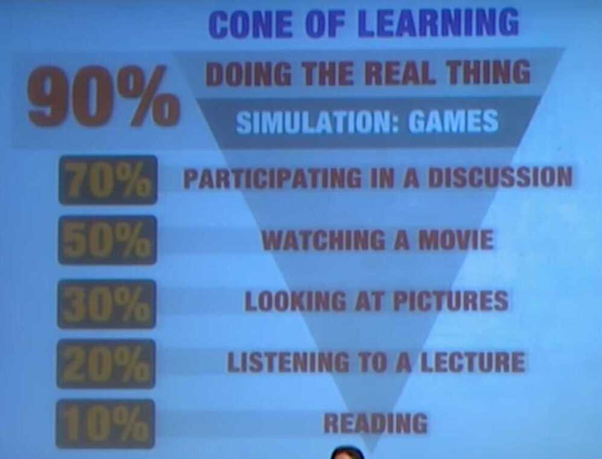

# Learning - Intro

https://guides.lib.uoguelph.ca/c.php?g=697430&p=4949569

Autodidactic Learning (Self Learn)

Learn by creating stories

Tell me and I forget, Teach me and I remember, Involve me and I learn -- Benjamin Franklin

Competence over credentials

If you want to learn something, learn from experts, and you will see the difference

One of the best strategies for learning something quickly: corner a nerd.

Find someone who totally geeks out about that topic and ask them every question you can think of.

Rivals are important - They can make you to raise your bar

MungerTechnique: Dedicate your best hour of the day to improving your mind, you'll improve your life on every level

If you're not working hard, ideas don't matter. The best idea is worthless without execution.

If you're already working hard, ideas are crucial. Most effort is wasted on mediocre ideas.

Don't over-improve your weaknesses. If you're not good at something, work on it until it no longer prevents your progress, but the bulk of your time is better spent maximizing your strengths.

The world contains far more information than any single person can learn in their lifetime.

The question is not whether you are ignorant, but what you choose to be ignorant about.

Few topics are worth your precious time. Choose what you pay attention to with great care.

You can't double your intelligence in one hour, but you can use one hour to write something twice as clear. And ideas that are easy to read and easy to understand will make you seem smarter. The better you communicate, the more intelligent you appear.

The gift of a beginner is fresh eyes.

The longer you're in a field, the harder it is to perceive new truths. Your mind is biased toward refining what you're already doing instead of exploring fresh terrain.

Take your expertise and apply it to something new.

## Learning Pyramid

## Collateral Knowledge

When one [searches](https://www.urbandictionary.com/define.php?term=searches) for answers regarding a [specific](https://www.urbandictionary.com/define.php?term=specific) subject, but ends up [learning](https://www.urbandictionary.com/define.php?term=learning) about several others in the process.

Trying to find out how to pronounce "[Boise](https://www.urbandictionary.com/define.php?term=Boise)", but ended up also learning about the [molecular](https://www.urbandictionary.com/define.php?term=molecular) structure of a diamond lattice.

Everytime you get deep into topic, there comes a point where you are satisfied, from there you go back so that you can focus on your area

## Get a coach

- Overload training
- Underload training

https://360learning.com/blog/learning-theories

1. Cognitive Learning Theory
2. Behavioral Learning Theory
3. Constructivist Learning Theory
4. Connectivism Learning Theory
5. Adult Learning Theory
6. Transformative Learning
7. Learning Curve Theory
8. Lifelong Learning Theory
9. It all comes down to Collaborative Learning

## Mental Models

- [Deliberate Practice](https://en.wikipedia.org/wiki/Practice_%28learning_method%29#Deliberate_practice) - "How expert one becomes at a skill has more to do with how one practices than with merely performing a skill a large number of times."

   The right sort of practice over a sufficient period of time leads to improvement. Nothing else.

- Imposter Syndrome - "High-achieving individuals marked by an inability to internalize their accomplishments and a persistent fear of being exposed as a 'fraud'."
- [Spacing Effect](https://en.wikipedia.org/wiki/Spacing_effect) - "The phenomenon whereby learning is greater when studying is spread out over time, as opposed to studying the same amount of time in a single session."

## Questions to ask while studying

- How does this concept related to the other?
- What are the implications of this concept for...?
- Why does it make sense that...?
- What are the steps that I must take to solve this problem?

## Recommendations

- Take structured notes (whatever suits you best: hierarchical, flow- based, mind-maps, etc.)
- Do not memorize lecturer's or textbook phrases, explain concepts to yourself in your own words
- When taking notes, avoid copying information word-for-word (verbatim). Use your own phrasing instead.

Lecturer - Negative reinforcement occurs when an aversive stimulus is removed to reinforce a behavior

Notes - Negative reinforcement is like when something becomes less painful, so you do it more, Like the time I prepared for that 10k run

- Avoid taking notes on a computer. Take handwritten notes instead.
- Exocortex (An Exocortex is a theoretical augmentation to a person's brain. It's basically extra functions and memory you could add to a brain to make people smarter)
- Knowledge notebook/personal wiki
- SQ3R method (Pragmatic Thinking and Learning book) - Scan, Question, Read, Record, Review

## Transfer-appropriate processing

- A trick to remembering is to practice as close as possible to the state of use/test/exam. Means it must closely resemble the use.

Like you can read everything about cycling, but you cannot cycle until you practice cycling

- In summary, if you are going to take a test of a particular format (such as an essay format), the best approach is to reap the benefits of multi- ple strategies. Whereas practicing with the final test format will teach you to processes the material in the way required by the test, recall will lead to most effective encoding. Therefore, ideally you should:
    - Spend about 1/4 of your time practicing with the final test format (e.g. multiple choice)
    - Spend the remaining 3/4 practicing with recall combined with deep-processing techniques

## State Dependence

- Spend at least 1/4 of your study time simulating the state you will likely be in during your exam (e.g. sit at a desk, time your answers)
- Study regardless of your mental/physical state (in different moods,
    with different energy levels, etc.)

## Context Dependence

- For 1/2 of your study time, simulate the environmental conditions of your test (a noisy/quiet environment, similar distractions, people around)
- For the other 1/2, alternate rooms, places and conditions as you study
- Test yourself with different kinds of practice questions - what-questions
    - why-questions
    - how-questions
- Make use of minimal context for flashcards, or if possible, try differ- ent ways of asking yourself questions to maximize your flexibility.

## Consolidation and Sleep

- Although some consolidation occurs during wakefulness, the primary time for consolidation is sleep.

- Napping during the day will protect your memory from trace decay and interference due to sleep-induced consolidation processes. (90 minutes cycle)
- Take a 20-minute nap to restore your energy.
- Take a 90-minute nap after a study session to consolidate your memory.
- Schedule your study sessions before sleep to reap the full benefits of consolidation.

## Interference: Does learning new things block your old memories?

- Research has found that the only way to overcome blocking interference is by making conscious effort to recover the correct memory trace (and have patience as this may take some time). Interference may, however, also cause a permanent loss of memory. Scientists who study memory call this the retrieval-induced forgetting effect (RIF).
- Re-study concepts that you confuse
    - Use comparing and contrasting to find differences between the
        concepts
    - Integrate the concepts (find the relations between them)
- Aim for mastery in a subject, do not pay attention to other people's performance

## Spacing effect

- Avoid massed studying (i.e. many hours in one session)
- Divide your study sessions into smaller blocks spread out over lon-
    ger periods of time
- The distance between study sessions should be about 10-20% of the
    test delay (e.g. for a test in 10 days, study once a day)
- Schedule your revision of each concept/topic to about the time that you would forget it (this needs self-experimentation as there is no formula to calculate this precisely)
- Consider using a flashcards program (Anki, Quizlet, Supermemo)
- [How to Supercharge Your Studying with Python, Anki, and ChatGPT](https://www.freecodecamp.org/news/supercharged-studying-with-python-anki-chatgpt/)
- [Image Occlusion, Heatmap, Cloze Overlapper - Glutanimate - Anki Dev (The Accelerated Learning Canon) - YouTube](https://www.youtube.com/watch?v=4Mc_e-kRjOs)

## Retrieval: Accessing Memories from the Brain

Spreading activation: Gain quick access to your memory

- When learning a new concept, connect it to the things that you al- ready know
- The more connections you make between the new concept and old concepts, the more easily it will be to remember the new concept

Retrieval failure: What to do if you get stuck in an exam

- To better remember to do something in a particular place and time in the future, visualize yourself vividly doing it (e.g. imagine your- self passing the library and returning the book)

- visualize the details of the context where you need to remember

the intention (objects, buildings, people)

- If you cannot remember a particular concept that you studied

during your exam:

- Actively remember as many concepts as possible which are relat-
    ed to this concept
- Actively remember as many concepts as possible which you stud-
    ied before and after this concept
- Visualize yourself in the context of studying (sitting at the desk
    in your room, etc.)
- Try to remember what time and where you studied the concept,
    what kind of mood you were in and what had happened on that day

Practice test: The most powerful technique for boosting memory

- Avoid learning strategies based on recognition (reviewing/re-reading of textbook chapters/notes, highlighting, summarizing)
- Revise with practice tests / questions to achieve the best results in your tests and exams
    - Use free recall (questions/tasks with no hints or options to
        choose from)
    - Practice with recognition questions (such as multiple-choice)
        only if your test will also be multiple-choice (see transfer-appro-
        priate processing) and for 1/4 of your study time only
    - Selectively re-read only the material that you cannot remember
    - Get immediate or delayed feedback on your answers Revise with
        practice tests / questions to achieve the best results in your tests and exams

https://www.scotthyoung.com/blog/2019/02/15/memory

## Hebbian Theory - Neurons that fire together, wire together

Use it or lose it

Neurons that fall out of sync lose their link

## Learning How to Learn - Key Points

- **Focused and Diffused Brain**
- **Pomodoro Technique**
- **Spaced Repitition**
- **A Good Sleep**

### Introduction to Focused and Diffused Brain

We have 2 modes of thinking: focused (highly intensive mental processes when you are acutely aware of what you are thinking), and diffuse (a more relaxed mental process associated with sub-conscious thinking)

Sometimes the first solution found prevents you from seeing a wider range of possible solutions. To sidestep that, repeatedly intersperse short periods of intense focus on new information with periods of relaxed diffuse thinking.

## Key Points

- Should be able to switch back and forth between focused and diffused mode
    - Pinball anology (tightly packed pinballs and loosely packed pinballs)
    - Eisten and salvador both let there mind wander and have a ball bearing and keys respectively in their hands and when they go to sleep, it falls and due to noise they wake up and work again in focused mode.
- Learning something difficult takes time (a little bit of it everyday)
- Metaphors and analogies are a powerful technique to learn
- Mind Maps (find on internet what mindmaps are available)

## What is Learning?

- Dendrites of nerurons form new synapses when we learn something new.
- Brain is highly flexible and always growing
- We can tap in the power of unconsious mind and sleep to help us to learn something new.
- There are a million billion synapses in our brain

## Spaced repetition

- repeating a vocabulary word or concept over days
- Builds stronger neural structures by repeating them over a number of days
- Recalling is very important part of learning and making it permanent

## Boost Learning Speed

1. Learners proficient in **fast-paced games** are significantly faster at performing new cognitive tasks.
2. By **pretending you are teaching something to someone** using simple language, you understand it better.
3. **Bilingual people may have a leg up** when it comes to **understanding new things**and processing information, regardless of the learned language.
4. **Learning new material right before sleeping** provides a significant retention advantage.
5. Establishing as many connections as possible is an effective way to learn, and the best way to do that is to **relate new information to known information.**
6. The brain processes visual information faster than text. **Include relevant visuals (charts, symbols, diagrams...) with learning materialsto improve retention.**

"One must learn by doing the thing; for though you think you know it, you have no certainty, until you try." - Sophocles

We often avoid taking action because we think "I need to learn more," but the best way to learn is often by taking action.

The teacher learns more than the student.

The author learns more than the reader.

The speaker learns more than the attendee.

The way to learn is by doing.

https://deepstash.com/article/3352/quotes-to-inspire-you-to-never-stop-learning

## Need For Cognition (NFC)

NFC is a personality trait used in psychology to describe how inclined an individual is to seek effortful mental activities like puzzles, complex concepts, or problem-solving. The [APA](https://dictionary.apa.org/need-for-cognition)(American Psychological Association) gives a slightly more in-depth description:

"A personality trait reflecting a person's tendency to enjoy engaging in extensive cognitive activity. This trait primarily reflects a person's motivation to engage in cognitive activity rather than his or her actual ability to do so. Individuals high in need for cognition tend to develop attitudes or take action based on thoughtful evaluation of information."

https://centerofinquiry.org/uncategorized/need-for-cognition-scale-wabash-national-study

## Curiosity

Curiosity is a function of overcoming fear. Fear of being wrong. Fear of being right. Fear of being different. If you don't have the guts to think about really bad ideas, you'll never have the opportunity to execute brilliant ones.

### Diversive curiosity

Diversive curiosity is the fleeting desire to explore novel things. It is the impulse that drives us to endlessly scroll Twitter, flip through People Magazine, or click on a headline, but it doesn't engage us in deeper exploration

### Empathic curiosity

Empathic curiosity is the 'curiosity about the thoughts and feelings of other people.' This is the curiosity that pushes us to truly empathize with someone and "put ourselves in their shoes."

### Epistemic curiosity

This is the ideal type of curiosity according to Leslie, and the one we should all be cultivating in ourselves, and in our learners: "Epistemic curiosity represents the deepening of a simple seeking of newness into a directed attempt to build understanding. It's what happens when diverse curiosity grows up."

Dr. Litman further splintered epistemic curiosity into two additional types:[Intellectual Interest curiosity (type I) and Informational Deprivation curiosity (type D)](http://drjlitman.net/wp-content/uploads/2013/11/Litman-2007-invited-chapter.pdf). The former refers to curiosity that drives one 'to learn something that may be entertaining or amusing,' while the latter 'is activated in situations when individuals feel they are lacking information that is considered essential to improving their understanding.'

https://360learning.com/blog/need-for-cognition

## Forgetting Curve

Our memories have a forgetting curve, and unless we review what we see or learn, most of the content is forgotten in 24 hours, and the rest in the following days.

Due to the internet, our recall memory has become less necessary, because now we don't need to remember information to recall it. Recognition memory is more important with recall memory fading away due to it being externalized.

[The Knowledge Illusion](../../book-summaries/the-knowledge-illusion)

[Japan's ancient secret to better cognitive memory - BBC REEL](https://youtu.be/s6OmqXCsYt8)

[Curve of Forgetting | Campus Wellness | University of Waterloo](https://uwaterloo.ca/campus-wellness/curve-forgetting)

## SQ3R / SQ4R (Survey, Question, Read, Respond, Record and Review)

- SQ4R is a method of reading and studying textbooks.
- When using this method, complete all the steps initially, then choose which are most effective for you and your courses.
- The SQ4R method may seem time consuming at first, but it's an effective method for reading, understanding, and remembering information from your textbooks.

## What are the benefits of using SQ4R?

- It's an active learning strategy that can be adapted to suit an individual's study preferences.
- It provides a strategy to retain a lot of factual detail, reducing the amount of information that has to be relearned for exams.
- It prompts the creation of study material to be used when preparing for exams.
- It helps to identify errors or areas of confusion.

### Step 1: Survey the textbook and chapters

- Read the preface and introduction to the text, and browse through the table of contents and the index. This will describe the main topics and the basic organizational structure of the book.
- Read the introduction and conclusion in each chapter and subsection.
- Scan the titles and subtitles. Study the pictures, charts, or graphs.
- Read the summary and any chapter questions.

### Step 2: Start with a question

- Take the section title, subtitle, or the first sentence of each paragraph and turn it into a question.
- For example: "Functions of the spinal cord" becomes "What are the functions of the spinal cord?"

### Step 3: Read actively

- Read carefully and actively by creating a "dialogue" with the text.
- Try to find the answer to the question you created, and ask questions as you read.
- Be careful not to skim the text looking for the answer, as you might miss other important information.

### Step 4: Respond to your question

- Close the textbook and answer the question you created in your own words.
- If you can't answer the question, reread the section until you can.
- If, after a few tries, you still can't answer the question, go on to the next few sections and see if things become clearer.
- If that doesn't help, you may need to change your question. Try making it broader or narrower.
- If changing your question doesn't help, get some assistance. Your instructor or TA are good places to start, or contact Learning Services.

### Step 5: Record Your notes

- Once you understand the material and can summarize it in your own words make a record of it.
- Common methods are highlighting and/or marking the text, or taking notes, or some combination of both.
- Whichever methods you choose, it's critical to read and understand the material first, and then go back and record.
- See belowfor the pros and cons of notetaking and highlighting.
- See our resources for help with note taking.

### Step 6: Review Your notes

- Do a thorough review of lecture and text notes weekly, and briefly before each class.
- Make weekly review periods effective by starting from the beginning of the course in each review session. Though the volume of review material increases as the semester progresses, the amount of time needed to review older material decreases. After you've reviewed the first week's material a few times, it will take only minutes to skim over it and recall the key points.

https://guides.lib.uoguelph.ca/c.php?g=697430&p=5011752

https://perell.com/essay/how-philosophers-think

## Chauffeur Knowledge

You understand an idea not when you've memorized it, but when you know why its specific form was chosen over all the alternatives.

[MASTERY by George Leonard | Core Message](https://www.youtube.com/watch?v=S9NYzLuNpDc)

- The dabbler - quick to fall in relationship, and quick to end the relationship when honeymoon phase ends
- The obsessive - refuses to let the honeymoon phase end
- The Hacker - just enough to win someone over to get married. Then they coast & expect the relationship to last

## Weekly Mastery Questions

- Am I surrendering to instruction?
- Am I practicing intentionally?
- Do I love to practice?
- Am I exploring the edge?

## PDCA (Plan-Do-Check-Act)

- Make a plan
- Do the plan
- Study the results of the plan
- Act on what you’ve learnt and integrate your new hypotheses into the next iteration of the loop.

[You Aren't Learning If You Don't Close the Loops - Commoncog](https://commoncog.com/no-learning-dont-close-loops/)

## Expert

[The 4 things it takes to be an expert - YouTube](https://www.youtube.com/watch?v=5eW6Eagr9XA)

1. Valid environment
2. Many repetitions
3. Timely feedback
4. Deliberate practice

## Tools

- https://curious.com/

## Others

- [Marty Lobdell - Study Less Study Smart](https://youtu.be/IlU-zDU6aQ0)
- [You're Not Slow: Become a Speed Learner in 20 Minutes](https://www.youtube.com/watch?v=_wzJnWCBWkI)
- [Ultralearning](../../book-summaries/ultralearning)
- [When is Learning Worth the Effort? - Scott H Young](https://www.scotthyoung.com/blog/2023/05/30/learning-cost-benefit/)
- [How to study for exams - Evidence-based revision tips - YouTube](https://www.youtube.com/watch?v=ukLnPbIffxE)
- [Augmenting Long term Memory - Michael Nielsen (The Accelerated Learning Canon) - YouTube](https://www.youtube.com/watch?v=o0-iULLKlfA)
- [Critical Listening: How to Quickly Understand Difficult Things - YouTube](https://www.youtube.com/watch?v=UlMCTUvxa78)
- [You’re Not Stupid: How to Easily Learn Difficult Things - YouTube](https://www.youtube.com/watch?v=Kz_brQBl8xk)
- [The human memory-facts and information](https://www.nationalgeographic.com/science/article/human-memory)
- [My New Learning Mindsets - YouTube](https://www.youtube.com/watch?v=tBL5X-6h7KY)
- [Asking Questions - Level 1 - Observational Questions - YouTube](https://www.youtube.com/watch?v=J_TVEPxFWAg)
- [Developing and Using Models - Level 1 - Models - YouTube](https://www.youtube.com/watch?v=p29JLoDVbgA)
- [10 Things Software Developers Should Learn about Learning | January 2024 | Communications of the ACM](https://cacm.acm.org/magazines/2024/1/278891-10-things-software-developers-should-learn-about-learning/fulltext)
- [Infobesity - How to Cope with the Overload of Information • Fabio Nudge • YOW! 2023 - YouTube](https://www.youtube.com/watch?v=5aTo8n-ql0s&ab_channel=GOTOConferences)
