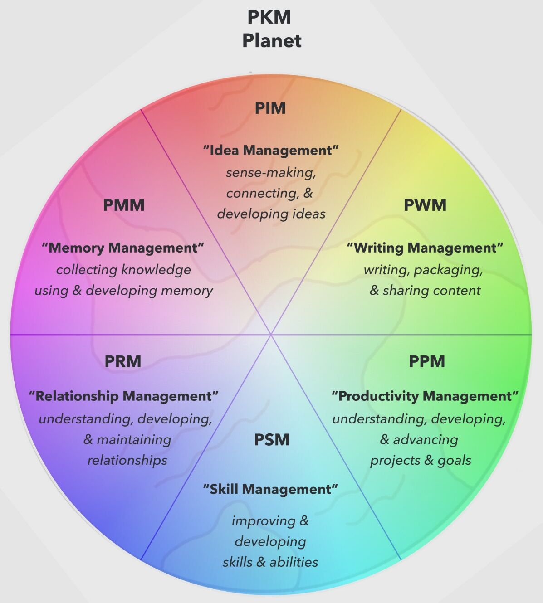

# Note Taking / Second Brain / PKM / Zettelkasten / Digital Garden

Your brain is for having ideas not holding them

I write to find out what I think -- Stephan King

I write entirely to find out - what I'm thinking, what I'm looking at, what I see, and what it means -- Joan Didion

## Personal Knowledge Management (PKM) / Second Brain

Personal knowledge management(PKM) is a process of collecting information that a person uses to gather, classify, store, search, retrieve and share [knowledge](https://en.wikipedia.org/wiki/Knowledge) in their daily activities and the way in which these processes support work activities. It is a response to the idea that [knowledge workers](https://en.wikipedia.org/wiki/Knowledge_worker) need to be responsible for their own growth and learning. It is a bottom-up approach to [knowledge management](https://en.wikipedia.org/wiki/Knowledge_management)(KM).

## Different levels of knowledge

- **Level 1: Having something (Information)** - a lot of our digital information falls into this category. You have the ability to go find what you're looking for when you need it, but you have to first think about it before you can locate it. If you have a video course that you bought but haven't gone through yet, that would fall into this category.
- **Level 2: Understanding something (Revelation)** - this is being able to recall something without having to look it up. At this level, you've internalized the information and are starting to make connections, but it hasn't necessarily changed how you act.
- **Level 3: Doing something (Application)** - this is where you start to see the result of the information you've collected. You don't just have it or understand it, it's changing your day-to-day actions. This is the first level where there is actual, visible output from the information that you've collected.

[What is PKM? What is Personal Knowledge Management?](https://www.youtube.com/watch?v=Q2WBHyqRsxA)

### PKM Archetypes

- Top-down vs Bottom-up
- Note-taker vs Note-maker
- Regurgitators vs Sense-makers
- Journaler, Writer, World-builder
- PD Nerd, PM
- "Churn & Burn" Student vs "Know & Grow" Student
- Relationship-builder

## Zettlekasten

The zettelkasten (German: "slip box") is a system of [note-taking](https://en.wikipedia.org/wiki/Note-taking) and [personal knowledge management](https://en.wikipedia.org/wiki/Personal_knowledge_management) used in research and study.

a Zettelkasten needs to adhere to the [Principle of Atomicity](https://zettelkasten.de/posts/create-zettel-from-reading-notes/). That means that each Zettel only contains one unit of knowledge and one only.

[https://en.wikipedia.org/wiki/Personal_knowledge_management](https://en.wikipedia.org/wiki/Personal_knowledge_management)

[https://thesweetsetup.com/pkm-intro-for-creatives](https://thesweetsetup.com/pkm-intro-for-creatives)

[https://en.wikipedia.org/wiki/Zettelkasten](https://en.wikipedia.org/wiki/Zettelkasten)

[https://zettelkasten.de/introduction](https://zettelkasten.de/introduction)

[HOW TO TAKE SMART NOTES by Sönke Ahrens](../../book-summaries/how-to-take-smart-notes)

## Organizing Notes

When you're deciding where to put notes, what it really boils down to is, how do you want to find this note again?

- Root folder must contain 7 folders +- 3
- Links / Folders / Tags
- MOC - Map Of Content

### Folders

Folders are probably the one that we're most familiar with because regardless of your operating system, this is how your computer lets you choose where to store files. Folders are like directories that you can put files into. The problem with folders is that you can't put one file in two different folders. It's one or the other. So it forces you to make a decision as to where that note belongs. Most note-taking tools also try to get you to organize things in this way, but I think that folders are best for situations where one note really only belongs in a single folder, or if you're trying to maintain the uniqueness of a note.

### Links

Links in Obsidian can be created by using the two left square brackets and then typing out the name or file name of a note. I think that links are best for connecting two notes that have similar meanings, a more of a semantic connection. In folders, it's really more about kind of categorizing notes, but with links, especially when the connection isn't obvious, you can connect two different notes.

### Tags

In Obsidian you can create tags on the fly, just by typing a # and then the word. I use tags for system-related things, like when two notes don't necessarily have any connection semantically, but I still want to process them in a certain way. For example, I have a TVZ tag that I use to mark all of the notes that I still need to process.

### Metadata

Metadata is pretty vague, but in this case, I'm referring specifically to Dataview parameters. Whether that's parameters that I've set in the YAML front matter of an Obsidian note or in line within the note itself. Metadata are good for combinations of the previous three, folders, links and tags, or when you're trying to visualize your body of knowledge that's in your vault. It's also great for creating databases.

## Methods

### [How to organize your notes in Obsidian - The LATCH method](https://www.youtube.com/watch?v=vS-b_RUtL1A)

**LATCH - Location, Alphabet, Time, Category and Hierarchy** by Richard Saul Wurman in Book, Information Anxiety.

### Others

- [How real people process notes](https://www.youtube.com/watch?v=6Bbj7xYj3Bc)

## Learning

- [https://demo-obsidian.owenyoung.com/](https://demo-obsidian.owenyoung.com/)
- [https://demo-wiki.owenyoung.com/#how-do-i-use-foam](https://demo-wiki.owenyoung.com/#how-do-i-use-foam)
- [LYT Kit](https://www.youtube.com/playlist?list=PL3NaIVgSlAVK6CQspGUYsbVF-EIGYuyth)
- [Making notes actually useful in Obsidian](https://www.youtube.com/watch?v=v7BbraqevMg)
- [The BASB Book](https://www.buildingasecondbrain.com/book)
- [BUILDING A SECOND BRAIN by Tiago Forte | Core Message - YouTube](https://www.youtube.com/watch?v=aEm72qlAtVc)
- [Organise Your Life - Building a Second Brain book summary - YouTube](https://www.youtube.com/watch?v=KTXshjVpEQ0)
- [Tiago Forte | Building a Second Brain | Talks at Google - YouTube](https://www.youtube.com/watch?v=Y86GOtc1KNo)
