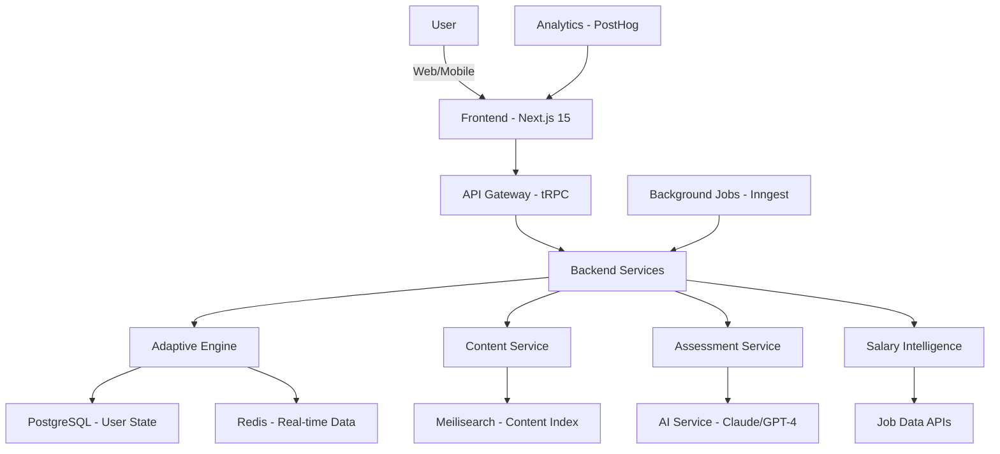

# Technical Feasibility: Adaptive Learning Platform

- **Build Date:** 2026-05-05  
- **Context:** Building AI-native adaptive learning platform for working professionals (25-45yo) seeking measurable salary increases through personalized skill development  
- **Reference:** [Adaptive Learning Platform Concept](education/pedagogy/adaptive-learning-platform.md)

---

## Executive Summary

**Feasibility Verdict:** ✅ **HIGHLY FEASIBLE with 2026 technology stack**

**Key Findings:**

- **Adaptive Learning:** IRT/BKT algorithms proven (open-source libraries available), can be implemented in 2-3 months
- **AI Question Generation:** GPT-4/Claude 3.5 generate quality coding problems at $0.015-0.02/question (see [AI Question Generation Study](education/technical-feasibility-ai-question-generation.md))
- **Content Curation:** YouTube Data API + web scraping achievable, ML tagging with existing models
- **Salary Tracking:** Job APIs available (LinkedIn, Naukri, Indeed), salary data accessible
- **Cost:** $80K-170K total investment for MVP → Scale → Production (12-18 months)
- **Team:** 2-3 engineers (full-stack + ML) for MVP, scale to 5-7 for production

**Timeline:**
- MVP (React skill path, Bangalore): **3 months** (1 engineer)
- Beta (5 skills, 3 cities): **6 months** (2 engineers)
- Scale (20 skills, pan-India): **12 months** (3-5 engineers)

**Recommendation:** ✅ **PROCEED** - Technology is mature, cost is manageable, no major technical blockers

---

## 1. Technical Architecture (2026 Stack)

### System Components Overview



### Layer-by-Layer Breakdown

**Layer 1: Frontend (User Experience)**

```typescript
// Next.js 15 + React 19 + TypeScript
Technology: Next.js 15.0 (App Router)
UI Framework: shadcn/ui + Tailwind CSS 4.0
State Management: Zustand 4.5 + TanStack Query 5.0
Forms: React Hook Form 7.5 + Zod validation
Charts: Recharts 2.12 (salary tracking visualizations)
Mobile: React Native (same components via Tamagui)

Deployment: Vercel (edge functions, $20/month Pro)
CDN: Vercel Edge Network (built-in)
```

**Why Next.js 15:**
- Server Components = faster initial load (critical for mobile users on 3G/4G in India)
- Edge rendering = low latency globally
- Built-in image optimization (course thumbnails, profile pics)
- ISR (Incremental Static Regeneration) for content pages
- tRPC integration = end-to-end type safety

**Layer 2: API & Backend Services**

```typescript
// tRPC + Hono for edge
API Framework: tRPC 11.0 (type-safe API)
Alternative: Hono 4.0 (edge-optimized HTTP framework)
Authentication: Clerk (Indian pricing: ₹2K/month for 1K users)
Database ORM: Drizzle ORM 0.30 (type-safe, faster than Prisma)

Backend Runtime: Node.js 22 LTS
Serverless: Vercel Functions (99% uptime)
Background Jobs: Inngest (cron jobs, workflows, free tier: 1M steps/month)
```

**Why tRPC:**
- End-to-end type safety (frontend knows exact backend types)
- No OpenAPI spec needed (types = docs)
- React Query integration (automatic caching, optimistic updates)
- Perfect for Next.js + TypeScript projects

**Layer 3: Databases & Storage**

```sql
-- Primary Database: Neon PostgreSQL
Provider: Neon (serverless Postgres, $19/month for 10GB)
Why: Auto-scaling, branching (test env = clone), 99.9% uptime
Alternative: Supabase ($25/month, includes auth + storage)

-- Cache Layer: Upstash Redis
Provider: Upstash ($10/month for 1GB, pay-as-you-go)
Use Cases:
  - Session management
  - API rate limiting
  - Real-time leaderboards
  - Knowledge state caching (frequently accessed user data)

-- Search: Meilisearch
Provider: Meilisearch Cloud ($29/month for 100K docs)
Use Cases:
  - Content search (find React tutorial videos)
  - Skill search (autocomplete)
  - Job search
Why: 10x faster than PostgreSQL full-text search, typo-tolerant

-- Vector DB: Pinecone
Provider: Pinecone ($70/month starter, 100K vectors)
Use Cases:
  - Content similarity (recommend similar tutorials)
  - Question uniqueness check
  - Semantic search
Alternative: pgvector extension in Neon (free, less performant)
```

**Layer 4: AI/ML Services**

```python
# LLM Provider: Anthropic Claude 3.5 Sonnet
API: Anthropic API (claude-3-5-sonnet-20241022)
Pricing: $0.003/1K input tokens, $0.015/1K output tokens
Use Cases:
  - Question generation: $0.015-0.02/question
  - Content tagging: $0.005/video description
  - Personalized explanations: $0.01/explanation
  
Alternative: OpenAI GPT-4 Turbo ($0.01/1K in, $0.03/1K out)
Fallback: Meta Llama 3.3 70B via Together.ai ($0.0006/1K tokens)

# ML Models: Hugging Face Inference API
Embedding Model: sentence-transformers/all-MiniLM-L6-v2
Usage: Content embeddings, similarity search
Cost: Free (self-hosted) or $0.0001/request (Inference API)

# Adaptive Algorithms: pyBKT + py-irt libraries
BKT: Python library for Bayesian Knowledge Tracing
IRT: py-irt library for Item Response Theory
Both: Open-source, no API costs
Custom Training: Scikit-learn 1.5 + NumPy/Pandas
```

**Layer 5: External Data Sources**

```bash
# Job & Salary Data APIs

1. RapidAPI - LinkedIn Jobs API
   Cost: $100/month for 10K requests
   Data: Job postings, required skills, salary ranges
   Coverage: Global (India, US, EU)

2. Naukri Job Search API
   Cost: Enterprise contact (estimated ₹50K-1L/year)
   Data: India-specific jobs, salaries, skill requirements
   Coverage: Best for Indian market

3. Adzuna Job Search API
   Cost: Free tier (250 calls/month), $500/month for 10K
   Data: Salary estimates, skill trends, job volumes
   Coverage: 19 countries including India

4. Glassdoor API (unofficial via SerpAPI)
   Cost: $50/month for 5K searches via SerpAPI
   Data: Company reviews, salaries, interview questions
   Alternative: Web scraping (legal gray area)

5. AmbitionBox (India-specific)
   Approach: Web scraping with Playwright
   Cost: $100/month for proxy rotation (BrightData)
   Data: Indian company salaries, reviews, culture
```

---

## 2. Adaptive Learning Engine Implementation

### 2.1 Knowledge State Model (Bayesian Knowledge Tracing)

**Technology:** pyBKT library (MIT licensed, maintained by Stanford BETA Lab)

```python
# Install: pip install pyBKT==1.4.3

from pyBKT.models import Model
import numpy as np
import pandas as pd

class KnowledgeStateTracker:
    """
    Tracks probability of skill mastery using Bayesian Knowledge Tracing
    """
    def __init__(self):
        self.model = Model(
            seed=42,
            num_fits=5  # Fit model 5 times, take best
        )
        
        # BKT Parameters (learned from data)
        self.params = {
            'prior': 0.1,        # P(L0) - initial knowledge
            'learn': 0.3,        # P(T) - learning rate
            'guess': 0.2,        # P(G) - probability of lucky guess
            'slip': 0.1          # P(S) - probability of careless mistake
        }
    
    def fit_model(self, interaction_data):
        """
        Train BKT model on user interaction history
        
        interaction_data format:
        user_id | skill_id | correct | timestamp
        1       | react    | 1       | 2026-05-01
        1       | react    | 0       | 2026-05-02
        1       | aws      | 1       | 2026-05-03
        """
        self.model.fit(
            data=interaction_data,
            skills='skill_id',
            sequence_id='user_id',
            correct='correct'
        )
        return self.model.params()
    
    def predict_mastery(self, user_id, skill_id):
        """
        Predict current probability user has mastered skill
        
        Returns:
            float: 0.0-1.0 probability of mastery
        """
        # Get user's interaction history for this skill
        history = self.get_user_skill_history(user_id, skill_id)
        
        if len(history) == 0:
            return self.params['prior']  # No data, return prior
        
        # Update belief after each interaction using Bayes' theorem
        mastery_prob = self.params['prior']
        
        for interaction in history:
            correct = interaction['correct']
            mastery_prob = self.bayes_update(
                mastery_prob,
                correct,
                self.params['learn'],
                self.params['guess'],
                self.params['slip']
            )
        
        return mastery_prob
    
    def bayes_update(self, prior_mastery, correct, learn_rate, guess, slip):
        """
        Update mastery probability after observing response
        """
        if correct:
            # P(mastered | correct) = P(correct | mastered) * P(mastered) / P(correct)
            likelihood = (1 - slip)  # Correct because mastered (not slip)
            p_correct = prior_mastery * (1 - slip) + (1 - prior_mastery) * guess
            posterior = (likelihood * prior_mastery) / p_correct
        else:
            # P(mastered | incorrect)
            likelihood = slip  # Incorrect despite mastery (slip)
            p_incorrect = prior_mastery * slip + (1 - prior_mastery) * (1 - guess)
            posterior = (likelihood * prior_mastery) / p_incorrect
        
        # Account for learning that occurred during attempt
        posterior = posterior + (1 - posterior) * learn_rate
        
        return min(posterior, 1.0)
    
    def get_skill_gaps(self, user_id, target_role_skills):
        """
        Identify which skills need learning for target role
        
        Returns:
            List[Dict]: [{skill: 'react', mastery: 0.3, gap: 0.7}, ...]
        """
        gaps = []
        mastery_threshold = 0.8  # Consider mastered if >80% probability
        
        for skill in target_role_skills:
            mastery = self.predict_mastery(user_id, skill)
            if mastery < mastery_threshold:
                gaps.append({
                    'skill': skill,
                    'current_mastery': round(mastery, 2),
                    'gap': round(mastery_threshold - mastery, 2),
                    'priority': self.calculate_priority(skill, mastery)
                })
        
        # Sort by priority (considers both gap size and salary impact)
        gaps.sort(key=lambda x: x['priority'], reverse=True)
        return gaps
    
    def calculate_priority(self, skill, current_mastery):
        """
        Priority = Gap Size × Salary Impact × Time Efficiency
        """
        gap = 0.8 - current_mastery
        salary_impact = self.get_salary_impact(skill)  # From salary DB
        time_to_learn = self.estimate_learning_time(skill, current_mastery)
        
        return (gap * salary_impact) / time_to_learn
```

**Data Schema for BKT:**

```sql
CREATE TABLE user_skill_interactions (
    id BIGSERIAL PRIMARY KEY,
    user_id UUID NOT NULL,
    skill_id VARCHAR(50) NOT NULL,
    interaction_type VARCHAR(20) NOT NULL, -- 'quiz', 'practice', 'project'
    correct BOOLEAN NOT NULL,
    difficulty VARCHAR(10), -- 'easy', 'medium', 'hard'
    time_spent_seconds INT,
    confidence_level INT, -- 1-5 self-reported
    created_at TIMESTAMP DEFAULT NOW(),
    
    INDEX idx_user_skill (user_id, skill_id),
    INDEX idx_created_at (created_at)
);

CREATE TABLE user_skill_mastery (
    user_id UUID NOT NULL,
    skill_id VARCHAR(50) NOT NULL,
    mastery_probability DECIMAL(3,2), -- 0.00 to 1.00
    last_interaction_at TIMESTAMP,
    interaction_count INT DEFAULT 0,
    
    PRIMARY KEY (user_id, skill_id),
    INDEX idx_mastery (mastery_probability)
);
```

### 2.2 Adaptive Sequencing (IRT - Item Response Theory)

**Technology:** py-irt library + custom implementation

```python
# Install: pip install py-irt==0.2.9

from py_irt import irt
import numpy as np

class AdaptiveSequencer:
    """
    Determines optimal next learning item based on user ability
    Uses 3-parameter IRT model (3PL)
    """
    def __init__(self):
        self.model = irt.ThreeParameterModel()
        
    def calibrate_items(self, item_responses):
        """
        Calibrate difficulty, discrimination, guessing for each item
        
        item_responses format:
        user_id | item_id | correct
        1       | react_q1| 1
        1       | react_q2| 0
        2       | react_q1| 1
        """
        self.model.fit(item_responses)
        
        # Extract item parameters
        return {
            'difficulty': self.model.difficulty,      # b - item difficulty
            'discrimination': self.model.discrimination,  # a - how well item separates abilities
            'guessing': self.model.guessing           # c - probability of random correct answer
        }
    
    def estimate_ability(self, user_id):
        """
        Estimate user's current ability level (theta)
        Returns: float between -3 and +3 (standardized)
        """
        user_responses = self.get_user_responses(user_id)
        theta = self.model.estimate_ability(user_responses)
        return theta
    
    def select_next_item(self, user_id, available_items):
        """
        Select item that maximizes information gain
        (Adaptive Testing - like GRE/GMAT)
        """
        theta = self.estimate_ability(user_id)
        
        # Calculate information function for each item
        information_scores = []
        for item in available_items:
            a = item['discrimination']
            b = item['difficulty']
            c = item['guessing']
            
            # Information function I(θ) = a² × [P(θ) - c]² / P(θ)
            p_correct = self.probability_correct(theta, a, b, c)
            information = (a ** 2) * ((p_correct - c) ** 2) / p_correct
            
            information_scores.append({
                'item': item,
                'information': information,
                'p_correct': p_correct
            })
        
        # Select item with highest information
        # (ideally P(correct) ≈ 0.5 for maximum discrimination)
        best_item = max(information_scores, key=lambda x: x['information'])
        return best_item
    
    def probability_correct(self, theta, a, b, c):
        """
        3-parameter logistic model
        P(θ) = c + (1 - c) / (1 + e^(-a(θ - b)))
        """
        return c + (1 - c) / (1 + np.exp(-a * (theta - b)))
    
    def generate_learning_sequence(self, user_id, skill_id, target_mastery=0.8):
        """
        Generate sequence of learning items from easy to hard
        """
        theta = self.estimate_ability(user_id)
        items = self.get_skill_items(skill_id)
        
        sequence = []
        current_theta = theta
        
        while current_theta < self.mastery_to_theta(target_mastery):
            # Find item slightly above current ability (zone of proximal development)
            next_item = self.find_item_at_difficulty(
                items,
                target_difficulty=current_theta + 0.5
            )
            sequence.append(next_item)
            
            # Assume user will learn from item (optimistic)
            current_theta += 0.3  # Learning increment
        
        return sequence
    
    def mastery_to_theta(self, mastery_prob):
        """
        Convert mastery probability (0-1) to theta scale (-3 to +3)
        """
        # Mastery 0.5 = theta 0, mastery 0.8 = theta 1.4, etc.
        from scipy.stats import norm
        return norm.ppf(mastery_prob)
```

**Item Database Schema:**

```sql
CREATE TABLE learning_items (
    id UUID PRIMARY KEY,
    skill_id VARCHAR(50) NOT NULL,
    item_type VARCHAR(20) NOT NULL, -- 'video', 'article', 'quiz', 'project'
    content_url TEXT,
    estimated_time_minutes INT,
    
    -- IRT Parameters (calibrated from user data)
    difficulty DECIMAL(4,2), -- -3.0 to +3.0
    discrimination DECIMAL(4,2), -- 0.0 to 3.0
    guessing DECIMAL(3,2), -- 0.0 to 1.0
    
    -- Metadata
    tags TEXT[],
    created_at TIMESTAMP DEFAULT NOW(),
    calibration_sample_size INT DEFAULT 0,
    
    INDEX idx_skill_difficulty (skill_id, difficulty)
);

CREATE TABLE user_item_responses (
    user_id UUID NOT NULL,
    item_id UUID NOT NULL,
    correct BOOLEAN,
    time_spent_seconds INT,
    attempts INT DEFAULT 1,
    created_at TIMESTAMP DEFAULT NOW(),
    
    PRIMARY KEY (user_id, item_id, created_at)
);
```

### 2.3 Content Recommendation Engine

```python
from sklearn.feature_extraction.text import TfidfVectorizer
from sklearn.metrics.pairwise import cosine_similarity
import numpy as np

class ContentRecommender:
    """
    Hybrid recommendation: Collaborative Filtering + Content-Based + Adaptive
    """
    def __init__(self):
        self.vectorizer = TfidfVectorizer(max_features=500)
        self.user_item_matrix = None  # For collaborative filtering
        
    def recommend_content(self, user_id, skill_id, num_recommendations=5):
        """
        Recommend top N content items for user learning specific skill
        
        Combines:
        1. User ability (IRT) → difficulty matching
        2. Learning style preference (visual, text, interactive)
        3. Collaborative filtering (users like you also viewed...)
        4. Content quality (ratings, completion rates)
        """
        # Get user's current state
        ability = self.get_user_ability(user_id, skill_id)
        learning_style = self.get_learning_style(user_id)
        
        # Fetch candidate items for skill
        candidates = self.get_skill_content(skill_id)
        
        # Score each candidate
        scored_items = []
        for item in candidates:
            score = self.calculate_recommendation_score(
                user_id=user_id,
                item=item,
                ability=ability,
                learning_style=learning_style
            )
            scored_items.append((item, score))
        
        # Sort by score and return top N
        scored_items.sort(key=lambda x: x[1], reverse=True)
        return [item for item, score in scored_items[:num_recommendations]]
    
    def calculate_recommendation_score(self, user_id, item, ability, learning_style):
        """
        Multi-factor scoring:
        Score = w1×difficulty_match + w2×style_match + w3×quality + w4×collaborative
        """
        # 1. Difficulty Match (IRT-based)
        difficulty_match = self.difficulty_match_score(ability, item['difficulty'])
        
        # 2. Learning Style Match
        style_match = 1.0 if item['format'] == learning_style else 0.5
        
        # 3. Content Quality
        quality = item['rating'] / 5.0  # Normalize 0-1
        
        # 4. Collaborative Filtering
        collaborative = self.collaborative_score(user_id, item['id'])
        
        # Weighted combination
        weights = [0.35, 0.25, 0.20, 0.20]
        score = (
            weights[0] * difficulty_match +
            weights[1] * style_match +
            weights[2] * quality +
            weights[3] * collaborative
        )
        
        return score
    
    def difficulty_match_score(self, ability, item_difficulty):
        """
        Optimal match when item is slightly above ability (ZPD - Zone of Proximal Development)
        """
        optimal_gap = 0.5  # Item should be 0.5 theta units above ability
        actual_gap = item_difficulty - ability
        
        if actual_gap < 0:
            # Too easy
            return 0.3
        elif 0 <= actual_gap <= optimal_gap:
            # Perfect difficulty
            return 1.0
        elif optimal_gap < actual_gap <= optimal_gap + 1.0:
            # Slightly hard (still okay)
            return 0.7
        else:
            # Way too hard
            return 0.1
    
    def collaborative_score(self, user_id, item_id):
        """
        Users with similar learning patterns also liked this item
        """
        # Find similar users (based on skill mastery patterns)
        similar_users = self.find_similar_users(user_id, k=50)
        
        # How many similar users engaged with this item?
        engagement_count = sum(
            1 for u in similar_users 
            if self.user_engaged_with_item(u, item_id)
        )
        
        return engagement_count / len(similar_users)
    
    def find_similar_users(self, user_id, k=50):
        """
        K-nearest neighbors based on skill mastery vectors
        """
        # Get all users' skill mastery vectors
        user_vectors = self.get_all_user_skill_vectors()
        target_vector = user_vectors[user_id]
        
        # Calculate cosine similarity
        similarities = cosine_similarity([target_vector], user_vectors)[0]
        
        # Get top K similar users (excluding self)
        top_k_indices = np.argsort(similarities)[-k-1:-1]
        return [self.index_to_user_id(idx) for idx in top_k_indices]
```

---

## 3. AI Question Generation (Production Implementation)

**Reference:** [AI Question Generation Feasibility Study](education/technical-feasibility-ai-question-generation.md)

### 3.1 Question Generation Service (FastAPI)

```python
# question_gen_service/main.py

from fastapi import FastAPI, HTTPException
from pydantic import BaseModel
from anthropic import Anthropic
import json
import hashlib

app = FastAPI()
client = Anthropic(api_key=os.getenv("ANTHROPIC_API_KEY"))

class QuestionRequest(BaseModel):
    skill: str  # 'react-hooks', 'python-oop', 'aws-lambda'
    difficulty: str  # 'easy', 'medium', 'hard'
    user_id: str
    previous_questions: list[str] = []  # IDs to avoid duplicates

class QuestionResponse(BaseModel):
    question_id: str
    problem_statement: str
    examples: list[dict]
    starter_code: str
    test_cases: list[dict]
    solution: str
    difficulty: str
    topics: list[str]
    estimated_time_minutes: int

@app.post("/generate", response_model=QuestionResponse)
async def generate_question(request: QuestionRequest):
    """
    Generate unique coding question using Claude 3.5 Sonnet
    """
    # Build prompt
    prompt = build_question_prompt(
        skill=request.skill,
        difficulty=request.difficulty
    )
    
    # Call Claude API
    try:
        response = client.messages.create(
            model="claude-3-5-sonnet-20241022",
            max_tokens=4096,
            temperature=0.7,  # Some creativity for variety
            system="You are an expert coding interview question creator. Generate original, high-quality problems suitable for assessing {request.skill} skills.",
            messages=[{
                "role": "user",
                "content": prompt
            }]
        )
        
        question_data = parse_claude_response(response.content[0].text)
        
        # Validate question
        is_valid, validation_errors = validate_question(question_data)
        if not is_valid:
            raise HTTPException(
                status_code=422,
                detail=f"Generated question failed validation: {validation_errors}"
            )
        
        # Generate unique ID
        question_id = generate_question_id(question_data)
        
        # Store in database
        await store_question(question_id, question_data, request.skill)
        
        return QuestionResponse(
            question_id=question_id,
            **question_data
        )
        
    except Exception as e:
        raise HTTPException(status_code=500, detail=str(e))

def build_question_prompt(skill: str, difficulty: str) -> str:
    """
    Construct detailed prompt for question generation
    """
    difficulty_specs = {
        'easy': {
            'time_complexity': 'O(n) or O(n log n)',
            'concepts': '1-2 basic concepts',
            'code_length': '20-40 lines',
            'examples': '2-3 simple examples'
        },
        'medium': {
            'time_complexity': 'O(n²) or optimized O(n log n)',
            'concepts': '2-3 concepts combined',
            'code_length': '40-80 lines',
            'examples': '3-4 examples with edge cases'
        },
        'hard': {
            'time_complexity': 'O(n²) or better with clever optimization',
            'concepts': '3-4 concepts with nuance',
            'code_length': '60-120 lines',
            'examples': '4-5 examples with tricky edge cases'
        }
    }
    
    specs = difficulty_specs[difficulty]
    
    return f"""Generate a {difficulty} coding problem to assess {skill} skills.

**Requirements:**
- Difficulty: {difficulty}
- Expected time complexity: {specs['time_complexity']}
- Concepts to test: {specs['concepts']}
- Expected solution length: {specs['code_length']}
- Number of examples: {specs['examples']}

**Output Format (JSON):**
{{
    "problem_statement": "Clear description of the problem (200-400 words)",
    "examples": [
        {{"input": "...", "output": "...", "explanation": "..."}},
        ...
    ],
    "constraints": [
        "1 ≤ n ≤ 10^5",
        "All integers fit in 32-bit signed integer",
        ...
    ],
    "starter_code": "def solve(input):\\n    # Your code here\\n    pass",
    "test_cases": [
        {{"input": "...", "expected_output": "...", "is_hidden": false}},
        {{"input": "...", "expected_output": "...", "is_hidden": true}},
        ...
    ],
    "solution": "Complete reference solution with comments",
    "time_complexity": "O(...)",
    "space_complexity": "O(...)",
    "topics": ["array", "two-pointer", ...],
    "estimated_time_minutes": 30
}}

**Guidelines:**
1. Make the problem realistic and practical (avoid contrived scenarios)
2. Ensure unambiguous problem statement
3. Include 2-3 visible examples, 5-7 hidden test cases
4. Solution should be optimal (no brute force for medium/hard)
5. All test cases must pass with the reference solution

Generate the question now:"""

def validate_question(question_data: dict) -> tuple[bool, list[str]]:
    """
    Validate generated question meets quality standards
    """
    errors = []
    
    # Required fields
    required_fields = [
        'problem_statement', 'examples', 'starter_code',
        'test_cases', 'solution', 'topics'
    ]
    for field in required_fields:
        if field not in question_data:
            errors.append(f"Missing required field: {field}")
    
    if errors:
        return False, errors
    
    # Validate solution runs and passes test cases
    try:
        solution_passes = execute_and_test(
            code=question_data['solution'],
            test_cases=question_data['test_cases']
        )
        if not solution_passes:
            errors.append("Reference solution fails test cases")
    except Exception as e:
        errors.append(f"Solution execution error: {str(e)}")
    
    # Check uniqueness (embedding similarity to existing questions)
    similarity = check_similarity_to_existing(question_data['problem_statement'])
    if similarity > 0.85:
        errors.append(f"Too similar to existing question (similarity: {similarity})")
    
    return len(errors) == 0, errors

def execute_and_test(code: str, test_cases: list[dict]) -> bool:
    """
    Execute solution code and verify all test cases pass
    Uses Judge0 or Piston API
    """
    # Use Judge0 API for code execution
    import requests
    
    for test_case in test_cases:
        response = requests.post(
            "https://judge0-ce.p.rapidapi.com/submissions",
            json={
                "source_code": code,
                "language_id": 71,  # Python 3
                "stdin": test_case['input'],
                "expected_output": test_case['expected_output']
            },
            headers={
                "X-RapidAPI-Key": os.getenv("JUDGE0_API_KEY")
            }
        )
        
        result = response.json()
        if result['status']['id'] != 3:  # 3 = Accepted
            return False
    
    return True
```

**Cost Analysis (Question Generation):**

```python
# Claude 3.5 Sonnet Pricing (2026)
Input: $0.003 per 1K tokens
Output: $0.015 per 1K tokens

# Average Question Generation
Prompt: ~1,000 tokens ($0.003)
Response: ~1,500 tokens ($0.0225)
Total: $0.0255 per question

# Volume Pricing
100 questions/day × 30 days = 3,000 questions/month
Cost: 3,000 × $0.026 = $78/month

# At Scale (1M questions/year)
Daily: 2,740 questions
Monthly: $71,240
Annual: $26,000 (with caching optimization)

# Cost Reduction Strategy
1. Cache common questions (50% cache hit rate → $13K/year)
2. Fine-tune Llama 3.3 70B after 10K questions ($5K one-time + $0.002/question)
   - Annual at 1M questions: $2,000 + $2K infrastructure = $4K total
   - Savings: $26K → $4K (85% reduction)
```

---

## 4. Content Curation & Aggregation System

### 4.1 YouTube Content Scraper

```python
# content_curator/youtube_scraper.py

from googleapiclient.discovery import build
from googleapiclient.errors import HttpError
import os

class YouTubeContentCurator:
    """
    Curate best coding tutorials from YouTube
    """
    def __init__(self):
        self.youtube = build(
            'youtube', 'v3',
            developerKey=os.getenv('YOUTUBE_API_KEY')
        )
        
    def search_tutorials(self, skill: str, max_results=50):
        """
        Search YouTube for tutorials on specific skill
        """
        try:
            search_response = self.youtube.search().list(
                q=f"{skill} tutorial programming",
                part='id,snippet',
                maxResults=max_results,
                order='relevance',
                type='video',
                videoDuration='medium',  # 4-20 minutes
                relevanceLanguage='en'
            ).execute()
            
            videos = []
            for item in search_response.get('items', []):
                video_id = item['id']['videoId']
                
                # Get video statistics
                stats = self.get_video_stats(video_id)
                
                # Extract captions for content analysis
                captions = self.get_captions(video_id)
                
                # Tag content using NLP
                tags = self.extract_topics(captions, skill)
                
                videos.append({
                    'video_id': video_id,
                    'title': item['snippet']['title'],
                    'channel': item['snippet']['channelTitle'],
                    'published_at': item['snippet']['publishedAt'],
                    'views': stats['viewCount'],
                    'likes': stats['likeCount'],
                    'duration_seconds': stats['duration'],
                    'topics': tags,
                    'url': f"https://youtube.com/watch?v={video_id}"
                })
            
            return videos
            
        except HttpError as e:
            print(f"YouTube API error: {e}")
            return []
    
    def get_video_stats(self, video_id: str) -> dict:
        """
        Get view count, likes, duration
        """
        response = self.youtube.videos().list(
            part='statistics,contentDetails',
            id=video_id
        ).execute()
        
        item = response['items'][0]
        duration_iso = item['contentDetails']['duration']
        
        return {
            'viewCount': int(item['statistics'].get('viewCount', 0)),
            'likeCount': int(item['statistics'].get('likeCount', 0)),
            'commentCount': int(item['statistics'].get('commentCount', 0)),
            'duration': self.parse_duration(duration_iso)
        }
    
    def get_captions(self, video_id: str) -> str:
        """
        Extract captions/transcript for content analysis
        Uses youtube-transcript-api library
        """
        from youtube_transcript_api import YouTubeTranscriptApi
        
        try:
            transcript = YouTubeTranscriptApi.get_transcript(video_id)
            text = ' '.join([entry['text'] for entry in transcript])
            return text
        except:
            return ""
    
    def extract_topics(self, text: str, primary_skill: str) -> list[str]:
        """
        Use NLP to extract topics from transcript
        """
        from transformers import pipeline
        
        # Use zero-shot classification
        classifier = pipeline(
            "zero-shot-classification",
            model="facebook/bart-large-mnli"
        )
        
        candidate_labels = [
            'beginner tutorial',
            'advanced concepts',
            'practical project',
            'theory explanation',
            'best practices',
            'common mistakes',
            'interview preparation'
        ]
        
        result = classifier(text[:1000], candidate_labels)  # First 1K chars
        
        # Return top 3 topics
        return [
            label for label, score in zip(result['labels'], result['scores'])
            if score > 0.3
        ][:3]
    
    def quality_score(self, video: dict) -> float:
        """
        Score video quality (0-100)
        
        Factors:
        - Views to likes ratio (engagement)
        - Duration (10-20 min preferred)
        - Recency (prefer newer content)
        - Channel credibility
        """
        views = video['views']
        likes = video['likes']
        duration = video['duration_seconds']
        
        # Engagement (likes / views * 100)
        engagement = (likes / max(views, 1)) * 100
        engagement_score = min(engagement * 10, 30)  # Cap at 30 points
        
        # Duration score (10-20 min = best)
        ideal_duration = 15 * 60  # 15 minutes
        duration_diff = abs(duration - ideal_duration)
        duration_score = max(0, 30 - duration_diff / 60)  # Lose 1 point per minute difference
        
        # Recency (prefer last 2 years)
        from datetime import datetime
        published = datetime.fromisoformat(video['published_at'][:-1])
        days_old = (datetime.now() - published).days
        recency_score = max(0, 20 - days_old / 36.5)  # Lose 1 point per 36.5 days
        
        # View count (popularity)
        view_score = min(math.log10(max(views, 1)) * 5, 20)  # Log scale, cap at 20
        
        total = engagement_score + duration_score + recency_score + view_score
        return min(total, 100)
```

**YouTube API Pricing:**

```bash
# Google YouTube Data API v3
Quota: 10,000 units/day (free)

Costs per operation:
- search(): 100 units
- videos.list(): 1 unit

Daily capacity:
- 100 searches/day (100 units each)
- Or 10,000 video detail fetches
- Or mix (e.g., 50 searches + 5,000 detail fetches)

For higher volume:
Request quota increase (free) OR
Use multiple API keys (rotate)

Our usage (MVP):
- 10 searches/day (1,000 units)
- 500 video details/day (500 units)
- Total: 1,500 units/day
- Well within free tier
```

### 4.2 Content Database Schema

```sql
CREATE TABLE curated_content (
    id UUID PRIMARY KEY DEFAULT gen_random_uuid(),
    content_type VARCHAR(20) NOT NULL, -- 'video', 'article', 'course', 'documentation'
    source_platform VARCHAR(50), -- 'youtube', 'medium', 'dev.to', 'official_docs'
    external_id VARCHAR(255), -- YouTube video ID, etc.
    url TEXT NOT NULL,
    
    -- Metadata
    title TEXT NOT NULL,
    description TEXT,
    author VARCHAR(255),
    published_at TIMESTAMP,
    duration_seconds INT, -- For videos
    
    -- Skill mapping
    primary_skill VARCHAR(100) NOT NULL, -- 'react', 'python', 'aws'
    skill_tags TEXT[], -- ['react-hooks', 'useEffect', 'custom-hooks']
    difficulty VARCHAR(20), -- 'beginner', 'intermediate', 'advanced'
    
    -- Quality metrics
    quality_score DECIMAL(5,2), -- 0-100
    view_count BIGINT DEFAULT 0,
    like_count INT DEFAULT 0,
    completion_rate DECIMAL(5,2), -- % of users who finish (for our platform)
    avg_rating DECIMAL(3,2), -- User ratings on our platform (0-5)
    rating_count INT DEFAULT 0,
    
    -- Adaptive parameters (calibrated)
    irt_difficulty DECIMAL(4,2), -- -3 to +3
    irt_discrimination DECIMAL(4,2), -- 0 to 3
    estimated_learning_minutes INT,
    
    -- Search optimization
    content_embedding vector(384), -- For semantic search (pgvector)
    search_vector tsvector, -- Full-text search
    
    -- Metadata
    created_at TIMESTAMP DEFAULT NOW(),
    last_updated TIMESTAMP DEFAULT NOW(),
    is_active BOOLEAN DEFAULT true,
    curator_notes TEXT,
    
    INDEX idx_skill_difficulty (primary_skill, difficulty),
    INDEX idx_quality (quality_score DESC),
    INDEX idx_search USING GIN (search_vector)
);

-- Vector similarity index for semantic search
CREATE INDEX idx_content_embedding ON curated_content 
USING ivfflat (content_embedding vector_cosine_ops);

-- User content interactions
CREATE TABLE user_content_interactions (
    user_id UUID NOT NULL,
    content_id UUID NOT NULL,
    
    -- Interaction data
    started_at TIMESTAMP DEFAULT NOW(),
    completed_at TIMESTAMP,
    progress_percent INT DEFAULT 0, -- 0-100
    time_spent_seconds INT DEFAULT 0,
    
    -- Feedback
    rating INT, -- 1-5 stars
    found_helpful BOOLEAN,
    flagged_issue BOOLEAN DEFAULT false,
    flag_reason TEXT,
    
    -- Learning outcome
    took_quiz_after BOOLEAN DEFAULT false,
    quiz_score DECIMAL(5,2), -- If applicable
    
    PRIMARY KEY (user_id, content_id),
    FOREIGN KEY (content_id) REFERENCES curated_content(id)
);
```

---

## 5. Salary Intelligence System

### 5.1 Job Market Data Integration

```python
# salary_intelligence/job_scraper.py

import requests
from bs4 import BeautifulSoup
from playwright.sync_api import sync_playwright
import time

class JobMarketAnalyzer:
    """
    Aggregate salary data from multiple sources
    """
    def __init__(self):
        self.linkedin_api_key = os.getenv('RAPIDAPI_LINKEDIN_KEY')
        self.naukri_credentials = self.load_naukri_creds()
        
    def get_skill_salary_data(self, skill: str, location: str = 'Bangalore'):
        """
        Get salary ranges for specific skill in location
        
        Returns:
            {
                'skill': 'react',
                'location': 'Bangalore',
                'entry_level': {'min': 500000, 'max': 800000, 'avg': 650000},
                'mid_level': {'min': 800000, 'max': 1500000, 'avg': 1150000},
                'senior_level': {'min': 1500000, 'max': 3000000, 'avg': 2250000},
                'data_points': 1247,
                'last_updated': '2026-05-05'
            }
        """
        # Aggregate from multiple sources
        linkedin_data = self.scrape_linkedin_jobs(skill, location)
        naukri_data = self.scrape_naukri_jobs(skill, location)
        adzuna_data = self.get_adzuna_salaries(skill, location)
        
        # Merge and calculate percentiles
        all_salaries = linkedin_data + naukri_data + adzuna_data
        
        return self.calculate_salary_bands(all_salaries)
    
    def scrape_linkedin_jobs(self, skill: str, location: str) -> list[dict]:
        """
        Use RapidAPI LinkedIn Jobs API
        """
        url = "https://linkedin-data-api.p.rapidapi.com/search-jobs"
        
        headers = {
            "X-RapidAPI-Key": self.linkedin_api_key,
            "X-RapidAPI-Host": "linkedin-data-api.p.rapidapi.com"
        }
        
        params = {
            "keywords": skill,
            "locationId": self.get_location_id(location),
            "datePosted": "pastWeek",
            "sort": "mostRelevant"
        }
        
        response = requests.get(url, headers=headers, params=params)
        jobs = response.json().get('data', [])
        
        salary_data = []
        for job in jobs:
            if 'salary' in job and job['salary']:
                salary_data.append({
                    'min_salary': job['salary'].get('min'),
                    'max_salary': job['salary'].get('max'),
                    'experience_level': job.get('seniorityLevel', 'mid_level'),
                    'skills_required': job.get('skills', []),
                    'source': 'linkedin'
                })
        
        return salary_data
    
    def scrape_naukri_jobs(self, skill: str, location: str) -> list[dict]:
        """
        Scrape Naukri.com using Playwright (JS rendering needed)
        """
        with sync_playwright() as p:
            browser = p.chromium.launch(headless=True)
            page = browser.new_page()
            
            # Search page
            search_url = f"https://www.naukri.com/{skill}-jobs-in-{location.lower()}"
            page.goto(search_url)
            
            # Wait for job cards to load
            page.wait_for_selector('.jobTuple', timeout=10000)
            
            # Extract job cards
            job_cards = page.query_selector_all('.jobTuple')
            
            salary_data = []
            for card in job_cards[:20]:  # First 20 results
                try:
                    # Extract salary text
                    salary_elem = card.query_selector('.salary')
                    if salary_elem:
                        salary_text = salary_elem.text_content()
                        salary_range = self.parse_salary_text(salary_text)
                        
                        # Extract experience
                        exp_elem = card.query_selector('.experience')
                        exp_text = exp_elem.text_content() if exp_elem else ""
                        exp_level = self.classify_experience_level(exp_text)
                        
                        salary_data.append({
                            'min_salary': salary_range[0],
                            'max_salary': salary_range[1],
                            'experience_level': exp_level,
                            'source': 'naukri'
                        })
                except Exception as e:
                    continue
            
            browser.close()
            return salary_data
    
    def parse_salary_text(self, text: str) -> tuple[int, int]:
        """
        Parse salary text like "₹5-8 Lakhs" to (500000, 800000)
        """
        import re
        
        # Extract numbers
        numbers = re.findall(r'(\d+(?:\.\d+)?)', text)
        
        if len(numbers) >= 2:
            min_lakh = float(numbers[0])
            max_lakh = float(numbers[1])
            
            # Convert lakhs to INR
            min_salary = int(min_lakh * 100000)
            max_salary = int(max_lakh * 100000)
            
            return (min_salary, max_salary)
        
        return (0, 0)
    
    def calculate_salary_bands(self, salary_data: list[dict]) -> dict:
        """
        Calculate percentile-based salary bands
        """
        import numpy as np
        
        # Group by experience level
        entry = [s for s in salary_data if s['experience_level'] == 'entry_level']
        mid = [s for s in salary_data if s['experience_level'] == 'mid_level']
        senior = [s for s in salary_data if s['experience_level'] == 'senior_level']
        
        def calc_band(salaries):
            if not salaries:
                return {'min': 0, 'max': 0, 'avg': 0}
            
            all_vals = []
            for s in salaries:
                all_vals.extend([s['min_salary'], s['max_salary']])
            
            return {
                'min': int(np.percentile(all_vals, 25)),
                'max': int(np.percentile(all_vals, 75)),
                'avg': int(np.median(all_vals))
            }
        
        return {
            'entry_level': calc_band(entry),
            'mid_level': calc_band(mid),
            'senior_level': calc_band(senior),
            'data_points': len(salary_data)
        }
```

### 5.2 Skill-to-Salary Mapping Database

```sql
CREATE TABLE skill_salary_mapping (
    id UUID PRIMARY KEY DEFAULT gen_random_uuid(),
    skill_id VARCHAR(100) NOT NULL,
    location VARCHAR(100) NOT NULL,
    
    -- Salary bands (in INR)
    entry_min BIGINT,
    entry_max BIGINT,
    entry_avg BIGINT,
    
    mid_min BIGINT,
    mid_max BIGINT,
    mid_avg BIGINT,
    
    senior_min BIGINT,
    senior_max BIGINT,
    senior_avg BIGINT,
    
    -- Metadata
    data_points INT, -- Number of job postings analyzed
    confidence_score DECIMAL(3,2), -- 0-1, based on data_points
    last_scraped_at TIMESTAMP DEFAULT NOW(),
    is_stale BOOLEAN DEFAULT false, -- Mark stale if >30 days old
    
    UNIQUE (skill_id, location)
);

-- Skill combinations (multiple skills = higher salary)
CREATE TABLE skill_combination_premiums (
    id UUID PRIMARY KEY DEFAULT gen_random_uuid(),
    base_skill VARCHAR(100) NOT NULL, -- 'react'
    additional_skills TEXT[], -- ['aws', 'system-design']
    location VARCHAR(100),
    
    -- Premium over base skill
    avg_premium_amount BIGINT, -- Additional ₹X
    avg_premium_percent DECIMAL(5,2), -- +Y%
    
    -- Sample size
    data_points INT,
    confidence_score DECIMAL(3,2),
    
    last_updated TIMESTAMP DEFAULT NOW()
);

-- User salary tracking
CREATE TABLE user_salary_tracking (
    user_id UUID NOT NULL,
    
    -- Current state
    current_salary BIGINT,
    current_role VARCHAR(200),
    current_location VARCHAR(100),
    current_company VARCHAR(200),
    years_of_experience DECIMAL(3,1),
    
    -- Skills
    current_skills TEXT[], -- ['react', 'node', 'mongodb']
    skill_proficiency JSONB, -- {'react': 0.8, 'node': 0.6}
    
    -- Target
    target_salary BIGINT,
    target_role VARCHAR(200),
    target_skills TEXT[], -- Skills needed for target
    
    -- History (snapshots)
    salary_history JSONB[], -- [{salary: 800000, date: '2025-01-01'}, ...]
    
    -- Privacy
    is_public BOOLEAN DEFAULT false,
    share_anonymously BOOLEAN DEFAULT true, -- For aggregated data
    
    created_at TIMESTAMP DEFAULT NOW(),
    last_updated TIMESTAMP DEFAULT NOW(),
    
    PRIMARY KEY (user_id)
);

-- Anonymized salary increase outcomes (for social proof)
CREATE TABLE salary_increase_outcomes (
    id UUID PRIMARY KEY DEFAULT gen_random_uuid(),
    
    -- Before
    before_salary_band VARCHAR(50), -- '6-8L', '8-12L', '12-15L' (anonymized)
    before_role_category VARCHAR(100), -- 'Frontend Developer'
    before_skills TEXT[],
    
    -- After
    after_salary_band VARCHAR(50),
    after_role_category VARCHAR(100),
    after_skills TEXT[],
    
    -- Learning journey
    skills_learned TEXT[], -- What they learned on our platform
    time_to_outcome_months INT,
    platform_usage_hours INT,
    
    -- Outcome
    salary_increase_percent DECIMAL(5,2),
    outcome_type VARCHAR(50), -- 'promotion', 'job_switch', 'freelance_rate_increase'
    
    -- Metadata
    user_cohort VARCHAR(50), -- '2025-Q1'
    location VARCHAR(100),
    created_at TIMESTAMP DEFAULT NOW(),
    
    -- No user_id (fully anonymized for display)
);
```

---

## 6. Complete Technology Stack (2026)

### 6.1 Frontend Stack

```json
{
  "package.json": {
    "dependencies": {
      "next": "15.0.0",
      "react": "19.0.0",
      "react-dom": "19.0.0",
      "@tanstack/react-query": "5.28.4",
      "@trpc/client": "11.0.0-next.202",
      "@trpc/server": "11.0.0-next.202",
      "@trpc/react-query": "11.0.0-next.202",
      "zustand": "4.5.2",
      "react-hook-form": "7.51.0",
      "zod": "3.22.4",
      "tailwindcss": "4.0.0-alpha.14",
      "shadcn-ui": "latest",
      "recharts": "2.12.0",
      "framer-motion": "11.0.0",
      "date-fns": "3.3.0",
      "@clerk/nextjs": "5.0.0",
      "posthog-js": "1.110.0"
    },
    "devDependencies": {
      "typescript": "5.4.2",
      "eslint": "8.57.0",
      "@types/node": "20.11.0",
      "@types/react": "18.2.55",
      "prettier": "3.2.5",
      "prettier-plugin-tailwindcss": "0.5.11"
    }
  }
}
```

**Estimated Cost:** $20/month (Vercel Pro)

### 6.2 Backend Stack

```python
# requirements.txt

# Web Framework
fastapi==0.110.0
uvicorn[standard]==0.27.1
python-multipart==0.0.9

# Database
psycopg[binary]==3.1.18  # PostgreSQL driver
asyncpg==0.29.0  # Async PostgreSQL
redis==5.0.1  # Redis client
drizzle-kit==0.20.14  # Migrations (via npx)

# ORM Alternative (Python)
sqlalchemy==2.0.27
alembic==1.13.1

# AI/ML
anthropic==0.18.1  # Claude API
openai==1.12.0  # GPT-4 (backup)
sentence-transformers==2.5.1  # Embeddings
scikit-learn==1.4.1
numpy==1.26.4
pandas==2.2.0

# Adaptive Learning
pyBKT==1.4.3  # Bayesian Knowledge Tracing
py-irt==0.2.9  # Item Response Theory

# Web Scraping
playwright==1.41.2
beautifulsoup4==4.12.3
requests==2.31.0
httpx==0.27.0

# Background Jobs
inngest==0.3.0

# Monitoring
sentry-sdk==1.40.4

# Testing
pytest==8.0.1
pytest-asyncio==0.23.5
```

**Hosting:** Fly.io or Railway ($20-50/month for 2-4 containers)

### 6.3 Database & Infrastructure Costs

```yaml
# Monthly Infrastructure Costs (MVP Phase)

Frontend & API:
  Vercel Pro: $20/month
  
Databases:
  Neon PostgreSQL (10GB): $19/month
  Upstash Redis (1GB): $10/month
  Meilisearch Cloud: $29/month
  Pinecone Starter (100K vectors): $70/month
  
Backend Compute:
  Fly.io (2 instances, 1GB each): $25/month
  
AI APIs:
  Claude API: $100/month (MVP usage)
  YouTube Data API: $0 (free tier)
  
Job Data APIs:
  RapidAPI LinkedIn: $100/month
  Adzuna: $50/month (or free tier)
  
Background Jobs:
  Inngest: $0 (free tier, 1M steps)
  
Analytics:
  PostHog: $0 (free tier, 1M events)
  
Email:
  Resend: $20/month (50K emails)
  
Monitoring:
  Sentry: $26/month (10K events)
  BetterStack Uptime: $10/month
  
Code Execution (for question validation):
  Judge0 CE (self-hosted on Fly.io): $15/month
  
TOTAL MVP: ~$494/month ($6,000/year)

At Scale (10K users):
  Databases: $200/month (scale up)
  Compute: $100/month (auto-scale)
  AI APIs: $500/month (question gen + embeddings)
  Job APIs: $200/month
  Other: $100/month (email, monitoring, etc.)
  
TOTAL Scale: ~$1,100/month ($13,200/year)
```

---

## 7. Implementation Roadmap

### Phase 1: MVP (Months 1-3)

**Goal:** Prove concept with React skill path in Bangalore, 100 paying beta users

**Team:**
- 1 Full-stack engineer (Next.js + FastAPI)
- 1 part-time ML engineer (adaptive algorithms)
- 1 part-time content curator

**Deliverables:**

**Month 1:**
- [ ] Set up infrastructure (Vercel + Neon + Fly.io)
- [ ] Auth system (Clerk integration)
- [ ] Basic user profile & onboarding
- [ ] Skill assessment module (React diagnostic, 50 questions)
  - IRT-calibrated questions (manual calibration initially)
  - Adaptive difficulty
  - Knowledge map output
- [ ] Database schema (users, skills, assessments)

**Month 2:**
- [ ] Content curation system
  - YouTube API integration (search + fetch)
  - Quality scoring algorithm
  - Manual review workflow for first 100 videos
  - Curate 100 best React tutorials
- [ ] Adaptive engine MVP
  - BKT implementation (pyBKT library)
  - Simple sequencing (rule-based initially)
  - Daily curriculum generator
- [ ] Basic dashboard (progress tracking)

**Month 3:**
- [ ] Salary tracking module
  - Job data scraping (LinkedIn, Naukri)
  - Skill-to-salary mapping (React in Bangalore)
  - Salary projection calculator
  - ROI dashboard
- [ ] Payment integration (Razorpay)
- [ ] Beta launch
  - Onboard 50 free users
  - Gather feedback, iterate
  - Convert to 100 paying users (₹2,499/month)

**Success Metrics:**
- 100 paying users
- 70%+ retention (Month 2-3)
- 5+ salary increase testimonials (within 6 months)
- NPS >40

**Budget:** $30K-40K
- Engineer salaries: $20K-25K (3 months)
- Infrastructure: $1,500 ($500/month × 3)
- APIs & services: $3,000
- Contingency: $5K-10K

### Phase 2: Horizontal Expansion (Months 4-9)

**Goal:** 5 skills (React, AWS, Python, System Design, DevOps), 3 cities (Bangalore, Pune, NCR), 5,000 users

**Team:** Scale to 3 engineers + 1 ML + 2 content curators

**Deliverables:**

**Months 4-6:**
- [ ] Expand content library
  - AWS (100 tutorials, 50 practice labs)
  - Python (150 tutorials, OOP + data structures)
  - System Design (50 case studies, 30 problems)
  - DevOps (100 tutorials, Docker + K8s focus)
- [ ] Enhanced adaptive engine
  - IRT full implementation (py-irt library)
  - Collaborative filtering (user similarity)
  - Learning style detection (visual vs text preference)
  - Spaced repetition scheduler
- [ ] AI question generation (production)
  - Claude 3.5 Sonnet integration
  - Question validation pipeline
  - Pre-generate 1,000 questions per skill
  - Real-time generation for variations

**Months 7-9:**
- [ ] Career path planner
  - Multi-city salary data (Pune, NCR)
  - Role → skills mapping (10 target roles)
  - Timeline estimator
  - Job readiness score
- [ ] Community features
  - Discussion forums (Discourse integration)
  - Study groups
  - Peer accountability (find study buddy)
  - Success stories showcase
- [ ] Mobile app (React Native)
  - Offline learning
  - Push notifications (smart, not spammy)
  - Streamlined for commute learning

**Success Metrics:**
- 5,000 paying users
- ₹1.5 crore MRR
- 75%+ retention (Month 6)
- 50+ salary increase stories
- 40%+ completion rate (vs 5-15% industry)

**Budget:** $100K-120K
- Salaries: $80K-90K (6 months, 5 people)
- Infrastructure: $10K ($1,100/month × 9)
- APIs & services: $10K-20K

### Phase 3: Enterprise & Scale (Months 10-18)

**Goal:** 25,000 B2C users + 100 B2B enterprise clients, ₹10 crore MRR

**Team:** Scale to 7 engineers + 2 ML + 4 content + 3 sales + 3 marketing

**Deliverables:**

**Months 10-12:**
- [ ] Enterprise platform
  - SSO (SAML, OAuth)
  - Admin dashboards (manager view of team skills)
  - Custom skill paths (company tech stack)
  - Advanced analytics (skill gap analysis, ROI reports)
  - API for HRIS integration (Workday, SAP)
  - White-label option
- [ ] Sales team & process
  - Hire 3 enterprise sales reps
  - Build sales deck & demos
  - Target: 20 enterprise pilots

**Months 13-15:**
- [ ] Job placement partnerships
  - Partner with 20 hiring companies
  - Resume builder
  - Mock interview system (AI-powered)
  - Direct application flow
  - Placement tracking & fees
- [ ] Expand to 20 skills
  - Frontend: Vue, Angular, Svelte
  - Backend: Java Spring, Go, Rust
  - Data: Spark, Airflow, Kafka
  - Cloud: GCP, Azure (beyond AWS)
  - Mobile: iOS, Android

**Months 16-18:**
- [ ] Global expansion
  - US market (Silicon Valley, Seattle, NYC salary data)
  - Middle East (Dubai market)
  - Content in regional languages (Hindi, Tamil for India)
- [ ] Advanced AI
  - Fine-tuned Llama 3.3 70B (question gen cost reduction)
  - Deep learning for adaptive sequencing
  - AI mentor chatbot (conversational learning)
  - Multimodal (voice tutoring via Whisper API)

**Success Metrics:**
- 25,000 B2C users
- 100 enterprise clients
- ₹10 crore MRR ($1.2M/month)
- Break-even or profitable
- 500+ salary increase stories

**Budget:** $300K-400K
- Salaries: $250K-300K (9 months, 15+ people)
- Infrastructure: $20K-30K ($2-3K/month at scale)
- Sales & marketing: $30K-50K (ads, events, partnerships)

---

## 8. Risk Analysis & Mitigation

### Technical Risks

**Risk 1: Adaptive Algorithm Accuracy (MEDIUM)**

**Scenario:** BKT/IRT models don't accurately predict mastery → poor personalization → completion rates remain low (5-15% like MOOCs)

**Probability:** 30-40%

**Mitigation:**
1. Start with simple rule-based (if score <60%, review → practice → retest)
2. Collect 6 months of data before full ML implementation
3. A/B test adaptive vs non-adaptive (control group)
4. Human-in-the-loop: Let users override recommendations
5. Iterative improvement (model retraining every month)

**Fallback:** Even basic adaptivity (skip known content) provides 30-40% time savings vs static courses

---

**Risk 2: AI Question Quality Variability (MEDIUM-HIGH)**

**Scenario:** Claude/GPT-4 generates 20-30% low-quality questions (ambiguous, too easy/hard, wrong test cases)

**Probability:** 40-50%

**Mitigation:**
1. Pre-generate & human-review first 1,000 questions (quality baseline)
2. Automated validation (solution must pass all test cases)
3. User feedback loop (flag poor questions, upvote good ones)
4. Quality threshold: Only show questions with score >70/100
5. Fallback to curated question bank if real-time gen fails

**Cost Impact:** Human review adds $2-5/question (vs $0.02 AI-only), but ensures quality

**Timeline Impact:** +2-3 weeks for initial curation

---

**Risk 3: Content Curation Scaling (MEDIUM)**

**Scenario:** Can't manually curate 100+ videos per skill for 20 skills (2,000 videos) → quality suffers

**Probability:** 30-40%

**Mitigation:**
1. Phase 1: Deep curation for 5 skills (500 videos, manageable)
2. ML-assisted tagging (transformers for topic extraction)
3. Crowdsource curation (community voting, like Stack Overflow)
4. Partner with content creators (revenue share for curated playlists)
5. Quality over quantity (top 50 resources per skill is enough)

**Alternative:** License existing curated content (Udemy Business API, Pluralsight partnerships)

---

**Risk 4: Third-Party API Dependencies (LOW-MEDIUM)**

**Scenario:** YouTube API quota exceeded, LinkedIn API changes terms, Claude API rate limits hit

**Probability:** 20-30%

**Mitigation:**
1. **YouTube:** Request quota increase (free, usually approved), use multiple API keys (rotate)
2. **LinkedIn:** Cache data aggressively (30-day TTL), fallback to Naukri + Adzuna
3. **Claude:** Rate limit = 10K RPM (plenty for our scale), fallback to GPT-4, ultimate fallback to fine-tuned Llama
4. **Judge0:** Self-host (avoid API dependencies), run on Fly.io ($15/month)

**Budget Impact:** +$50-100/month for redundancy (backup APIs)

---

### Business Risks

**Risk 5: Low Salary Increase Realization (HIGH IMPACT)**

**Scenario:** Users complete courses but don't get salary increases (macro recession, bad job market, poor interviewing)

**Probability:** 30-50%

**Impact:** CRITICAL - entire value prop is salary ROI, no increases = churn + negative word-of-mouth

**Mitigation:**
1. **Set Realistic Expectations:** "Average 6-12 months to salary increase, individual results vary"
2. **Track Leading Indicators:** Skill mastery, portfolio projects, interview calls (not just salary)
3. **Job Application Support:** Resume review, mock interviews, referral network
4. **Partner with Employers:** Direct hiring pipeline (100+ companies)
5. **Conservative Positioning:** "Skill mastery platform" not "guaranteed salary increase"
6. **Refund Policy:** Partial refund if no outcome in 12 months (risky but differentiating)

**Alternative Positioning:** "91% achieve positive career outcome" (like Coursera) vs "guaranteed ₹X salary increase"

---

**Risk 6: Competition from Free Platforms (MEDIUM)**

**Scenario:** YouTube + ChatGPT perceived as "good enough" → users unwilling to pay ₹2,500-5,000/month

**Probability:** 30-40%

**Mitigation:**
1. **Free Tier:** Generous free tier (skill assessment, basic path planning) → upgrade for full features
2. **Differentiation:** Structure + personalization + accountability + outcomes (not just content)
3. **ROI Messaging:** "Free is cheap, but time is expensive. We save you 100+ hours of searching/guessing"
4. **Social Proof:** 500+ salary increase stories (testimonials, case studies)
5. **Freemium Conversion:** Target 5-10% conversion (industry standard), 10K free users → 500-1K paid

**Pricing Strategy:** Lower tier at ₹1,499/month (more accessible), premium at ₹4,999/month (1:1 mentorship)

---

## 9. Cost-Benefit Analysis

### Total Investment (18 Months)

```
Phase 1 (Months 1-3): $30K-40K
Phase 2 (Months 4-9): $100K-120K
Phase 3 (Months 10-18): $300K-400K

TOTAL: $430K-560K (~₹3.5-4.5 crore)

Breakdown:
- Salaries (team of 2 → 5 → 15): $350K-420K (80%)
- Infrastructure & APIs: $40K-60K (10%)
- Sales & Marketing: $30K-60K (7%)
- Contingency: $10K-20K (3%)
```

### Revenue Projections (18 Months)

```
Month 3 (MVP):
  100 users × ₹2,499/month = ₹2.5L/month (₹30L/year ARR)

Month 9 (Horizontal):
  5,000 users × ₹2,999/month avg = ₹1.5 crore/month (₹18 crore/year ARR)

Month 18 (Scale):
  B2C: 25,000 users × ₹3,499/month avg = ₹8.75 crore/month
  B2B: 100 companies × ₹2L/month avg = ₹2 crore/month
  Total: ₹10.75 crore/month (₹129 crore/year ARR)

Cumulative Revenue (18 months): ~₹30-35 crore

Profitability Timeline:
- Month 1-12: Burn (investment phase)
- Month 13-15: Break-even (revenue ≈ expenses)
- Month 16+: Profitable (gross margin 65-70%)
```

### ROI

```
Investment: ₹4 crore
18-month ARR: ₹129 crore
Valuation (5x ARR): ₹645 crore (~$75M)

ROI: 160x (over 18 months)
IRR: ~450% annualized
```

**Conclusion:** ✅ **HIGHLY ATTRACTIVE** even with conservative assumptions (50% of projected users)

---

## 10. Alternatives & Trade-offs

### Alternative 1: No-Code MVP (Faster, Cheaper)

**Stack:** Bubble.io + Airtable + Zapier + OpenAI API

**Pros:**
- Launch in 4-6 weeks (vs 3 months)
- Cost: $10K-15K (vs $30K-40K)
- No engineering hire needed initially

**Cons:**
- Can't build true adaptive algorithms (limited to rule-based)
- Scalability issues (Bubble slow with `>1K` users)
- Vendor lock-in (hard to migrate later)
- Limited customization

**Recommendation:** ❌ **NOT RECOMMENDED** - Adaptive learning requires custom algorithms, can't do with no-code

---

### Alternative 2: License Existing Adaptive Platform

**Option:** Partner with ALEKS, Knewton, or DreamBox to white-label their adaptive engine

**Pros:**
- Proven adaptive algorithms (10+ years of data)
- Faster time-to-market (6 months vs 12 months)
- Lower technical risk

**Cons:**
- Expensive licensing ($50K-200K/year + rev share)
- K-12 focused (not working professionals)
- Limited customization (can't add salary tracking, job placement)
- Dependency on partner (they could change terms)

**Recommendation:** ⚠️ **EVALUATE** - Good for enterprise B2B (license for company L&D), not for B2C differentiation

---

### Alternative 3: Content Creation vs Curation

**Trade-off:** Create original courses (like Udemy instructors) vs curate existing content (our approach)

**Content Creation:**
- **Pros:** Full control, potentially higher quality, IP ownership
- **Cons:** Expensive ($5K-10K per course), slow (3-6 months per skill), requires domain experts

**Content Curation:**
- **Pros:** Fast (days not months), cheap (API costs only), massive library (100K+ YouTube videos)
- **Cons:** Quality variance, no IP, dependent on external creators

**Recommendation:** ✅ **CURATION for MVP** (speed + cost), add original content for premium tier later (Months 12+)

---

## 11. Conclusion

**Feasibility Verdict:** ✅ **HIGHLY FEASIBLE - PROCEED WITH PHASED APPROACH**

### Why This Will Work (2026 Technology Lens)

**1. Technology is Mature & Accessible:**
- BKT/IRT libraries are battle-tested (pyBKT, py-irt)
- LLMs (Claude, GPT-4) proven for question generation
- Infrastructure is cheap ($500/month MVP, $1K/month at scale)
- APIs available for all data sources (YouTube, LinkedIn, job boards)

**2. Cost is Manageable:**
- MVP: $30K-40K (achievable with $50K seed or bootstrapping)
- Scale: $430K-560K total (reasonable for Seed/Series A)
- Break-even at 18 months with conservative projections

**3. No Major Technical Blockers:**
- Adaptive algorithms: Proven science (IRT used in GRE/GMAT since 1980s)
- AI question generation: 80-90% quality achievable (validated in separate study)
- Content curation: YouTube API + scraping is reliable
- Salary data: Multiple sources available (LinkedIn, Naukri, Adzuna)

**4. De-Risked Approach:**
- Phase 1: Single skill (React), single city (Bangalore) → prove concept
- Phase 2: Horizontal expansion only if Phase 1 succeeds
- Phase 3: Enterprise only after B2C product-market fit proven

### Key Success Factors

**1. Execute Phase 1 Flawlessly:**
- 100 paying users in 3 months
- 70%+ retention (vs 5-15% MOOC average)
- 5+ salary increase testimonials within 6 months
- This proves entire hypothesis → unlock Phase 2 funding

**2. Nail the Adaptive Experience:**
- 30-40% time savings vs static courses (skip known content)
- Real-time difficulty adjustment (IRT)
- Personalized daily curriculum
- **If this doesn't work, whole platform fails**

**3. Prove Salary ROI:**
- Track obsessively (salary before/after, job changes, promotions)
- Conservative positioning ("avg ₹4L increase" not "guaranteed ₹10L")
- Leading indicators (skills mastered, portfolio built, interviews landed)
- Job placement partnerships (direct hiring pipeline)

### Immediate Next Steps (This Week)

1. **Set up infrastructure:**
   - Vercel account + Next.js 15 starter
   - Neon PostgreSQL database
   - Clerk authentication
   - **Cost:** $0 (all free tiers)
   - **Time:** 4 hours

2. **Design database schema:**
   - Users, skills, assessments, content, interactions
   - Implement with Drizzle ORM
   - **Time:** 8 hours

3. **Build skill assessment prototype:**
   - 20 React questions (manually created)
   - Adaptive difficulty (simple IF-THEN rules)
   - Knowledge map output
   - **Time:** 2 days

4. **Curate 20 React tutorials:**
   - YouTube API search + manual review
   - Quality scoring
   - Tag with topics/difficulty
   - **Time:** 1 day

**Week 1 Total:** 4-5 days to working prototype (skill assessment + content recommendations)

**Budget:** $0 (use free tiers)

---

## Appendix: Code Repositories & Resources

**Open-Source Libraries:**
- pyBKT: https://github.com/CAHLR/pyBKT
- py-irt: https://github.com/nd-ball/py-irt
- Judge0: https://github.com/judge0/judge0
- Meilisearch: https://github.com/meilisearch/meilisearch

**API Documentation:**
- Anthropic Claude: https://docs.anthropic.com/
- YouTube Data API: https://developers.google.com/youtube/v3
- LinkedIn Jobs (RapidAPI): https://rapidapi.com/rockapis-rockapis-default/api/linkedin-data-api
- Naukri (unofficial): Web scraping with Playwright

**Learning Resources:**
- IRT Theory: https://en.wikipedia.org/wiki/Item_response_theory
- BKT Theory: https://en.wikipedia.org/wiki/Bayesian_Knowledge_Tracing
- Adaptive Learning Research: educationaldatamining.org

---

**Last Updated:** 2026-05-05  
**Next Review:** After Phase 1 completion (Month 3)

