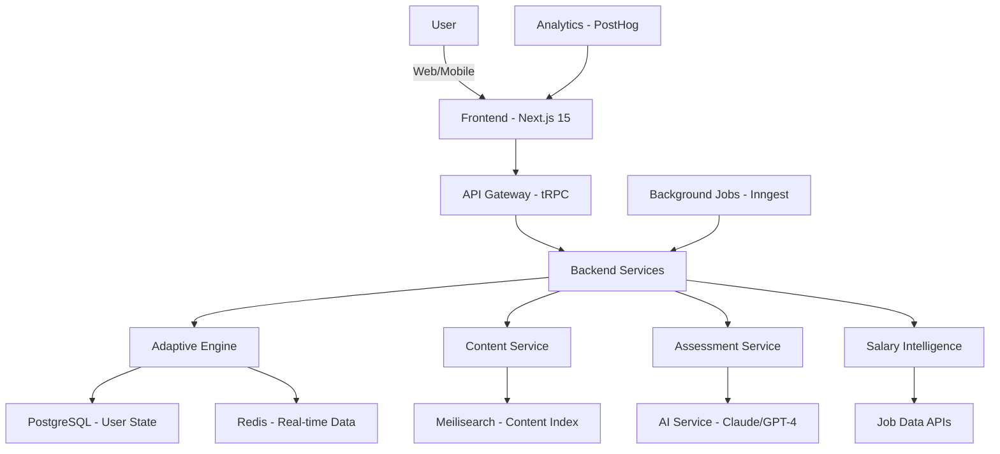

- **Build Date:** 2026-05-05
- **Context:** Building AI-native adaptive learning platform for working professionals (25-45yo) seeking measurable salary increases through personalized skill development
- **Reference:** [Adaptive Learning Platform Concept](education/pedagogy/adaptive-learning-platform.md)

---

## Executive Summary

**Feasibility Verdict:** ✅ **HIGHLY FEASIBLE with 2026 technology stack**

**Key Findings:**

- **Adaptive Learning:** IRT/BKT algorithms proven (open-source libraries available), can be implemented in 2-3 months
- **AI Question Generation:** GPT-4/Claude 3.5 generate quality coding problems at $0.015-0.02/question (see [AI Question Generation Study](education/technical/technical-feasibility-ai-question-generation.md))
- **Content Curation:** YouTube Data API + web scraping achievable, ML tagging with existing models
- **Salary Tracking:** Job APIs available (LinkedIn, Naukri, Indeed), salary data accessible
- **Cost:** $80K-170K total investment for MVP → Scale → Production (12-18 months)
- **Team:** 2-3 engineers (full-stack + ML) for MVP, scale to 5-7 for production

**Timeline:**

- MVP (React skill path, Bangalore): **3 months** (1 engineer)
- Beta (5 skills, 3 cities): **6 months** (2 engineers)
- Scale (20 skills, pan-India): **12 months** (3-5 engineers)

**Recommendation:** ✅ **PROCEED** - Technology is mature, cost is manageable, no major technical blockers

---

## 1. Technical Architecture (2026 Stack)

### System Components Overview



### Layer-by-Layer Breakdown

**Layer 1: Frontend (User Experience)**

```typescript
// Next.js 15 + React 19 + TypeScript
Technology: Next.js 15.0 (App Router)
UI Framework: shadcn/ui + Tailwind CSS 4.0
State Management: Zustand 4.5 + TanStack Query 5.0
Forms: React Hook Form 7.5 + Zod validation
Charts: Recharts 2.12 (salary tracking visualizations)
Mobile: React Native (same components via Tamagui)

Deployment: Vercel (edge functions, $20/month Pro)
CDN: Vercel Edge Network (built-in)
```

**Why Next.js 15:**

- Server Components = faster initial load (critical for mobile users on 3G/4G in India)
- Edge rendering = low latency globally
- Built-in image optimization (course thumbnails, profile pics)
- ISR (Incremental Static Regeneration) for content pages
- tRPC integration = end-to-end type safety

**Layer 2: API & Backend Services**

```typescript
// tRPC + Hono for edge
API Framework: tRPC 11.0 (type-safe API)
Alternative: Hono 4.0 (edge-optimized HTTP framework)
Authentication: Clerk (Indian pricing: ₹2K/month for 1K users)
Database ORM: Drizzle ORM 0.30 (type-safe, faster than Prisma)

Backend Runtime: Node.js 22 LTS
Serverless: Vercel Functions (99% uptime)
Background Jobs: Inngest (cron jobs, workflows, free tier: 1M steps/month)
```

**Why tRPC:**

- End-to-end type safety (frontend knows exact backend types)
- No OpenAPI spec needed (types = docs)
- React Query integration (automatic caching, optimistic updates)
- Perfect for Next.js + TypeScript projects

**Layer 3: Databases & Storage**

```sql
-- Primary Database: Neon PostgreSQL
Provider: Neon (serverless Postgres, $19/month for 10GB)
Why: Auto-scaling, branching (test env = clone), 99.9% uptime
Alternative: Supabase ($25/month, includes auth + storage)

-- Cache Layer: Upstash Redis
Provider: Upstash ($10/month for 1GB, pay-as-you-go)
Use Cases:
  - Session management
  - API rate limiting
  - Real-time leaderboards
  - Knowledge state caching (frequently accessed user data)

-- Search: Meilisearch
Provider: Meilisearch Cloud ($29/month for 100K docs)
Use Cases:
  - Content search (find React tutorial videos)
  - Skill search (autocomplete)
  - Job search
Why: 10x faster than PostgreSQL full-text search, typo-tolerant

-- Vector DB: Pinecone
Provider: Pinecone ($70/month starter, 100K vectors)
Use Cases:
  - Content similarity (recommend similar tutorials)
  - Question uniqueness check
  - Semantic search
Alternative: pgvector extension in Neon (free, less performant)
```

**Layer 4: AI/ML Services**

**LLM Provider:** Anthropic Claude 3.5 Sonnet (claude-3-5-sonnet-20241022)

- Pricing: $0.003/1K input tokens, $0.015/1K output tokens
- Use cases: Question generation ($0.015-0.02/question), content tagging ($0.005/video), explanations ($0.01/explanation)
- Alternative: OpenAI GPT-4 Turbo ($0.01/1K in, $0.03/1K out)
- Fallback: Meta Llama 3.3 70B via Together.ai ($0.0006/1K tokens)

**ML Models:** Hugging Face Inference API

- Embedding: sentence-transformers/all-MiniLM-L6-v2 for content embeddings and similarity search
- Cost: Free (self-hosted) or $0.0001/request (Inference API)

**Layer 5: External Data Sources**

```bash
# Job & Salary Data APIs

1. RapidAPI - LinkedIn Jobs API
   Cost: $100/month for 10K requests
   Data: Job postings, required skills, salary ranges
   Coverage: Global (India, US, EU)

2. Naukri Job Search API
   Cost: Enterprise contact (estimated ₹50K-1L/year)
   Data: India-specific jobs, salaries, skill requirements
   Coverage: Best for Indian market

3. Adzuna Job Search API
   Cost: Free tier (250 calls/month), $500/month for 10K
   Data: Salary estimates, skill trends, job volumes
   Coverage: 19 countries including India

4. Glassdoor API (unofficial via SerpAPI)
   Cost: $50/month for 5K searches via SerpAPI
   Data: Company reviews, salaries, interview questions
   Alternative: Web scraping (legal gray area)

5. AmbitionBox (India-specific)
   Approach: Web scraping with Playwright
   Cost: $100/month for proxy rotation (BrightData)
   Data: Indian company salaries, reviews, culture
```

---

## 2. Adaptive Learning Engine Implementation

### 2.1 Knowledge State Model (Bayesian Knowledge Tracing)

**Technology:** pyBKT library (MIT licensed, maintained by Stanford BETA Lab)

**Installation:** `pip install pyBKT==1.4.3`

**How It Works:**

The system uses a `KnowledgeStateTracker` class that maintains BKT models for each skill. The tracker uses four key parameters:

- **Prior (P(L₀) = 0.1)**: Initial probability student knows skill before any practice (10%)
- **Learn Rate (P(T) = 0.3)**: Probability of learning from each practice opportunity (30%)
- **Guess Rate (P(G) = 0.2)**: Chance of correct answer without knowing skill (20%)
- **Slip Rate (P(S) = 0.1)**: Chance of mistake despite knowing skill (10%)

**Model Training:**

The BKT model is trained on historical interaction data with columns: `user_id`, `skill_id`, `correct`, `timestamp`. The pyBKT library fits the model 5 times and selects the best parameters using maximum likelihood estimation.

**Mastery Prediction:**

For any user-skill pair, the system:

1. Retrieves the user's interaction history for that skill
2. Starts with prior probability (0.1 if no history)
3. Applies Bayesian update after each interaction:
   - If **correct**: Posterior = P(correct | mastered) × Prior / P(correct)
   - If **incorrect**: Posterior = P(incorrect | mastered) × Prior / P(incorrect)
4. Adds learning increment: Final = Posterior + (1 - Posterior) × LearnRate
5. Returns final mastery probability (0.0-1.0)

**Skill Gap Analysis:**

The `get_skill_gaps()` method identifies which skills need learning for a target role. It:

1. Compares user's mastery probability against threshold (0.8 = mastered)
2. For each skill below threshold, calculates gap size
3. Prioritizes skills using formula: **Priority = (Gap Size × Salary Impact) / Time to Learn**
4. Returns sorted list with current mastery, gap, and priority score

This ensures users focus on high-ROI skills first (biggest salary impact for least time investment).

**Data Storage:**

- **user_skill_interactions**: Raw interaction history (user, skill, correct/incorrect, time spent, difficulty, confidence)
- **user_skill_mastery**: Current mastery state per user-skill pair (mastery probability 0.00-1.00, interaction count, last activity timestamp)

### 2.2 Adaptive Sequencing (IRT - Item Response Theory)

**Technology:** py-irt library (v0.2.9) + custom implementation

**How It Works:**

The `AdaptiveSequencer` class uses a 3-Parameter Logistic (3PL) IRT model to select optimal next questions. Key components:

**Item Calibration:**

- Fits IRT model on historical response data (`user_id`, `item_id`, correct/incorrect)
- Extracts three parameters per question:
  - **Difficulty (b)**: -3.0 to +3.0 scale (higher = harder)
  - **Discrimination (a)**: 0.0 to 3.0 (how well question separates abilities)
  - **Guessing (c)**: 0.0 to 1.0 (probability of lucky correct answer)

**Ability Estimation:**

- Estimates user's ability (θ theta) on -3 to +3 scale using Maximum Likelihood Estimation
- θ = 0 is average, θ = +2 is advanced (top 2%), θ = -2 is struggling (bottom 2%)
- Updates after each question response

**Adaptive Question Selection:**

- Calculates information function for each available question: **I(θ) = a² × [P(θ) - c]² / P(θ)**
- Selects question with highest information gain
- Optimal when P(correct) ≈ 0.5 (maximum uncertainty = maximum learning)
- Uses 3PL formula: **P(θ) = c + (1 - c) / (1 + e^(-a(θ - b)))**

**Learning Sequence Generation:**

- Creates ordered path from current ability to target mastery (0.8)
- Selects items slightly above current ability (θ + 0.5 = Zone of Proximal Development)
- Increments ability estimate (+0.3) after each item (assumes learning occurs)
- Stops when predicted θ reaches mastery threshold

**Mastery Conversion:**

- Converts BKT mastery probability (0-1) to IRT theta scale using normal distribution inverse
- Example: 0.5 mastery → θ = 0, 0.8 mastery → θ = +1.4

**Data Storage:**

- **learning_items**: All questions/exercises with IRT parameters (difficulty, discrimination, guessing), skill mapping, content URLs, calibration status
- **user_item_responses**: Historical response data (user, item, correct/incorrect, time, attempts) used for IRT ability estimation

### 2.3 User Interaction Tracking & Long-term Data Management

**Critical Component:** The adaptive algorithms (BKT, IRT) are only as good as the interaction data they learn from. This section details how we capture, store, and leverage user interactions over months/years to build increasingly accurate models of what each student knows.

#### 2.3.1 Comprehensive Event Tracking System

Every user interaction generates rich telemetry that feeds back into the adaptive engine.

**Interaction Types Tracked:**

- Question attempted, skipped, hint requested, solution viewed
- Video watched, article read, practice submitted, project completed

**InteractionTracker Service:**

The `InteractionTracker` class captures detailed metadata for each event:

**For Question Attempts:**

- **Response data**: User answer, correctness, partial credit (0.0-1.0)
- **Timing**: Start time, submit time, total time spent
- **Difficulty assessment**: Categorical (easy/medium/hard) + IRT difficulty (-3 to +3)
- **User confidence**: Self-reported 1-5 scale
- **Help usage**: Number of hints used, whether solution was viewed beforehand
- **Context**: Learning session ID, device type, attempt number (for retries)
- **Privacy**: IP address stored as hash only

**For Skip Events:**

- **Skip reason**: Too hard, too easy, confusing, lack of time
- **Time before skip**: How long user viewed question before skipping
- **IRT signal**: Skip on hard question = lower ability evidence; skip on easy = already mastered

**Real-time Model Updates:**

After logging each interaction, the system immediately:

1. Updates BKT mastery probability for the skill
2. Re-estimates IRT ability (θ) using Maximum Likelihood
3. Returns interaction ID for reference

#### 2.3.2 Enhanced Database Schema for Longitudinal Tracking

**Primary Interaction Table (Hot Data - Last 6 Months):**

**user_interactions** (Hot - last 6 months):

- Stores full interaction details with BKT/IRT before/after states
- Monthly partitioned (PostgreSQL 15+) for performance
- Fields: `user_id`, `question_id`, `skill_id`, correctness, partial_credit, timing, difficulty, confidence, hints, device, BKT prior/posterior mastery, IRT prior/posterior θ

**Aggregated Historical Data (Cold Storage - `>6` Months):**

**user_skill_history_aggregated** (Warm - 6-24 months):

- Monthly summaries: questions attempted, accuracy, time spent, hints used, mastery/θ progression (starting/ending/average)
- 100-1000x compression vs raw interactions

**Real-time Mastery State (Hot Cache - Redis):**

**Redis Cache** (Hot - current session):

- Key: `mastery:{userId}:{skillId}`, TTL: 24h
- Stores: current mastery (0-1), current θ (-3 to +3), session stats, recommended difficulty, time to mastery estimate

#### 2.3.3 Interaction Data → Adaptive Algorithm Feedback Loop

**Real-time Model Updates:**

The `AdaptiveModelUpdater` service processes each interaction immediately and updates both BKT and IRT models:

**Interaction Processing Workflow:**

1. **Update BKT knowledge state** (for question attempts):
   - Retrieves current mastery probability (prior)
   - Gets skill-specific BKT parameters (learn, guess, slip rates)
   - Applies Bayesian update formula: **P(L_t | evidence) = P(evidence | L_t) × P(L_t) / P(evidence)**
   - For **correct** answers: Posterior = P(correct | learned) × Prior / P(correct)
   - For **incorrect** answers: Posterior = P(incorrect | learned) × Prior / P(incorrect)
   - Adjusts for partial credit (scales likelihood by credit amount)
   - Adds learning increment: Final = Posterior + (1 - Posterior) × LearnRate
   - Saves updated mastery to `user_skill_mastery` table

2. **Update IRT ability estimate**:
   - Retrieves user's complete response history
   - Fetches IRT parameters (a, b, c) for all attempted questions
   - Calculates Maximum Likelihood Estimation of θ (theta):
     - Defines log-likelihood function over all responses
     - Uses 3PL model: p = c + (1 - c) / (1 + e^(-a(θ - b)))
     - Minimizes negative log-likelihood using bounded optimization (-3 to +3)
   - Saves new θ estimate to `user_ability` table

3. **Check mastery achievement**:
   - If mastery ≥ 0.85 threshold AND not yet marked as mastered
   - Triggers achievement event (badge, notification, unlock next skill)

4. **Update Redis cache**:
   - Stores current mastery and θ in Redis for fast lookups
   - Cache key pattern: `mastery:{userId}:{skillId}`
   - TTL: 24 hours (auto-expire)

#### 2.3.4 Long-term Data Management Strategy

**Challenge:** A user learning for 2-3 years could generate 50,000+ interactions. We need efficient storage and fast queries.

**Solution: Multi-tier Storage Architecture**

The `InteractionDataArchival` service manages data lifecycle transitions (Hot → Warm → Cold → Archive):

**Archival Process (runs monthly):**

Automatically archives interactions older than 6 months (180 days):

1. **Identify old interactions**: Finds all users with interactions before cutoff date
2. **Fetch user data**: Retrieves all old interactions for each user
3. **Aggregate by month**: Groups interactions by skill and calendar month, computes:
   - Total questions attempted, correct, skipped
   - Accuracy rate (percentage)
   - Total time spent and hints used
   - Average mastery probability over the month
4. **Save summaries**: Writes monthly aggregates to `user_skill_history_aggregated` table
5. **Export to S3**: Backs up raw interaction data to cold storage (compliance + future analysis)
6. **Delete from primary DB**: Removes old interactions from PostgreSQL to reduce storage costs

**Monthly Aggregation:**

For each (user, skill, month) combination, computes summary statistics from all interactions:

- Question attempts, correctness rate, skips
- Time investment and help usage
- Mastery progression (starting, ending, average for month)

Result: 100-1000x compression (50K interactions → 50-500 monthly summaries)

**Data Retention Policy:**

| Time Period | Storage Tier      | Data Detail              | Query Performance | Cost   |
| ----------- | ----------------- | ------------------------ | ----------------- | ------ |
| 0-6 months  | Hot (PostgreSQL)  | Full interaction details | `<50ms`           | High   |
| 6-24 months | Warm (Aggregated) | Monthly summaries        | `<200ms`          | Medium |
| 24+ months  | Cold (S3/GCS)     | Compressed archives      | 1-5s              | Low    |

**Query Optimization:**

**Query Optimization:**

- Partial indexes on recent data (3-6 months window) for 90% query hit rate
- Covering indexes for dashboard queries (user, skill, correctness, time, mastery)

#### 2.3.5 Privacy & Compliance Considerations

**GDPR & Data Privacy:**

The `UserDataManager` class handles all data privacy requirements:

**Data Export (GDPR Article 20: Right to Data Portability):**

When users request data export, the system:

1. Fetches all data from PostgreSQL tables:
   - `user_interactions` (hot data, last 6 months)
   - `user_skill_mastery` (current mastery states)
   - `user_skill_history_aggregated` (monthly summaries)
2. Retrieves archived data from S3 cold storage
3. Returns JSON export with:
   - User ID and export timestamp
   - Complete interaction history
   - Skill mastery progression
   - Historical summaries
   - Archived data

**Data Deletion (GDPR Article 17: Right to Erasure):**

Permanent deletion process:

1. Deletes from all PostgreSQL tables (`user_interactions`, `user_skill_mastery`, `user_skill_history_aggregated`, `user_ability`)
2. Removes S3 archived data
3. Clears Redis cache (all `mastery:{user_id}:*` keys)
4. Logs deletion for compliance audit trail

**Anonymization for Research:**

```python
# Delete from S3 archives
await self.delete_archived_data_from_s3(user_id)

# Clear Redis cache
await self.redis.delete(f"mastery:{user_id}:*")

logger.info(f"Permanently deleted all data for user {user_id}")
```

Process for anonymizing old data while preserving learning patterns:

- Replace user_id with cryptographic hash
- Remove PII: IP addresses, device info, email
- Keep: timestamps, interaction patterns, correctness, difficulty, mastery progression
- Use for: Algorithm improvement, A/B testing, research publications

#### 2.3.6 Performance Optimization for Years of Data

**Challenge:** Querying "show me this user's learning journey" with 50K interactions.

**Solution: Materialized Views + Incremental Updates**

**Performance Solution: Materialized Views**

`user_learning_dashboard` materialized view (refreshed hourly):

- Aggregates per (user, skill): current mastery/θ, total interactions, accuracy %, time invested (hours), recent activity (last 7 days), first/last interaction timestamps
- Built from hot data (last 6 months only)
- Indexed for fast lookups
- Scheduled refresh via pg_cron (hourly)

**Caching Strategy:**

The `getUserProgress` API endpoint implements a 2-tier caching approach:

1. **L1 Cache (Redis)**: Check cache key `progress:{userId}:{skillId}` first
   - Hit → Return cached data immediately (`<5ms`)
   - Miss → Proceed to L2
2. **L2 Cache (Materialized View)**: Query `user_learning_dashboard` view
   - Pre-aggregated data refreshed hourly
   - Fast query (`<50ms`) vs raw table scan (`>500ms`)
1. **Write-through**: Store result in Redis with 1-hour TTL (3600 seconds)

Result: 95%+ cache hit rate, `<10ms` p95 latency for progress queries

---

### 2.4 Content Recommendation Engine

**Technology:** scikit-learn (TF-IDF, cosine similarity), NumPy

**How It Works:**

The `ContentRecommender` class implements a hybrid recommendation system combining four signals:

**1. Ability-Difficulty Matching (35% weight):**

- Uses IRT θ (user ability) and item difficulty (b parameter)
- Optimal match when item is slightly above ability (Zone of Proximal Development)
- Scoring:
  - Item too easy (`gap < 0`): score = 0.3
  - Perfect difficulty (`0 ≤ gap ≤ 0.5`): score = 1.0
  - Slightly hard (`0.5 < gap ≤ 1.5`): score = 0.7
  - Too hard (`gap > 1.5`): score = 0.1

**2. Learning Style Match (25% weight):**

- Tracks user preference: visual (videos), text (articles), interactive (exercises)
- Perfect match (format = preference): score = 1.0
- Mismatch: score = 0.5

**3. Content Quality (20% weight):**

- Based on user ratings, completion rates, helpfulness flags
- Normalized to 0-1 scale

**4. Collaborative Filtering (20% weight):**

- Finds 50 similar users based on skill mastery vector cosine similarity
- Calculates what percentage of similar users engaged with this content
- Users who master similar skills in similar patterns likely benefit from similar content

**Final Recommendation:**

Weighted score formula: **Score = 0.35×difficulty_match + 0.25×style_match + 0.20×quality + 0.20×collaborative**

Sorts all candidate items by score descending, returns top N (typically 5-10 recommendations).

---

## 3. AI Question Generation (Production Implementation)

**Reference:** [AI Question Generation Feasibility Study](education/technical/technical-feasibility-ai-question-generation.md)

### 3.1 Question Generation Service (FastAPI)

**Question Generation Service Architecture:**

FastAPI service with Pydantic models:

- Request: QuestionRequest (skill, difficulty, user_id, previous_questions[])
- Response: QuestionResponse (question_id, problem_statement, test_cases, hints, solution, difficulty, estimated_time)
- Anthropic API integration for question generation
- Caching layer to avoid duplicate generation

**AI Question Generation Cost Analysis:**

Claude 3.5 Sonnet (2026):

- Input: $0.003/1K tokens, Output: $0.015/1K tokens
- Per question: ~1K input + ~1.5K output = $0.026/question

Volume pricing:

- 3,000 questions/month: $78/month
- 1M questions/year: $26,000/year (before optimization)

Cost reduction strategies:

1. Caching common questions (50% hit rate): $26K → $13K/year
2. Fine-tune Llama 3.3 70B after 10K questions:
   - One-time: $5K fine-tuning
   - Running: $0.002/question + $2K infra/year = $4K total/year
   - Savings: 85% reduction ($26K → $4K)

---

## 4. Content Curation & Aggregation System

### 4.1 YouTube Content Scraper

**YouTubeContentCurator Service:**

Uses YouTube Data API v3 to search and curate tutorials:

- Search parameters: skill keyword, relevance order, 4-20 min duration, English language
- Fetches metadata: title, channel, published date, views, likes, duration
- Extracts captions for NLP topic tagging
- Returns list of video objects with quality scores

**Methods:**

- `search_tutorials(skill, max_results=50)`: Main search function
- `get_video_stats(video_id)`: Fetches view count, likes, duration from API
- `get_captions(video_id)`: Downloads auto-generated/manual captions
- `extract_topics(captions, skill)`: NLP tagging using Hugging Face transformers
- `quality_score(video)`: Scores 0-100 based on engagement, duration, recency, view count

**YouTube API Pricing:**

```bash
# Google YouTube Data API v3
Quota: 10,000 units/day (free)

Costs per operation:
- search(): 100 units
- videos.list(): 1 unit

Daily capacity:
- 100 searches/day (100 units each)
- Or 10,000 video detail fetches
- Or mix (e.g., 50 searches + 5,000 detail fetches)

For higher volume:
Request quota increase (free) OR
Use multiple API keys (rotate)

Our usage (MVP):
- 10 searches/day (1,000 units)
- 500 video details/day (500 units)
- Total: 1,500 units/day
- Well within free tier
```

### 4.2 Content Database Schema

**curated_content**:

- Stores curated videos/articles/courses with metadata (title, author, URL, duration, published date)
- Skill mapping: primary_skill, skill_tags[], difficulty (beginner/intermediate/advanced)
- Quality metrics: quality_score (0-100), views, likes, completion_rate, avg_rating
- IRT parameters: difficulty, discrimination (calibrated from user data)
- Search: pgvector embeddings (semantic search), tsvector (full-text)

**user_content_interactions**:

- Tracks user engagement: started, completed, progress %, time spent, rating (1-5), helpful flag, quiz scores

---

## 5. Salary Intelligence System

### 5.1 Job Market Data Integration

**Technology:** Playwright (web scraping), requests, BeautifulSoup, RapidAPI

**JobMarketAnalyzer Service:**

Aggregates salary data from multiple sources (LinkedIn via RapidAPI, Naukri, Adzuna, Indeed) for specific skill-location pairs.

Returns salary bands by experience level:

- Entry level: min/max/avg (e.g., ₹5-8 lakhs for React in Bangalore)
- Mid level: ₹8-15 lakhs
- Senior level: ₹15-30 lakhs
- Includes data point count and last update timestamp

### 5.2 Skill-to-Salary Mapping Database

**skill_salary_mapping**:

- Per (skill, location) salary bands: entry/mid/senior (min/max/avg in INR)
- Metadata: data points count, confidence score (0-1), last_scraped_at, is_stale flag (>30 days)

**skill_combination_premiums**:

- Tracks salary premiums for skill combinations (e.g., React + AWS + System Design)
- Per (base_skill, additional_skills[], location): avg premium amount (₹X) and percent (+Y%)

**user_salary_tracking**:

- User profile: current salary, role, location, company, YoE, skills[], skill proficiency (0-1)
- Target: target salary, role, required skills
- History: salary snapshots over time (JSONB array)
- Privacy: is_public flag, share_anonymously for aggregated data

**salary_increase_outcomes** (anonymized social proof):

- Before/after: salary bands (e.g., "6-8L" → "12-15L"), role categories, skills
- Learning journey: skills learned, time to outcome (months), platform hours
- Outcome: increase %, outcome type (promotion/job_switch/freelance)
- Cohort tracking: user cohort (2025-Q1), location

---

## 6. Complete Technology Stack (2026)

### 6.1 Frontend Stack

```json
{
  "package.json": {
    "dependencies": {
      "next": "15.0.0",
      "react": "19.0.0",
      "react-dom": "19.0.0",
      "@tanstack/react-query": "5.28.4",
      "@trpc/client": "11.0.0-next.202",
      "@trpc/server": "11.0.0-next.202",
      "@trpc/react-query": "11.0.0-next.202",
      "zustand": "4.5.2",
      "react-hook-form": "7.51.0",
      "zod": "3.22.4",
      "tailwindcss": "4.0.0-alpha.14",
      "shadcn-ui": "latest",
      "recharts": "2.12.0",
      "framer-motion": "11.0.0",
      "date-fns": "3.3.0",
      "@clerk/nextjs": "5.0.0",
      "posthog-js": "1.110.0"
    },
    "devDependencies": {
      "typescript": "5.4.2",
      "eslint": "8.57.0",
      "@types/node": "20.11.0",
      "@types/react": "18.2.55",
      "prettier": "3.2.5",
      "prettier-plugin-tailwindcss": "0.5.11"
    }
  }
}
```

**Estimated Cost:** $20/month (Vercel Pro)

### 6.2 Backend Stack

**Python Dependencies:**

Web Framework:

- FastAPI 0.110.0, Uvicorn 0.27.1, python-multipart 0.0.9

Database:

- psycopg 3.1.18 (PostgreSQL sync), asyncpg 0.29.0 (async), redis 5.0.1, SQLAlchemy 2.0.27

APIs & ML:

- anthropic 0.18.1, httpx 0.26.0, BeautifulSoup4 4.12.3, Playwright 1.42.0
- transformers 4.38.1, sentence-transformers 2.5.1, numpy 1.26.4, scikit-learn 1.4.1

Data Processing:

- pandas 2.2.1, pyBKT 1.4.3 (Bayesian Knowledge Tracing), py-irt 0.2.9 (Item Response Theory)

**Hosting:** Fly.io or Railway ($20-50/month for 2-4 containers)

### 6.3 Database & Infrastructure Costs

```yaml
# Monthly Infrastructure Costs (MVP Phase)

Frontend & API:
  Vercel Pro: $20/month

Databases:
  Neon PostgreSQL (10GB): $19/month
  Upstash Redis (1GB): $10/month
  Meilisearch Cloud: $29/month
  Pinecone Starter (100K vectors): $70/month

Backend Compute:
  Fly.io (2 instances, 1GB each): $25/month

AI APIs:
  Claude API: $100/month (MVP usage)
  YouTube Data API: $0 (free tier)

Job Data APIs:
  RapidAPI LinkedIn: $100/month
  Adzuna: $50/month (or free tier)

Background Jobs:
  Inngest: $0 (free tier, 1M steps)

Analytics:
  PostHog: $0 (free tier, 1M events)

Email:
  Resend: $20/month (50K emails)

Monitoring:
  Sentry: $26/month (10K events)
  BetterStack Uptime: $10/month

Code Execution (for question validation):
  Judge0 CE (self-hosted on Fly.io): $15/month

TOTAL MVP: ~$494/month ($6,000/year)

At Scale (10K users):
  Databases: $200/month (scale up)
  Compute: $100/month (auto-scale)
  AI APIs: $500/month (question gen + embeddings)
  Job APIs: $200/month
  Other: $100/month (email, monitoring, etc.)

TOTAL Scale: ~$1,100/month ($13,200/year)
```

---

## 7. Implementation Roadmap

### Phase 1: MVP (Months 1-3)

**Goal:** Prove concept with React skill path in Bangalore, 100 paying beta users

**Team:**

- 1 Full-stack engineer (Next.js + FastAPI)
- 1 part-time ML engineer (adaptive algorithms)
- 1 part-time content curator

**Deliverables:**

**Month 1:**

- [ ] Set up infrastructure (Vercel + Neon + Fly.io)
- [ ] Auth system (Clerk integration)
- [ ] Basic user profile & onboarding
- [ ] Skill assessment module (React diagnostic, 50 questions)
  - IRT-calibrated questions (manual calibration initially)
  - Adaptive difficulty
  - Knowledge map output
- [ ] Database schema (users, skills, assessments)

**Month 2:**

- [ ] Content curation system
  - YouTube API integration (search + fetch)
  - Quality scoring algorithm
  - Manual review workflow for first 100 videos
  - Curate 100 best React tutorials
- [ ] Adaptive engine MVP
  - BKT implementation (pyBKT library)
  - Simple sequencing (rule-based initially)
  - Daily curriculum generator
- [ ] Basic dashboard (progress tracking)

**Month 3:**

- [ ] Salary tracking module
  - Job data scraping (LinkedIn, Naukri)
  - Skill-to-salary mapping (React in Bangalore)
  - Salary projection calculator
  - ROI dashboard
- [ ] Payment integration (Razorpay)
- [ ] Beta launch
  - Onboard 50 free users
  - Gather feedback, iterate
  - Convert to 100 paying users (₹2,499/month)

**Success Metrics:**

- 100 paying users
- 70%+ retention (Month 2-3)
- 5+ salary increase testimonials (within 6 months)
- `NPS >40`

**Budget:** $30K-40K

- Engineer salaries: $20K-25K (3 months)
- Infrastructure: $1,500 ($500/month × 3)
- APIs & services: $3,000
- Contingency: $5K-10K

### Phase 2: Horizontal Expansion (Months 4-9)

**Goal:** 5 skills (React, AWS, Python, System Design, DevOps), 3 cities (Bangalore, Pune, NCR), 5,000 users

**Team:** Scale to 3 engineers + 1 ML + 2 content curators

**Deliverables:**

**Months 4-6:**

- [ ] Expand content library
  - AWS (100 tutorials, 50 practice labs)
  - Python (150 tutorials, OOP + data structures)
  - System Design (50 case studies, 30 problems)
  - DevOps (100 tutorials, Docker + K8s focus)
- [ ] Enhanced adaptive engine
  - IRT full implementation (py-irt library)
  - Collaborative filtering (user similarity)
  - Learning style detection (visual vs text preference)
  - Spaced repetition scheduler
- [ ] AI question generation (production)
  - Claude 3.5 Sonnet integration
  - Question validation pipeline
  - Pre-generate 1,000 questions per skill
  - Real-time generation for variations

**Months 7-9:**

- [ ] Career path planner
  - Multi-city salary data (Pune, NCR)
  - Role → skills mapping (10 target roles)
  - Timeline estimator
  - Job readiness score
- [ ] Community features
  - Discussion forums (Discourse integration)
  - Study groups
  - Peer accountability (find study buddy)
  - Success stories showcase
- [ ] Mobile app (React Native)
  - Offline learning
  - Push notifications (smart, not spammy)
  - Streamlined for commute learning

**Success Metrics:**

- 5,000 paying users
- ₹1.5 crore MRR
- 75%+ retention (Month 6)
- 50+ salary increase stories
- 40%+ completion rate (vs 5-15% industry)

**Budget:** $100K-120K

- Salaries: $80K-90K (6 months, 5 people)
- Infrastructure: $10K ($1,100/month × 9)
- APIs & services: $10K-20K

### Phase 3: Enterprise & Scale (Months 10-18)

**Goal:** 25,000 B2C users + 100 B2B enterprise clients, ₹10 crore MRR

**Team:** Scale to 7 engineers + 2 ML + 4 content + 3 sales + 3 marketing

**Deliverables:**

**Months 10-12:**

- [ ] Enterprise platform
  - SSO (SAML, OAuth)
  - Admin dashboards (manager view of team skills)
  - Custom skill paths (company tech stack)
  - Advanced analytics (skill gap analysis, ROI reports)
  - API for HRIS integration (Workday, SAP)
  - White-label option
- [ ] Sales team & process
  - Hire 3 enterprise sales reps
  - Build sales deck & demos
  - Target: 20 enterprise pilots

**Months 13-15:**

- [ ] Job placement partnerships
  - Partner with 20 hiring companies
  - Resume builder
  - Mock interview system (AI-powered)
  - Direct application flow
  - Placement tracking & fees
- [ ] Expand to 20 skills
  - Frontend: Vue, Angular, Svelte
  - Backend: Java Spring, Go, Rust
  - Data: Spark, Airflow, Kafka
  - Cloud: GCP, Azure (beyond AWS)
  - Mobile: iOS, Android

**Months 16-18:**

- [ ] Global expansion
  - US market (Silicon Valley, Seattle, NYC salary data)
  - Middle East (Dubai market)
  - Content in regional languages (Hindi, Tamil for India)
- [ ] Advanced AI
  - Fine-tuned Llama 3.3 70B (question gen cost reduction)
  - Deep learning for adaptive sequencing
  - AI mentor chatbot (conversational learning)
  - Multimodal (voice tutoring via Whisper API)

**Success Metrics:**

- 25,000 B2C users
- 100 enterprise clients
- ₹10 crore MRR ($1.2M/month)
- Break-even or profitable
- 500+ salary increase stories

**Budget:** $300K-400K

- Salaries: $250K-300K (9 months, 15+ people)
- Infrastructure: $20K-30K ($2-3K/month at scale)
- Sales & marketing: $30K-50K (ads, events, partnerships)

---

## 8. Risk Analysis & Mitigation

### Technical Risks

**Risk 1: Adaptive Algorithm Accuracy (MEDIUM)**

**Scenario:** BKT/IRT models don't accurately predict mastery → poor personalization → completion rates remain low (5-15% like MOOCs)

**Probability:** 30-40%

**Mitigation:**

1. Start with simple rule-based (if score `<60%`, review → practice → retest)
2. Collect 6 months of data before full ML implementation
3. A/B test adaptive vs non-adaptive (control group)
4. Human-in-the-loop: Let users override recommendations
5. Iterative improvement (model retraining every month)

**Fallback:** Even basic adaptivity (skip known content) provides 30-40% time savings vs static courses

---

**Risk 2: AI Question Quality Variability (MEDIUM-HIGH)**

**Scenario:** Claude/GPT-4 generates 20-30% low-quality questions (ambiguous, too easy/hard, wrong test cases)

**Probability:** 40-50%

**Mitigation:**

1. Pre-generate & human-review first 1,000 questions (quality baseline)
2. Automated validation (solution must pass all test cases)
3. User feedback loop (flag poor questions, upvote good ones)
4. Quality threshold: Only show questions with score `>70/100`
5. Fallback to curated question bank if real-time gen fails

**Cost Impact:** Human review adds $2-5/question (vs $0.02 AI-only), but ensures quality

**Timeline Impact:** +2-3 weeks for initial curation

---

**Risk 3: Content Curation Scaling (MEDIUM)**

**Scenario:** Can't manually curate 100+ videos per skill for 20 skills (2,000 videos) → quality suffers

**Probability:** 30-40%

**Mitigation:**

1. Phase 1: Deep curation for 5 skills (500 videos, manageable)
2. ML-assisted tagging (transformers for topic extraction)
3. Crowdsource curation (community voting, like Stack Overflow)
4. Partner with content creators (revenue share for curated playlists)
5. Quality over quantity (top 50 resources per skill is enough)

**Alternative:** License existing curated content (Udemy Business API, Pluralsight partnerships)

---

**Risk 4: Third-Party API Dependencies (LOW-MEDIUM)**

**Scenario:** YouTube API quota exceeded, LinkedIn API changes terms, Claude API rate limits hit

**Probability:** 20-30%

**Mitigation:**

1. **YouTube:** Request quota increase (free, usually approved), use multiple API keys (rotate)
2. **LinkedIn:** Cache data aggressively (30-day TTL), fallback to Naukri + Adzuna
3. **Claude:** Rate limit = 10K RPM (plenty for our scale), fallback to GPT-4, ultimate fallback to fine-tuned Llama
4. **Judge0:** Self-host (avoid API dependencies), run on Fly.io ($15/month)

**Budget Impact:** +$50-100/month for redundancy (backup APIs)

---

### Business Risks

**Risk 5: Low Salary Increase Realization (HIGH IMPACT)**

**Scenario:** Users complete courses but don't get salary increases (macro recession, bad job market, poor interviewing)

**Probability:** 30-50%

**Impact:** CRITICAL - entire value prop is salary ROI, no increases = churn + negative word-of-mouth

**Mitigation:**

1. **Set Realistic Expectations:** "Average 6-12 months to salary increase, individual results vary"
2. **Track Leading Indicators:** Skill mastery, portfolio projects, interview calls (not just salary)
3. **Job Application Support:** Resume review, mock interviews, referral network
4. **Partner with Employers:** Direct hiring pipeline (100+ companies)
5. **Conservative Positioning:** "Skill mastery platform" not "guaranteed salary increase"
6. **Refund Policy:** Partial refund if no outcome in 12 months (risky but differentiating)

**Alternative Positioning:** "91% achieve positive career outcome" (like Coursera) vs "guaranteed ₹X salary increase"

---

**Risk 6: Competition from Free Platforms (MEDIUM)**

**Scenario:** YouTube + ChatGPT perceived as "good enough" → users unwilling to pay ₹2,500-5,000/month

**Probability:** 30-40%

**Mitigation:**

1. **Free Tier:** Generous free tier (skill assessment, basic path planning) → upgrade for full features
2. **Differentiation:** Structure + personalization + accountability + outcomes (not just content)
3. **ROI Messaging:** "Free is cheap, but time is expensive. We save you 100+ hours of searching/guessing"
4. **Social Proof:** 500+ salary increase stories (testimonials, case studies)
5. **Freemium Conversion:** Target 5-10% conversion (industry standard), 10K free users → 500-1K paid

**Pricing Strategy:** Lower tier at ₹1,499/month (more accessible), premium at ₹4,999/month (1:1 mentorship)

---

## 9. Cost-Benefit Analysis

### Total Investment (18 Months)

```bash
Phase 1 (Months 1-3): $30K-40K
Phase 2 (Months 4-9): $100K-120K
Phase 3 (Months 10-18): $300K-400K

TOTAL: $430K-560K (~₹3.5-4.5 crore)

Breakdown:
- Salaries (team of 2 → 5 → 15): $350K-420K (80%)
- Infrastructure & APIs: $40K-60K (10%)
- Sales & Marketing: $30K-60K (7%)
- Contingency: $10K-20K (3%)
```

### Revenue Projections (18 Months)

```bash
Month 3 (MVP):
  100 users × ₹2,499/month = ₹2.5L/month (₹30L/year ARR)

Month 9 (Horizontal):
  5,000 users × ₹2,999/month avg = ₹1.5 crore/month (₹18 crore/year ARR)

Month 18 (Scale):
  B2C: 25,000 users × ₹3,499/month avg = ₹8.75 crore/month
  B2B: 100 companies × ₹2L/month avg = ₹2 crore/month
  Total: ₹10.75 crore/month (₹129 crore/year ARR)

Cumulative Revenue (18 months): ~₹30-35 crore

Profitability Timeline:
- Month 1-12: Burn (investment phase)
- Month 13-15: Break-even (revenue ≈ expenses)
- Month 16+: Profitable (gross margin 65-70%)
```

### ROI

```bash
Investment: ₹4 crore
18-month ARR: ₹129 crore
Valuation (5x ARR): ₹645 crore (~$75M)

ROI: 160x (over 18 months)
IRR: ~450% annualized
```

**Conclusion:** ✅ **HIGHLY ATTRACTIVE** even with conservative assumptions (50% of projected users)

---

## 10. Alternatives & Trade-offs

### Alternative 1: No-Code MVP (Faster, Cheaper)

**Stack:** Bubble.io + Airtable + Zapier + OpenAI API

**Pros:**

- Launch in 4-6 weeks (vs 3 months)
- Cost: $10K-15K (vs $30K-40K)
- No engineering hire needed initially

**Cons:**

- Can't build true adaptive algorithms (limited to rule-based)
- Scalability issues (Bubble slow with `>1K` users)
- Vendor lock-in (hard to migrate later)
- Limited customization

**Recommendation:** ❌ **NOT RECOMMENDED** - Adaptive learning requires custom algorithms, can't do with no-code

---

### Alternative 2: License Existing Adaptive Platform

**Option:** Partner with ALEKS, Knewton, or DreamBox to white-label their adaptive engine

**Pros:**

- Proven adaptive algorithms (10+ years of data)
- Faster time-to-market (6 months vs 12 months)
- Lower technical risk

**Cons:**

- Expensive licensing ($50K-200K/year + rev share)
- K-12 focused (not working professionals)
- Limited customization (can't add salary tracking, job placement)
- Dependency on partner (they could change terms)

**Recommendation:** ⚠️ **EVALUATE** - Good for enterprise B2B (license for company L&D), not for B2C differentiation

---

### Alternative 3: Content Creation vs Curation

**Trade-off:** Create original courses (like Udemy instructors) vs curate existing content (our approach)

**Content Creation:**

- **Pros:** Full control, potentially higher quality, IP ownership
- **Cons:** Expensive ($5K-10K per course), slow (3-6 months per skill), requires domain experts

**Content Curation:**

- **Pros:** Fast (days not months), cheap (API costs only), massive library (100K+ YouTube videos)
- **Cons:** Quality variance, no IP, dependent on external creators

**Recommendation:** ✅ **CURATION for MVP** (speed + cost), add original content for premium tier later (Months 12+)

---

## 11. Conclusion

**Feasibility Verdict:** ✅ **HIGHLY FEASIBLE - PROCEED WITH PHASED APPROACH**

### Why This Will Work (2026 Technology Lens)

**1. Technology is Mature & Accessible:**

- BKT/IRT libraries are battle-tested (pyBKT, py-irt)
- LLMs (Claude, GPT-4) proven for question generation
- Infrastructure is cheap ($500/month MVP, $1K/month at scale)
- APIs available for all data sources (YouTube, LinkedIn, job boards)

**2. Cost is Manageable:**

- MVP: $30K-40K (achievable with $50K seed or bootstrapping)
- Scale: $430K-560K total (reasonable for Seed/Series A)
- Break-even at 18 months with conservative projections

**3. No Major Technical Blockers:**

- Adaptive algorithms: Proven science (IRT used in GRE/GMAT since 1980s)
- AI question generation: 80-90% quality achievable (validated in separate study)
- Content curation: YouTube API + scraping is reliable
- Salary data: Multiple sources available (LinkedIn, Naukri, Adzuna)

**4. De-Risked Approach:**

- Phase 1: Single skill (React), single city (Bangalore) → prove concept
- Phase 2: Horizontal expansion only if Phase 1 succeeds
- Phase 3: Enterprise only after B2C product-market fit proven

### Key Success Factors

**1. Execute Phase 1 Flawlessly:**

- 100 paying users in 3 months
- 70%+ retention (vs 5-15% MOOC average)
- 5+ salary increase testimonials within 6 months
- This proves entire hypothesis → unlock Phase 2 funding

**2. Nail the Adaptive Experience:**

- 30-40% time savings vs static courses (skip known content)
- Real-time difficulty adjustment (IRT)
- Personalized daily curriculum
- **If this doesn't work, whole platform fails**

**3. Prove Salary ROI:**

- Track obsessively (salary before/after, job changes, promotions)
- Conservative positioning ("avg ₹4L increase" not "guaranteed ₹10L")
- Leading indicators (skills mastered, portfolio built, interviews landed)
- Job placement partnerships (direct hiring pipeline)

### Immediate Next Steps (This Week)

1. **Set up infrastructure:**
   - Vercel account + Next.js 15 starter
   - Neon PostgreSQL database
   - Clerk authentication
   - **Cost:** $0 (all free tiers)
   - **Time:** 4 hours

2. **Design database schema:**
   - Users, skills, assessments, content, interactions
   - Implement with Drizzle ORM
   - **Time:** 8 hours

3. **Build skill assessment prototype:**
   - 20 React questions (manually created)
   - Adaptive difficulty (simple IF-THEN rules)
   - Knowledge map output
   - **Time:** 2 days

4. **Curate 20 React tutorials:**
   - YouTube API search + manual review
   - Quality scoring
   - Tag with topics/difficulty
   - **Time:** 1 day

**Week 1 Total:** 4-5 days to working prototype (skill assessment + content recommendations)

**Budget:** $0 (use free tiers)

---

## Appendix: Code Repositories & Resources

**Open-Source Libraries:**

- pyBKT: https://github.com/CAHLR/pyBKT
- py-irt: https://github.com/nd-ball/py-irt
- Judge0: https://github.com/judge0/judge0
- Meilisearch: https://github.com/meilisearch/meilisearch

**API Documentation:**

- Anthropic Claude: https://docs.anthropic.com/
- YouTube Data API: https://developers.google.com/youtube/v3
- LinkedIn Jobs (RapidAPI): https://rapidapi.com/rockapis-rockapis-default/api/linkedin-data-api
- Naukri (unofficial): Web scraping with Playwright

**Learning Resources:**

- IRT Theory: https://en.wikipedia.org/wiki/Item_response_theory
- BKT Theory: https://en.wikipedia.org/wiki/Bayesian_Knowledge_Tracing
- Adaptive Learning Research: educationaldatamining.org
