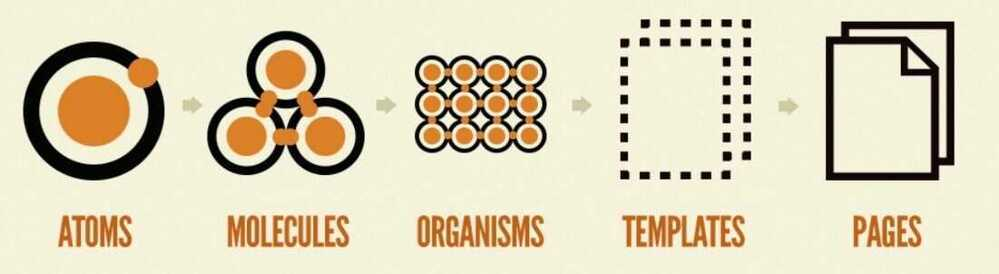

# Design System

The complete set of design standards, documentation, UI patterns, and components. Design systems allow you to manage design at scale

- Typography
- Layouts and grids
- Colors
- Icons
- Components
- Coding Conventions
- Documentation
- Reusable components

## Atomic Design System

Atomic design is methodology for creating design systems. There are five distinct levels in atomic design:

1. [Atoms](https://bradfrost.com/blog/post/atomic-web-design/#atoms)
2. [Molecules](https://bradfrost.com/blog/post/atomic-web-design/#molecules)
3. [Organisms](https://bradfrost.com/blog/post/atomic-web-design/#organisms)
4. [Templates](https://bradfrost.com/blog/post/atomic-web-design/#templates)
5. [Pages](https://bradfrost.com/blog/post/atomic-web-design/#pages)

https://bradfrost.com/blog/post/atomic-web-design

https://atomicdesign.bradfrost.com/table-of-contents

## Tools

- Frontify

### Lona

A tool for defining design systems and using them to generate cross-platform UI code, Sketch files, and other artifacts.

https://github.com/airbnb/Lona

### Zeplin

A design delivery tool that helps designers publish files in a format that developers can understand. It's a central hub for build-ready designs that the entire product team can use. Zeplin is good for asset collaboration.

[Zeplin vs. Figma Dev Mode: a point-by-point breakdown \| Zeplin Gazette](https://blog.zeplin.io/zeplin-vs-dev-mode/)

### StoryBook

Storybook is an open source tool for developing UI components in isolation for React, Vue, and Angular. It makes building stunning UIs organized and efficient.

[Storybook](https://storybook.js.org/) is a development environment for UI components. It allows you to browse a component library, view the different states of each component, and interactively develop and test components.

https://www.freecodecamp.org/news/what-is-storybook-and-how-can-i-use-it-to-create-a-component-libary-in-react

https://storybook.js.org

https://github.com/storybookjs/storybook

- https://patternlab.io

Pattern Lab is a frontend workshop environment that helps you build, view, test, and showcase your design system's UI components.

- https://penpot.app

Penpot is the first Open Source design and prototyping platform meant for cross-domain teams. Non dependent on operating systems, Penpot is web based and works with open web standards (SVG). For all and empowered by the community.

- https://www.invisionapp.com

## Color Palette picker

http://colormind.io

https://mycolor.space

https://coolors.co

## Typography tools

https://type-scale.com

https://www.modularscale.com

https://www.figma.com/best-practices/typography-systems-in-figma

https://www.figma.com/best-practices/typography-systems-in-figma/typography-scales

https://jhildenbiddle.github.io/vertical-rhythm-reset

"Helvetica is the sweatpants of typefaces." -- John Boardley, Graphic Designer

Course - https://www.freecodecamp.org/news/how-to-design-good-typography

[The 40 Best Google Fonts-A Curated Collection for 2023 · Typewolf](https://www.typewolf.com/google-fonts)

## Creating own design system

https://www.youtube.com/watch?v=LwYZTKxj-do&ab_channel=freeCodeCampTalks

https://www.invisionapp.com/inside-design/guide-to-design-systems

https://medium.com/@siw_grinaker/top-12-design-systems-b598368be5a6

https://www.freecodecamp.org/news/how-to-create-and-implement-a-design-system-with-css

[How to create an effective UX Design System by Ansh Mehra (Hindi)](https://www.youtube.com/watch?v=6B4K8-9zHM4)

- Design Debt

## Links

[UI / UX / IxD / Design / Frontend](ui-ux-ixd-design-frontend)
