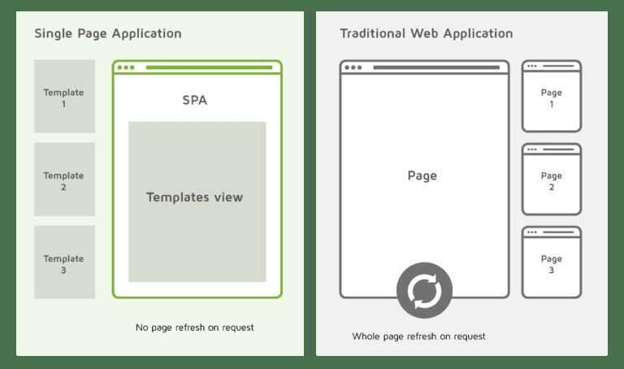

# Frontend Architecture

## PRPL pattern

PRPL is a pattern for structuring and serving **Progressive Web Apps (PWAs)**, with an emphasis on the performance of app delivery and launch. It stands for:

- **Push** critical resources for the initial URL route.
- **Render** initial route.
- **Pre-cache** remaining routes.
- **Lazy-load** and create remaining routes on demand.

Beyond targeting the fundamental goals and standards of PWAs, PRPL strives to optimize for:

- Minimum time-to-interactive
- Especially on first use (regardless of entry point)
- Especially on real-world mobile devices
- Maximum caching efficiency, especially over time as updates are released
- Simplicity of development and deployment

https://developers.google.com/web/fundamentals/performance/prpl-pattern

https://www.toptal.com/ui-ux-frontend-developer/interview-questions

https://www.youtube.com/watch?v=TcTSqhpm80Y

## Single Page Applications (SPAs) / Multiple Page Applications (MPAs)

Before the advent of SPA's, Multiple Page Applications (MPA's) were widely used. Let's first see how MPA's work so that we can understand how useful SPA's are.

### How do MPA's Work?

In MPA's, if you want to go to another page, a request is first sent to the server. Then, the server responds by providing the required page.

For example, let's say you go to a website. Now, you want to check the contact page. So, you click on the link in the navigation bar. When this occurs, a request is sent to the server that the user wants to see the contact page. So, the server sends the required page back to the user, which in our case will probably be contact.html.

### How do SPA's Work?

In SPA's, there is only one page, i.e, index.html. When you want to go to another page, the server provides the same page but with a different component injected into it.

## Client-side rendering (CSR)

Client-side rendering allows developers to make their websites entirely rendered in the browser with JavaScript. Instead of having a different HTML page per route, a client-side rendered website creates each route dynamically directly in the browser. This approach spread once JS frameworks made it easy to take.

## Server Side Rendering (SSR) / Universal rendering

Server-side rendering allows developers to pre-populate a web page with custom user data directly on the server. It is generally faster to make all the requests within a server than making extra browser-to-server round-trips for them. This is what developers used to do before client-side rendering.

Render React & Vue on the server as oppose to a client side SPA using NEXT (React) and NUXT (Vue)

- Better SEO
- File System Routing
- Automatic Code Splitting
- Static Exporting
- CSS-in-JS

## Client-side vs Server-side rendering

Client-side rendering manages the routing dynamically without refreshing the page every time a user requests a different route. But server-side rendering is able to display a fully populated page on the first load for any route of the website, whereas client-side rendering displays a blank page first.

[Client-side vs. Server-side vs. Pre-rendering for Web Apps | Toptal](https://www.toptal.com/front-end/client-side-vs-server-side-pre-rendering)

**Others -** Predictive Fetching (guess.js)

## Pre-rendering

Pre-rendering is a tradeoff between client-side and server-side rendering. Every pre-rendered page displays a skeleton template while the data waits to be rehydrated with AJAX/XHR requests. Once the page is fetched, internal routing is done dynamically to take advantage of a client-side rendered website.

## Optimistic update

In an optimistic update the UI behaves as though a change was successfully completed before receiving confirmation from the server that it actually was - it is being optimistic that it will eventually get the confirmation rather than an error. This allows for a more responsive user experience.

https://www.apollographql.com/docs/react/v2/performance/optimistic-ui

https://medium.com/guidesmiths-dev/anatomy-of-a-react-application-optimistic-updates-e4a3318665c7

[Skeleton Screens](http://www.lukew.com/ff/entry.asp?1797)

## Universal App or isomorphic app

A universal app sends to the browser a page populated with data. Then the app loads its JavaScript and rehydrates the page to get a fully client-side rendered app. This approach combines the advantages of the latest techniques available today.

https://www.toptal.com/front-end/client-side-vs-server-side-pre-rendering

## Server-Side Frameworks

- Nodejs - Express, Koa, Adonis, Featherjs, Nestjs
- PHP - Laravel, Symfony, Slim
- Python - Django, Flask
- C# - ASP.NET MVC
    - Blazor
              - [What's behind the hype about Blazor? - Stack Overflow](https://stackoverflow.blog/2020/02/26/whats-behind-the-hype-about-blazor/)
              - [Blazor | Build client web apps with C# | .NET](https://dotnet.microsoft.com/en-us/apps/aspnet/web-apps/blazor)
              - [Front-end Web Development with .NET for Beginners - YouTube](https://www.youtube.com/playlist?list=PLdo4fOcmZ0oXNZX1Q8rB-5xgTSKR8qA5k)
- Java - Spring MVC, Grails
- Ruby - Ruby on Rails, Sinatra
- Go - Revel

## Mobile Development

- **Flutter** - SDK from Google to build native mobile apps. Uses **Dart**
- React Native - Build native mobile apps using the React framework
- **NativeScript** - Build native mobile apps with JS, TS, Angular or Vue - https://nativescript.org
- Ionic - Build hybird mobile apps with JavaScript
- Xamarin - Build native mobile apps with C#
- [Dioxus | An elegant GUI library for Rust](https://dioxuslabs.com/)

## Desktop Apps with Electron

Electron allows us to cross-platform desktop applications with Javascript

- Uses Nodejs & Chromium
- High data security
- High performance
- Accessibility
- Examples: VSCode, Atom, Postman, Discord

## API-First Design

- Traditionally we start with the UI and then move to the backend with a strict connection to the web app
- With API-first design, you start with the appropriate APIs and then build products on top of it

[Web Development In 2020 - A Practical Guide](https://www.youtube.com/watch?v=0pThnRneDjw)

https://dev.to/mmcshinsky/why-frontend-architecture-matters-1ldj

https://github.com/h5bp/Front-end-Developer-Interview-Questions

## Links

https://dev.to/kevtiq/how-to-create-a-scalable-and-maintainable-front-end-architecture-4f47

https://www.toptal.com/front-end/client-side-vs-server-side-pre-rendering

[**https://www.freecodecamp.org/news/how-to-build-your-first-saas/**](https://www.freecodecamp.org/news/how-to-build-your-first-saas/)

**Best Stack** - Nextjs, TailwindCSS, TypeScript

[Explosive Velocity with a Modern Stack - Tejas Kumar - GOTO 2021](https://www.youtube.com/watch?v=KTkyQ3z7M8w&ab_channel=GOTOConferences)
