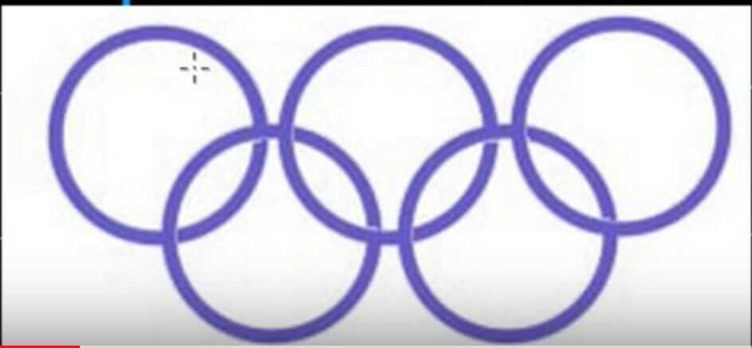

# Gestalt Principles

- Human visual system is optimized to see structure and relationships

1. Common fate

2. Figure / Ground

3. Similarity

4. Pragnanz

5. Proximity

6. Continuity

7. Closure

https://www.khanacademy.org/science/health-and-medicine/nervous-system-and-sensory-infor/sensory-perception-topic/v/gestalt-principles

## Stages of human visual processing

- Stage one: processing inside the retina
    - High resolution and intense color in the fovea
    - Lower resolution and less intense color elsewhere
    - Tuning to detect edges
- Stage two: "preattentive" processing
    - Less than 1/4 second
    - Unconscious
    - Information from retina assembled into shapes and groups
- Stage three: "Attentive" processing
    - Stores of experience used to interpret the output of state two

## Gestalt principles come from stage two

- The visual system is predisposed to interpret edges, shapes, and groups in certain ways
- Again, this is unconscious, and takes place before conscious interpretation
    - Conscious interpretation can override the perceptions from stage two, but it takes cognitive work

## Design principle: Gestalt proximity

- The visual system assumes that things grouped together are related
- The initial grouping is automatic and unconscious
    - Happens in less than 1/4 second
