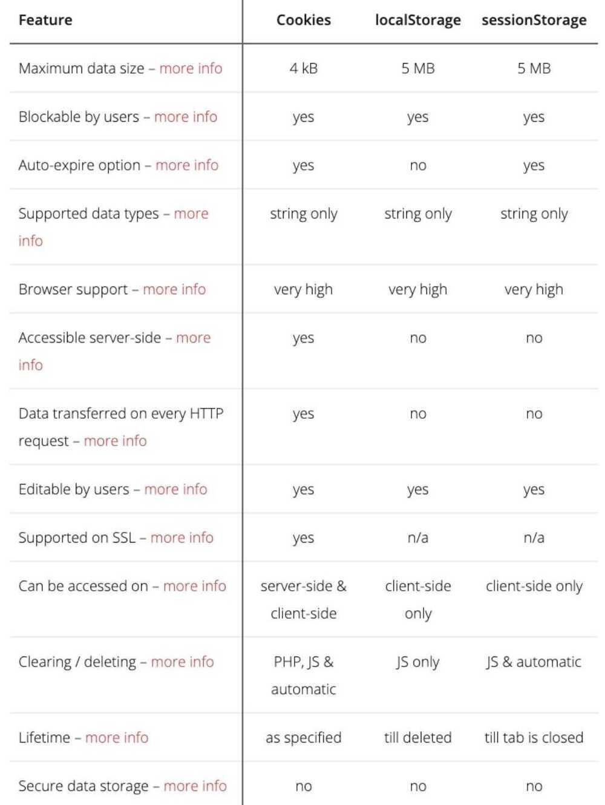

# Intro

The HTTP protocol is one of the most important protocols for smooth communication between the server and the client. The main disadvantage of the HTTP protocol it is a stateless protocol that means it does not track any kind of information of response and request by the server and the client, So in order to resolve this problem, there are three ways to track useful information.

## Local Storage

This read-only interface property provides access to the Document's local storage object, the stored data is stored across browser sessions. Similar to sessionStorage, except that localStorage data gets cleared when the page session ends -- that is when the page is closed. It is cleared when the last "private" tab of a browser is closed (localStorage data for a document loaded in a private browsing or incognito session).

DOM Strings are storage formats that use UTF-16 to encode data, which uses two bytes per character. Strings are automatically generated from integer keys just as they are for objects. The data stored in LocalStorage is specific to a protocol in the document. If the site is loaded over HTTP (e.g., http://example.com), localStorage returns a different object than if it is loaded over HTTPS (e.g., https://abc.com).

If a document is loaded from a file: URL (that is, directly from the user's local file system instead of being loaded from the server) the requirements for behavior are undefined and may vary among different browsers. Each file appears to be returned a different object by localStorage in all current browsers: URL. Essentially, it seems to be a case of each URL: file having its own unique local storage area.

This behavior cannot be guaranteed because as mentioned above, the file: URL requirements remain unclear. As such, there's a possibility that browsers may change how they handle files at any time. The way some browsers handle it has evolved.

Local storage has 4 methods

#### setItem() Method

This method takes two parameters one is key and another one is value. It is used to store the value in a particular location with the name of the key

`localStorage.setItem(key, value)`

- **getItem() Method --** This method takes one parameter that is key which is used to get the value stored with a particular key name

localStorage.getItem(key)

- **removeItem() Method --** This is method is used to remove the value stored in the memory in reference to key

localStorage.removeItem(key)

- **clear() Method --** This method is used to clear all the values stored in localstorage

localStorage.clear()

## Session Storage

Session Storage objects can be accessed using the sessionStorage read-only property. The difference between sessionStorage and localStorage is that localStorage data does not expire, whereas sessionStorage data is cleared when the page session ends.

A unique page session gets created once a document is loaded in a browser tab. Page sessions are valid for only one tab at a time. Pages are only saved for the amount of time that the tab or the browser is open; they do not persist after the page reloads and restores. A new session is created each time a tab or window is opened; this is different from session cookies. Each tab/window that is opened with the same URL creates its own sessionStorage.When you duplicate a tab, the sessionStorage from the original tab is copied to the duplicated tab. Closing a window/tab ends the session and clears sessionStorage objects.

A page's protocol determines what data is stored in sessionStorage. Particularly, data stored by scripts accessed through HTTP (for example, http://abc.com) is stored in a separate object from the same site accessed through HTTPS (for instance, https://abc.com). A DOMString number is two bytes per character in UTF-16 DOMString format. Strings are automatically generated from integer keys just as they are for objects.

Session Storage has 4 methods

- **setItem() Method --** This method takes two parameters one is key and another one is value. It is used to store the value in a particular location with the name of the key

sessionStorage.setItem(key, value)

- **getItem() Method --** This method takes one parameter that is key which is used to get the value stored with a particular key name

sessionStorage.getItem(key)

- **removeItem() Method --** This is method is used to remove the value stored in the memory in reference to key

sessionStorage.removeItem(key)

- **clear() Method --** This method is used to clear all the values stored in the session storage

sessionStorage.clear()

## Cookies

The term "cookie" refers to just the textual information about a website. In order to recognize you and show you results according to your preferences, this website saves some information in your local system when you visit a particular website. The history of the internet has long been marked by the use of cookies. A website visitor asks the server for a web page when they visit it. Every request for a server is unique. Likewise, if you visit a hundred times, each request will be considered unique by the server. Since a server receives many requests every second, storing every user's information on a server doesn't seem logical and obvious. The same information may not be needed again if you don't return. Therefore, a cookie is sent and stored on your local machine to uniquely identify you. You will receive a response from the same server the next time you hit it since it recognizes you. Almost every server uses this cookie (some exceptions exist today because of advertisements). Therefore, although you might have many cookies in your system, such cookies will be recognized by a server and analyzed.

When cookies were first developed, they were used to better the developer's experience. Consider visiting a website in a language other than your native one (let's say English). You can select English as your language from the website's language section. It might be necessary to switch languages five times a day if you visit the same website five times. These details are therefore stored in a cookie on your system. This ensures that the server knows that you wish to view the website in English the next time you send a request. Cookies are vital in this regard. The scale cookies used today are much smaller than the example above.

| **Local Storage**                                                         | **Session Storage**                                                                                                                                          | **Cookies**                                                        |
|--------------------|---------------------------------|-------------------|
| The storage capacity of local storage is 5MB/10MB                         | The storage capacity of session storage is 5MB                                                                                                                | The storage capacity of Cookies is 4KB                              |
| As it is not session-based, it must be deleted via javascript or manually | It's session-based and works per window or tab. This means that data is stored only for the duration of a session, i.e., until the browser (or tab) is closed | Cookies expire based on the setting and working per tab and window |
| The client can only read local storage                                   | The client can only read local storage                                                                                                                        | Both clients and servers can read and write the cookies             |
| There is no transfer of data to the server                                | There is no transfer of data to the server                                                                                                                    | Data transfer to the server is exist                                |
| There are fewer old browsers that support it                              | There are fewer old browsers that support it                                                                                                                  | It is supported by all the browser including older browser          |

https://www.geeksforgeeks.org/difference-between-local-storage-session-storage-and-cookies

## localStorage vs sessionStorage

- localstorage has no expiration time, while data stored in sessionStorage gets cleared when the browsing session ends (i.e. when the browser / browser tab is closed)
- Session storage exists only within the current browser tab - even two tabs loaded with the same website will have different sessionStorage data
- sessionStorage data survives page refresh, but not closing/opening the tab. LocalStorage data, on the other hand, is shared between all tabs and windows from the same origin
- LocalStorage data does not expire; it remains after the browser is restarted and even after OS reboot
