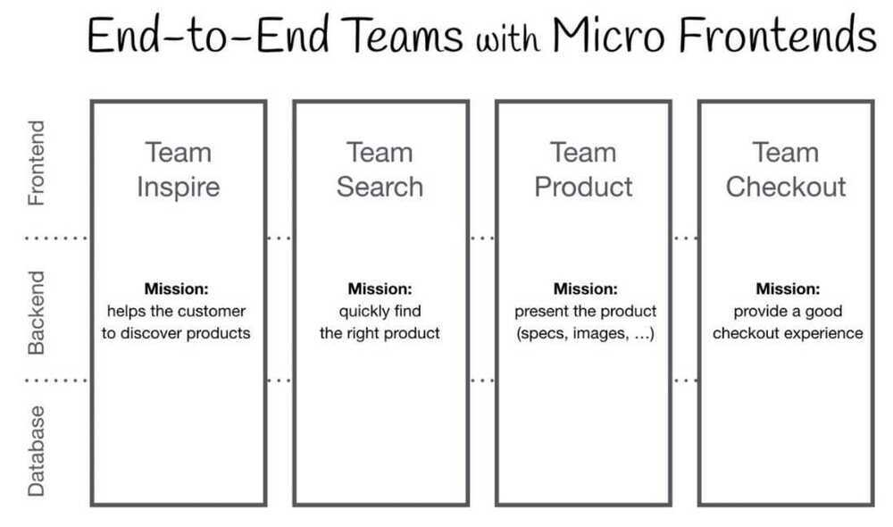

# Microfrontend Architecture

Micro-frontend architecture is a design approach in which a [front-end](https://www.toptal.com/front-end) app is decomposed into individual, semi-independent "microapps" working loosely together.

The benefits of the micro-frontend pattern include

1. Micro-frontend architectures may be simpler, and thus easier to reason about and manage.

2. Independent development teams can collaborate on a front-end app more easily.

3. They can provide a means for migrating from an "old" app by having a "new" app running side by side with it.

https://www.toptal.com/front-end/micro-frontends-strengths-benefits

Micro-frontends let you build a website or web app as a composition of features that you can create and work on separately.

- asynchronous loading, error handling, shared state, cross platform micro-frontends, how to route multiple applications together, and even how to test micro-frontend code.

- Why Micro-Frontends?
- Why Module Federation?
- Asynchronous Loading
- Error Handling
- Server Setup
- Sharing Functions
- Nomenclature
- Sever Cart Setup
- Sharing State
- Sharing the JWT
- Sharing the Cart
- State Sharing Alternatives
- Finishing the Cart
- Cross-Platform Micro-Frontends
- Micro-Frontend Routing
- Unit Testing
- End-To-End Testing

https://www.freecodecamp.org/news/learn-all-about-micro-frontends

https://micro-frontends.org

https://medium.com/@lucamezzalira/i-dont-understand-micro-frontends-88f7304799a9

https://martinfowler.com/articles/micro-frontends.html

https://single-spa.js.org

https://bit.dev
