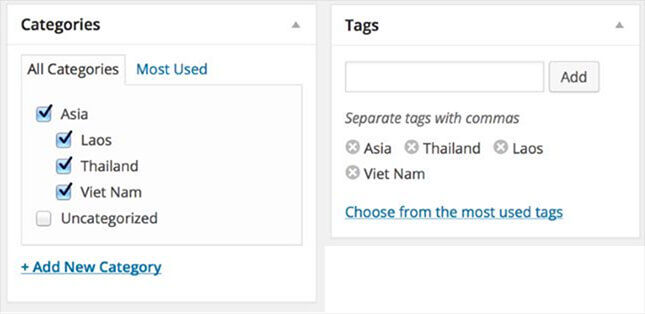

# Wordpress

https://wordpress.com/home/deepaksood619.wordpress.com

WordPress is a content management system that powers 34% of all websites on the internet and 60% of websites that run on CMS. The power of WordPress is in the ecosystem - there are a lot of different plugins and themes. Anyone without any special programming knowledge can build a website, but a working knowledge of WordPress intricacies is a boon to any developer or designer resume.

https://www.advancedcustomfields.com

[Overview of WordPress (Beginners Guide 2020)](https://www.youtube.com/watch?v=jmqu4HC3zmo)

## Biggest Wordpress Users

- WordPress.com
- IBM Jobs
- Microsoft News
- Facebook Newsroom
- Mercedes-Benz
- BBC America
- Forbes Blogs
- Time Magazine
- CNN Press Room
- Quartz
- The White House
- Usain Bolt
- Katty Perry
- Brian Smith
- Boing Boing
- The Bloggess
- FiveThirtyEight
- The Herald Sun
- Flickr Blog
- TechCrunch
- Sony Music
- Bata
- Bloomberg Professional
- Yelp Blog
- The New York Observer
- PlayStation Blog
- Rolling Stones
- Spotify Newsroom
- Disney Books
- Etsy Journal
- TED Blog

[30+ Examples of Biggest Companies Using WordPress - weDevs](https://wedevs.com/blog/103311/top-brands-using-wordpress/)

[Largest user base you have served? : r/Wordpress](https://www.reddit.com/r/Wordpress/comments/1dyshjs/largest_user_base_you_have_served/?rdt=42578)

[40+ Most Notable Big Name Brands that are Using WordPress](https://www.wpbeginner.com/showcase/40-most-notable-big-name-brands-that-are-using-wordpress/)

## wp-admin

[WordPress Admin Dashboard Tutorial 2020 - Step By Step For Beginners In WP-ADMIN!](https://www.youtube.com/watch?v=Ov_zUmMyJnQ)

Posts - That are part of blogs

Pages - That are not part of blog, and are standalone pages like about us, contact us, etc

## Themes

- https://generatepress.com
- Divi Theme - https://www.elegantthemes.com https://www.elegantthemesdemo.com
- Astra
- https://www.isitwp.com/top-wordpress-themes
- https://rishitheme.com

## Plugins

- https://wp-rocket.me
- W3 Total Cache
- WP Super Cache
- Kinsta Cache
- Contact Form 7 by Takayuki Miyoshi
- **Yoast SEO by Team Yoast**
- **Page Builder - Gutenberg editor**
- **Page Builder - Elementor Website Builder by Elementor.com**
- **Page Builder -** Classic Editor by WordPress Contributors
- Akismet Spam Protection by Automattic
- jonRadio multiple themes
- All-in-One WP Migration by ServMask
- Accordian plugin
- https://wordpress.org/support/article/managing-plugins

## Tools

### WP-Cli

[WP-Cli](https://wp-cli.org/) lets you work with WordPress using the command line. With this great tool you can upgrade and downgrade WordPress in seconds, as well as update plugins. Notably, when you find yourself migrating to a different server, the built in search-replace command will take care of all the url changes for you, and it's worth installing it simply because of that.

### Advanced Database Cleaner

The [Advanced Database Cleaner](https://wordpress.org/plugins/advanced-database-cleaner/) plugin cleans out spam comments, built in revisions, and transients. You can even set up tasks to run automatically.

### Query Monitor

When things are running slowly and you're not sure what to blame, [Query Monitor](https://wordpress.org/plugins/query-monitor/) lets you see what queries are taking too long to execute, as well as show you PHP warnings and errors.

- https://themeisle.com/blog/wordpress-version-control
- https://kinsta.com/blog/wordpress-version-control
    - [WP Pusher](https://wppusher.com/)-- lets you deploy themes and plugins from any Git repository. Note that this one focuses specifically on themes and plugins.
    - [Revisr](https://wordpress.org/plugins/revisr/)-- offers a much more comprehensive approach to using Git with WordPress. You can track your entire site, including your database, in a Git repository. You can also commit changes from inside your WordPress dashboard, revert files, and push/pull changes to a remote repository (like Bitbucket or GitHub).
    - [VersionPress](https://versionpress.com/) is an open source project that aims to "bring the full power of Git to WordPress" by version-controlling both your site's files and database. Though it also relies on Git, VersionPress gets its own section because it does things a little differently than the methods above.

## Commands

```sql
drop database wordpress;

create database wordpress;

select * from wordpress.wp_options;

update wp_options set option_value='http://localhost:8080' where option_name='siteurl';
```

```yaml
services:
wordpress:
image: wordpress
restart: always

ports:
- 8083:80

environment:
WORDPRESS_DB_HOST: db
WORDPRESS_DB_USER: exampleuser
WORDPRESS_DB_PASSWORD: examplepass
WORDPRESS_DB_NAME: exampledb

volumes:
- wordpress:/var/www/html

db:
image: mysql:5.7
restart: always

environment:
MYSQL_DATABASE: exampledb
MYSQL_USER: exampleuser
MYSQL_PASSWORD: examplepass
MYSQL_RANDOM_ROOT_PASSWORD: '1'

volumes:
- db:/var/lib/mysql

volumes:
wordpress:
db:
```

## Config

https://wordpress.org/support/article/editing-wp-config-php

## Questions

- What is the latest version of wordpress?
- Why WordPress Is So Popular?
    - Simplicity and Flexibility
    - In-corporate with publishing tools
    - User Management
    - Media Management
    - Full Standards Compliance
    - Ease Theme System
    - Extend with Plugins
    - Built-in Comments
    - Search Engine Optimized & Multilingual
    - Open Source
- What are WordPress hooks?

It is provided by WordPress to allow your plugin to ' hook into' the whole WordPress; that is, to call functions in the plugin at particular times according to your need and thereby set your plugin in motion.

There are two kinds of hooks:

- Actions hook
- Filters hook

- What are the difference between action hook and filter hook in WordPress?

### 1. Actions Hook

Actions Hook are triggered by particular events that take place in WordPress such as changing themes, publishing a post, or displaying an administration screen. It is a custom [PHP](https://www.bestinterviewquestion.com/core-php-interview-questions) function defined in your plugin and hooked, i.e., set to respond, to some of these events.

Actions often do one or more of the following things

- Modify database data
- Send an email message
- Modify the generated administration screen or front end page sent to a user web browser

Here are some Actions Functions listed

- has_action()
- do_action()
- add_action()
- remove_action()

### 2. Filters Hook

Filters Hook are functions that WordPress passes data through, at certain points in execution, just before taking some action with the data. It sits between the database and the browser and between the browser and the database; all most all input and output in WordPress pass through at least one filter hook.

The necessary steps to add your filters to WordPress are listed:

- Create the PHP function that filters the data
- Hook to the screen in WordPress, by calling add_filter()
- Put your PHP function in a plugin file and activate it.

Here are some Filters Functions listed

- has_filter()
- doing_filter()
- add_filter()
- remove_filter() etc

- How many default tables are in WordPress?

There are altogether 12 tables by default in WordPress.

- wp_options
- wp_users
- wp_links
- wp_commentmeta
- wp_term_relationships
- wp_postmeta
- wp_posts
- wp_termmeta
- wp_term_taxonomy
- wp_usermeta
- wp_terms
- wp_comments

- How many types of users Role in WordPress? Explain

We can make many types of user types of role.

- Administrator Role
- Author Role
- Editor Role
- Subscriber Role
- Contributor Role

- What is plugin? list some important WordPress plugin?

WordPress plugins are a type of apps that allows you to add more functionality and features to your WordPress website just like the same way as apps do for your smartphone. Plugins allow you to create any type of the site with WordPress, not just blogs. Nowadays plugins are very popular.

There are lots of plugins are available that listed below

- Yoast SEO Plugin (This plugins are used for SEO purpose.)
- Contact Form 7 (This plugins is used to make web forms with any code)
- Sitemap & URLs Plugins
- All In One WP Security & Firewall etc

Advantages of WordPress Plugins

- Helps in SEO
- Ease Of Use and Quick Installation Process
- It helps in to Keep Secure
- Strong Community Support
- Helps to use advanced features of WordPress

- What are the difference between post and page in WordPress?

In WordPress, Posts is a dynamic entity that has a published or updated date and is displayed on the blog page.

Example: news, events etc

Pages do not have published or updated date. Hence there are useful for the static and timeless type of content.

Example, the "About Us" or "Contact Us"

The difference between pages and posts is that the WordPress page is a static entity and post is a dynamic entity.

- What is Category in WordPress?

A category is one of the predefined taxonomies in WordPress, and it is used to sort and group content into different sections. In new WordPress installation, "Uncategorized" is the default category. We can change the default category from Settings -> Writing screen. In WordPress post can be filed under many categories and can have both tags and categories.

- What is Tag in WordPress? Explain

A tag is one of the pre-defined taxonomy in WordPress. You can add tags to posts along with categories in WordPress. Tags are smaller in scope and focused on specific topics.

- What are the difference between Tag & Category in WordPress?



In WordPress categories are hierarchical which means terms can have a relationship with each other like child and parent.

Example: You could have a Category called India, and under India, you could have categories called Delhi, Haryana, and U.P. Categories means for broad grouping of posts.

But Tags are NOT hierarchical which means no relationship between them. Tags means to describe specific details posts.

- Where do I insert Google Analytics code in WordPress?

While there are different ways to add Google Analytics your WordPress site, here are the 3 most common ones:

- Through MonsterInsights
- By inserting plugins for Headers and Footers
- By installing Google Analytics in the WordPress Theme

## Others

- https://www.wpbeginner.com/wp-themes/how-to-use-multiple-themes-for-pages-in-wordpress
- https://www.toptal.com/wordpress/tips-and-practices
- https://www.toptal.com/wordpress/interview-questions
- https://www.freecodecamp.org/news/how-to-create-an-ecommere-website-using-woocomerce
- https://www.freecodecamp.org/news/easily-create-a-website-using-elementor-and-wordpress
- [Harness WordPress: Hooks, Actions and Filters  | Toptal](https://www.toptal.com/wordpress/power-of-wordpress-hooks-actions-and-filters)
- [The Ultimate Guide to High Performance WordPress](https://www.freecodecamp.org/news/the-ultimate-guide-to-high-performance-wordpress/)
