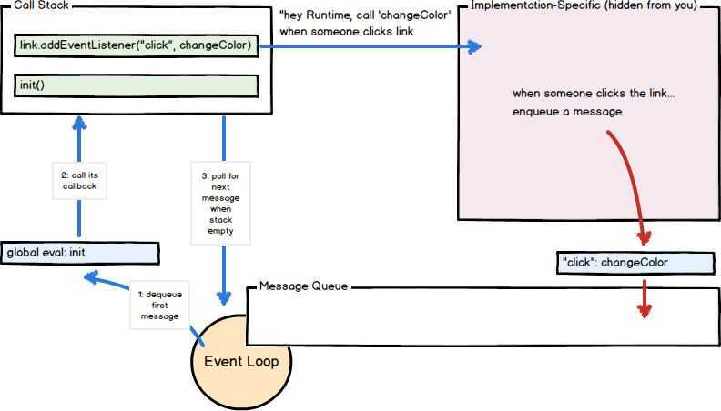

# Intro

## Javascript

1. Lightweight
2. Interpreted
3. Designed for creating network-centric application
4. Integrated in HTML
5. Object-Oriented capabilities

   - It has objects which can contain data and methods that act upon that data.
   - It does not have classes, but it does have constructors which do what classes do, including acting as containers for class variables and methods. It does not have class-oriented inheritance, but it does have prototype-oriented inheritance.
   - The two main ways of building up object systems are by inheritance (is-a) and by aggregation (has-a). JavaScript does both, but its dynamic nature allows it to excel at aggregation.

6. Open and cross-platform
7. Untyped language (JavaScript variable can hold value of any data type)
8. Single Threaded

## Advantages of JavaScript

1. Less server interaction
2. Immediate feedback to visitors
3. Increased interactivity
4. Richer interfaces

## Syntax

1. Case sensitive

## Features

- First Class Functions
- Prototype Based - Supports objects but not classes
- Event Loops
- Callback Functions - A function sent as a parameter to other function (Since javascript supports first class functions)
- Asynchronous - [Asynchronous JavaScript for Steady App Performance | Toptal](https://www.toptal.com/javascript/asynchronous-javascript-programming)

## Console Logs

- console.log()
- console.warn()
- console.error()
- console.table()

## EventLoop

The event loop is the term given to the process of the waiting for the queue to receive a message synchronously.The increment that the event loop moves in is called a 'tick', and every time it 'ticks' it checks if the call stack is empty, if so , it adds the top function in the event queue to the call stack and executes it.Once it is finished processing this function it starts ticking again. This diagram is simple and great.

https://developer.mozilla.org/en-US/docs/Web/JavaScript/EventLoop

https://www.youtube.com/watch?v=8aGhZQkoFbQ

V8 JS Engine - https://www.youtube.com/watch?v=xckH5s3UuX4&ab_channel=freeCodeCampTalks

https://dev.to/lydiahallie/javascript-visualized-event-loop-3dif

## Service Workers

1. Runs in background
2. Alternative to AppCache

https://developers.google.com/web/fundamentals/primers/service-workers

## ModernJS

- We define variables with [let](https://developer.mozilla.org/en-US/docs/Web/JavaScript/Reference/Statements/let) and [const](https://developer.mozilla.org/en-US/docs/Web/JavaScript/Reference/Statements/const) statements. For the purposes of the React documentation, you can consider them equivalent to [var](https://developer.mozilla.org/en-US/docs/Web/JavaScript/Reference/Statements/var).
- We use theclasskeyword to define [JavaScript classes](https://developer.mozilla.org/en-US/docs/Web/JavaScript/Reference/Classes). There are two things worth remembering about them. Firstly, unlike with objects, youdon'tneed to put commas between class method definitions. Secondly, unlike many other languages with classes, in JavaScript the value ofthisin a method [depends on how it is called](https://developer.mozilla.org/en-US/docs/Web/JavaScript/Reference/Classes#Boxing_with_prototype_and_static_methods).
- We sometimes use=>to define ["arrow functions"](https://developer.mozilla.org/en-US/docs/Web/JavaScript/Reference/Functions/Arrow_functions). They're like regular functions, but shorter. For example, `x => x *2` is roughly equivalent to `function(x) { return x* 2; }`. Importantly, arrow functions [don't have their own this value](https://developer.mozilla.org/en-US/docs/Web/JavaScript/Reference/Functions/Arrow_functions#No_separate_this) so they're handy when you want to preserve the this value from an outer method definition.

https://gist.github.com/gaearon/683e676101005de0add59e8bb345340c

## ECMAScript - European Computer Manufactures Association Script (ES)

A scripting language specification on which the syntax of JavaScript - along with Jscript and ActionScript - is based

https://codeburst.io/javascript-wtf-is-es6-es8-es-2017-ecmascript-dca859e4821c

https://www.taniarascia.com/es6-syntax-and-feature-overview

ECMAScript 2015, also known as ES6, introduced many changes to JavaScript.

## ES Modules

https://www.freecodecamp.org/news/javascript-modules-beginners-guide

## Learning

https://www.30secondsofcode.org/js/p/1

https://github.com/ryanmcdermott/clean-code-javascript

## References

- Javascript: The Definitive Guide
- https://medium.freecodecamp.org/here-are-examples-of-everything-new-in-ecmascript-2016-2017-and-2018-d52fa3b5a70e
- Why I hate JS - https://charlieharvey.org.uk/page/javascript_the_weird_parts
- https://www.toptal.com/javascript/tips-and-practices
- https://www.freecodecamp.org/news/how-javascript-implements-oop
- https://www.freecodecamp.org/news/complete-introduction-to-the-most-useful-javascript-array-methods
- https://www.freecodecamp.org/news/javascript-lexical-scope-tutorial
- https://www.freecodecamp.org/news/synchronous-vs-asynchronous-in-javascript
- https://www.freecodecamp.org/news/learn-javascript-form-validation-by-making-a-form
- https://github.com/airbnb/javascript
- https://www.freecodecamp.org/news/execution-context-how-javascript-works-behind-the-scenes
- https://www.freecodecamp.org/news/javascript-es-modules-and-module-bundlers
- https://www.freecodecamp.org/news/lexical-scope-in-javascript
- https://www.freecodecamp.org/news/objects-in-javascript-for-beginners
- [JavaScript Tips to Help You Build Better Web Development Projects](https://www.freecodecamp.org/news/javascript-tips-for-better-web-dev-projects/)
- [How to Use JavaScript Promises - Callbacks, Async/Await, and Promise Methods Explained](https://www.freecodecamp.org/news/javascript-promises-async-await-and-promise-methods/)
- [Learn JavaScript Operators - Logical, Comparison, Ternary, and More JS Operators With Examples](https://www.freecodecamp.org/news/javascript-operators/)
