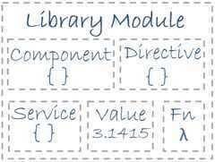

# 3. Modules

## Modules

- Where we write pieces of our Angular application.
- Makes our code more maintainable testable and readable.
- Where we define dependencies of our application.

Every Angular app has at least one NgModule class, [the*root module*](https://angular.io/guide/bootstrapping), conventionally namedAppModule.

While the*root module*may be the only module in a small application, most apps have many more*feature modules*, each a cohesive block of code dedicated to an application domain, a workflow, or a closely related set of capabilities.

An NgModule, whether a *root* or *feature*, is a class with an@[NgModule](https://angular.io/api/core/NgModule) decorator.

NgModules vs. JavaScript modules

The NgModule - a class decorated with @[NgModule](https://angular.io/api/core/NgModule) - is a fundamental feature of Angular.

JavaScript also has its own module system for managing collections of JavaScript objects. It's completely different and unrelated to the NgModule system.

In JavaScript each *file* is a module and all objects defined in the file belong to that module. The module declares some objects to be public by marking them with theexportkey word. Other JavaScript modules use *import statements* to access public objects from other modules.

## Libraries

Angular ships as a collection of JavaScript modules. You can think of them as library modules.

Each Angular library name begins with the@angularprefix.

You install them with thenpmpackage manager and import parts of them with JavaScriptimportstatements.



For example, import Angular's [Component](https://angular.io/api/core/Component) decorator from the@angular/corelibrary like this:

```js
import { [Component](https://angular.io/api/core/Component) } from '@angular/core';

You also import NgModules from Angular *libraries*using JavaScript import statements:

import { [BrowserModule](https://angular.io/api/platform-browser/BrowserModule) } from '@angular/platform-browser';
```
