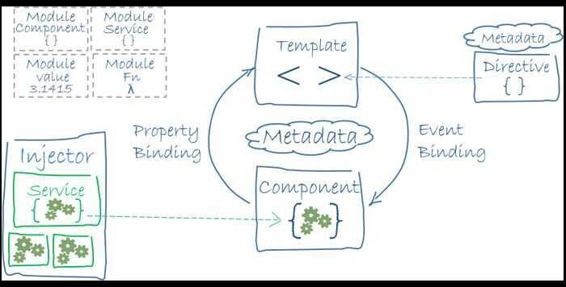

# AngularJS

https://www.toptal.com/angular/angular-9-tutorial-angular-ivy

https://medium.freecodecamp.org/want-to-learn-angular-heres-our-free-33-part-course-by-dan-wahlin-fc2ff27ab451

https://www.freecodecamp.org/news/learn-angular-full-course

https://www.toptal.com/angular-js/interview-questions

https://www.toptal.com/angular/hire-angular-developer

https://angular.io/guide/architecture

## Architecture

You write Angular applications by composing HTML *templates*with Angularized markup, writing *component*classes to manage those templates, adding application logic in *services*, and boxing components and services in *modules*.

Then you launch the app by *bootstrapping* the *root module*. Angular takes over, presenting your application content in a browser and responding to user interactions according to the instructions you've provided.



Modules - Angular apps are modular and Angular has its own modularity system called *NgModules*.

## Angular Ivy

Angular Ivy is the new Angular compiler. It's the result of a major refactoring the Angular team worked on for two years. It sets the foundation for many improvements, allowing Angular to stay current with the latest innovations in web development.

## Commands

```bash
# Install
npm install -g @angular/cli

# Create a new project
ng new my-app

# Serve the application
cd my-app
ng serve --open

# Create a Component
ng generate component heroes
```
