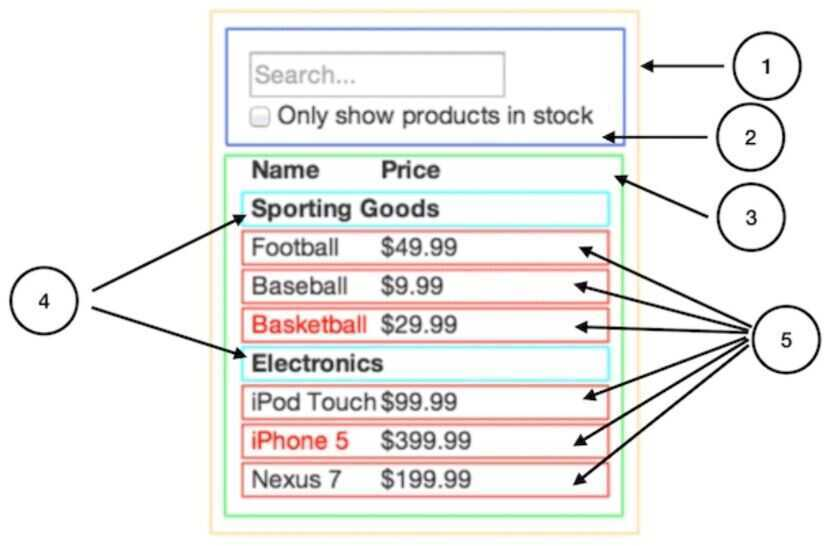

# Intro

## A Javascript library for building user interfaces

https://www.youtube.com/watch?v=N3AkSS5hXMA

## Features

- Code Reusability
- JSX
- Virtual DOM

React's magic comes from its interpretation of the DOM and its strategy for creating UIs.

React uses the Virtual DOM to render an HTML tree virtually first. Then, every time a state changes and we get a new HTML tree that needs to be taken to the browser's DOM, instead of writing the whole new tree React will only write the difference between the new tree and the previous tree (since React has both trees in memory). This process is known as Tree Reconciliation.

The VDOM is a programming concept, providing a critical part of the React architecture. Rather than interacting directly with the DOM, changes are instead first rendered to the VDOM - a lightweight representation of the target state of the DOM.

Changes made to the VDOM are batched together to avoid unnecessary frequent changes to the DOM. Each time these batched changes are persisted to the DOM, React creates a diff between the current representation and the previous representation persisted to the DOM, then applies the diff to the DOM.

This abstraction layer for the DOM provides a simple interface for developers while allowing React to update the DOM in an efficient and performant manner.

https://www.freecodecamp.org/news/how-to-manipulate-the-dom-beginners-guide

- **Declarative**

Design simple views for each state in your application, and React will efficiently update and render just the right components when your data changes

- **Component-Based**

Build encapsulated components that manage their own state, then compose them to make complex UIs

- Class based components

- React also has an unidirectional dataflow. UI in React is actually the function of the state. This means that as the state updates it updates the UI as well. So our UI progresses as the state changes.

## Functionalities

- Render HTML Content with the data provided
- Have multiple UI States depending on the data
- Dispatch actions on user interaction or life cycle events
- Animation using ReactCSSTransitionGroup

Takes all the js files from components, actions, reducers and bundles them all together into one js file.

React is a javascript library that is used to produce html that is shown to the user.

Components/views are snippets of code that produce html.

package.json file is a list of the the dependencies that our application use.

1. Exporting modules
2. Classes
3. State

## Advantages of React

1. **Fast** - Apps made in React can handle complex updates and still feel quick and responsive.
2. **Modular -** Instead of writing large, dense files of code, you can write many smaller, reusable files. React's modularity can be a beautiful solution to JavaScript's [maintainability problems](https://en.wikipedia.org/wiki/Spaghetti_code).
3. **Scalable -** Large programs that display a lot of changing data are where React performs best.
4. **Flexible -** You can use React for interesting projects that have nothing to do with making a web app. People are still figuring out React's potential.[There's room to explore](https://medium.mybridge.co/22-amazing-open-source-react-projects-cb8230ec719f).

## Reconciliation

React has a smart diffing algorithm that it uses to only regenerate in its DOM node what actually needs to be regenerated while it keeps everything else as is. This diffing process is possible because of React's virtual DOM.

Using the virtual DOM, React keeps the last DOM version in memory. When it has a new DOM version to take to the browser, that new DOM version will also be in memory, so React can compute the difference between the new and the old versions.

React will then instruct the browser to update only the computed diff and not the whole DOM node. No matter how many times we regenerate our interface, React will take to the browser only the new "partial" updates.

## React and React DOM

We have React and ReactDOM as two different libraries because there are use cases such as React Native where rendering to the DOM isn't needed for mobile development so the library was split so people could decide what they needed depending on the project they were working on.

## React Router

## React Functional Components

## New Features

1. **Suspense** - https://reactjs.org/docs/concurrent-mode-suspense.html
2. Time Slicing
3. Profiler

## ES16

const - variable in js.

Its a constant, and this value will never change throughout the application.

Javascript Modules

Encapsulates the idea that all the code that we write in separate files is siloed or seperated from other code that we write and other libraries that we install in our project. (we can not make reference to other variables from different files)

https://reactjs.org/docs/thinking-in-react.html

## Break The UI Into A Component Hierarchy

Draw boxes around every component (and subcomponent) in the mock and give them all names.

1. FilterableProductTable(orange): contains the entirety of the example
2. SearchBar(blue): receives alluser input
3. ProductTable(green): displays and filters thedata collectionbased onuser input
4. ProductCategoryRow(turquoise): displays a heading for eachcategory
5. ProductRow(red): displays a row for eachproduct

## Build A Static Version in React

Building a static version requires a lot of typing and no thinking, and adding interactivity requires a lot of thinking and not a lot of typing.

1. Identify The Minimal (but complete) Representation Of UI State
2. Identify Where Your State Should Live
3. Add Inverse Data Flow

## React 19

- [React v19 – React](https://react.dev/blog/2024/12/05/react-19)
- [React 19 Upgrade Guide – React](https://react.dev/blog/2024/04/25/react-19-upgrade-guide)

## Advanced

[Advanced React Patterns, Performance, Environment and Testing | New Course Launch 🎉](https://www.youtube.com/watch?v=MfIoAG3e7p4&ab_channel=codedamn)

- Compound components

[The React Cookbook: Advanced Recipes to Level Up Your Next App](https://www.youtube.com/watch?v=lG6Z0FQj_SI)

- Context API - a mechanism for components to connect without passing data as props, or dispatching lots of events.
- Presentation / Container Components (Seperation of concerns)
- Render Props

https://www.toptal.com/react/interview-questions

https://www.toptal.com/react/react-memoization

[Things you forgot (or never knew) because of React - Josh Collinsworth blog](https://joshcollinsworth.com/blog/antiquated-react)
