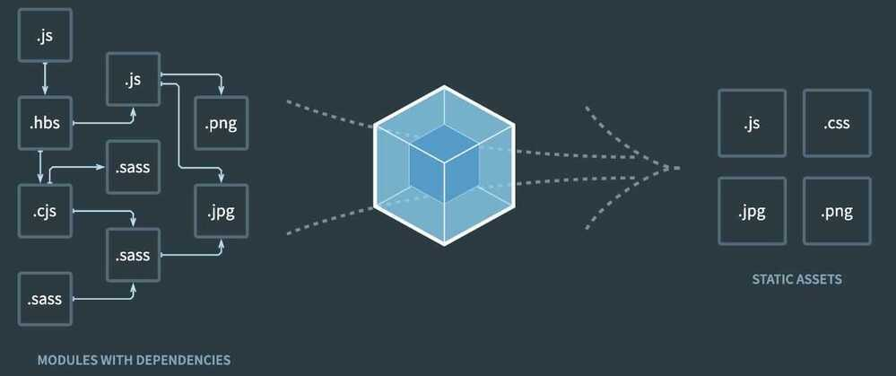

# Tools

[**https://medium.com/dubizzletechblog/setting-up-prettier-and-eslint-for-js-and-react-apps-bbc779d29062**](https://medium.com/dubizzletechblog/setting-up-prettier-and-eslint-for-js-and-react-apps-bbc779d29062)

https://prettier.io

https://github.com/jaredpalmer/tsdx

Despite all the recent hype, setting up a new TypeScript (x React) library can be tough. Between [Rollup](https://github.com/rollup/rollup), [Jest](https://github.com/facebook/jest), tsconfig, [Yarn resolutions](https://yarnpkg.com/en/docs/selective-version-resolutions), ESLint, and getting VSCode to play nicely....there is just a whole lot of stuff to do (and things to screw up). TSDX is a zero-config CLI that helps you develop, test, and publish modern TypeScript packages with ease--so you can focus on your awesome new library and not waste another afternoon on the configuration.

## npx tsdx create mylib

https://github.com/rollup/rollup

Rollup is a module bundler for JavaScript which compiles small pieces of code into something larger and more complex, such as a library or application. It uses the standardized ES module format for code, instead of previous idiosyncratic solutions such as CommonJS and AMD. ES modules let you freely and seamlessly combine the most useful individual functions from your favorite libraries. Rollup can optimize ES modules for faster native loading in modern browsers, or output a legacy module format allowing ES module workflows today.

https://stackblitz.com

https://lisperator.net/uglifyjs

https://github.com/reactjs/react-codemod

## React Developer Tools

https://www.toptal.com/react/debugging-react-developer-tools

https://chrome.google.com/webstore/detail/react-developer-tools/fmkadmapgofadopljbjfkapdkoienihi/related?hl=en

## Build tools

https://github.com/facebook/create-react-app

### Vite

Vite (French word for "quick", pronounced [`/vit/`](https://cdn.jsdelivr.net/gh/vitejs/vite@main/docs/public/vite.mp3), like "veet") is a new breed of frontend build tooling that significantly improves the frontend development experience. It consists of two major parts:

- A dev server that serves your source files over [native ES modules](https://developer.mozilla.org/en-US/docs/Web/JavaScript/Guide/Modules), with [rich built-in features](https://vite.dev/guide/features.html) and astonishingly fast [Hot Module Replacement (HMR)](https://vite.dev/guide/features.html#hot-module-replacement).
- A [build command](https://vite.dev/guide/build.html) that bundles your code with [Rollup](https://rollupjs.org/), pre-configured to output highly optimized static assets for production.

Next Generation Frontend Tooling

1. Instant Server Start
2. Lightning Fast HMR
3. Rich Features
4. Optimized Build
5. Universal Plugin Interface
6. Fully Typed APIs

- [GitHub - vitejs/vite: Next generation frontend tooling. It's fast!](https://github.com/vitejs/vite)
- [Vite \| Next Generation Frontend Tooling](https://vite.dev/)

## Webpack

A bundler for javascript and friends. Packs many modules into a few bundled assets. Code Splitting allows for loading parts of the application on demand. Through "loaders", modules can be CommonJs, AMD, ES6 modules, CSS, Images, JSON, Coffeescript, LESS, ... and your custom stuff.

bundle assets, images, scripts, styles

Install npm packages on the frontend

Webpack also provides features like a local server with hot reload (they call it hot module replacement) to make your development experience better.

https://www.toptal.com/react/webpack-react-tutorial-pt-1

https://webpack.js.org

https://github.com/webpack/webpack

[Turbopack - The successor to webpack](https://turbo.build/pack)

## Other

- Parcel
- Rollup
- Browserify

## Babel (Transpiler)

Babel is how we take advantage of ECMA script beyond ES5 and deal with something called JSX (JavaScript as XML) that we will use in React.

Babel is a JavaScript compiler or transpiler which translates the ECMAScript 2015+ code into code that can be understood by older JavaScript engines.

Babel is the most popular Javascript compiler, and frameworks like Vue and React use it by default.

## Do you need Babel for your React App?

For React, you need a compiler because React code generally uses JSX and JSX needs to be compiled. Also the library is built on the concept of using ES6 syntax.

Luckily, when you create a project withcreate-react-app, it comes with Babel already configured and you usually do not need to modify the config.

## ESLint

you can use a tool like ESLint to enforce rules in the code. For example, you can create a rule to enforce or disallow the usage of semicolons in your JavaScript code. If you break a rule, ESLint shows an error and the code does not even get compiled -- so it is not possible to ignore that unless you disable the rule.

Linters can be used to enforce standards by writing custom rules. But you can also use the pre-made ESLint configs established by big tech companies to help devs get into the habit of writing clean code.

You can take a look at Google's ESLint config [here](https://github.com/google/eslint-config-google)-- it is the one I prefer.

ESLint helps you get used to best practices, but that's not its only benefit. ESLint also warns you about possible bugs/errors in your code so you can avoid common mistakes.

## Decisions

## Editor

- Which one?
- Which plugins?
- Use built in terminal?
- Editor config

## Module format

- ES6 Modules, CommonJS

## HTML generation

- Minify?
- Use plugin?
- Inject prod only concerns?
- Templating language?

## Transpiling

- Native ES or diff language?
- Use experimental features?
- Which plugins?
- Production vs dev config

## Bundler

- Webpack, Browserify, Rollup

## Linting

- Which linter?
- Enable which rules?
- Warning or error?
- Which plugins?
- Use a preset?

## Testing

- Framework?
- Assertion Library?
- Helpers?
- Test file location?
- File naming?
- What environment?
- Mocking?
- Code Coverage
- Continuous Integration

## Project structure

- By file type or feature?
- Centralize API?
- Allow Inline JS?
- Extract to POJOs?

## HTTP

- Library
- Mock schema format
- Mock data generation
- Mock server

## Production build

- Minification
- Sourcemaps
- Bundle splitting
- Cache busting
- Error logging

## Automated Deployment

https://github.com/thedaviddias/Front-End-Checklist

https://frontendchecklist.io

## JavaScript ToolChain

The bleeding edge JavaScript toolchain can seem quite complex, and it's very important to feel confident in the toolchain and to have a mental picture of how the pieces fit together.

There are a couple primary pillars in the JavaScript toolchain: Dependency Management, Linting, Style-checking, Transpilation, and Compilation, Minification, Source-Mapping.

Typically, we use build tools like Gulp, Watchify/Browserify, Broccoli, or Webpack towatch the filesystemfor file events (like when you add or edit a file). After this occurs, the build tool is configured to carry out a group ofsequential or parallel tasks.

This part is the most complex piece, and is the center of the development process.

The rest of the tools belong in that group of sequential or parallel tasks:

- **Style linting -** typically a linter like JSCS is used to ensure the source code is following a certain structure and style
- **Dependency Management -** for JavaScript projects, most people use other packages from npm; some plugins exist for build systems (e.g. Webpack) and compilers (e.g. Babel) that allow automatic installation of packages beingimported orrequire()'d
- **Transpilation -** a specific sub-genre of compilation, transpilation involves compiling code from one source version to another, only to a similar runtime level (e.g. ES6 to ES5)
- **Compilation -** specifically separate from transpiling ES6 and JSX to ES5, is the act of including assets, processing CSS files as JSON, or other mechanisms that can load and inject external assets and code into a file. In addition, there are all sorts of build steps that can analyze your code and even optimize it for you.
- **Minification and Compression -** typically part of -- but not exclusively controlled by -- compilation, is the act of minifying and compressing a JS file into fewer and/or smaller files
- **Source-Mapping -** another optional part of compilation is building source maps, which help identify the line in the original source code that corresponds with the line in the output code (i.e. where an error occurred)
