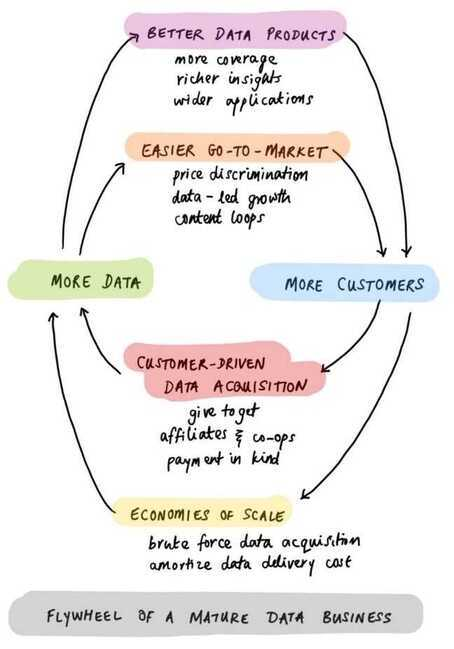

## Economics of Data Business

https://pivotal.substack.com/p/economics-of-data-biz

- **Geospatial Data Startup** - Location-based data services
- **Microfinance** - [Economists dropped $10M in rural Africa](https://youtu.be/BD9kEHvXlGQ) - Changed economic science

## Everything-as-a-Service (XaaS)

- **Living as a Service** - Apartment swapping networks
- **Child as a Service** - Childcare subscription models
- **Flight as a Service** - Flight subscription services
- **Food as a Service** - Meal subscription platforms
- **Raising Children Roadmaps** - Step-by-step, day-by-day guides (pedagogy)
- **Teaching as a Service** - Education subscription platforms
- **Entertainment as a Service** - Entertainment subscriptions
- **Vacation as a Service** - Travel subscription models

## Finance / Economics

### Programmable Currency

**Core concept:** You can program currency to only be used for certain purposes

- Example: Farmer can only use it for buying fertilizer
- Example: Student prize money can only buy books at specific bookshop
- Once purchased, currency becomes fungible again
- If not spent, returns to sender and becomes fungible

**Use cases:**

- Health insurance money paid directly to hospital
- Credit transferred directly to merchant for specific purpose (car loan, home loan)
- Food coupons and other restricted-use vouchers

### Smart Credit

- Health Insurance money paid by insurer directly to hospital (smart/programmable currency)
- Credit doesn't go to you, goes directly to merchant
- Enables lower interest rates (more secure lending)
- Examples: car loan, home loan

### Regenerative Finance (ReFi)

**Philosophy:**

- Re-imagining financial system with modern tools
- Accounts for needs of all stakeholders (current and future)
- Puts a price on externalities
- Not anti-growth or anti-progress
- Accelerates planet-positive technologies through better measurement and financing

**Key principle:** "Back money with more of the things you want to see in the world, you'll get more of those things" - Charles Eisenstein's Sacred Economics

**References:**

- [Celo: Building a Regenerative Economy](https://www.notboring.co/p/celo-building-a-regenerative-economy)
- [Celo as a Cultural Extension of Ethereum](https://app.t2.world/article/cm1eqxyh8151217321mcesuw528v)
- [Will RBI make money dance to its tunes?](https://finshots.in/archive/will-rbi-make-money-dance-to-its-tunes/)

**Example implementation:**

- School gives money to student for books at specific bookshop
- Student can only use money for that purpose
- After purchase, money becomes fungible for bookshop owner
- If not spent, money returns to school

### Other Fintech Ideas

- **Free Privacy-Focused Financial Tracker** - https://fin.naviran.in/
- **Credit Card Based UPI** - UPI payments via credit card

## Ecommerce

### Ecommerce for Small Businesses

- **Mobile product scanner** - Capture photos to go online
- Any business can be online by photographing products
- **Chat functionality** between consumers and businesses
- **Map functionality** for each business location
- **Powerful search** for customers
- **Automatic inventory management** using camera (no barcodes)
- **360° video scanning** for adding products
- Barcodes are dead

### Money Investment Portal

**Single investment type with auto-allocation:**

- Automatically allocated and rebalanced
- Includes: Savings + FD + RD + Mutual Fund + Gilt + Stocks
- Define goals, system tells you allocations and does it for you
- Automatically moves from equity to debt when goal is near

## Marketplace & Services

### Online Maid Services

- Uber-like service for maids and families
- 0 day leave for families
- If a maid is unavailable, another takes her place

### Recharge Guru

**Single portal for all recharges:**

- No wallet, no cashback hunting, no promo-codes needed
- Finds the best recharge option automatically
- Deducts cashback amount upfront, recovers from merchants later
- Hourly checks for best rates (Paytm, Mobikwik, Freecharge, PhonePay, etc.)
- Can extend to: flight bookings, hotel bookings

**Business model:**

- Once everyone stops hunting for offers manually, take a cut from recharges
- Negotiate exclusive codes

## Infrastructure Tools

- **Free Open Source Ticketing + Chat System** (hosted)
- **Free Open Source JIRA/Asana** (hosted)

## Other Ideas

- **Diet Chart + What Should I Eat Today** - Including recipes
- **Personal Location Sharing Service** - Request someone's location (default 1 hour), they can allow/reject

## Links

- [The Grid](../../../book-summaries/business/the-grid.md)
- [9 startups that stood out on YC Demo Day 2](https://techcrunch.com/2024/09/26/9-startups-that-stood-out-on-yc-demo-day-2/)
