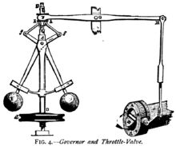

# Control Engineering

Control engineeringorcontrol systems engineeringis an [engineering](https://en.wikipedia.org/wiki/Engineering) discipline that applies [automatic control](https://en.wikipedia.org/wiki/Automatic_control) theory to design systems with desired behaviors in [control](https://en.wikipedia.org/wiki/Control_theory) environments.The discipline of controls overlaps and is usually taught along with [electrical engineering](https://en.wikipedia.org/wiki/Electrical_engineering) at many institutions around the world

The practice uses [sensors](https://en.wikipedia.org/wiki/Sensors) and detectors to measure the output performance of the process being controlled; these measurements are used to provide corrective [feedback](https://en.wikipedia.org/wiki/Feedback) helping to achieve the desired performance. Systems designed to perform without requiring human input are called [automatic control](https://en.wikipedia.org/wiki/Automatic_control) systems (such as [cruise control](https://en.wikipedia.org/wiki/Cruise_control) for regulating the speed of a car).[Multi-disciplinary](https://en.wikipedia.org/wiki/Multi-disciplinary) in nature, control systems engineering activities focus on implementation of control systems mainly derived by [mathematical modeling](https://en.wikipedia.org/wiki/Mathematical_model) of a diverse range of [systems](https://en.wikipedia.org/wiki/System).

## Overview

Modern day control engineering is a relatively new field of study that gained significant attention during the 20th century with the advancement of technology. It can be broadly defined or classified as practical application of [control theory](https://en.wikipedia.org/wiki/Control_theory). Control engineering has an essential role in a wide range of control systems, from simple household washing machines to high-performance [F-16](https://en.wikipedia.org/wiki/F-16) fighter aircraft. It seeks to understand physical systems, using mathematical modelling, in terms of inputs, outputs and various components with different behaviors; use control systems design tools to develop [controllers](https://en.wikipedia.org/wiki/Controller_(control_theory)) for those systems; and implement controllers in physical systems employing available technology. A [system](https://en.wikipedia.org/wiki/Control_system) can be [mechanical](https://en.wikipedia.org/wiki/Mechanical_engineering), [electrical](https://en.wikipedia.org/wiki/Electrical_engineering), [fluid](https://en.wikipedia.org/wiki/Fluid), [chemical](https://en.wikipedia.org/wiki/Chemical), [financial](https://en.wikipedia.org/wiki/Finance) or [biological](https://en.wikipedia.org/wiki/Biology), and the mathematical modelling, analysis and controller design uses [control theory](https://en.wikipedia.org/wiki/Control_theory) in one or many of the [time](https://en.wikipedia.org/wiki/Time_domain), [frequency](https://en.wikipedia.org/wiki/Frequency_domain) and [complex-s](https://en.wikipedia.org/wiki/S_domain) domains, depending on the nature of the design problem.

<https://en.wikipedia.org/wiki/Control_engineering>

<https://en.wikipedia.org/wiki/Control_system>

## Control Theory

Control theoryin [control systems engineering](https://en.wikipedia.org/wiki/Control_engineering) is a subfield of [mathematics](https://en.wikipedia.org/wiki/Mathematics) that deals with the control of continuously operating [dynamical systems](https://en.wikipedia.org/wiki/Dynamical_system) in engineered processes and machines. The objective is to develop a control model for controlling such systems using a control action in an optimum manner withoutdelay or overshootand ensuring control [stability](https://en.wikipedia.org/wiki/Stability_theory).

To do this, a [controller](https://en.wikipedia.org/wiki/Controller_(control_theory)) with the requisite corrective behaviour is required. This controller monitors the controlled process variable (PV), and compares it with the reference or set point (SP). The difference between actual and desired value of the process variable, called theerrorsignal, or SP-PV error, is applied as feedback to generate a control action to bring the controlled process variable to the same value as the set point. Other aspects which are also studied are [controllability](https://en.wikipedia.org/wiki/Controllability) and [observability](https://en.wikipedia.org/wiki/Observability). On this is based the advanced type of automation that revolutionized manufacturing, aircraft, communications and other industries. This isfeedback control, which is usuallycontinuousand involves taking measurements using a [sensor](https://en.wikipedia.org/wiki/Sensor) and making calculated adjustments to keep the measured variable within a set range by means of a "final control element", such as a [control valve](https://en.wikipedia.org/wiki/Control_valve).

## Open-loop and closed-loop (feedback) control

Fundamentally, there are two types of control loops: open loop control and closed loop (feedback) control.

## Open-Loop Control

In open loop control, the control action from the controller is independent of the "process output" (or "controlled process variable" - PV). A good example of this is a central heating boiler controlled only by a timer, so that heat is applied for a constant time, regardless of the temperature of the building. The control action is the timed switching on/off of the boiler, the process variable is the building temperature, but neither is linked

## Closed-Loop Control

In closed loop control, the control action from the controller is dependent on feedback from the process in the form of the value of the process variable (PV). In the case of the boiler analogy, a closed loop would include a thermostat to compare the building temperature (PV) with the temperature set on the thermostat (the set point - SP). This generates a controller output to maintain the building at the desired temperature by switching the boiler on and off. A closed loop controller, therefore, has a feedback loop which ensures the controller exerts a control action to manipulate the process variable to be the same as the "Reference input" or "set point". For this reason, closed loop controllers are also called feedback controllers

The definition of a closed loop control system according to the British Standard Institution is "a control system possessing monitoring feedback, the deviation signal formed as a result of this feedback being used to control the action of a final control element in such a way as to tend to reduce the deviation to zero."

Likewise; "AFeedback Control Systemis a system which tends to maintain a prescribed relationship of one system variable to another by comparing functions of these variables and using the difference as a means of control."

## Control Theory

There are two major divisions in control theory, namely, classical and modern, which have direct implications for the control engineering applications.

## Classical SISO System Design

The scope of classical control theory is limited to [single-input and single-output](https://en.wikipedia.org/wiki/Single-input_single-output_system)(SISO) system design, except when analyzing for disturbance rejection using a second input. The system analysis is carried out in the time domain using [differential equations](https://en.wikipedia.org/wiki/Differential_equations), in the complex-s domain with the [Laplace transform](https://en.wikipedia.org/wiki/Laplace_transform), or in the frequency domain by transforming from the complex-s domain. Many systems may be assumed to have a second order and single variable system response in the time domain. A controller designed using classical theory often requires on-site tuning due to incorrect design approximations. Yet, due to the easier physical implementation of classical controller designs as compared to systems designed using modern control theory, these controllers are preferred in most industrial applications. The most common controllers designed using classical control theory are [PID controllers](https://en.wikipedia.org/wiki/PID_controller). A less common implementation may include either or both a Lead or Lag filter. The ultimate end goal is to meet requirements typically provided in the time-domain called the step response, or at times in the frequency domain called the open-loop response. The step response characteristics applied in a specification are typically percent overshoot, settling time, etc. The open-loop response characteristics applied in a specification are typically Gain and Phase margin and bandwidth. These characteristics may be evaluated through simulation including a dynamic model of the system under control coupled with the compensation model.

## Modern MIMO System Design

Modern control theory is carried out in the [state space](https://en.wikipedia.org/wiki/State_space_(controls)), and can deal with [multiple-input and multiple-output](https://en.wikipedia.org/w/index.php?title=Multiple-input_multiple-output_system&action=edit&redlink=1)(MIMO) systems. This overcomes the limitations of classical control theory in more sophisticated design problems, such as fighter aircraft control, with the limitation that no frequency domain analysis is possible. In modern design, a system is represented to the greatest advantage as a set of decoupled first order [differential equations](https://en.wikipedia.org/wiki/Differential_equation) defined using [state variables](https://en.wikipedia.org/wiki/State_variables).[Nonlinear](https://en.wikipedia.org/wiki/Nonlinear_control), [multivariable](https://en.wikipedia.org/w/index.php?title=Multivariable_control&action=edit&redlink=1), [adaptive](https://en.wikipedia.org/wiki/Adaptive_control) and [robust control](https://en.wikipedia.org/wiki/Robust_control) theories come under this division. Matrix methods are significantly limited for MIMO systems where linear independence cannot be assured in the relationship between inputs and outputs. Being fairly new, modern control theory has many areas yet to be explored. Scholars like [Rudolf E. Kalman](https://en.wikipedia.org/wiki/Rudolf_E._Kalman) and [Aleksandr Lyapunov](https://en.wikipedia.org/wiki/Aleksandr_Lyapunov) are well-known among the people who have shaped modern control theory.

## Centrifugal Governor

Acentrifugal governoris a specific type of [governor](https://en.wikipedia.org/wiki/Governor_(device)) with a feedback system that controls the speed of an [engine](https://en.wikipedia.org/wiki/Engine) by regulating the flow of [fuel](https://en.wikipedia.org/wiki/Fuel) or [working fluid](https://en.wikipedia.org/wiki/Working_fluid), so as to maintain a near-constant speed. It uses the principle of [proportional control](https://en.wikipedia.org/wiki/Proportional_control).

Centrifugal governors were invented by [Christiaan Huygens](https://en.wikipedia.org/wiki/Christiaan_Huygens) and used to regulate the distance and pressure between [millstones](https://en.wikipedia.org/wiki/Millstone) in [windmills](https://en.wikipedia.org/wiki/Windmill) in the 17th century.In 1788, [James Watt](https://en.wikipedia.org/wiki/James_Watt) adapted one to control his [steam engine](https://en.wikipedia.org/wiki/Steam_engine) where it regulates the admission of steam into the [cylinder](https://en.wikipedia.org/wiki/Cylinder_(engine))(s), a development that proved so important he is sometimes called the inventor. Centrifugal governors' widest use was on steam engines during the [Steam Age](https://en.wikipedia.org/wiki/Steam_power_during_the_Industrial_Revolution) in the 19th century. They are also found on [stationary](https://en.wikipedia.org/wiki/Stationary_engine)[internal combustion engines](https://en.wikipedia.org/wiki/Internal_combustion_engine) and variously fueled [turbines](https://en.wikipedia.org/wiki/Turbine), and in some modern [striking clocks](https://en.wikipedia.org/wiki/Striking_clock).

A simple governor does not maintain an exact speed but a speed range, since under increasing load the governor opens the throttle as the speed (RPM) decreases.

<https://en.wikipedia.org/wiki/Centrifugal_governor>

## PID Controller

Aproportional--integral--derivative controller(PID controller.orthree-term controller) is a [control loop](https://en.wikipedia.org/wiki/Control_loop) mechanism employing [feedback](https://en.wikipedia.org/wiki/Feedback) that is widely used in [industrial control systems](https://en.wikipedia.org/wiki/Industrial_control_system) and a variety of other applications requiring continuously modulated control. A PID controller continuously calculates anerror valuee(t) as the difference between a desired [setpoint](https://en.wikipedia.org/wiki/Setpoint_(control_system))(SP) and a measured [process variable](https://en.wikipedia.org/wiki/Process_variable)(PV) and applies a correction based on [proportional](https://en.wikipedia.org/wiki/Proportional_control), [integral](https://en.wikipedia.org/wiki/Integral), and [derivative](https://en.wikipedia.org/wiki/Derivative) terms (denotedP, I, andDrespectively), hence the name.

In practical terms it automatically applies accurate and responsive correction to a control function. An everyday example is the [cruise control](https://en.wikipedia.org/wiki/Cruise_control) on a car, where ascending a hill would lower speed if only constant engine power is applied. The controller's PID algorithm restores the measured speed to the desired speed with minimal delay and overshoot, by increasing the power output of the engine.

The first theoretical analysis and practical application was in the field of automatic steering systems for ships, developed from the early 1920s onwards. It was then used for automatic process control in the manufacturing industry, where it was widely implemented in pneumatic, and then electronic, [controllers](https://en.wikipedia.org/wiki/Controller_(control_theory)). Today there is universal use of the PID concept in applications requiring accurate and optimised automatic control.

<https://en.wikipedia.org/wiki/PID_controller>

## PID ControllerWorking Principle

The working principle behind a PID controller is that the proportional, integral and derivative terms must be individually adjusted or "tuned." Based on the difference between these values a correction factor is calculated and applied to the input. For example, if an oven is cooler than required, the heat will be increased. Here are the three steps:

- Proportional tuninginvolves correcting a target proportional to the difference. Thus, the target value is never achieved because as the difference approaches zero, so too does the applied correction.

- Integral tuningattempts to remedy this by effectively cumulating the error result from the "P" action to increase the correction factor. For example, if the oven remained below temperature, "I" would act to increase the head delivered. However, rather than stop heating when the target is reached, "I" attempts to drive the cumulative error to zero, resulting in an overshoot.

- Derivative tuningattempts to minimize this overshoot by slowing the correction factor applied as the target is approached.

<https://www.omega.co.uk/prodinfo/how-does-a-pid-controller-work.html>

## Controllers

- Proportional Controller
- Derivative Controller
- Integral Controller
- Proportional Derivative (PD) Controller
- Proportional Integral (PI) Controller
- Proportional Integral Derivative (PID) Controller

<https://www.tutorialspoint.com/control_systems/index.htm>

[Control System](https://www.youtube.com/playlist?list=PLWPirh4EWFpGpH_Rb6Q4iQ6vGGRA6MORZ)
