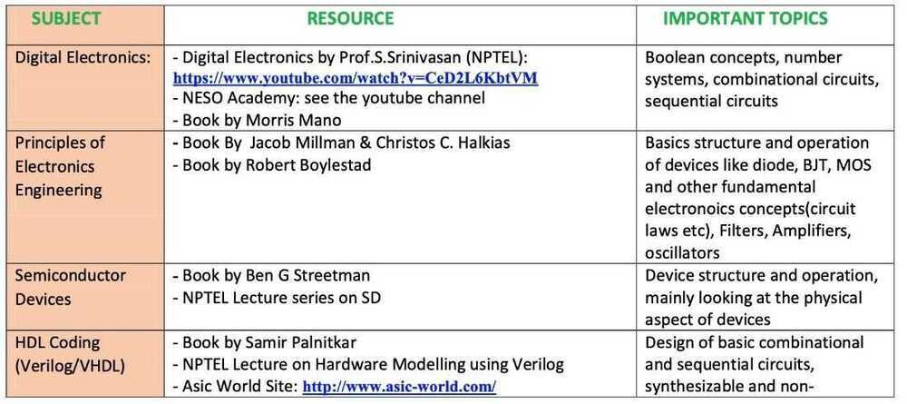
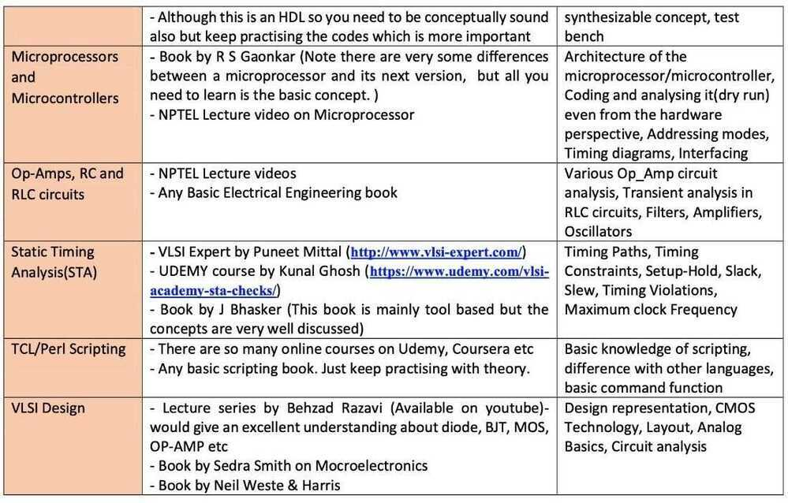

# Embedded Systems / Electronics

## Network Processors

A **network processor** is an [integrated circuit](https://en.wikipedia.org/wiki/Integrated_circuit) which has a feature set specifically targeted at the [networking](https://en.wikipedia.org/wiki/Computer_networking) application domain.

Network processors are typically [software](https://en.wikipedia.org/wiki/Software) programmable devices and would have generic characteristics similar to general purpose [central processing units](https://en.wikipedia.org/wiki/Central_Processing_Unit) that are commonly used in many different types of equipment and products.

## Functions

In the generic role as a packet processor, a number of optimised features or functions are typically present in a network processor, these include:

- Pattern matching - the ability to find specific patterns of bits or bytes within packets in a packet stream.
- Key lookup - the ability to quickly undertake a database lookup using a key (typically an address in a packet) to find a result, typically [routing](https://en.wikipedia.org/wiki/Routing) information.
- Computation
- Data bitfield manipulation - the ability to change certain data fields contained in the packet as it is being processed.
- [Queue](https://en.wikipedia.org/wiki/Queue_(data_structure)) management - as packets are received, processed and scheduled to be sent onwards, they are stored in queues.
- Control processing - the micro operations of processing a packet are controlled at a macro level which involves communication and orchestration with other nodes in a system.
- Quick allocation and re-circulation of packet buffers.

## Architectural Paradigms

In order to deal with high data-rates, several architectural paradigms are commonly used:

- [Pipeline](https://en.wikipedia.org/wiki/CPU_pipeline) of processors - each stage of the pipeline consisting of a processor performing one of the functions listed above.
- [Parallel processing](https://en.wikipedia.org/wiki/Parallel_computing) with multiple processors, often including [multithreading](https://en.wikipedia.org/wiki/Multithreading_(computer_architecture)).
- Specialized [microcoded](https://en.wikipedia.org/wiki/Microcode) engines to more efficiently accomplish the tasks at hand.
- With the advent of [multicore](https://en.wikipedia.org/wiki/Multi-core_(computing)) architectures, network processors can be used for higher layer ([L4-L7](https://en.wikipedia.org/wiki/OSI_model)) processing.

Additionally, traffic management, which is a critical element in [L2](https://en.wikipedia.org/wiki/OSI_model#Layer_2:_data_link_layer)-[L3](https://en.wikipedia.org/wiki/OSI_model#Layer_3:_network_layer) network processing and used to be executed by a variety of co-processors, has become an integral part of the network processor architecture, and a substantial part of its silicon area ("real estate") is devoted to the integrated traffic manager.Modern network processors are also equipped with low-latency high-throughput on-chip interconnection networks optimized for the exchange of small messages among cores (few data words). Such networks can be used as an alternative facility for the efficient inter-core communication aside of the standard use of shared memory.

<https://en.wikipedia.org/wiki/Network_processor>

## Coprocessor

Acoprocessoris a computer processor used to supplement the functions of the primary processor (the [CPU](https://en.wikipedia.org/wiki/Central_processing_unit)). Operations performed by the coprocessor may be [floating point](https://en.wikipedia.org/wiki/Floating_point) arithmetic, [graphics](https://en.wikipedia.org/wiki/Graphics), [signal processing](https://en.wikipedia.org/wiki/Signal_processing), [string processing](https://en.wikipedia.org/wiki/String_processing), [cryptography](https://en.wikipedia.org/wiki/Cryptographic_accelerator) or [I/O interfacing](https://en.wikipedia.org/wiki/Input/output#Interface) with peripheral devices. By offloading processor-intensive tasks from the [main processor](https://en.wikipedia.org/wiki/Central_processing_unit#main_processor), coprocessors can accelerate system performance. Coprocessors allow a line of computers to be customized, so that customers who do not need the extra performance do not need to pay for it.

<https://en.wikipedia.org/wiki/Coprocessor>

## Interview Questions

### In platforms with significant constraints on memory size, is it more preferable to allocate memory statically or dynamically?

It's preferable to use static memory allocation on platforms with memory sizes in the low kilobytes and below. This is because data overhead, CPU overhead, and memory fragmentation can be significant issues when using dynamic memory allocation.

### Describe the pros and cons of using a generic real-time operating system (RTOS) on a mid-range microcontroller

RTOSes can significantly ease the development of complex products, which can translate into faster development cycles. They often support compartmentalizing code into tasks, implement cross-task communication mechanisms, and commonly include abstractions ("drivers") for platform-specific hardware, which makes porting firmware to new hardware easier. Because of all that, they also introduce overhead in code size and CPU usage, which is not acceptable for all projects.

### What are the most important characteristics of UART-based (also calledRS-232-likeandTTL-like) serial communication, I2C communication, and SPI communication?

Simple UART-based serial communication - with or without UART hardware - is the least demanding communications protocol to implement, but comes with severe limitations:

- It's intended to connect only two devices.
- It's asynchronous, meaning there's no explicit agreement about clock rates between the devices.
- It's most commonly used at slow bit rates (up to 115,200 bps).

I2C can connect up to 127 devices on the same electrical bus, and each device is individually addressable. One of the devices, a master device, generates a clock signal shared by all the others, called slave devices. There is only one data wire, so all communication is unidirectional. (It's commonly used to communicate with sensors on a PCB, which often use simple request-response protocols.)

The SPI bus is designed for fast, bidirectional communication with complex devices, which can involve cases such as transferring a large volume of data in bulk. With SPI, all devices share the data and clock wires, but there are also separate addressing wires which enable communication to and from specific devices.

### Why are C and C++ still very popular and widely supported in embedded firmware development?

Hardware constraints, both for memory sizes and CPU speed, limit what can be done on embedded devices. C and C++ usually have very minimal overhead and are very "close to the hardware" in terms of abstractions offered to developers. This makes them suitable for even the smallest devices.

### How many wires are required to reliably implement TTL-like serial communication between two devices, and why?

TTL-like serial communication is often used to interface small microcontroller-based devices to larger computer systems, either for general communication or for uploading firmware. This type of communication uses two wires, one for each direction, called TX (transmit) and RX (receive.) But there also needs to be a common electrical ground level shared between the devices, so the minimum number of wires to reliably implement TTL serial communication is three. (The requirement for common electrical ground is also present in I2C and SPI.)

### Since 32-bit and 64-bit microcontrollers exist, why are 8-bit ones still in use?

The general reason is picking the right tool for the job. The three most common reasons are backwards compatibility, price, and electrical power consumption. Backwards compatibility is important when interfacing with existing infrastructure, especially in industrial environments, where in many cases, the electrical and operational constraints impact the choice of microcontrollers.

Generally, smaller microcontrollers (with narrower primary registers) are also cheaper. But they can contain a very large selection of peripherals and interfacing options, so they can be used in many situations that require advanced functionality but not high CPU speed.

Smaller microcontrollers also generally require less power to operate, which is especially important for IoT and battery-powered devices.

### Is firmware and data embedded in microcontrollers generally safe from downloading, tampering, or hacking?

No. Unless the microcontroller is specially constructed to offer countermeasures against firmware downloading and/or modification, any code and data uploaded to a microcontroller should be considered relatively easy to download and modify. (Such hardened microcontrollers are usually expensive.)

### Discuss a couple of options for wireless communication between embedded devices

On the high end of cost and complexity, wireless communication can be implemented using one of the wifi standards. These offer great bandwidth, are interoperable with many other devices, and can be long-range. But wifi standards are also fairly complex and require dedicated hardware.

Bluetooth is a reasonable choice for interfacing between different types of hardware over short distances, i.e., those of up to 15 yards (~14 meters). It also requires specialized hardware, but such hardware is usually cheap and simple to use. Devices using Bluetooth for communication often emulate a serial line between them.

There are also custom radio-based communication devices and protocols which work on the same frequencies as WiFi and Bluetooth (around 2.4 GHz), but with simpler protocols that are incompatible with the standard ones. They are usually cheaper than Bluetooth and simpler to implement.

There are also transceivers operating at low frequencies such as 433 MHz. While they offer very low bitrates over short distances - up to 10 yards (~9 meters)-they are extremely cheap and easy to implement. If larger distances are required and a small bitrate is acceptable, which is often the case in IoT devices, solutions like LoRa, SigFox, and NB-IoT can be used.

Finally, infrared communication over very short distances (a couple of yards) can also be an efficient choice.

### Describe the role of a watchdog timer

A watchdog timer is a feature of many microcontrollers - usually implemented with specific dedicated hardware - that can be used to check whether the software running on the microcontroller hung.

Microcontrollers are designed to be sturdy and resilient. But there's still any number of issues that can affect hardware stability. There can also be an unhandled combination of events on the software side. Both of these can cause microcontrollers to "hang," either electrically or in an infinite loop in software.

A watchdog timer is a subsystem which needs to be explicitly notified by the software that everything is running as expected, within a specific amount of time. If the watchdog does not receive the notification it expects, it will perform some action, such as resetting the microcontroller, or even the whole device. This is usually done periodically, and the watchdog timer will perform its action if it doesn't receive a notification after a configurable amount of time has passed since the last notification.

### What are some common issues when handling interrupts?

Interrupt handlers almost always need to finish their execution quickly - the details depend on the device and application - and this limits the complexity of what can be done in their code. Also, the context in which the interrupt handler code is executed can, for either hardware or software reasons, prevent the usage from within the interrupt handler code of:

- Common library functions
- Access to peripherals and devices
- Even certain types of CPU instructions

The usual way to mitigate this is to have the interrupt controller set a special variable which is observed by non-interrupt code, and which can then perform arbitrary actions

<https://www.toptal.com/embedded/interview-questions>

## Courses

## Others

<https://en.wikipedia.org/wiki/MISRA_C>

[Design for testing (DFT) - Wikipedia](https://en.wikipedia.org/wiki/Design_for_testing)

[Using DFT Architecture for Superior SoC Testing](https://medium.com/@einfochips/using-dft-architecture-for-superior-soc-testing-9f2c1b290252)

[Basic Electronics Part 1 - YouTube](https://www.youtube.com/watch?v=nb4ovfwqup8)
