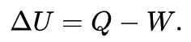

# Mechanical Engineering

## Outline

- [Aerospace engineering](https://en.wikipedia.org/wiki/Aerospace_engineering)
  - Core
    - Fluid mechanics
    - Strength of materials
    - Aerodynamics
    - Gas dynamics
    - Structures
    - Flight mechanics
    - Spacecraft dynamics
    - Orbital mechanics
    - Rockets and staging
    - Aircraft design
  - [Aeronautics](https://en.wikipedia.org/wiki/Aeronautics)
  - [Astronautics](https://en.wikipedia.org/wiki/Astronautics)
- [Acoustical engineering](https://en.wikipedia.org/wiki/Acoustical_engineering)
- [Automotive engineering](https://en.wikipedia.org/wiki/Automotive_engineering)
- [Biomedical engineering](https://en.wikipedia.org/wiki/Biomedical_engineering)
  - [Biomechanical engineering](https://en.wikipedia.org/wiki/Biomechanical_engineering)
  - [Neural engineering](https://en.wikipedia.org/wiki/Neural_engineering)
- [Continuum mechanics](https://en.wikipedia.org/wiki/Continuum_mechanics)
- [Fluid mechanics](https://en.wikipedia.org/wiki/Fluid_mechanics)
- [Heat transfer](https://en.wikipedia.org/wiki/Heat_transfer)
- [Industrial engineering](https://en.wikipedia.org/wiki/Industrial_engineering)
- [Manufacturing engineering](https://en.wikipedia.org/wiki/Manufacturing_engineering)
- [Marine engineering](https://en.wikipedia.org/wiki/Marine_propulsion)
- [Mass transfer](https://en.wikipedia.org/wiki/Mass_transfer)
- [Mechatronics](https://en.wikipedia.org/wiki/Mechatronics)
- [Nanoengineering](https://en.wikipedia.org/wiki/Nanoengineering)
- [Ocean engineering](https://en.wikipedia.org/wiki/Offshore_construction)
- [Optical engineering](https://en.wikipedia.org/wiki/Optical_engineering)
- [Robotics](https://en.wikipedia.org/wiki/Robotics)
- [Thermodynamics](https://en.wikipedia.org/wiki/Thermodynamics)
- [Vehicle engineering](https://en.wikipedia.org/wiki/Vehicle_engineering)

## Mechanical Engineering

- The field of engineering that focuses on the design, construction, operation, and maintenance of machines and mechanical systems - pretty much anything that moves
- Thomas newcomen: first steam engine
- James watt (1763), perfected the design
- Wright brother (1903), airplane
- Unimate (first robot 1960) by George Devol Jr

Had up to six fully programmable axes of motion and could handle parts weighing up to around 225 kilograms at high speeds

- Biomechanics

One of the newest divisions of mechanical engineering.

Exoskeleton-suits, limbs that move like their biological counterparts and other robotic implants

## Biomedical and Industrial Engineering

- Industrial Engineering

It's not just the machines they have to think about. They also have to consider the workers, materials, energy flow, and communication that are needed to provide the best product or service

One of the most important areas that industrial engineers try to optimze is the assembly line. It's where we can see the biggest improvements in quality, delivery-time and cost

Frederick Winslow Taylor: Father of industrial engineering and scientific management

- Introduced the concept of time study
- The Principles of Scientific Management, 1911

- Biomedical engineering
  - Defibrillators
  - Pacemakers
  - MRI and CT scans
  - Insulin pumps
  - Biological modelling
  - Drug delivery
  - Cell encapsulation
  - Synovial fluids

## Law of Conservation

- Matter and energy can neither be created nor destroyed
- If your box is perfectly efficient, the law of conservation tells you that the amount of steel you get at the end, should weigh exactly as much as the ingredients you put in. This is called **Steady-state.**
- Conversion: Describes how much of our initial input was used in the process. Conversion rate 60% means that we get output 60KG with 40KG waste with 100KG input
- Yield: How much final product you can get out of your initial input
- Accumulation: Engineers use it to keep track of the differences between what's coming in and what's going out
- Generation
- Consumption
- Formula: Input - Output + Generation - Consumption = Accumulation

## Reversibility and Irreversibility

- Pressure-Volume work
- Shaft work
- Electrical work
- Reversible processes are impossible in real life. They require slow, steady, incredibly small changes to make sure you don't permanently change the system in a way that you can't reverse without putting some additional work in
- Efficiency: The efficiency of any system is the ratio of what you get out of it, compared to what you have to put into it. It's going to have a value ranging from 0% to 100%, with 100% being max efficiency.

## The first and zeroth laws of thermodynamics

- The Branch of Physics and Engineering that focuses on converting energy, often in the form of heat and work. It describes how thermal energy is converted to and from other forms of energy and also to work.
- Zeroth law of thermodynamics (Thermal Equlibrium)
  - An equlibrium is where certain properties like pressure, volume, or temperature, remain the same across the system
  - The **zeroth law of thermodynamics** states that if two [thermodynamic systems](https://en.wikipedia.org/wiki/Thermodynamic_system) are each in [thermal equilibrium](https://en.wikipedia.org/wiki/Thermal_equilibrium) with a third one, then they are in thermal equilibrium with each other. Accordingly, thermal equilibrium between systems is a [transitive relation](https://en.wikipedia.org/wiki/Transitive_relation).
- First Law of thermodynamics (Heat as Energy) (about quantity of energy)
  - It can neither be created nor destroyed

The **first law of thermodynamics** is a version of the law of [conservation of energy](https://en.wikipedia.org/wiki/Conservation_of_energy), adapted for [thermodynamic systems](https://en.wikipedia.org/wiki/Thermodynamic_system). The law of conservation of energy states that the total [energy](https://en.wikipedia.org/wiki/Energy) of an [isolated system](https://en.wikipedia.org/wiki/Isolated_system) is constant; energy can be transformed from one form to another, but can be neither created nor destroyed. The first law is often formulated

- The energy inside a system
  - Kinetic Energy (KE)
    - The type of energy that's involved with movement
    - Translational kinetic energy
    - Rotational kinetic energy
    - Vibrational kinetic energy
  - Potential Energy (PE)
    - Energy that can come from where something is, even if it's not moving
    - gravitational potential energy
    - Horizontal potential energy (bow and arrow using elasticity)
  - Internal Energy
    - Energy associated with the seemingly random movement of molecules
- The energy that can move between boundaries
  - Heat (Q): The flow of thermal energy
  - Work (W): Essentially any type of energy other than heat

- In closed systems
  - In stationary system KE and PE is 0
  - Adiabatic process: where there is no heat transfer

- Isochoric process: The volume of the system remains constant

- **In open systems**
  - Enthalpy (H): includes internal energy, but also adds in the energy required to give a system its volume and pressure
  - Shaft Work (WS): Any type of mechanical energy other than what's necessary for flow

Why can't we invent a perfect engine

- Heat Engine

A heat engine is a machine or system that converts heat into other forms of energy

- Second Law of Thermodynamics (about Quality of energy)
  - States that as energy is transferred or transformed, more and more of it, is wasted. It basically restricts the inter-conversion between heat and work.
  - Carnot Engine

The Carnot cycle is actually a hypothetical process -- It's the most ideal cycle of changing pressures and temperatures in a fluid.

Contains two adiabatic processes, two isothermal processes, all of which are reversible

- Entropy

Is the measure of a system's thermal energy per unit temperature that's unavailable for doing work. It's also the measure of the disorder, or randomness, of a system.

**Classical mechanics is a framework for unraveling the forces at work in a wide class of mechanical systems**

Cellular Automation (simple systems calledcellular automatathat live and die according to simple rules on a lattice.)

## Intermediate Axis Theorem

Thetennis racket theoremorintermediate axis theoremis a result in [classical mechanics](https://en.wikipedia.org/wiki/Classical_mechanics) describing the movement of a [rigid body](https://en.wikipedia.org/wiki/Rigid_body) with three distinct [principal moments of inertia](https://en.wikipedia.org/wiki/Principal_moments_of_inertia). It is also dubbed theDzhanibekov effect, after [Russian](https://en.wikipedia.org/wiki/Russian_people) [cosmonaut](https://en.wikipedia.org/wiki/Cosmonaut) [Vladimir Dzhanibekov](https://en.wikipedia.org/wiki/Vladimir_Dzhanibekov) who noticed one of the theorem's consequences while in space in 1985 although the effect was already known for at least 150 years before that and is well described in contemporary texts on classical mechanics that would have been known to Dzhanibekov. An article explaining the effect was published in 1991.

The theorem describes the following effect: rotation of an object around its first and third [principal axes](https://en.wikipedia.org/wiki/Moment_of_inertia#Principal_axes) is stable, while rotation around its second principal axis (or intermediate axis) is not.

https://en.wikipedia.org/wiki/Tennis_racket_theorem

## Takt Time

Takt time is the average time between the start of production of one unit and the start of production of the next unit, when these production starts are set to match the rate of customer demand. For example, if a customer wants 10 units per week, then, given a 40-hour work week and steady flow through the production line, the average time between production starts should be 4 hours (actually less than that in order to account for things like machine downtime and scheduled paid employee breaks), yielding 10 units produced per week. In fact, takt time simply reflects the rate of production needed to match the demand. In the previous example, whether it takes 4 minutes or 4 years to produce the product, the takt time is based on customer demand. If a process or a production line are unable to produce at takt time, either demand leveling, additional resources, or process re-engineering is needed to correct the issue

https://en.wikipedia.org/wiki/Takt_time

[The interesting engineering behind your Car Window!](https://youtu.be/Yl40Uj8kCWU)

- Crank gear mechanism
- Worm gear arrangement (Worm drive)

https://www.machinerylubrication.com/Read/1080/worm-gears

- Vertical guides

## Venturi effect

TheVenturi effectis the reduction in [fluid pressure](https://en.wikipedia.org/wiki/Fluid_pressure) that results when a fluid flows through a constricted section (or choke) of a pipe. The Venturi effect is named after its discoverer, the 18th century Italian [physicist](https://en.wikipedia.org/wiki/Physicist), [Giovanni Battista Venturi](https://en.wikipedia.org/wiki/Giovanni_Battista_Venturi).

https://en.wikipedia.org/wiki/Venturi_effect

## Isotropic vs anisotropic

Isotropic refers to the properties of a material which is independent of the direction whereas anisotropic is direction-dependent. These two terms are used to explain the properties of the material in basic crystallography. The mechanical and physical properties can be easily affected based on the atom orientation in crystals. Some examples of isotropic materials are cubic symmetry crystals, glass, etc. Some examples of anisotropic materials are composite materials, wood, etc. Below are a few differences between isotropic and anisotropic materials.

[Difference Between Isotropic And Anisotropic - Differences explained on BYJU’S](https://byjus.com/chemistry/difference-between-isotropic-and-anisotropic/)

## Robotics

- [The Fastest Maze-Solving Competition On Earth - YouTube](https://www.youtube.com/watch?v=ZMQbHMgK2rw)
- [GitHub - Smoothieware/Smoothieware: Modular, opensource, high performance G-code interpreter and CNC controller written in Object-Oriented C++](https://github.com/Smoothieware/Smoothieware)
- [start [smoothieware.org]](https://smoothieware.org/)

## Links

- [Heat Pumps: the Future of Home Heating](https://www.youtube.com/watch?v=7J52mDjZzto)
- [How to build a satellite – with Stuart Eves](https://www.youtube.com/watch?v=oWidvY7JzFE)
- [How do airplanes actually fly? - Raymond Adkins - YouTube](https://www.youtube.com/watch?v=p4VHMsIuPmk)
- [The Science Of Small Distances - YouTube](https://www.youtube.com/watch?v=Aw-xbs8ZWxE)
- [The World Of Microscopic Machines - YouTube](https://www.youtube.com/watch?v=iPGpoUN29zk)
- [The Most Complex System In Modern Cars - YouTube](https://www.youtube.com/watch?v=mxHJ3O4iudw)
- [How to save 51 billion lives for 68 cents with simple Engineering - YouTube](https://www.youtube.com/watch?v=Qf-D1Upn-KU)
- [The GENIUS of Inertial Navigation Systems Explained - YouTube](https://www.youtube.com/watch?v=Pq_PDaYclAw&ab_channel=FlyByMax)
- [Understanding Magnetic couplers! - YouTube](https://www.youtube.com/watch?v=IAkxS1xVraw&ab_channel=Lesics)
- [The Secret Invention That Changed World War 2 - YouTube](https://www.youtube.com/watch?v=Dtocpvv88gQ)
- [How does an Elevator work? - YouTube](https://www.youtube.com/watch?v=rKp4pe92ljg)
- [Lessons from a Can Opener - YouTube](https://www.youtube.com/watch?v=i_mLxyIXpSY)
- [This goofy fridge has a really clever design. It's also kinda terrible. - YouTube](https://www.youtube.com/watch?v=8PTjPzw9VhY)
- [How a Diesel-Electric Locomotive Works - YouTube](https://www.youtube.com/watch?v=cIQ0yIZgQeE)
- [Axial Flux Motors Will Change CARS - Here's Why - YouTube](https://www.youtube.com/watch?v=HFY0cNRQjHA)
- [How do Mechanical Pencils Work? #shorts - YouTube](https://www.youtube.com/watch?v=vpR8piWPdKo)
- [How do Soap Bottle Pumps Work? || Inside Animation of a Soap Pump Dispenser - YouTube](https://www.youtube.com/watch?v=9kzC4CpPxSQ)
- [Photoelectric light controls are weirder than they seem - YouTube](https://www.youtube.com/watch?v=Khp3wb0QMpQ)
