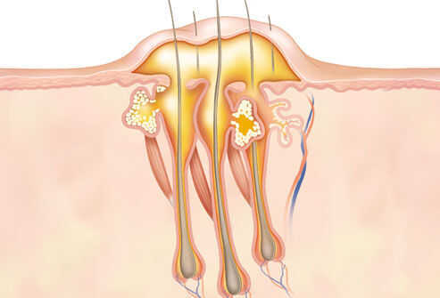

# Diseases

Listening to your own body over a lifetime can tell you far more than any doctor in a small room for a rushed 10 minutes appointment.

## Lifestyle related disease

- Obesity
- Hypertension

We've discovered that there are more than 70,000 ways the human body can fail. 70,000 different diagnoses for our 13 organ systems. We've developed 6,000 drugs, 4,000 medical and surgical procedures

## Hyperthyroidism

Hyperthyroidism, or overactive thyroid, happens when the thyroid gland produces too much thyroid hormone. This has an impact throughout the body.

https://www.medicalnewstoday.com/articles/9153.php

## Injury

- Don't put water on skin damage and never itch the blood clot appear after injury, it will heal faster
- Put betadine on it and don't cover it, cover while bathing

## Brushing Teeth

- Change brush every 3 months
- Brush for 2 minutes, twice a day, once flossing
- Don't rinse with water / ~~use mouthwash floride water (listerine)~~
- Don't put brush in bathroom
- Flossing
- Use tongue cleaner
- Don't use hard toothbrush (soft or extra soft)
- Minimal pressure
- Brush in circles (no back and forth)
- Brush in 45 degree angle to gums
- Downwards (or upwards) towards your gums
- Change routine
- Don't brush more than 2 times a day
- Wait 30 min after eating before brushing

[How long should you brush your teeth? Here are some tips from experts | CNN](https://edition.cnn.com/2021/11/19/health/teeth-brushing-health-wellness-partner/index.html)

## Cough

- Drink hot ghee with adrak juice
- Drink hot water + lemon + honey (honey soothes your throat)
- Salt + water gargle
- Non productive cough / Dry cough

### Viral infection

When you get infected with one of the many viruses that cause the common cold, your short-term symptoms usually last less than a week. It's not uncommon, however, for a cough to linger long after your other symptoms have improved.

These post-cold coughs are usually dry and can last for up to two months. They're usually the result of irritation in your airway, which is often overly sensitive after a viral illness.

This type of cough is difficult to treat and often requires time and patience. Coughing only increases the irritation in your airway, so try using throat lozenges and warm liquids to soothe your throat. This may help to reduce your coughing, giving your airway a chance to heal.

sucking on throat lozenges to moisturize and soothe irritated throat tissue

taking OTC cough suppressants, such as dextromethorphan (Robitussin), to suppress your cough reflex

adding honey to a hot drink to soothe irritated throat tissue

## Thalassaemia

Any of a group of hereditary haemolytic diseases caused by faulty haemoglobin synthesis, widespread in Mediterranean, African, and Asian countries.

Thalassemiais a blood disorder passed down through families (inherited) in which the body makes an abnormal form or inadequate amount of hemoglobin. Hemoglobin is the protein in red blood cells that carries oxygen.

It can be prevented in babies before birth

## Hemorrhoid / Piles

Hemorrhoids, also calledpiles, are [vascular](https://en.wikipedia.org/wiki/Sinusoid_(blood_vessel)) structures in the [anal canal](https://en.wikipedia.org/wiki/Anal_canal).In their normal state, they are cushions that help with [stool](https://en.wikipedia.org/wiki/Human_feces) control.They become a disease when [swollen](https://en.wikipedia.org/wiki/Swelling_(medical)) or [inflamed](https://en.wikipedia.org/wiki/Inflammation); the unqualified term "hemorrhoid" is often used to refer to the disease.The signs and symptoms of hemorrhoids depend on the type present.Internal hemorrhoids often result in painless, bright red [rectal bleeding](https://en.wikipedia.org/wiki/Hematochezia) when [defecating](https://en.wikipedia.org/wiki/Defecation). [External hemorrhoids](https://en.wikipedia.org/wiki/External_hemorrhoids) often result in pain and swelling in the area of the [anus](https://en.wikipedia.org/wiki/Anus).If bleeding occurs it is usually darker.Symptoms frequently get better after a few days.A [skin tag](https://en.wikipedia.org/wiki/Skin_tag) may remain after the healing of an external hemorrhoid.

https://en.wikipedia.org/wiki/Hemorrhoid

## Hernia

Aherniais the abnormal exit of tissue or an [organ](https://en.wikipedia.org/wiki/Organ_(anatomy)), such as the [bowel](https://en.wikipedia.org/wiki/Bowel), through the wall of the cavity in which it normally resides.Hernias come in a number of types.Most commonly they involve the [abdomen](https://en.wikipedia.org/wiki/Abdomen), specifically the groin.[Groin hernias](https://en.wikipedia.org/wiki/Groin_hernia_(disambiguation)) are most common of the [inguinal](https://en.wikipedia.org/wiki/Inguinal_hernia) type but may also be [femoral](https://en.wikipedia.org/wiki/Femoral_hernia).Other hernias include [hiatus](https://en.wikipedia.org/wiki/Hiatus_hernia), [incisional](https://en.wikipedia.org/wiki/Incisional_hernia), and [umbilical hernias](https://en.wikipedia.org/wiki/Umbilical_hernia). Symptoms are present in about 66% of people with groin hernias.This may include pain or discomfort especially with coughing, exercise, or going to the bathroom. Often it gets worse throughout the day and improves when lying down.A bulging area may occur that becomes larger when bearing down.Groin hernias occur more often on the right than left side.The main concern is [strangulation](https://en.wikipedia.org/wiki/Strangulation_(bowel)), where the blood supply to part of the bowel is blocked. This usually produces severe pain and tenderness of the area.Hiatus or hiatal hernias often result in [heartburn](https://en.wikipedia.org/wiki/Heartburn) but may also cause chest pain or pain with eating.

https://en.wikipedia.org/wiki/Hernia

## Anorexia

An eating disorder characterized by markedly reduced appetite or total aversion to food.Anorexiais a serious psychological disorder. It is a condition that goes well beyond out-of-control dieting. The person withanorexia, most often a girl or young woman, initially begins dieting to lose weight.

## Boils

- A boil is a common, painful infection of a hair follicle and the surrounding skin. It begins as a red lump, then fills with pus as white blood cells rush in to fight the infection. Good home care can often clear up a single boil, also known as a skin abscess. A doctor's care is needed when a boil resists treatment or develops in certain vulnerable areas of the body.

- You may also have a general feeling of ill health, fatigue, or a fever, which is reason to call a doctor.
- Most boils are caused by **staph bacteria (Staphylococcus aureus)**. When a scrape, cut, or splinter breaks the skin, the bacteria can enter a hair follicle and start an infection.
- Not exactly, but the germs that cause boils (staph) are easily spread through skin-to-skin contact and contaminated objects. These bacteria usually do no harm unless they find a break in the skin. To avoid spreading staph, don't share towels, bedding, clothes, or sports gear while you have a boil. Avoid touching the boil, and keep it covered. Frequent hand washing can also help prevent spreading the bacteria.
    - Since bacteria are everywhere in our environments and on many people's skin, the best defense against boils includes:
        - Hand washing or use of alcohol-based hand sanitizer
        - Careful cleaning of cuts, scrapes, and other wounds
        - Keeping wounds covered
        - Not sharing towels, sheets, razors, etc.
    - Wash towels, sheets, and anything else in contact with an infected area in very hot water. Throw away any wound dressings in a tightly sealed bag.
    -
- **Types of Boil**
    - **Carbuncle**

When several boils form close together and join beneath the skin, it's called a carbuncle. They are most commonly found on the back and the neck but can develop anywhere. Men are more likely to develop carbuncles than women. A carbuncle tends to lie deeper beneath the skin than a boil and can take longer to heal.

- Cystic Acne
- Armpit and Groin (hidradenitis suppurativa)
- Pilonidal Abscess
- Stye

- Anyone can develop a boil. The risk increases with:
    - Close contact with an infected person
    - Acne, eczema, or other causes of breaks in the skin
    - Diabetes
    - A weakened immune system
    - Poor [nutrition](http://www.medicinenet.com/script/main/art.asp?articlekey=10192)
    - Poor hygiene
    - Exposure to harsh chemicals that irritate the skin

- **Treatment**
    - Apply warm, moist compresses several times a day to help a boil open and drain. After it starts draining, keep it clean, and continue using warm compresses -- a clean one every time. Change the bandage often and wash hands well. Resist the urge to squeeze or pop the boil. This can make the infection worse.
    - When the boil starts draining, wash it with an antibacterial soap until all the pus is gone and clean with rubbing alcohol. Apply a medicated ointment (topical antibiotic) and a bandage. Continue to wash the infected area two to three times a day and to use warm compresses until the wound heals.

- Warm compresses may promote the drainage and healing of carbuncles. Gently soak the carbuncle in warm water, or apply a clean, warm, moist washcloth for 20 minutes several times per day. Similar strategies include covering the carbuncle with a clean, dry cloth and gently applying a heating pad or hot water bottle for 20 minutes several times per day. After each use, washcloths or cloths should be washed in hot water and dried at a high temperature.
- Washing the carbuncle and covering the area with a sterile bandage also may promote drainage and healing and help prevent the infection from spreading. Over-the-counter [medications](https://www.webmd.com/drugs/index-drugs.aspx) such as [acetaminophen](https://www.webmd.com/drugs/2/drug-362/acetaminophen+oral/details) or [ibuprofen](https://www.webmd.com/drugs/mono-9368-IBUPROFEN+-+ORAL.aspx?drugid=5166&drugname=ibuprofen+oral) can help relieve the pain of an inflamed carbuncle.
- It's important to thoroughly [wash your hands](https://www.webmd.com/cold-and-flu/cold-guide/cold-prevention-hand-washing) after touching a carbuncle. Launder any clothing, bedding, and towels that have touched a carbuncle and avoid sharing bedding, clothing, or other personal items.
- Depending on severity, most carbuncles heal within two to three weeks after medical treatment.

- **When to Call the Doctor**

If a boil doesn't heal after a week of home care, call your doctor. Other reasons to call include:

- A boil on the face or spine
- A fever or red streaks coming from the sore
- A very large or painful boil
- A boil that keeps coming back
- The skin around the boil turns red or red streaks appear.
- The pain becomes severe.
- The boil does not drain.
- A second boil appears.

- **Complications**
    - Sometimes, carbuncles are caused by methicillin-resistantStaphylococcus aureus([MRSA](https://www.webmd.com/skin-problems-and-treatments/understanding-mrsa)) bacteria, and require treatment with potent prescription [antibiotics](https://www.webmd.com/cold-and-flu/rm-quiz-antibiotics-myths-facts) if the lesions are not drained properly.

## Cold

A cold can cause a stuffy or runny nose, sore throat, and low fever, but is a cold bacterial or viral?

The [common cold](https://www.healthline.com/health/cold-flu/cold) is caused by a number of different viruses, although **rhinoviruses** are most often the culprit.

There’s not much you can do to treat a cold except wait it out and use OTC medications to help relieve your symptoms.

### Symptoms

Symptoms of a cold usually peak within 2 to 3 days and can include:

- Sneezing
- Stuffy nose
- Runny nose
- Sore throat
- Coughing
- Mucus dripping down your throat (post-nasal drip)
- Watery eyes
- Fever (although most people with colds do not have fever)

When viruses that cause colds first infect the nose and sinuses, the nose makes clear mucus. This helps wash the viruses from the nose and sinuses. After 2 or 3 days, mucus may change to a white, yellow, or green color. This is normal and does not mean you need an antibiotic.

Some symptoms, especially runny or stuffy nose and cough, can last for up to 10 to 14 days. Those symptoms should improve over time.

### When to Seek Medical Care

- Trouble breathing or fast breathing
- Dehydration
- Fever that lasts longer than 4 days
- Symptoms that last more than 10 days without improvement
- Symptoms, such as fever or cough, that improve but then return or worsen
- Worsening of chronic medical conditions

Colds can have similar symptoms to [flu](https://www.cdc.gov/flu/about/keyfacts.htm). It can be difficult (or even impossible) to tell the difference between them based on symptoms alone.

### How to Feel Better

Below are some ways you can feel better while your body fights off a cold:

- Get plenty of rest.
- Drink plenty of fluids.
- Use a clean humidifier or cool mist vaporizer.
- Use saline nasal spray or drops.
    - For young children, use a rubber suction bulb to clear mucus.
- Breathe in steam from a bowl of hot water or shower.
- Suck on lozenges. Do not give lozenges to children younger than 4 years of age.
- Use honey to relieve cough for adults and children at least 1 year of age or older.

[Common Cold | Antibiotic Use | CDC](https://www.cdc.gov/antibiotic-use/colds.html)

### Flu vs Common Cold

Influenza (flu) and the common cold are both contagious respiratory illnesses, but they are caused by different viruses. Flu is caused by influenza viruses only, whereas the common cold can be caused by a number of different viruses, including rhinoviruses, parainfluenza, and [seasonal coronaviruses](https://www.cdc.gov/coronavirus/general-information.html). Seasonal coronaviruses should not be confused with SARS-CoV-2, the virus that causes [COVID-19](https://www.cdc.gov/coronavirus/2019-ncov/index.html). Because flu and the common cold have similar symptoms, it can be difficult to tell the difference between them based on symptoms alone. In general, flu is worse than the common cold, and symptoms are typically more intense and begin more abruptly. Colds are usually milder than flu. People with colds are more likely to have a runny or stuffy nose than people who have flu. Colds generally do not result in serious health problems, such as pneumonia, bacterial infections, or hospitalizations. Flu can have serious [associated complications](https://www.cdc.gov/flu/symptoms/symptoms.htm).

[Cold Versus Flu | CDC](https://www.cdc.gov/flu/symptoms/coldflu.htm)

## Aphasia

Aphasia is an inability to comprehend or formulate language because of damage to specific [brain](https://en.m.wikipedia.org/wiki/Brain "Brain") regions.

## Norwood scale

[The Dreadful Business of Balding & Hair Loss - YouTube](https://www.youtube.com/watch?v=Q65BI_5lul4&ab_channel=ModernMBA)

## Lead Poisioning

[Lead Poisoning](https://www.drishtiias.com/daily-updates/daily-news-analysis/lead-poisoning-1)

## Tonsilitis

[Understanding Tonsillitis - YouTube](https://www.youtube.com/watch?v=9jpMQQn3R9o)

## Diabetes

[The Rise Of Glucose Monitoring Among Non-Diabetics - YouTube](https://www.youtube.com/watch?v=nYy1zEHvXZ4)

## Mumps

[Mumps: Causes, Symptoms & Treatments](https://my.clevelandclinic.org/health/diseases/15007-mumps)

Vaccine - The mumps vaccine is part of the **MMR vaccine** series, which also protects against measles and rubella. The CDC recommends that children receive two doses of the MMR vaccine, the first between 12 and 15 months of age and the second between 4 and 6 years of age, with at least four weeks between the doses. The vaccine is 96% effective against measles, 86% effective against mumps, and 89% effective against rubella.

## JellyFish Sting

- Caladryl
- Delayed skin reaction
- Tetanus
- Vinegar

## PCOS and PCOD

PCOD (Polycystic Ovarian Disease) and PCOS (Polycystic Ovary Syndrome) are both hormonal disorders that affect the ovaries. PCOD is generally less severe than PCOS

## ADHD

ADHD, or Attention-Deficit/Hyperactivity Disorder, is a neurodevelopmental condition characterized by symptoms of inattention, hyperactivity, and impulsivity. These symptoms can manifest in different ways and impact various aspects of a person's life.

## Links

[Bacterial vs. Viral Infections: What’s the Difference?](https://www.healthline.com/health/bacterial-vs-viral-infections)
