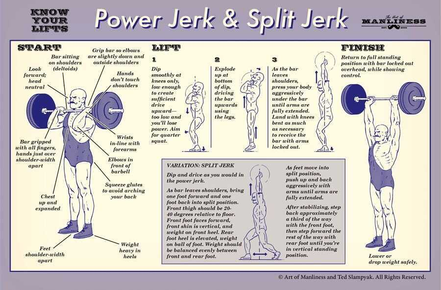
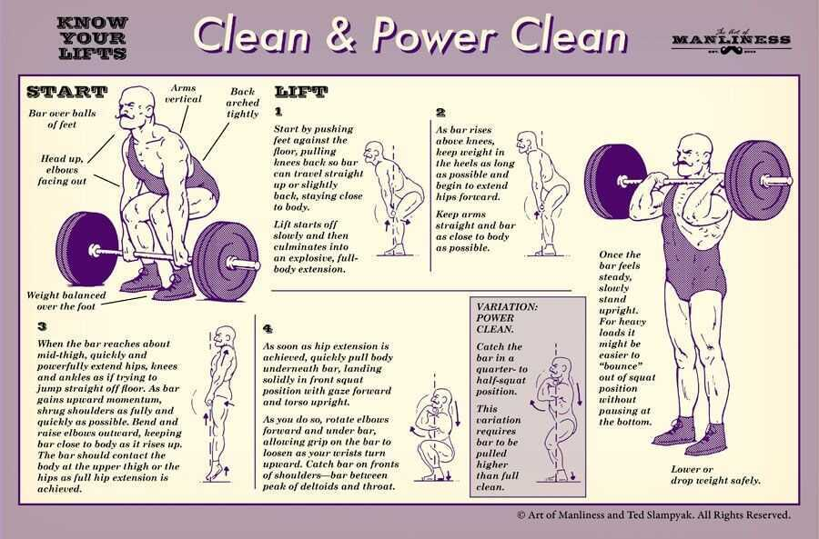
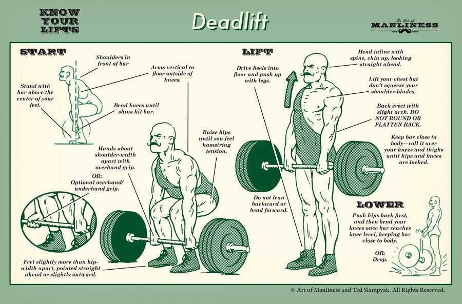
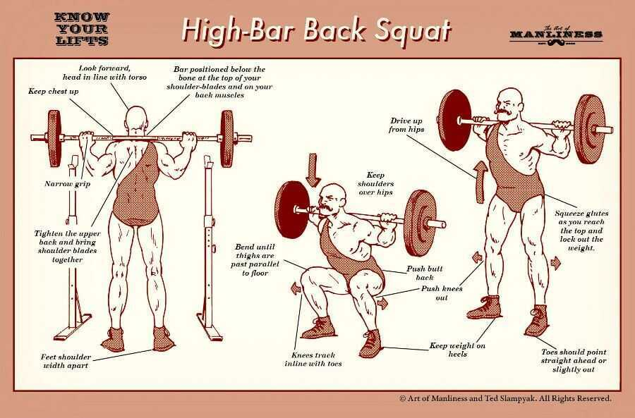

# Gym

The best exercise for gaining strength is not missing workouts

## Ego-lifting

## mind-muscle connection

## meal plan

## 250-500 over tdee

## compound lifts

## group two mucle group per day, each muscle group twice-thrice in week

## 2-2-4: concentric-pause-eccentric (concentration curl)

## After 6-8 weeks add a deload week

## why biceps won't grow

1. **high weight**

2. **not full range of motions**

## Most important exercises

1. Squat (Compound)
2. Deadlift (Compound)
3. Bench Press (Compound)
4. Close-grip bench press (triceps)
5. Pull ups
6. Abs pulldown
7. Shoulder press

## Triceps

1. **Over head exercises**

   - **dumbbell pullup over the head**

   - **barbell triceps curl**

   - **close grip bench press**

## Pushups

1. Full range of motion
2. Don't flare your elbows out while going down
3. Keep your spine straight
4. Don't go too fast
5. Breathe in while going down through nose, breathe out while going up (pushing up) through mouth

https://www.youtube.com/watch?v=A_7foakUeHw

## Gym routine (60 mins)

1. 10 mins stretching
2. 20 mins cardio
   - 10 mins treadmill + 10 mins cross trainer
   - 20 mins treadmill
   - 20 mins cross trainer
3. 30 mins weight training

## 5-Day Split Routine

Monday -- Chest

Pushups

15, 8, 7

Barbell Bench Press

5-8, 7.5-6, 10-4

Incline Dumbbell Press

7.5-6, 10-4, 12.5-3

Decline Dumbbell Press

7.5-8, 10-6, 12.5-4

Dumbbell Flyers

7.5-8, 10-6, 12.5-4

Barbell pullover (easy curl bar)

bar-8, bar+2.5-6, bar+2.5-4

Butterfly

3-8, 4-6, 5-4

Weighted Crunch

Body-15, body+5-8, body+10-6

Flat-bench lying leg raise

Leg-8, leg+2.5-6, leg+5-4, leg+7.5-2

Tuesday -- Back

Barbell Deadlift

lb+10-10, lb+15-8, lb+20-4, lb+25-2

Weighted pull up

Body weight-7, bw-7, bw-5

Reverse-grip bent-over barbell row

Short barbell+5-8, sb+7.5-8, sb+10-8

One-arm dumbbell row

7.5-10, 10-8, 12.5-4

Lat Pull-down

4-10, 5-8, 6-4

Dumbbell Shrug

10-10, 12.5-8, 15-6

Lat pull down back

4-10, 5-8, 6-4

Wednesday -- arms

Thursday -- Shoulders

Dumbbell Shoulder press

7.5-8, 10-6, 12.5-4

Arnold Dumbbell press

7.5-8, 10-6, 12.5-4

Dumbbell side lateral raise

2.5-10, 5-8, 7.5-4

Front dumbbell raise

5-8, 7.5-6, 10-6

Upright barbell row

Short barbell+2.5-10, sb+5-6, sb+7.5-3

Weighted crunch

Body-10, Body+5-8, body+10-6

Flat-bench lying leg raise

Leg-7, leg+2.5-7, leg+4-4

Friday -- Legs

Barbell Squat

lb+5-10, lb+10-8, 15-6

Leg press/ dumbbell squat

10-8, 15-6., 20-4

Barbell lunge

Lb+5-7, lb+10-5, lb+15-3

Leg extension back

5-8, 6-6, 7-6

Seated leg extension

6-10, 7-4, 8-6

Saturday -- arms, biceps, triceps

Close-grip barbell bench press

Long barbell+5-8, lb+7.5-6, 10-4

Barbell curl

5-8, 7.5-6, 10-4

Triceps pully

3-8, 4-6, 5-4

Triceps dips

10, 8, 6

Preacher curl

2-12, 3-4, 3-4

Triceps kick back

5-8, 7.5-6, 7.5-6

Concentration

5-8, 7.5-6, 10-4

Hammer

5-8, 7.5-6, 10-4

Lying triceps curl

Curlbar+1-8, cb+3-6, cb+5-4, cb+7-1

Dumbbell alternating biceps curl

5-8, 7.5-6, 10-4

Reverse barbell curl

Short barbell-8, sb+3-6, sb+5-4, sb+7-2

Weighted crunch

10-10, 15-8

Flat-bench lying leg raise

Leg-10, leg+2.5-8, leg+5-6, leg+7.5-4

Sunday -- OFF

## New Routine

Monday - chest

1. Bench press - lb-12, lb+5-10, lb+7.5-8

2. Incline bench press - lb+5-12, lb+7.5-5, lb+7.5-3

3. Decline dumbbell press - 5-12, 7.5-10, 10-8, 12.5-6

4. Butterfly - 4-12, 5-10, 6-8

5. Dumbbell Pullover - 7.5-12, 10-10, 12.5-6

Tuesday - triceps

1. Dumbbell over head - 5-12, 7.5-8, 10-8

2. Easy curlbar over head - bar-12, b+5-10 b+5-6

3. Cable triceps pushdown - 3-10,4-6,

4. Triceps over head pull down - 2-12, 3-10, 4-8

5. Single hand - 2.5-12, 5-10, 5-5

Wednesday - back

1. Lat pulldown front - 3-12, 4-10, 5-8

2. Cable seated row - 3-12, 4-10, 4-8

3. Wide grip pulldown behind the neck - 4-12, 5-10, 5-6

4. Dumbbell one arm row- 5-12, 7.5-10, 10-8

5. Close grip front lat pulldown - 4-12, 5-10, 5-8

6. Hyperextensions - back extension -12,12,12

Thursday - biceps

1. Barbell curl - barbell - 12, b+5-8, b+5-4

2. Dumbbell curl - 5-12, 7.5-8, 10-3

3. Preacher curl - 2-12, 3-8, 3-8

4. Dumbbell Hammer curl - 5-12, 7.5-8, 10-3

5. Dumbbell concentration - 5-12, 7.5-6, 7.5-5

Saturday - shoulders

1. Barbell shoulder press - b-12, b+5-10, b+5-8

2. Dumbbell shoulder press - 5-12, 7.5-10, 10-8

3. Dumbbell front raise - 2.5-12, 5-10, 7.5-8

4. Dumbbell lateral raise - 2.5-12, 5-10, 7.5-2

5. Front rope row - 2-12, 3-10, 4-8, 5-6

Friday - Legs

1. Leg press - 5-12, 10-10, 15-8

2. Dumbbell Squats - 5-12, 7.5-10, 10-8

3. Dumbbell Lunges - 5-12, 7.5-8, 10-6

4. Leg extension 2-12, 3-10, 4-8

5. Bodyweight standing calf raise - 12, 10, 8

1. Deadlifts strength training - minimum 2 times of week

Box jumps

2. Proprioception - single leg standing, slack line walking

4. HIIT - BDNF (brain derived neurotrophic factor) - high intensity interval training

## Gym Fads

1. TRAINING TOO LONG IS OVERKILL

2. RESULTS TAKE TIME

3. HARDCORE TRAINING WITH NO MEAL PLAN = NO RESULTS

4. EATING SMALL MEALS EVERY 3 HOURS IS NOT REQUIRED TO GET LEAN

5. BRO-SPLITS ARE NOT THE BEST OR ONLY WAY TO BUILD MUSCLE

   - But the reality is that your muscles are ready to go again after just 36 - 48 hours and if you want to maximize your muscle growth you can absolutely hit every bodypart twice a week.

6. You Don't Need Hours Of Cardio To Get Abs Or Stay Lean

7. I WISH I UNDERSTOOD THE IMPORTANCE OF COMPOUND MOVEMENTS

8. NOT TRAINING WITH FULL RANGE OF MOTION IS A WASTE OF TIME

9. DELOAD WEEKS ARE VERY IMPORTANT. - cut the load in half

10. BIGGER MUSCLES DON'T AUTOMATICALLY MEAN MORE STRENGTH

11. TO BUILD MUSCLE & STRENGTH YOU NEED PROGRESSIVE OVERLOAD & TO SWITCH UP YOUR WORKOUTS
