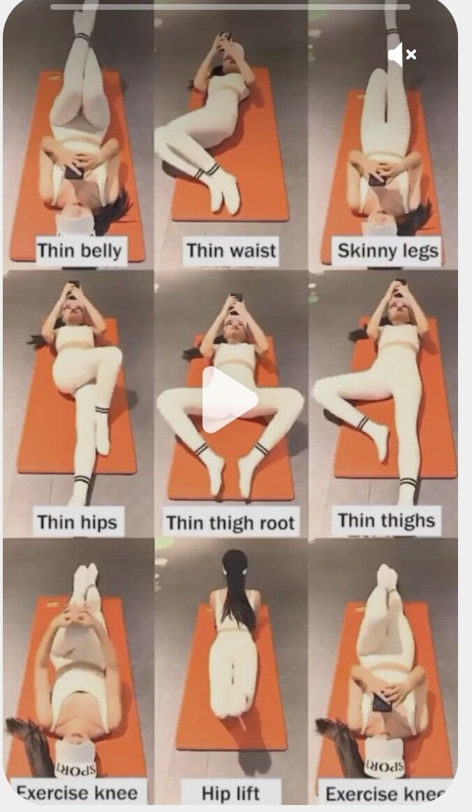
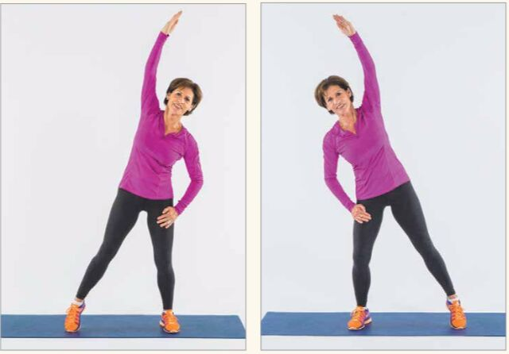
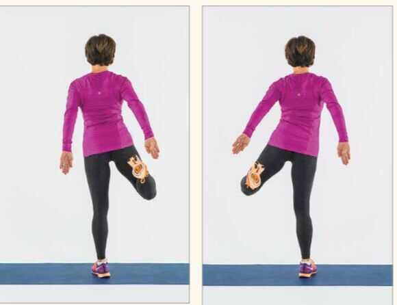
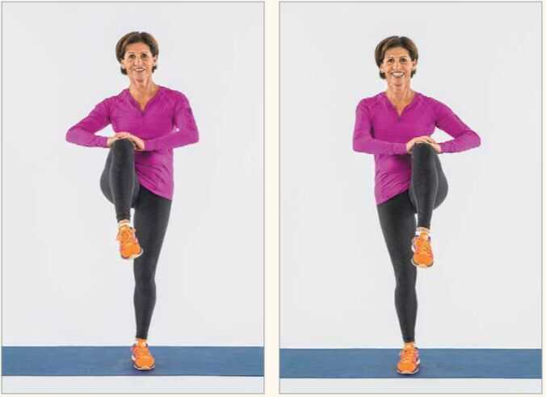

# Home Exercise Routine

## Fast Routine

- Treadmill - 12 Km/h - 1.2 KM - 6 Mins
- Weight Trainings
	- Dumbell Bench Press
	- Biceps Curl
	- Overhead press (Shoulders)

## Routines

Youtube - Athlean X

https://in.pinterest.com/pin/thin-body-workout--801077852487590084

1. Shoulder rolls - from back, start small movements to large movements

    

2. Overhead reach - Reaching side to side

    

3. Torso rotation with a reach - lift your toes so you don't twist your back

    

4. Hamstring curls with arms

    

5. Knee lifts

    

6. Surya Namaskar - 3 rounds
7. Hand rolls
8. Neck rolls
9. Folded hand rolls
10. Ankle rolls
11. Tad asana (Hands stretching)
12. Squats with hands
13. Pushups - 34
14. Squat jumps
15. Jumping jack
16. Plank jacks
17. Mountain climbers
18. Squat with side leg lift
19. Up and down plank
20. Straight leg kickback left/right
21. Side plank leg pull right/left

## Youtube / Links

Neti - Baking soda, 1 tea spoon of salt, 1/2 litre boiled water

[20 MIN FULL BODY WORKOUT // No Equipment | Pamela Reif - YouTube](https://www.youtube.com/watch?v=UBMk30rjy0o&ab_channel=PamelaReif)

[20 Minute Heart-Pumping Cardio Workout - No Equipment With Warm-Up & Cool-Down | SELF](http://youtube.com/watch?v=vncKnAPhgtg&ab_channel=SELF)

[Shankha Prakshalana - Laghu Shankha Prakshalana: Method, Benefits](https://www.easyayurveda.com/2018/01/16/laghu-shankha-prakshalana/)

[Safety and usefulness of Laghu shankha prakshalana in patients with essential hypertension: A self controlled clinical study - PMC](https://www.ncbi.nlm.nih.gov/pmc/articles/PMC4296435/)

[Movement Expert: Ideal Workouts From 0 to 70+ - YouTube](https://www.youtube.com/watch?v=CL_mkrcNEKE&ab_channel=BryanJohnson)
