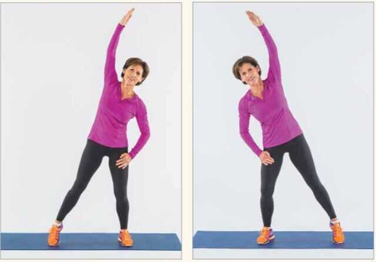
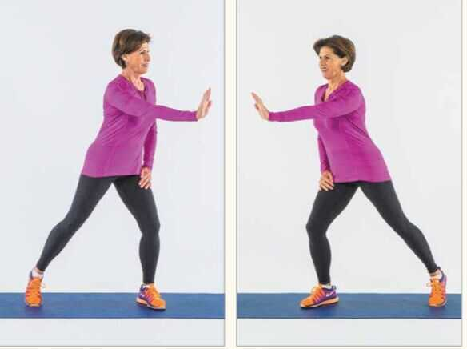

# Home Exercise Routine

Youtube - Athlean X

<https://in.pinterest.com/pin/thin-body-workout--801077852487590084>

1. Shoulder rolls - from back, start small movements to large movements

2. Overhead reach - Reaching side to side

3. Torso rotation with a reach - lift your toes so you don't twist your back

4. Hamstring curls with arms

5. Knee lifts

6. Surya Namaskar - 3 rounds

7. Hand rolls

8. Neck rolls

9. Folded hand rolls

10. Ankle rolls

11. Tad asana (Hands stretching)

12. Squats with hands

13. Pushups - 34

14. Squat jumps

15. Jumping jack

16. Plank jacks

17. Mountain climbers

18. Squat with side leg lift

19. Up and down plank

20. Straight leg kickback left/right

21. Side plank leg pull right/left

## Youtube

<https://www.youtube.com/watch?v=UBMk30rjy0o&ab_channel=PamelaReif>

[20 Minute Heart-Pumping Cardio Workout - No Equipment With Warm-Up & Cool-Down | SELF](http://youtube.com/watch?v=vncKnAPhgtg&ab_channel=SELF)
