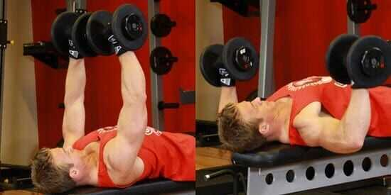
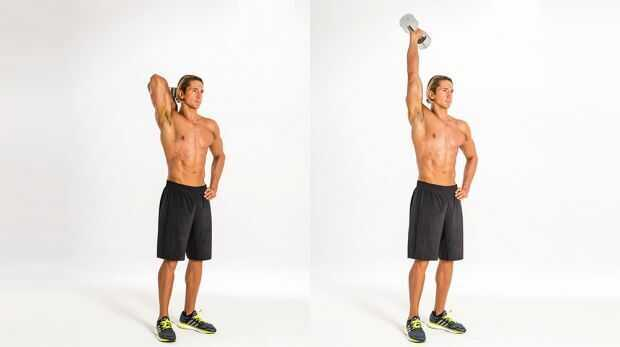
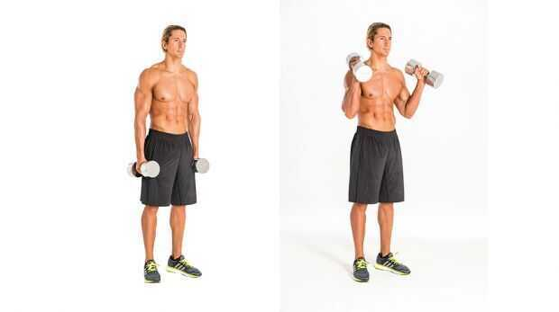
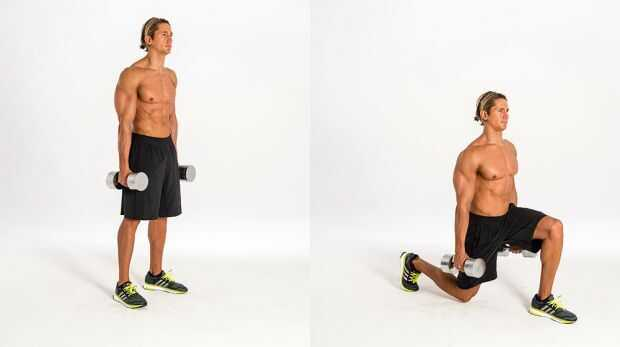
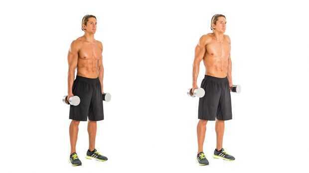
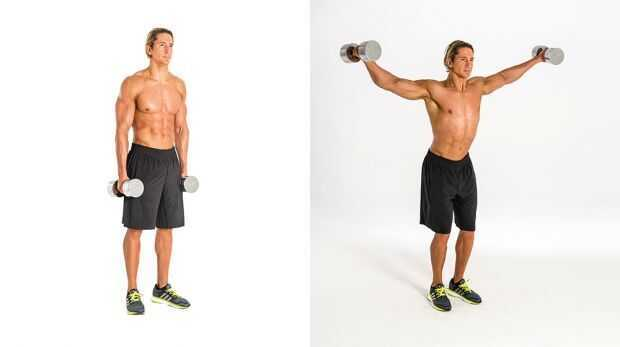
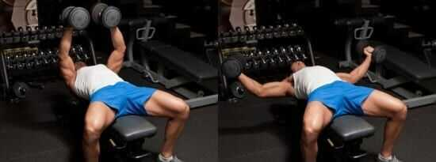
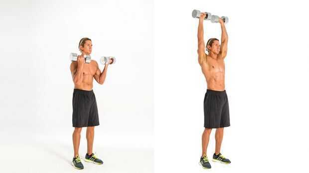
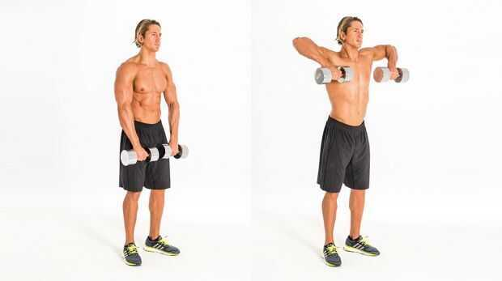

# Home + Gym

### Gym

- More equipments
- More motivation (not a big factor)
- Moving difficult (not a big factor)
- More types of exercise (zumba/dance/boxing and all)
- Time waste

### Home Gym

- Less equipments
- Cannot make real body without equipments
- Can be healthy without spending too much time
- More focus on other things
- Save time
- Overall will save money
- Can exercise when you don't have time too
- Will recover money in 4-5 years
- No Covid and lockdown tension

## What do you want to do? Make body or stay fit? (will not be able to make body)

- **Can do both too**

1. Add all exercise photos to exercises
2. Create only weekly things here

## Sets 4 Reps 10 Rest 60 sec Tempo 2010

1. Monday (Focus Chest + Triceps)

   - Treadmill - 15 mins

   - Dumbbell Bench Press

   

   - Dumbell pull overs

   

   - Triceps Extension

   

   - Standing Triceps over head dumbbell

   - Pushups

2. Tuesday (Focus Back + Biceps)

   - Treadmill - 15 mins

   - Hammer

   

   - Reverse Fly

   

   - Dumbbell Row

   

   - Bicep curl

   

3. Wednesday (Focus Shoulders & Legs & Abs)

   - Treadmill - 15 mins

   - Overhead press

   

   - Squat

   

   - Lunge

   

   - Shrug

   

   - Front raise

   

   - Lateral raise

   

   - Abs

   - Plank

   - situps

4. Thursday (Focus Triceps + Chest)

   - Treadmill - 15 mins

5. Friday (Focus Biceps + Back)

   - Treadmill - 15 mins

6. Saturday (Focus Legs + Shoulders)

   - Treadmill - 15 mins

7. Sunday (Cardio + Abs)

   - Treadmill - 30-45 mins (Endurance)

   - Dumbbell Crunch

- Plank

<https://www.coachmag.co.uk/workouts/abs-workouts>

<https://www.coachmag.co.uk/fitness/workouts/dumbbell-workouts>

<https://www.myprotein.co.in/blog/training/chest-day-101-top-5-dumbbell-exercises>

- Dumbbell Flyes

## Workout 2: Arms (Week 1)

## 2B [Triceps kick-back](https://www.coachmag.co.uk/tricep-exercises/6913/how-to-do-the-triceps-kick-back)

Sets4Reps10 each sideRest60secTempo2010

## 3A [Spider curl](https://www.coachmag.co.uk/biceps-exercises/8357/how-to-do-the-spider-curl)

Sets4Reps10Rest0secTempo2010

## 3B Narrow dumbbell press-up

Sets4Reps10Rest60secTempo2010

Renegade Row

Week 2

| Exercise                    | Sets | Reps         | Rest  | Tempo |
|-----------------------------|------|--------------|-------|-------|
| 1A Biceps curl              | 4    | 12           | 0sec  | 2010  |
| 1B Triceps extension        | 4    | 12 each side | 60sec | 2010  |
| 2A Hammer curl              | 4    | 12           | 0sec  | 2010  |
| 2B Triceps kick-back        | 4    | 12 each side | 60sec | 2010  |
| 3A Spider curl              | 4    | 12           | 0sec  | 2010  |
| 3B Narrow dumbbell press-up | 4    | 12           | 60sec | 2010  |

Week 3

| Exercise                    | Sets | Reps         | Rest  | Tempo |
|-----------------------------|------|--------------|-------|-------|
| 1A Biceps curl              | 5    | 10           | 0sec  | 2011  |
| 1B Triceps extension        | 5    | 10 each side | 60sec | 2011  |
| 2A Hammer curl              | 5    | 10           | 0sec  | 2011  |
| 2B Triceps kick-back        | 5    | 10 each side | 60sec | 2011  |
| 3A Spider curl              | 5    | 10           | 0sec  | 2011  |
| 3B Narrow dumbbell press-up | 5    | 10           | 60sec | 2010  |

Week 4

| Exercise                    | Sets | Reps         | Rest  | Tempo |
|-----------------------------|------|--------------|-------|-------|
| 1A Biceps curl              | 5    | 12           | 0sec  | 2011  |
| 1B Triceps extension        | 5    | 12 each side | 60sec | 2011  |
| 2A Hammer curl              | 5    | 12           | 0sec  | 2011  |
| 2B Triceps kick-back        | 5    | 12 each side | 60sec | 2011  |
| 3A Spider curl              | 5    | 12           | 0sec  | 2011  |
| 3B Narrow dumbbell press-up | 5    | 12           | 60sec | 2010  |

## Workout 3: Legs And Abs (Week 1)

## 1B [Woodchop](https://www.coachmag.co.uk/exercises/full-body-workouts/212/woodchop)

Sets4Reps10 each sideRest60secTempo2010

## 2B Halo

Sets4Reps10 each sideRest60secTempo2010

## 3A [Goblet squat](https://www.coachmag.co.uk/leg-exercises/3379/how-to-master-the-goblet-squat)

Sets4Reps10Rest0secTempo2010

## Workout 4: Shoulders (Week 1)

## 2A [Arnold press](https://www.coachmag.co.uk/exercises/arm-exercises/2987/6-standing-dumb-bell-curl-arnold-press)

Sets4Reps10Rest0secTempo2010

## 2B [Upright row](https://www.coachmag.co.uk/back-exercises/6699/how-to-do-the-upright-row)

Sets4Reps10Rest60secTempo2010
