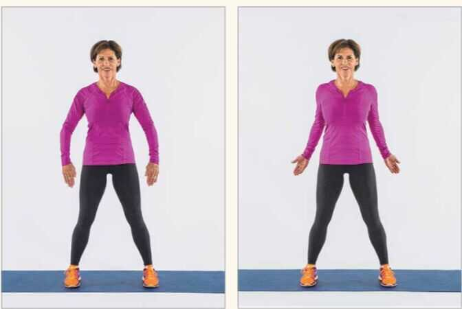
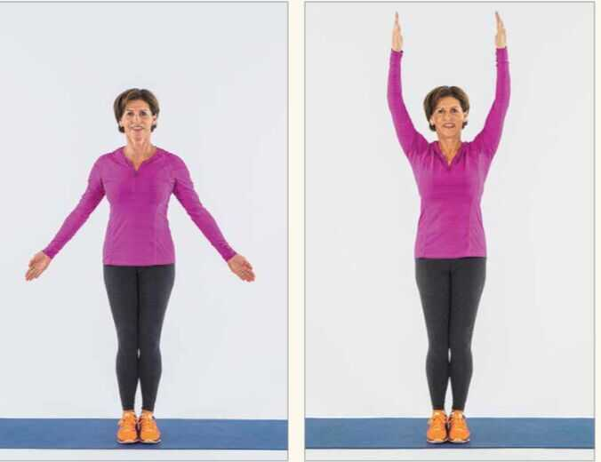

# Exercise / Stretching

Your entire life happens inside your body. It's the one home you will always occupy and can never sell.

But you can renovate it.

If you can only pick one habit to build, exercise might be the one. Everything is downstream from how your body is functioning.

## Tips

Don't sit for long stretches of hour in each position

## Types of Exercise

1. Aerobic

    Aerobic and cardio are synonymous. This type of exercise involves moving major muscle groups continuously to elevate your heart rate and induce a sweat. Aerobic activity can be low-intensity, like a brisk walk, or swimming; or it can be high intensity like running, rowing, playing a sport such as tennis, etc.

2. Anaerobic

    Strength training using resistance or weights is the primary anaerobic activity as it doesn't require the same oxygen inputs; hence the word "anaerobic," which means without oxygen. This type of exercise strengthens and tones muscles while also improving coordination and balance. Examples of anaerobic activities include weight lifting, push-ups, pull-ups, plyometric training and HIIT (high-intensity interval training).

3. Flexibility

    Stretching is a type of flexibility exercise that keeps your muscles relaxed and able to move freely. Without stretching either before or after a workout, you're more prone to injuries like tears and pulls.[Yoga](https://www.sleepadvisor.org/yoga-for-sleep/) is also a fantastic activity for flexibility.

<https://www.sleepadvisor.org/sleep-after-workout>

## Dynamic stretches - ones that incorporate movement and take joints through their full range of motion

## Static stretches - Stretches that you hold for extended periods of time

- Active static stretch - the muscle being stretched does the work of holding the position.
- Passive static stretch - depends on gravity or a prop - like a partner, barre, strap, or elastic band - to hold the muscle that is being stretched in place.

### Ballistic stretches

Many people try to go deeper into a stretch by adopt- ing a stretch position, then bouncing to quickly extend muscle length and range of motion. Stretches like these are called ballistic stretches. Ballistic stretches trigger the stretch reflex - resistance prompted by specialized nerves, forcing a lengthening muscle to contract

### Proprioceptive neuromuscular facilitation

PNF takes a two-step approach. It starts with iso- metric contraction of the opposing muscle, followed by a passive static stretch of the target muscle applied by a partner who focuses on moving a joint through its range of motion. (To do an isometric contraction, you press against an immovable object, like a partner, so that the muscle activates without lengthening or shortening.)

## Stretching

You should not do static stretches (in which you adopt and hold a position) before you exercise. Rather, you should do these when your muscles are warmed up - say, after 10 minutes on the treadmill or with a type of warm-up called dynamic stretching that increases the flow of blood and oxygen to muscles. Surprisingly, rather than readying muscles for sports, static stretches do not improve athletic performance, but can actually undercut strength and power, possibly by affecting the ability of the muscle to store and swiftly release energy. Dynamic stretches are a better choice.

## How a Strech work

Imagine that you could examine skeletal muscle as if peering through a microscope at increasing levels of magnification. First, you'd notice strands of tissue cre- ated by bundles of cells known as muscle fibers). A single muscle fiber comprises similarly bundled filaments called myofibrils. Myofibrils can contract, relax, and lengthen. Each myofibril is built from tinier units called sarcomeres, which in turn are made up of overlapping thin and thick myofilaments.

Every move you make begins when lightning-quick electrical signals skip down nerve pathways to a muscle and flip a cellular switch that releases calcium, signaling a particular muscle or group of muscles to contract. This prompts myofilaments to glide across each other, forcefully shortening sarcomeres.

So, just what happens when you deliberately try to stretch a muscle? Sarcomeres lengthen, creating less overlap in those sliding myofilaments. This allows some muscle fibers to lengthen, too. When sarcomeres reach their limits, the tension on the muscle is trans- mitted to the tendon, which elongates, also.

- **delayed onset muscle soreness - 24 to 48 hours after a workout**

## Pre-workout stretching

1. 5 round surya namaskar

2. Tad asana

3. Arm and neck rotation

4. Lunges

5. Pushups

## Harvard Stretching

1. Shoulder rolls - from back, start small movements to large movements

2. Overhead reach - Reaching side to side

3. Torso rotation with a reach - lift your toes so you don't twist your back

4. Hamstring curls - No arm movement

5. Add arms to hamstring curl

6. Shallow side lunges

7. Knee lifts

8. Arm sweeps - Cool down with four arm sweeps

## Pre-running streching

1. Walking lunge
2. Side to side lunges
3. Knee pull
4. Hip bridge
5. Trunk rotation
6. Calf raise
7. Ankling rotation
8. Standing quad stretch
9. Light jog / Hip flexor warm up / Bike kick

<https://www.healthline.com/health/fitness-exercise/essential-runner-stretches>

<https://www.runnersworld.com/health-injuries/a20809473/five-exercises-to-do-before-every-run>

## Post workout cooldown

1. Child's pose (balasana)

## Morning exercise

1. Daily walking
2. Deadlifts strength training - minimum 2 times of week
3. Box jumps
4. Proprioception - single leg standing, slack line walking
5. HIIT - BDNF (brain derived neurotrophic factor) - high intensity interval training

## Others

[Cold-Water Immersion and Cryotherapy: Neuroendocrine and Fat Browning Effects](https://www.youtube.com/watch?v=XaLd5w6zF7A)

[No.1 Heart Surgeon: Cardio Is A Waste Of Time For Weight Loss! Philip Ovadia | E240 - YouTube](https://www.youtube.com/watch?v=V7a8X8AB8yU)

[Exercise Makes You Smarter - This Is Why (animated) - YouTube](https://www.youtube.com/watch?v=D4UKd1iOUeo)
