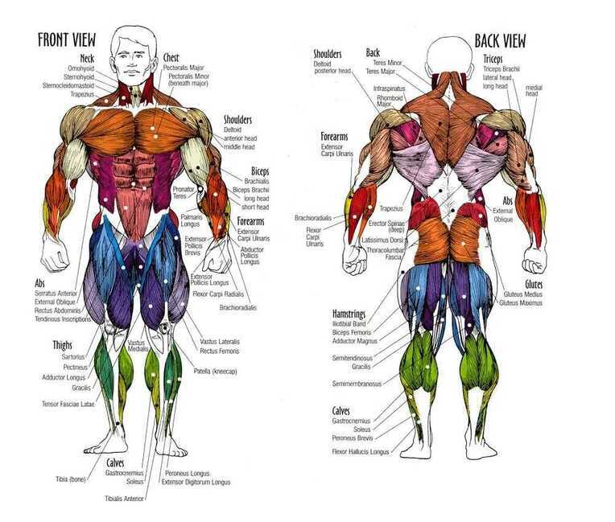

# Muscles

## Muscles

- **Joints** are the junctions that link bones together. The architecture of each joint - whether it acts as a hinge, pivot, or ball-in-socket - helps dictate the directions of movement allowed.
- **Tendons** are flexible cords of strong tissue that tether muscles to bones. The Achilles' tendon, a thick cord that fastens the two calf muscles to the heel bone, is one well-known example.
- **Ligaments** are tough, fibrous bands of tissue that bind bone to bone, or bone to cartilage, at a joint, allowing a safe range of movement. An example is the anterior cruciate ligament (ACL), one of five ligaments that collectively control knee movements. The ACL is responsible for keeping the knee joint from rotating too far or allowing your shin to move out in front of your thigh. As many sports enthusi- asts know, some to their sorrow, the ACL is often injured in sports like soccer and skiing that demand forceful actions involving quick stops or turns.

[What actually ARE muscle cramps? - YouTube](https://www.youtube.com/watch?v=WsWPI18RmVU)

[Deltoid muscle - Wikipedia](https://en.wikipedia.org/wiki/Deltoid_muscle)

[Brachialis muscle - Wikipedia](https://en.wikipedia.org/wiki/Brachialis_muscle)
