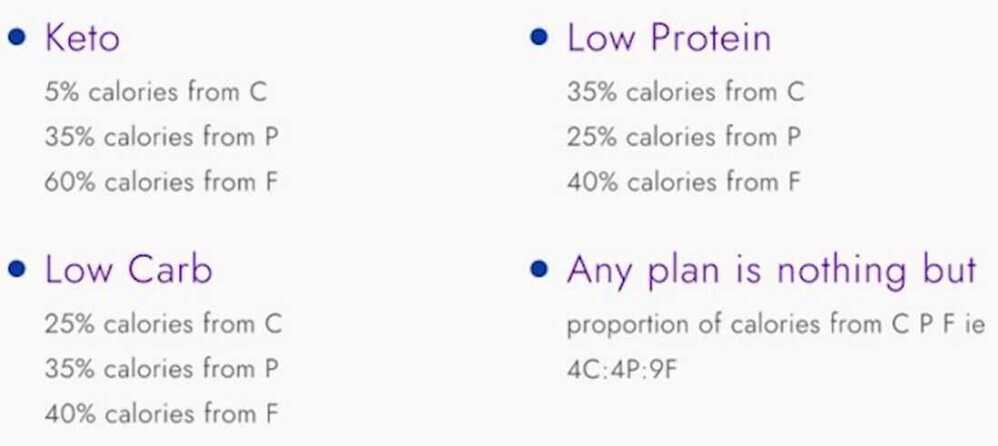

# Daily Requirements

## Macronutrients

- **Providing energy (Carbs, Protein, Fats)**
    - Carbohydrates (pasta, rice, cereals, breads, potatoes, milk, fruit, sugar)
        - [Glucose](https://en.wikipedia.org/wiki/Glucose)
        - [Sucrose](https://en.wikipedia.org/wiki/Sucrose)
        - [Ribose](https://en.wikipedia.org/wiki/Ribose)
        - [Amylose](https://en.wikipedia.org/wiki/Amylose) a major component of [starch](https://en.wikipedia.org/wiki/Starch)
        - [Amylopectin](https://en.wikipedia.org/wiki/Amylopectin)
        - [Maltose](https://en.wikipedia.org/wiki/Maltose)
        - [Galactose](https://en.wikipedia.org/wiki/Galactose)
        - [Fructose](https://en.wikipedia.org/wiki/Fructose)
        - [Lactose](https://en.wikipedia.org/wiki/Lactose)

- Protein (meat, dairy, legumes, nuts, seafood and eggs)

[**Amino acids**](https://en.wikipedia.org/wiki/Amino_acids)

- Standard amino acids
    - [Alanine](https://en.wikipedia.org/wiki/Alanine)
    - [Arginine](https://en.wikipedia.org/wiki/Arginine)
    - [Aspartic acid (aspartate)](https://en.wikipedia.org/wiki/Aspartic_acid)
    - [Asparagine](https://en.wikipedia.org/wiki/Asparagine)
    - [Cysteine](https://en.wikipedia.org/wiki/Cysteine)
    - [Glutamic acid (glutamate)](https://en.wikipedia.org/wiki/Glutamic_acid)
    - [Glutamine](https://en.wikipedia.org/wiki/Glutamine)
    - [Glycine](https://en.wikipedia.org/wiki/Glycine)
    - [Histidine](https://en.wikipedia.org/wiki/Histidine)
    - [Isoleucine](https://en.wikipedia.org/wiki/Isoleucine)(branched chain amino acid)
    - [Leucine](https://en.wikipedia.org/wiki/Leucine)(branched chain amino acid)
    - [Lysine](https://en.wikipedia.org/wiki/Lysine)
    - [Methionine](https://en.wikipedia.org/wiki/Methionine)
    - [Phenylalanine](https://en.wikipedia.org/wiki/Phenylalanine)
    - [Proline](https://en.wikipedia.org/wiki/Proline)
    - [Serine](https://en.wikipedia.org/wiki/Serine)
    - [Threonine](https://en.wikipedia.org/wiki/Threonine)
    - [Tryptophan](https://en.wikipedia.org/wiki/Tryptophan)
    - [Tyrosine](https://en.wikipedia.org/wiki/Tyrosine)
    - [Valine](https://en.wikipedia.org/wiki/Valine)(branched chain amino acid)

- Fats / lipids (oils, butter, margarine, nuts, seeds, avocados and olives, meat and seafood)

[**Saturated fats**](https://en.wikipedia.org/wiki/Saturated_fats)

- [Butyric acid](https://en.wikipedia.org/wiki/Butyric_acid)(C4)
- [Caproic acid](https://en.wikipedia.org/wiki/Caproic_acid)(C6)
- [Caprylic acid](https://en.wikipedia.org/wiki/Caprylic_acid)(C8)
- [Capric acid](https://en.wikipedia.org/wiki/Capric_acid)(C10)
- [Lauric acid](https://en.wikipedia.org/wiki/Lauric_acid)(C12)
- [Myristic acid](https://en.wikipedia.org/wiki/Myristic_acid)(C14)
- [Pentadecanoic acid](https://en.wikipedia.org/wiki/Pentadecanoic_acid)(C15)
- [Palmitic acid](https://en.wikipedia.org/wiki/Palmitic_acid)(C16)
- [Margaric acid](https://en.wikipedia.org/wiki/Margaric_acid)(C17)
- [Stearic acid](https://en.wikipedia.org/wiki/Stearic_acid)(C18)
- [Arachidic acid](https://en.wikipedia.org/wiki/Arachidic_acid)(C20)
- [Behenic acid](https://en.wikipedia.org/wiki/Behenic_acid)(C22)
- [Lignoceric acid](https://en.wikipedia.org/wiki/Lignoceric_acid)(C24)
- [Cerotic acid](https://en.wikipedia.org/wiki/Cerotic_acid)(C26)

[**Monounsaturated fats**](https://en.wikipedia.org/wiki/Monounsaturated_fats)

- [Myristol](https://en.wikipedia.org/wiki/Myristol)
- [Pentadecenoic](https://en.wikipedia.org/wiki/Pentadecenoic)
- [Palmitoyl](https://en.wikipedia.org/wiki/Palmitoyl)
- [Heptadecenoic](https://en.wikipedia.org/wiki/Heptadecenoic)
- [Oleic acid](https://en.wikipedia.org/wiki/Oleic_acid)
- [Eicosen](https://en.wikipedia.org/wiki/Eicosen)
- [Erucic acid](https://en.wikipedia.org/wiki/Erucic_acid)
- [Nervonic acid](https://en.wikipedia.org/wiki/Nervonic_acid)

[**Polyunsaturated fats**](https://en.wikipedia.org/wiki/Polyunsaturated_fats)

- [Linoleic acid](https://en.wikipedia.org/wiki/Linoleic_acid)(LA) - an [essential fatty acid](https://en.wikipedia.org/wiki/Essential_fatty_acid)
- [α-Linolenic acid](https://en.wikipedia.org/wiki/%CE%91-Linolenic_acid)(ALA) - an essential fatty acid
- [Stearidonic acid](https://en.wikipedia.org/wiki/Stearidonic_acid)(SDA)
- [Arachidonic acid](https://en.wikipedia.org/wiki/Arachidonic_acid)(ETA)
- [Timnodonic acid](https://en.wikipedia.org/wiki/Timnodonic_acid)(EPA)
- [Clupanodonic acid](https://en.wikipedia.org/wiki/Clupanodonic_acid)(DPA)
- [Cervonic acid](https://en.wikipedia.org/wiki/Cervonic_acid)(DHA)

[**Essential fatty acids**](https://en.wikipedia.org/wiki/Essential_fatty_acids)

These 2 essential fatty acids are the starting point for other important omega-acids (e.g. DHA, EPA)

- [α-Linolenic acid](https://en.wikipedia.org/wiki/%CE%91-Linolenic_acid) ALA (18:3)[Omega-3 fatty acid](https://en.wikipedia.org/wiki/Omega-3_fatty_acid)
- [Linoleic acid](https://en.wikipedia.org/wiki/Linoleic_acid) LA (18:2)[Omega-6 fatty acid](https://en.wikipedia.org/wiki/Omega-6_fatty_acid)

- **Not providing energy**
    - Water
    - Fiber

## Dietary fiber or roughage is the portion of plant-derived food that cannot be completely broken down by [digestive enzymes](https://en.wikipedia.org/wiki/Digestive_enzyme).It has two main components

- Soluble fiber -- which dissolves in water -- is readily fermented in the [colon](https://en.wikipedia.org/wiki/Colon_(anatomy)) into gases and physiologically active [by-products](https://en.wikipedia.org/wiki/By-product), such as [short-chain fatty acids](https://en.wikipedia.org/wiki/Short-chain_fatty_acid) produced in the [colon](https://en.wikipedia.org/wiki/Colon_(anatomy)) by [gut bacteria](https://en.wikipedia.org/wiki/Gut_flora); it is [viscous](https://en.wikipedia.org/wiki/Viscous), may be called [prebiotic](https://en.wikipedia.org/wiki/Prebiotic_(nutrition)) fiber, and delays [gastric emptying](https://en.wikipedia.org/wiki/Stomach#Function) which, in humans, can result in an extended feeling of fullness.
- Insoluble fiber -- which does not dissolve in water -- is inert to digestive enzymes in the upper [gastrointestinal tract](https://en.wikipedia.org/wiki/Gastrointestinal_tract) and provides bulking.Some forms of insoluble fiber, such as [resistant starches](https://en.wikipedia.org/wiki/Resistant_starch), can be fermented in the colon.Bulking fibers absorb water as they move through the [digestive system](https://en.wikipedia.org/wiki/Digestive_system), easing [defecation](https://en.wikipedia.org/wiki/Defecation).

- Antioxidants

## Micronutrients

- **Minerals**
    - Calcium
    - Chlorine
    - Magnesium
    - Phosphorus
    - Potassium
    - Sodium - 2300 mg, Salt - 6 gm/day - 1 teaspoon/day

- Milk and dairy products are a good source of calcium and magnesium
- Red meat is a good source of iron and zinc
- Seafood and vegetables (depending on the soil in which they are produced) are generally good sources of iodine

- **Trace minerals**
    - [Boron](https://en.wikipedia.org/wiki/Boron)
    - [Cobalt](https://en.wikipedia.org/wiki/Cobalt)
    - [Chromium](https://en.wikipedia.org/wiki/Chromium)
    - [Copper](https://en.wikipedia.org/wiki/Copper_in_health)
    - [Iodine](https://en.wikipedia.org/wiki/Iodine)
    - [Iron](https://en.wikipedia.org/wiki/Iron)
    - [Manganese](https://en.wikipedia.org/wiki/Manganese)
    - [Molybdenum](https://en.wikipedia.org/wiki/Molybdenum)
    - [Selenium](https://en.wikipedia.org/wiki/Selenium)
    - [Zinc](https://en.wikipedia.org/wiki/Zinc)

- **Vitamins**
    - [Vitamin B complex](https://en.wikipedia.org/wiki/Vitamin_B_complex)
        - [Vitamin B1(thiamin)](https://en.wikipedia.org/wiki/Vitamin_B1)
        - [Vitamin B2(riboflavin)](https://en.wikipedia.org/wiki/Vitamin_B2)
        - [Vitamin B3(niacin)](https://en.wikipedia.org/wiki/Vitamin_B3)
        - [Vitamin B5(pantothenic acid)](https://en.wikipedia.org/wiki/Vitamin_B5)
        - [Vitamin B6group](https://en.wikipedia.org/wiki/Vitamin_B6):
            - Pyridoxine
            - Pyridoxal-5-Phosphate
            - Pyridoxamine
        - [Vitamin B7(biotin)](https://en.wikipedia.org/wiki/Biotin)
        - [Vitamin B8(ergadenylic acid)](https://en.wikipedia.org/wiki/Ergadenylic_acid)
        - [Vitamin B9(folic acid)](https://en.wikipedia.org/wiki/Folic_acid)
        - [Vitamin B12(cyanocobalamin)](https://en.wikipedia.org/wiki/Vitamin_B12)
        - [Choline](https://en.wikipedia.org/wiki/Choline)
    - [Vitamin A (e.g. retinol (see also - provitamin A carotenoids))](https://en.wikipedia.org/wiki/Vitamin_A)
    - [Vitamin C (Ascorbic acid)](https://en.wikipedia.org/wiki/Vitamin_C)
    - [Vitamin D](https://en.wikipedia.org/wiki/Vitamin_D)
        - [Ergocalciferol](https://en.wikipedia.org/wiki/Ergocalciferol)
        - [Cholecalciferol](https://en.wikipedia.org/wiki/Cholecalciferol)
    - [Vitamin E (tocopherol)](https://en.wikipedia.org/wiki/Vitamin_E)
    - [Vitamin K](https://en.wikipedia.org/wiki/Vitamin_K)
        - [Phylloquinone](https://en.wikipedia.org/wiki/Phylloquinone)
        - [Menaquinone complices](https://en.wikipedia.org/w/index.php?title=Menaquinone_complices&action=edit&redlink=1)
    - [Carotenoids](https://en.wikipedia.org/wiki/Carotenoid)
        - [Alpha carotene](https://en.wikipedia.org/wiki/Alpha_carotene)
        - [Beta carotene](https://en.wikipedia.org/wiki/Beta_carotene)
        - [Cryptoxanthin](https://en.wikipedia.org/wiki/Cryptoxanthin)
        - [Lutein](https://en.wikipedia.org/wiki/Lutein)
        - [Lycopene](https://en.wikipedia.org/wiki/Lycopene)
        - [Zeaxanthin](https://en.wikipedia.org/wiki/Zeaxanthin)

- Fruits and vegetables are generally good sources of Vitamin C and A and folic acid (a B group vitamin)
- Grains and cereals are generally good sources of the B group vitamins and fibre
- Full-fat dairy and egg yolks are generally sources of the fat soluble vitamins A, D and E
- Milk and vegetable or soya bean oil are generally good sources of vitamin K, which can also be synthesised by gut bacteria

## References

https://en.wikipedia.org/wiki/List_of_macronutrients

https://en.wikipedia.org/wiki/List_of_micronutrients

https://en.wikipedia.org/wiki/Dietary_fiber
