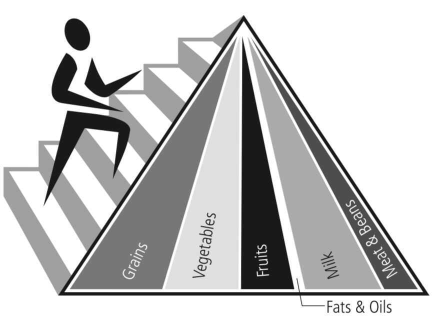
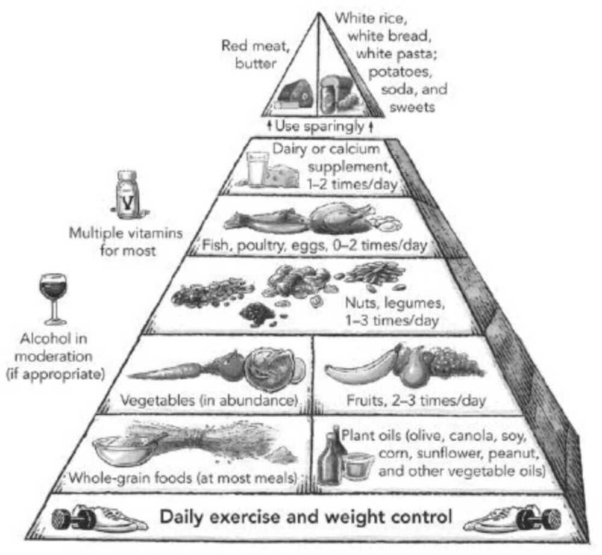

# Food

The way you eat not only decides your physical health, but the very way you think, feel, and experience life. -- Sadhguru

Only eat till you are 80% full

Zero Oil Cooking

[The truth about caffeine: how coffee really affects our bodies | Coffee | The Guardian](https://www.theguardian.com/food/2023/feb/15/the-truth-about-caffeine-how-coffee-really-affects-our-bodies)

**Important controls - Salt, Sugar, Oil**

## Tips

- Front-loading your eating and eating only while the sun's up are great ways to be healthier
- Stack your meals so that three quarters (or more) of what you eat comes before 2 p.m., the rest between then and sundown
- Eating dinner for breakfast and keeping your eating consistent add up to a better diet
- Your gut wall can be strenghened by a pair of pheonomena called **hormesis and autophagy**
    - Hormesis - beneficial ways in which your body responds to low amounts of stress, the source of which is known as a hormetic stressor
    - Autophagy - self devouring
- To benefit from hormesis and autophagy, seek out polyphenols and moderate amounts of alcohol and exercise (moderate)
- To live a long and healthy life, make your bacteria hungry
    - Partial intermittent fasting (5 consecutive days per month, limit to consuming fewer than 900 calories per day)
    - mitogenesis - mitochondria reproduction
- Food Tips
    - One carrot a day provides all the vitamin A for a day that body needs
    - Folate (Vitamin B9) during pregnency
    - Kidney - Drink a lot of water during the day; drink less water at night; empty your bladder before going to bed
        - [ChatGPT - Kidney efficiency and water intake](https://chatgpt.com/share/67d9615e-2068-8005-85cd-6c8d534f8a5e)
    - Pancreas - Avoid overfeeding

Recommended Calorie intake - 2800

[ChatGPT - Small vs Large Portions](https://chatgpt.com/share/67b90f46-d394-8005-a1aa-5928a922ffb8)

## Good foods

1. Almonds (Brain)
2. Eggs (Brain)
      - Egg Yolk - Vitamin D
     - https://blog.bigbasket.com/2021/06/26/eggs-the-best-superfoods-for-everyone
3. Bananas (Brain)
4. Walnuts / pistachios / Almonds (Brain)
5. Broccoli (Brain, boosts cancer-fighting defence system)
6. Fish/seafood
   - Fatty Fish (men who ate fish at least once a month were 43% less likely to have ischemic strokes compared with men who never ate fish like tuna)
   - Salmon (Brain)
7. Nimbu pani
8. Curd
9. Milk (low-fat or fat-free milk / skim-milk) / ButterMilk / Tea / Coffee
10. Sprouts
11. Lettuce - Vitamin A, B6, B9, K
12. Chicken - Vitamin B1, B2, B3, B5, B6, B12
13. Tomato - Vitamin C
14. Cucumber - Vitamin K
15. Kale - Karam Saag
16. Blueberries
17. Oats (carbs, fiber, beta-glucan)
18. Chocolate - cocoa (high-flavanol cocoa drink twic a day) (boost ability to repair and regenerate)
19. **Sweet Potatos**
20. Spinach
21. Flexseeds, chia seeds, pumpkin seeds (rich in omega-3, decrease fatigue)
22. Turmeric
23. **Extra virgin Olive oil**
24. Coconut water
25. Soy Foods (boosts cancer-fighting defence system, 10 grams of soy protein daily) - contain genistein, a potent cancer-fighting substance that suppresses the blood vessels that feed nutrients to tumors.
26. **Pomegranate/Juice (keep anemia away, rich in iron)**
27. Parmigiano-Reggiano cheese
28. White button Mushroom
29. Berry Juice (cherries, red grapes, blackcurrants, blackberries and chokeberries)
30. Beer (xanthohumol, anti-cancer properties)

## Normal foods

1. Ghee in limited quantity

## Bad foods

1. Eggplant (inhibit absorption of calcium)
2. Red meet (beef/pork) - Stop all non veg
3. Ice cream, whole milk and cheese (The healthiest milk and milk products are low-fat versions, such as skim milk, milk with 1% fat, and reduced-fat cheeses)
4. Pastries (cookies, pie, crois- sants, tarts, cake, and Danish)
5. Doughnuts
6. **Sugar**
7. **Salt** - Sodium chloride can be replaced by potassium chloride (Tata Salt Superlite - 30% less sodium)
8. Muffins, croissants, crackers, bagels, and other baked goods made with white flour
9. **Butter**
10. **Palm oil**
11. Soft drinks  - Juices
12. Alcohol / Tobacco, etc

## Supplements

1. creatine
2. beet juice
3. antioxidant multivitamins
4. Folic acid - Vitamin B9
    - Important for making red blood cells and thymine and cytosine (2 of the 4 bases that make up DNA)
    - Pregnant women need it the most
5. Melatonin
6. St John's Wort (flower)

### Nitin Kamath's Supplements

1. Vitamin D
2. Omega 3
3. Shilajit
4. Ashwagandha
5. Magnesium

## Pregnant / Pregnancies food

Soya ataa + wheat ataa ( 1kg to 8 kg )

## Facts

- Stem cells regenerate lungs every eight days, skin once a fortnight, small intestine almost every other day

Curd - lactobacillus - lactic acid bacteria

Yogurt - lactobacillus bulgaris and streptococcus thermophilus.

## Gain Weight Diet Plan

Keep 10 almonds soaked in water over-night and eat them as soon as you wake up the next morning. You must have a glass of banana shake during breakfast clubbed with either 1 bowl vegetable daliya or vegetable oats. You can substitute these with 2 slices of multigrain bread or 30g paneer, tofu or chicken breast.

- During mid-morning, have 1 whole fruit of your choice and drink 1 glass of lassi, coconut water or butter milk
- In lunch, you must have 2-3 chappati with 1 bowl vegetables and cottage cheese and curd
- During your snack time, have 1 glass banana shake again along with 2 biscuits, 1 bowl upma or 1 grilled sandwich
- Before dinner, don't forget to have 1 bowl chicken or vegetable soup
- In dinner, have 2-3 chappatis along with 1 bowl vegetable, 1 bowl dal, 1 bowl curd or sweet dish
- Before going off to sleep, have 1 glass of milk with a pinch of turmeric and 1 tablespoon honey in it

https://www.onlymyhealth.com/how-gain-weight-in-days-1326451658

## Eating patterns

[Should you skip timely meals and eat only when you are hungry?](https://indianexpress.com/article/lifestyle/food-wine/hunger-meal-food-time-dr-bm-hegde-nutrition-9272928/)

### Meal-eaters vs grazers

- Eating 3 meals of 800 calories will cause the same thermic effect as eating 6 meals of 400 calories. There is literally no difference.
- Multiple studies have compared eating many smaller versus fewer larger meals and concluded that there is no significant effect on either metabolic rate or the total amount of fat lost
- Fewer and larger meals lower your average daily blood sugar levels. Getting most of your calories in the morning and eating fewer in the afternoon and evening also seems to reduce average blood sugar levels.
- Skipping meals every now and then helps you lose weight and may improve your blood sugar control over time.

## Food Pyramid

- Grains: Make half your grain whole. Eat at least 3 oz. of whole grain cereals, breads, crackers, rice, or pasta every day

- Vegetables: Vary your vegetables. Eat more dark green veg- etables like broccoli and spinach. Eat more orange vegetables like carrots and sweet potatoes. Eat more dry beans and peas

- Fruits: Eat a variety of fruits. Choose fresh, frozen, canned, or dried fruit. Go easy on fruit juices, which have high sugar content without much fiber

- Milk: Eat calcium-rich foods. Choose low-fat or fat-free dairy products. If you don't drink milk or eat dairy products, choose lactose-free products or other calcium sources such as fortified foods and drinks

- Meat and beans: Eat lean proteins. Choose low-fat or lean cuts of meat and poultry. Bake, broil, or grill your meats. Eat more fish, beans, peas, nuts, and seeds

- Protein - 16% of your daily energy intake
- Fibre > 30 grams per day
- Free sugar < 5 per cent of your daily energy intake
- Meat - free days

[Data | How many Indians eat meat? - The Hindu](https://www.thehindu.com/data/data-how-many-indians-eat-meat/article65299234.ece) - 70% of India is non-veg

## Vegetables

- Daikon, White Radish - Mooli

https://www.healthline.com/nutrition/list-of-vegetables

Mushroom - White Truffle [Tuber magnatum - Wikipedia](https://en.wikipedia.org/wiki/Tuber_magnatum)

## Eight principles of low-glycemic eating

7. Eat a lot of non-starchy vegetables, beans, and fruits such as apples, pears, peaches, and berries. Even tropi- cal fruits like bananas, mangoes, and papayas tend to have a lower glycemic index than typical desserts

8. Eat grains in the least-processed state possible: "unbroken," such as whole-kernel bread, brown rice, and whole barley, millet, and wheat berries; or tra- ditionally processed, such as stone-ground bread, steel-cut oats, and natural granola or muesli breakfast cereals

9. Limit white potatoes and refined grain products such as white breads and white pasta to small side dishes.

10. Limit concentrated sweets - including high-calorie foods with a low glycemic index, such as ice cream - to occasional treats. Reduce fruit juice to no more than one cup a day. Completely eliminate sugar-sweetened drinks

11. Eat a healthful type of protein, such as beans, fish, or skinless chicken, at most meals

12. Choose healthful fats, such as olive oil, nuts (almonds, walnuts, pecans), and avocados. Limit saturated fats from dairy and other animal products. Completely eliminate partially hydrogenated fats (trans fats), which are in fast food and many packaged foods

13. Have three meals and one or two snacks each day, and don't skip breakfast

14. Eat slowly and stop when full

http://hrccatalog.hrrh.on.ca/InmagicGenie/DocumentFolder/healthy%20eating.pdf

[Fed Up 2014](https://www.youtube.com/watch?v=Y647tNm8nTI)

Smooth, bright, seedless, conveniently wrapped; the banana is the original fast food

## Milk

- Cow's Milk
    - Raw Milk / Whole Milk
    - Double toned milk
    - Toned milk
    - Skimmed milk
    - Pasteurized Milk
    - Homogenized Milk
- Almond Milk
- **Soy Milk (best for planet)**
- **Oat Milk (best for planet)**
- [Which type of milk is best for you? - Jonathan J. O’Sullivan & Grace E. Cunningham - YouTube](https://www.youtube.com/watch?v=s6TXDFp1EcM)
- [The truth about milk: According to science | Prof. Tim Spector and Dr Sarah Berry - YouTube](https://www.youtube.com/watch?v=6CPBeNPlcNc)
- [Difference between homogenized and pasteurized milk and which one is safe | The Times of India](https://timesofindia.indiatimes.com/life-style/food-news/difference-between-homogenized-and-pasteurized-milk-and-which-one-is-safe/photostory/89508297.cms?from=mdr)
- [Is A2 milk a marketing gimmick?](https://finshots.in/archive/is-a2-milk-a-marketing-gimmick-fssai-india-a1-a2-milk-exports-amul-nandini-gcmmf-kmf/)
- [Is A2 milk a cash-cow? - The Whole Truth](https://thewholetruthfoods.com/learn/truth-be-told/is-a2-milk-a-cash-cow)
- [7 Types of Milk for 7 Common Mom Problems – आज़माई हुई देसी ट्रिक्स!](https://youtu.be/r3OE1udxjNQ)
## Fruits

## Vitamins

They decide how our skin looks. How strong our bones are. How we fight infections. Whether we wake up happy or grumpy. Vitamins wield immense power over our bodies and minds. What’s more, Bigbasketeer, vitamin deficiencies can have some pretty serious consequences. Reason enough to take a closer look at them?

Vitamins are...

15. A group of compounds

    There are 13 vitamins in all: A, C, D, E, K, and the B-complex of 8 vitamins

16. Micronutrients

    We need them in tiny quantities (milli or micrograms). Unlike carbs/proteins, which are macronutrients.

17. Essential nutrients

    They’re not produced directly by our bodies but supplied from our food (with a few exceptions.)

#### Vitamin supplements: Good or Bad?

When it comes to vitamins, there is such a thing as too much. Every vitamin has a recommended daily intake and you can get this from a healthy, diverse diet. But if you’re eating fortified foods and taking supplements (often ordered online without checking dosage or composition), you may consume more than you need.

So, unless you have a diagnosed deficiency, get your vitamins from food. There is evidence that this has better health outcomes overall!

### Your guide to a vitamin-rich diet

#### Vitamin A

Important for

- Growth
- Immunity
- Skin & bone formation
- Reproductive health
- Eyesight

Get it from

- Orange/yellow produce (carrots, red capsicum, mango, papaya, pumpkin)
- Green leafy veggies
- Eggs

#### Vitamin B Complex

Important for

- Metabolism
- DNA synthesis
- Nervous system function
- RBC creation

Get it from

- Seafood, meat & poultry
- Eggs & dairy
- Legumes (beans, lentils)
- Green leafy veggies
- Beetroot

#### Vitamin C

Important for

- Collagen for skin & hair
- Immunity
- Antioxidant properties

Get it from

- Citrus fruits
- Kiwi & amla
- Potato & tomato
- Green leafies
- Cruciferous veggies (cabbage, gobi, broccoli)

#### Vitamin E

Important for

- Skin & hair
- Eyesight
- Antioxidant properties

Get it from

- Nuts and seeds such as almonds, sunflower seeds, and peanuts
- Egg yolks
- Whole grains
- Green leafy veggies

#### Vitamin K

Important for

- Bone health
- Blood clotting & wound healing

Get it from

- Green leafy vegetables
- Avocado
- Kiwi

Wondering what happened to vitamins B4, B8, B10, and B11? They got the boot! As scientists’ understanding of vitamins evolved, these were no longer regarded as vitamins. Reminds you of Pluto, huh?

#### Vitamin D

We saved it for the last because it’s kinda special! Vitamin D has many roles to play-blood pressure regulation, bone growth, calcium balance, hormone production, immune health, nervous system function etc.

Unlike the others, vitamin D can be produced by our bodies, provided our skin is exposed to adequate sunshine. Unfortunately, most of us don’t get enough time in the sun and hence, are D-deficient.

**Make Vit D while the sun shines**

Try to get 10-20 minutes of sunlight ideally before noon, 3-4 times a week. Darker skin needs more sun than lighter skin; so adjust your sun exposure based on your need.

##### Food

- fatty fish
- Egg Yolk
- fortified cereals
fortified milk and juices
yogurt
beef liver

[25-Hydroxy Vitamin D Test](https://www.healthline.com/health/25-hydroxy-vitamin-d-test)

[Vitamin D Deficiency: Symptoms, Treatments, and Causes](https://www.healthline.com/nutrition/vitamin-d-deficiency-symptoms)

## Infused Water

**Tooth Enamel Erosion** - Many infused water recipes include citrus fruits, which are known to wear away tooth enamel due to their acidic content. Frequently drinking citrus-infused water could lead to tooth sensitivity or cavities, so be sure to infuse your water with other fruits from time to time.

**Shelf Life** - Over time, fruit-infused water will go bad, but it will last longer when stored in the refrigerator. If you leave it out at room temperature, it’s best to consume it within four hours. But, if you’re storing it in the refrigerator, it will stay fresh for about three days.

[Are There Health Benefits to Drinking Infused Water? Pros and Cons, Nutrition, and More](https://www.webmd.com/diet/health-benefits-infused-water)

[To Infuse or Not to Infuse? | BestFoodFacts.org](https://www.bestfoodfacts.org/vitamins-infused-water/)

[Health benefits of infused water (and common myths debunked) - Fad Free Nutrition Blog](https://fadfreenutrition.nutricionalgrano.com/health-benefits-of-infused-water/)

## Sugarcane Juice

Despite providing some nutrients, sugarcane juice is still high in sugar and carbs. In 240 mL of sugarcane juice will contain the following ingredients:

Calories: 183. Protein: 0 grams. Fat: 0 grams. Sugar: 50 grams - equivalent to 12 teaspoons. Fiber: 0-13 grams. The sugar content in 240mL of sugarcane juice is 50 grams - equivalent to 12 teaspoons, significantly more than the total daily sugar recommended by the American Heart Association respectively for men (9 teaspoons). and women (6 teaspoons).

Although sugarcane juice is classified as a low glycemic index (GI) beverage, it is still high in glycemic index (GL) - meaning it has a definite impact on your blood sugar levels.

### Sugarcane juice has a concise shelf life

It can become toxic and inedible quickly; when stored for more than 20 minutes, sugarcane oxidises, this can be extremely harmful to your body. Oxidation acts like a poison and facilitates various stomach problems. Therefore, freshly made sugarcane juice is the safest to consume sugarcane!

[Sugarcane juice good or bad for diabetes? | Vinmec](https://www.vinmec.com/en/news/health-news/nutrition/sugarcane-juice-good-or-bad-for-diabetes/)

[15 Excellent Health Benefits Of Sugarcane Juice - PharmEasy Blog](https://pharmeasy.in/blog/15-excellent-health-benefits-of-sugarcane-juice/)

[Is Sugarcane Juice Good or Bad for Diabetes?](https://www.healthline.com/nutrition/sugarcane-juice-diabetes)

## Salt

- **Salt** - Sodium chloride can be replaced by potassium chloride (Tata Salt Superlite - 30% less sodium)
	- Not for Kidney patient, check with doctor before switching
- Globally, each year 1.9 million deaths are attributable to high sodium intake.
- WHO recommends limiting sodium intake to below 2 g/day to reduce blood pressure and risk of cardiovascular diseases (CVDs)
	- GBD - Global Burden of Disease
- [Launch of the WHO guideline on the use of lower-sodium salt substitutes](https://www.who.int/news-room/events/detail/2025/01/27/default-calendar/launch-of-the-who-guideline-on-the-use-of-lower-sodium-salt-substitutes)
- [WHO Guidelines: Replace regular table salt with lower-sodium salt substitutes that contain potassium - The Hindu](https://www.thehindu.com/sci-tech/health/replace-regular-table-salt-with-lower-sodium-salt-substitutes-that-contain-potassium-who/article69151664.ece)
- [What WHO’s recommendation for low sodium salt alternatives means for India  - The Hindu](https://www.thehindu.com/sci-tech/health/sodium/article69158576.ece)
- [Pass on the Salt: Should We Ask for Potassium Chloride at the Dinner Table Instead? \| Office for Science and Society - McGill University](https://www.mcgill.ca/oss/article/health-and-nutrition-contributors/pass-salt-should-we-ask-potassium-chloride-dinner-table-instead)
- [Salt Alternative: Potassium Chloride](https://www.healthline.com/health-news/what-is-potassium-chloride-and-why-you-may-want-to-replace-salt-with-it)
- [Dietary Impact of Adding Potassium Chloride to Foods as a Sodium Reduction Technique - PMC](https://pmc.ncbi.nlm.nih.gov/articles/PMC4848703/)
- [What Happens If You Switch From Sodium Chloride (Salt) to Potassium Chloride? \| The Cooking Doc® - YouTube](https://www.youtube.com/watch?v=V4VS6GoK-eo)
- [Potassium Chloride Salt Substitute Side Effects - YouTube](https://www.youtube.com/watch?v=KE8OG2yHZzI)
- [The Sodium-Potassium Ratio is More Important Than a Low Sodium Diet - YouTube](https://www.youtube.com/watch?v=z4MFnrMpzBA)
- [The Best Salt According to Science (NOT what you think!) - YouTube](https://www.youtube.com/watch?v=b_Fu-dwHA0M)
- [There is a Salt without Sodium! - YouTube](https://www.youtube.com/watch?v=LVfcmIxTZO4)
- [Healthy Salt? Can it be? - YouTube](https://www.youtube.com/watch?v=EysSyhgtTYc)
- [The Benefits of Potassium Chloride - What is Potassium Chloride? - YouTube](https://www.youtube.com/watch?v=RJ1bvFOz5V4)

## Farming

- Sustenance farming
- NPK - Nitrogen, Phosphorus, and Potassium
- [Soya Chunks : How it's Made ? Good or Bad ?? || Explained by Farming Engineer - YouTube](https://www.youtube.com/watch?v=Jkq36eV0Fsc)
- [मक्खन फल ने बनाया 26 साल का लड़का करोड़पति // एवोकाडो खेती Israel butter fruit nursery India Avocado - YouTube](https://www.youtube.com/watch?v=vqTOZEQq5zM)
- [Permaculture | Andrew Millison - YouTube](https://www.youtube.com/@amillison/playlists)
- [These Farmers Are Earning ₹250+ Crore Every Year \| Story From a Rajasthan Village - YouTube](https://youtu.be/0ClJa5ICJpY)
- [Auto sinchai system \| Timer valve \| सिंचाई का आसान तरीका #irrigation #irrigationsystem #dehaat - YouTube](https://www.youtube.com/watch?v=mxMCVWe2bDA&ab_channel=DeHaat)

### Playlist

- [Organic Acre - YouTube](https://www.youtube.com/@OrganicAcre)
- [Farming Engineer - YouTube](https://www.youtube.com/@FarmingEngineer)
- [Honest food review - YouTube](https://www.youtube.com/playlist?list=PLWXBW2QXy3ul0W0ODOo3NdHU6w7COn8GP)
- [DeHaat - YouTube](https://www.youtube.com/@DeHaat)

## Others

### Inset Fragments

**Insect fragments** are a natural and unavoidable part of many foods due to their presence during growth, harvesting, and processing. Food authorities generally consider these fragments as natural contaminants that don't pose a health risk. For example, a 16-ounce jar of peanut butter can legally contain up to 136 insect parts before being considered contaminated.

Common Foods with Insect Fragments:

- **Peanut Butter:** Can contain up to 136 insect parts per 16-ounce jar.
- **Wheat Flour:** The FDA has a defect action level of 75 insect fragments per 50g of flour.
- **Cinnamon:** The FDA allows an average of 400 or more insect fragments per 50 grams.
- **Tomato Sauce:** The FDA allows an average of 30 or more fly eggs per 100 grams.
- **Coffee Beans:** Insects can be found in various stages of growth within coffee berries.
- **Fruit Juices:** Juices can be made with fruit that may contain insect fragments.
- **Dried Fruits:** Weevils can infest and multiply in dried fruits.
- **Spices:** Spices like cinnamon, pepper, and others can contain insect fragments.

It's nearly impossible to completely eliminate insect fragments during large-scale food production.

## Links

[Why I eat "expired" food - YouTube](https://www.youtube.com/watch?v=kCeuP6yG64g)

[Food expiration dates don’t mean what you think - Carolyn Beans - YouTube](https://www.youtube.com/watch?v=jDg8DQl7ZeQ)

[Why Coconut Farmers Risk Their Lives To Feed The World's Superfood Obsession | Big Business - YouTube](https://www.youtube.com/watch?v=vEA8HpR_Azw)

[home - FIT SHIT](https://fitshit.in/)

[Precaution vs. Proof: How the US and EU Differ on Food Safety](https://tbthealth.substack.com/p/precaution-vs-proof-how-the-us-and)

[Why Some Fruits Won’t Ripen On Your Counter - YouTube](https://www.youtube.com/watch?v=ttCd60Qko5A)

[Ultra processed foods and the third age of eating - with Chris van Tulleken - YouTube](https://www.youtube.com/watch?v=j1oOoYnCfJs)
