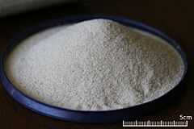
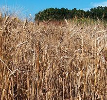
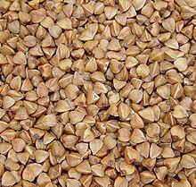
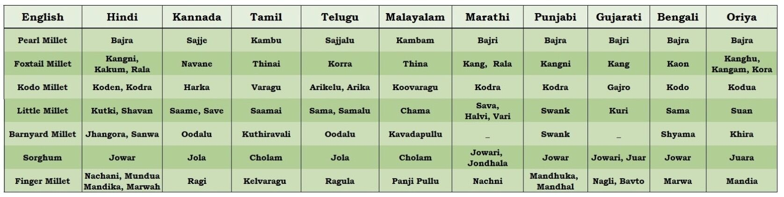
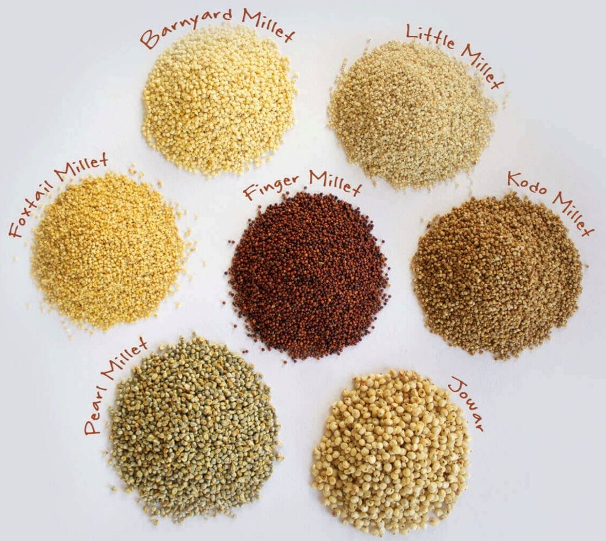

# Grains

## Semolina / Sooji

Semolina is the coarse, purified [wheat middlings](https://en.wikipedia.org/wiki/Wheat_middlings) of [durum wheat](https://en.wikipedia.org/wiki/Durum) mainly used in making [upma](https://en.wikipedia.org/wiki/Upma), [pasta](https://en.wikipedia.org/wiki/Pasta), and [couscous](https://en.wikipedia.org/wiki/Couscous). The word semolina can also refer to sweet dessert made from semolina and milk.The term semolina is also used to designate coarse middlings from other varieties of wheat, and from other grains, such as [rice](https://en.wikipedia.org/wiki/Rice) and [maize](https://en.wikipedia.org/wiki/Maize).

https://en.wikipedia.org/wiki/Semolina

### Sooji vs Rawa / Rava

Rava is finest version. And soji is thicker version.

Usually for crispiness we use rava like in dosa, fitters etc. while soji is use when we need texture like in cake, sweets etc.

## Durum Wheat

Durum wheat ([/ˈdjʊərəm/](https://en.wikipedia.org/wiki/Help:IPA/English)), also called pasta wheat or macaroni wheat (Triticum durum or Triticum turgidum subsp.duru), is a [tetraploid](https://en.wikipedia.org/wiki/Polyploid) species of [wheat](https://en.wikipedia.org/wiki/Wheat).It is the second most cultivated species of wheat after [common wheat](https://en.wikipedia.org/wiki/Common_wheat), although it represents only 5% to 8% of global wheat production.It was developed by [artificial selection](https://en.wikipedia.org/wiki/Artificial_selection) of the domesticated [emmer](https://en.wikipedia.org/wiki/Emmer) wheat strains formerly grown in Central Europe and the [Near East](https://en.wikipedia.org/wiki/Near_East) around 7000 BC, which developed a naked, [free-threshing](https://en.wikipedia.org/wiki/Wheat#Hulled_versus_free-threshing_wheat) form. Like emmer, durum wheat is [awned](https://en.wikipedia.org/wiki/Awn_(botany))(with bristles). It is the predominant wheat that grows in the Middle East.

Durumin [Latin](https://en.wikipedia.org/wiki/Latin) means "hard", and the species is the hardest of all wheats. This refers to the resistance of the grain to milling, in particular of the [starchy](https://en.wikipedia.org/wiki/Starch)[endosperm](https://en.wikipedia.org/wiki/Endosperm), implying dough made from its flour is weak or "soft". This makes durum favorable for [semolina](https://en.wikipedia.org/wiki/Semolina) and [pasta](https://en.wikipedia.org/wiki/Pasta) and less practical for flour, which requires more work than with [hexaploid](https://en.wikipedia.org/wiki/Hexaploid) wheats like [common bread wheats](https://en.wikipedia.org/wiki/Common_wheat). Despite its high [protein](https://en.wikipedia.org/wiki/Protein) content, durum is not a strong wheat in the sense of giving strength to [dough](https://en.wikipedia.org/wiki/Dough) through the formation of a [gluten](https://en.wikipedia.org/wiki/Gluten) network. Durum contains 27% extractable wet gluten, about 3% higher than in common wheat (T. aestivumL.).

https://en.wikipedia.org/wiki/Durum

## Buckwheat / kuttu ka atta

Buck wheat (Fagopyrum esculentum), or common buckwheat,  is a plant cultivated for its [grain-like](https://en.wikipedia.org/wiki/Pseudocereal) seeds and as a [cover crop](https://en.wikipedia.org/wiki/Cover_crop). A related species, [Fagopyrum tataricum](https://en.wikipedia.org/wiki/Fagopyrum_tataricum), is a domesticated food plant raised in Asia. Despite the name, buckwheat is not related to [wheat](https://en.wikipedia.org/wiki/Wheat), as it is not a [grass](https://en.wikipedia.org/wiki/Grasses). Instead, buckwheat is related to [sorrel](https://en.wikipedia.org/wiki/Sorrel), [knotweed](https://en.wikipedia.org/wiki/Polygonum), and [rhubarb](https://en.wikipedia.org/wiki/Rhubarb). Buckwheat is referred to as a [pseudocereal](https://en.wikipedia.org/wiki/Pseudocereal) because its seeds' culinary use is the same as cereals', owing to their composition of [complex carbohydrates](https://en.wikipedia.org/wiki/Complex_carbohydrates).

https://en.wikipedia.org/wiki/Buckwheat

## Millet

Millets are a group of highly variable small-seeded [grasses](https://en.wikipedia.org/wiki/Grasses), widely grown around the world as [cereal](https://en.wikipedia.org/wiki/Cereal)[crops](https://en.wikipedia.org/wiki/Crops) or grains for [fodder](https://en.wikipedia.org/wiki/Fodder) and human food.

Millets are important crops in the [semiarid tropics](https://en.wikipedia.org/wiki/Semi-arid_climate) of Asia and Africa (especially in [India](https://en.wikipedia.org/wiki/India), [Mali](https://en.wikipedia.org/wiki/Mali), [Nigeria](https://en.wikipedia.org/wiki/Nigeria), and [Niger](https://en.wikipedia.org/wiki/Niger)), with 97% of millet production in [developing countries](https://en.wikipedia.org/wiki/Developing_country).The crop is favored due to its [productivity](https://en.wikipedia.org/wiki/Agricultural_productivity) and short growing season under dry, high-temperature conditions.

Millets are [indigenous](https://en.wikipedia.org/wiki/Indigenous_(ecology)) to many parts of the world. The most widely grown millet is [pearl millet](https://en.wikipedia.org/wiki/Pearl_millet), which is an important crop in India and parts of Africa. [Finger millet](https://en.wikipedia.org/wiki/Finger_millet), [proso millet](https://en.wikipedia.org/wiki/Proso_millet), and [foxtail millet](https://en.wikipedia.org/wiki/Foxtail_millet) are also important crop species.

Millets may have been consumed by humans for about 7,000 years and potentially had "a pivotal role in the rise of multi-crop agriculture and settled farming societies".

- Major - Jowar, Bajra, Ragi
- Minor - Others

|                                 |                              |
| ------------------------------- | ---------------------------- |
| Amaranth                        | Rajgira/ Ramdana             |
| Barnyard                        | Sanwa/ Samvat ke Chawal      |
| Buckwheat                       | Kuttu                        |
| **Finger millet**               | **Ragi / Nachni**            |
| Foxtail millet                  | Kangni / Kakum               |
| Kodu / Kodo                     | Kodon                        |
| Little millet                   | Moraiyo/ Kutki/ Shavan/ Sama |
| Pearl millet                    | Bajra                        |
| Proso millet (broomcorn millet) | Chena                        |
| Sorghum                         | Jowar                        |

https://en.wikipedia.org/wiki/Millet

https://www.wellcurve.in/blog/different-types-of-millets

https://pristineorganics.com/millet-ancient-grains-for-a-healthier-future

## Other Grains (Gluten Free)

| English              | Hindi                     |
| -------------------- | ------------------------- |
| Rice                 | Chawal                    |
| Puffed Rice          | Murmure                   |
| Beaten Rice          | Poha                      |
| Brown Rice           |                           |
| **Corn, Maize**      | **Makkai, Makki, Bhutta** |
| Polenta              | Makkai ka Daliya          |
| Oats                 | Jaee                      |
| Quinoa               |                           |
| Tapioca Pearls, Sago | Sabudana                  |
| Water chestnut four  | Singhare ka aata          |
| Teff                 |                           |
| Brown Top Millet     | Makra                     |

Corn is mainly used in North America, however in the UK and other parts of the world, maize is more commonly used. ... For example, corn is most commonly used when referring to food items, such as popcorn, whereas maize is less commonly used to describe these foods, even though it comes from the same crop.

Cornflour and corn flour (two words) are different things

The later one you asked, is makai ka ata which we get from whole kernel. Often known as maize flour and can be used for making roti's and tortilla.

Cornflour is starch which gets from endosperm portion of kernel and used as binding or thickening agent.

https://www.quora.com/Is-corn-flour-same-as-makke-maize-ka-ata

## Gluten Free Flours

1. Almond flour
2. Arrowroot flour
3. Chickpea flour
4. Cononut flour
5. Tapiaco flour
6. Cassava flour
7. Tigernut flour

[https://www.healthline.com/nutrition/gluten-free-flours](https://www.healthline.com/nutrition/gluten-free-flours#section15)

## Gluten Containing Grains

|                         |                                                            |
| ----------------------- | ---------------------------------------------------------- |
| All-purpose white flour | Maida                                                      |
| Barley                  | Jau / Jav                                                  |
| Broken wheat            | Daliya (These days there is also gluten free jowar daliya) |
| Bulgar                  |                                                            |
| Couscous                | No exact hindi word but it is like thick sooji.            |
| Rye                     |                                                            |
| Semolina                | Sooji / Rava                                               |
| Vermicelli              | Seviyan, Sevaiyan                                          |
| Wheat                   | Gehoon                                                     |
| Whole Wheat Flour       | Gehoon aata                                                |

[Eight Swaps To Eat Better Everyday - Truth Be Told](https://tbthealth.substack.com/p/eight-swaps-to-eat-better-everyday)
