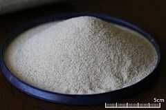
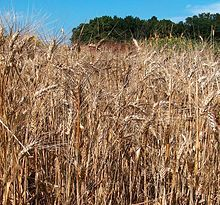
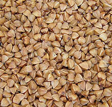
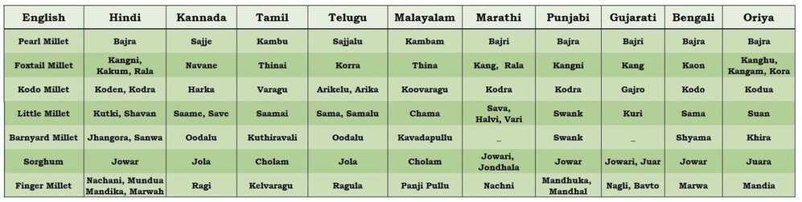
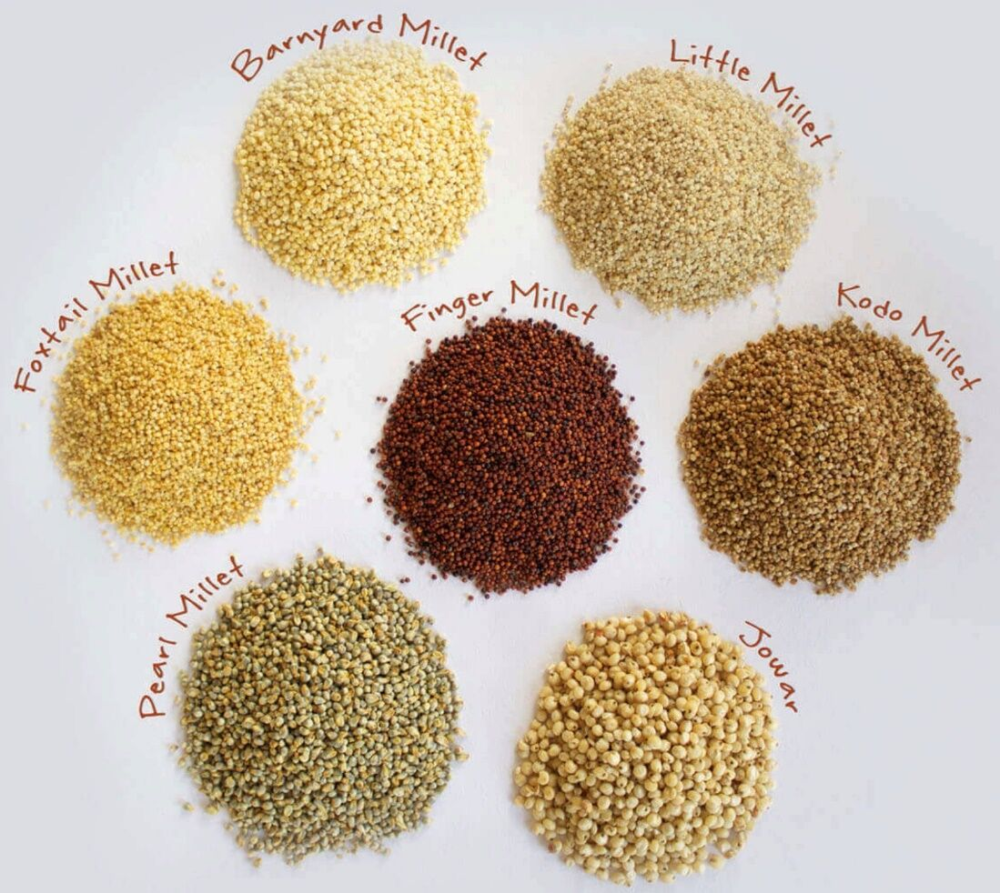

# Grains

## Semolina / Sooji

Semolina is the coarse, purified [wheat middlings](https://en.wikipedia.org/wiki/Wheat_middlings) of [durum wheat](https://en.wikipedia.org/wiki/Durum) mainly used in making [upma](https://en.wikipedia.org/wiki/Upma), [pasta](https://en.wikipedia.org/wiki/Pasta), and [couscous](https://en.wikipedia.org/wiki/Couscous). The word semolina can also refer to sweet dessert made from semolina and milk.The term semolina is also used to designate coarse middlings from other varieties of wheat, and from other grains, such as [rice](https://en.wikipedia.org/wiki/Rice) and [maize](https://en.wikipedia.org/wiki/Maize).

https://en.wikipedia.org/wiki/Semolina

### Sooji vs Rawa / Rava

Rava is finest version. And soji is thicker version.

Usually for crispiness we use rava like in dosa, fitters etc. while soji is use when we need texture like in cake, sweets etc.

## Durum Wheat

Durum wheat ([/ˈdjʊərəm/](https://en.wikipedia.org/wiki/Help:IPA/English)), also called pasta wheat or macaroni wheat (Triticum durum or Triticum turgidum subsp.duru), is a [tetraploid](https://en.wikipedia.org/wiki/Polyploid) species of [wheat](https://en.wikipedia.org/wiki/Wheat).It is the second most cultivated species of wheat after [common wheat](https://en.wikipedia.org/wiki/Common_wheat), although it represents only 5% to 8% of global wheat production.It was developed by [artificial selection](https://en.wikipedia.org/wiki/Artificial_selection) of the domesticated [emmer](https://en.wikipedia.org/wiki/Emmer) wheat strains formerly grown in Central Europe and the [Near East](https://en.wikipedia.org/wiki/Near_East) around 7000 BC, which developed a naked, [free-threshing](https://en.wikipedia.org/wiki/Wheat#Hulled_versus_free-threshing_wheat) form. Like emmer, durum wheat is [awned](https://en.wikipedia.org/wiki/Awn_(botany))(with bristles). It is the predominant wheat that grows in the Middle East.

Durumin [Latin](https://en.wikipedia.org/wiki/Latin) means "hard", and the species is the hardest of all wheats. This refers to the resistance of the grain to milling, in particular of the [starchy](https://en.wikipedia.org/wiki/Starch)[endosperm](https://en.wikipedia.org/wiki/Endosperm), implying dough made from its flour is weak or "soft". This makes durum favorable for [semolina](https://en.wikipedia.org/wiki/Semolina) and [pasta](https://en.wikipedia.org/wiki/Pasta) and less practical for flour, which requires more work than with [hexaploid](https://en.wikipedia.org/wiki/Hexaploid) wheats like [common bread wheats](https://en.wikipedia.org/wiki/Common_wheat). Despite its high [protein](https://en.wikipedia.org/wiki/Protein) content, durum is not a strong wheat in the sense of giving strength to [dough](https://en.wikipedia.org/wiki/Dough) through the formation of a [gluten](https://en.wikipedia.org/wiki/Gluten) network. Durum contains 27% extractable wet gluten, about 3% higher than in common wheat (T. aestivumL.).

https://en.wikipedia.org/wiki/Durum

## Buckwheat / kuttu ka atta

Buck wheat (Fagopyrum esculentum), or common buckwheat,  is a plant cultivated for its [grain-like](https://en.wikipedia.org/wiki/Pseudocereal) seeds and as a [cover crop](https://en.wikipedia.org/wiki/Cover_crop). A related species, [Fagopyrum tataricum](https://en.wikipedia.org/wiki/Fagopyrum_tataricum), is a domesticated food plant raised in Asia. Despite the name, buckwheat is not related to [wheat](https://en.wikipedia.org/wiki/Wheat), as it is not a [grass](https://en.wikipedia.org/wiki/Grasses). Instead, buckwheat is related to [sorrel](https://en.wikipedia.org/wiki/Sorrel), [knotweed](https://en.wikipedia.org/wiki/Polygonum), and [rhubarb](https://en.wikipedia.org/wiki/Rhubarb). Buckwheat is referred to as a [pseudocereal](https://en.wikipedia.org/wiki/Pseudocereal) because its seeds' culinary use is the same as cereals', owing to their composition of [complex carbohydrates](https://en.wikipedia.org/wiki/Complex_carbohydrates).

https://en.wikipedia.org/wiki/Buckwheat

## Millet

Millets are a group of highly variable small-seeded [grasses](https://en.wikipedia.org/wiki/Grasses), widely grown around the world as [cereal](https://en.wikipedia.org/wiki/Cereal)[crops](https://en.wikipedia.org/wiki/Crops) or grains for [fodder](https://en.wikipedia.org/wiki/Fodder) and human food.

Millets are important crops in the [semiarid tropics](https://en.wikipedia.org/wiki/Semi-arid_climate) of Asia and Africa (especially in [India](https://en.wikipedia.org/wiki/India), [Mali](https://en.wikipedia.org/wiki/Mali), [Nigeria](https://en.wikipedia.org/wiki/Nigeria), and [Niger](https://en.wikipedia.org/wiki/Niger)), with 97% of millet production in [developing countries](https://en.wikipedia.org/wiki/Developing_country).The crop is favored due to its [productivity](https://en.wikipedia.org/wiki/Agricultural_productivity) and short growing season under dry, high-temperature conditions.

Millets are [indigenous](https://en.wikipedia.org/wiki/Indigenous_(ecology)) to many parts of the world. The most widely grown millet is [pearl millet](https://en.wikipedia.org/wiki/Pearl_millet), which is an important crop in India and parts of Africa. [Finger millet](https://en.wikipedia.org/wiki/Finger_millet), [proso millet](https://en.wikipedia.org/wiki/Proso_millet), and [foxtail millet](https://en.wikipedia.org/wiki/Foxtail_millet) are also important crop species.

Millets may have been consumed by humans for about 7,000 years and potentially had "a pivotal role in the rise of multi-crop agriculture and settled farming societies".

- Major - Jowar, Bajra, Ragi
- Minor - Others

| **English**                     | **Hindi**                    |
| ------------------------------- | ---------------------------- |
| Amaranth                        | Rajgira/ Ramdana             |
| Barnyard                        | Sanwa/ Samvat ke Chawal      |
| Buckwheat                       | Kuttu                        |
| **Finger millet**               | **Ragi / Nachni**            |
| Foxtail millet                  | Kangni / Kakum               |
| Kodu / Kodo                     | Kodon                        |
| Little millet                   | Moraiyo/ Kutki/ Shavan/ Sama |
| Pearl millet                    | Bajra                        |
| Proso millet (broomcorn millet) | Chena                        |
| Sorghum                         | Jowar                        |

https://en.wikipedia.org/wiki/Millet

https://www.wellcurve.in/blog/different-types-of-millets

https://pristineorganics.com/millet-ancient-grains-for-a-healthier-future

## Oats

All oats start out exactly the same: as **whole oat groats**. This is the whole grain kernel with just the inedible outer hull removed.

The differences between steel-cut, rolled, and instant oats come down entirely to **how much those groats are processed**. The more an oat is processed (steamed, flattened, or chopped), the faster it cooks—but it also digests faster, which raises its Glycemic Index (GI).

### The Oat Spectrum (From Least to Most Processed)

#### 1. Whole Oat Groats

- **What they are:** The intact, un-chopped, un-rolled grain.
- **Texture:** Very chewy, similar to brown rice or wheat berries.
- **Cooking Time:** 45–60 minutes (soaking overnight highly recommended).
- **Health Profile:** The absolute best for blood sugar. They have the lowest GI and keep you full the longest, but they are rarely used for breakfast due to the long prep time.

#### 2. Steel-Cut Oats (Irish Oats)

- **What they are:** Whole oat groats that have been chopped into two or three pieces with a steel blade. They are not steamed or rolled.
- **Texture:** Dense, chewy, and slightly nutty. They retain a "bite" even after cooking and do not get mushy.
- **Cooking Time:** 20–30 minutes.
- **Health Profile:** Excellent. Because the pieces are thick, your digestive enzymes take longer to break them down, leading to a slow, steady release of glucose into your bloodstream.

#### 3. Rolled Oats (Old-Fashioned Oats)

- **What they are:** Oat groats that are steamed to make them soft, then pressed through metal rollers to flatten them into flakes.
- **Texture:** Softer and creamier. They absorb a lot of liquid and can become mushy if overcooked.
- **Cooking Time:** 5–10 minutes.
- **Health Profile:** A great middle ground. The steaming and rolling process slightly pre-cooks the starches, so they digest a bit faster than steel-cut oats, but they still retain their full fiber profile. This is the best type to use for making "Oats Poha."

#### 4. Quick & Instant Oats

- **What they are:** Rolled oats that are steamed much longer, rolled much thinner, and sometimes finely chopped. Instant oats are basically pre-cooked and dehydrated, often with added sugars or flavors.
- **Texture:** Very soft, often turning to a paste or slime when mixed with hot water.
- **Cooking Time:** 1–2 minutes (or just by adding hot water).
- **Health Profile:** The least healthy option. Because they are so thin and pre-cooked, your body digests them almost immediately. This causes a rapid spike in blood sugar, acting more like refined white flour than a whole grain.

### Direct Comparison

|**Type**|**Processing Method**|**Texture**|**Glycemic Index**|**Best For**|
|---|---|---|---|---|
|**Steel-Cut**|Chopped with a blade|Chewy, nutty|Low (~55)|Porridge, savory upma (needs pressure cooking).|
|**Rolled**|Steamed & flattened|Soft, absorbs liquid|Medium (~59)|Granola, overnight oats, oats poha, baking.|
|**Instant**|Pre-cooked, rolled thin, chopped|Mushy, paste-like|High (70-83+)|Emergency meals only; avoid for daily use.|

> **Key takeaway:** No matter which type you buy, you are getting the same exact amount of fiber, protein, and calories per gram. The only thing that changes is **how fast your body breaks that nutrition down.**

### Is Oats Better? (Pros & Cons)

Oats are an excellent, versatile whole grain, but they are not a flawless superfood.

**Pros of Oats:**

- **Beta-Glucan:** A specific type of soluble fiber proven to lower LDL (bad) cholesterol.
- **Blood Sugar Management:** Prevents insulin spikes, making it highly suitable for diabetics.
- **Satiety:** The high fiber content expands in your stomach, curbing mid-morning cravings.
- **Versatility:** Cooks extremely fast and adapts easily to both sweet and savory Indian flavor profiles.

**Cons of Oats:**

- **Phytic Acid:** Oats contain antinutrients that can bind to minerals (like iron and zinc), preventing your body from absorbing them.
- **Texture Profile:** They easily turn into a slimy porridge, which makes replicating dry dishes like poha or upma difficult.
- **Glyphosate Risk:** Depending on the brand, non-organic oats are often sprayed heavily with pesticides.
- **Processing:** Instant or quick oats are heavily processed, stripping away the very benefits that make whole oats healthy.

[OATS Explained: Benefits & Recipes \| Busting Myths about OATS \| Saurabh Bothra Yoga - YouTube](https://www.youtube.com/watch?v=jZLc_7TTkOw)

### Better Alternatives to Oats

If you are looking for grains that offer the same—or better—health benefits as oats, with superior texture for Indian cooking, consider these alternatives:

#### Millets (Foxtail, Barnyard, Little, or Kodo)

- **Why they are better:** Millets are ancient, indigenous Indian grains. They have an exceptionally low Glycemic Index, are naturally gluten-free, and are incredibly rich in iron, calcium, and protein.
- **Usage:** They make fantastic upma or perfectly fluffy pulao without turning mushy.

#### Quinoa

- **Why it is better:** Unlike oats, quinoa is a "complete protein," meaning it contains all nine essential amino acids your body needs. It is also packed with fiber and magnesium.
- **Usage:** Quinoa fluffs up beautifully and is a direct, texture-perfect replacement for suji in upma or rice in pulao.

#### Red or Brown Rice Poha

- **Why it is better:** If you love the traditional texture of poha but want more nutrition, red or brown rice flakes retain the nutrient-dense bran layer that white rice poha loses.
- **Usage:** Use exactly like normal poha. It takes slightly longer to soak but provides more fiber, B vitamins, and complex carbs.

#### Amaranth (Rajgira)

- **Why it is better:** A powerhouse of calcium and protein. It is highly anti-inflammatory and easier to digest than oats.
- **Usage:** Best used as a porridge or mixed into savory batters, rather than as a flaky upma substitute.

## Other Grains (Gluten Free)

| English              | Hindi                     |
| -------------------- | ------------------------- |
| Rice                 | Chawal                    |
| Puffed Rice          | Murmure                   |
| Beaten Rice          | Poha                      |
| Brown Rice           |                           |
| **Corn, Maize**      | **Makkai, Makki, Bhutta** |
| Polenta              | Makkai ka Daliya          |
| Oats                 | Jaee                      |
| Quinoa               |                           |
| Tapioca Pearls, Sago | Sabudana                  |
| Water chestnut four  | Singhare ka aata          |
| Teff                 |                           |
| Brown Top Millet     | Makra                     |

Corn is mainly used in North America, however in the UK and other parts of the world, maize is more commonly used. ... For example, corn is most commonly used when referring to food items, such as popcorn, whereas maize is less commonly used to describe these foods, even though it comes from the same crop.

Cornflour and corn flour (two words) are different things

The later one you asked, is makai ka ata which we get from whole kernel. Often known as maize flour and can be used for making roti's and tortilla.

Cornflour is starch which gets from endosperm portion of kernel and used as binding or thickening agent.

https://www.quora.com/Is-corn-flour-same-as-makke-maize-ka-ata

## Gluten Free Flours

1. Almond flour
2. Arrowroot flour
3. Chickpea flour
4. Cononut flour
5. Tapiaco flour
6. Cassava flour
7. Tigernut flour

[https://www.healthline.com/nutrition/gluten-free-flours](https://www.healthline.com/nutrition/gluten-free-flours#section15)

## Gluten Containing Grains

|                         |                                                            |
| ----------------------- | ---------------------------------------------------------- |
| All-purpose white flour | Maida                                                      |
| Barley                  | Jau / Jav                                                  |
| Broken wheat            | Daliya (These days there is also gluten free jowar daliya) |
| Bulgar                  |                                                            |
| Couscous                | No exact hindi word but it is like thick sooji.            |
| Rye                     |                                                            |
| Semolina                | Sooji / Rava                                               |
| Vermicelli              | Seviyan, Sevaiyan                                          |
| Wheat                   | Gehoon                                                     |
| Whole Wheat Flour       | Gehoon aata                                                |

[Eight Swaps To Eat Better Everyday - Truth Be Told](https://tbthealth.substack.com/p/eight-swaps-to-eat-better-everyday)

## Links

- [pulses-daal-lentils](knowledge/biology/nutrition/pulses-daal-lentils.md)
