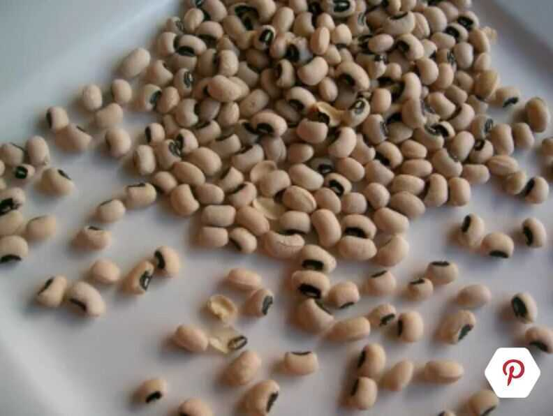
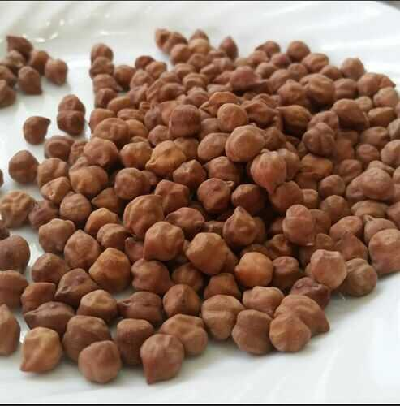
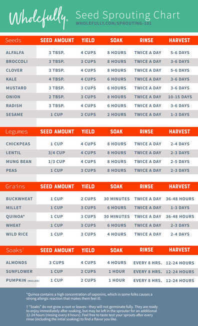

# Pulses / Daal / Lentils

[How To identify Indian Dals | Basic Cooking Skills For Beginners | Easy Guide To Lentils & Pulses - YouTube](https://www.youtube.com/watch?v=RUmFIvs2RRA&ab_channel=RajshriFood)

## Masoor daal / Red lentils / Malka Masoor

Masoor is probably the most commonly used daal ([lentil](https://www.thespruceeats.com/lentil-selection-and-storage-1807776)) in India. It is available whole and split and without skin.

- Whole - Malka Masoor
- Split - Dhuli Massor Daal

It does not need soaking prior to cooking as it is a "soft" daal and cooks quickly.

## Saabut masoor daal / Khadi masoor daal

Saabutmasoor, means whole and the brownish skin is left on in this type of masoor daal.

It can be used in all the same dishes as masoor daal (split and skin removed). Saabut masoor takes slightly longer to cook than masoor daal.

## Saabut moong daal

- soak for 5 hours

Saabut moong daal, is whole moong or moong with the green skin left on. It cooks faster if soaked in advance as it is a "harder" daal. Saabut moong tastes great when sprouted and is a lovely, healthful addition to salads.

Mix a handful of sprouted Saabut moong daal in a bowl of yogurt, season with salt and somechaat masala(available at most Indian grocery stores) and you'll have a delicious and filling snack.

## Hari split moong daal / green split moong daal / moong daal chilka

### Saabut vs Hari moong daal

#### Sabut Moong Dal

- Sabut moong dal refers to whole green moong beans with their skin intact.
- It is rich in fiber, protein, and various nutrients including vitamins and minerals.
- Sabut moong dal takes longer to cook compared to split lentils because of its whole form.
- It has a slightly nutty flavor and retains its shape well after cooking, making it suitable for salads, soups, stews, and Indian dishes like khichdi and dal makhani.

#### Hari Moong Dal

- Hari moong dal, on the other hand, refers to split green moong beans without the skin.
- It cooks faster compared to sabut moong dal due to its split form.
- Hari moong dal is also rich in protein, fiber, and various nutrients.
- It has a milder flavor compared to sabut moong dal and tends to disintegrate more when cooked, making it suitable for dishes like dals, curries, and soups.

## Moong daal

Moong daal, has had its olive green skin removed and is split. It is a golden yellow color and turns slightly lighter when cooked.

Moong does not need soaking prior to being cooked as it is a "soft" daal.

### Green vs Yellow Moong daal

- Nutrition - Green moong dal is more nutritious than yellow moong dal because the skin of the green moong dal contains nutrients.
- Preparation - Green moong dal needs to be soaked for at least five hours before cooking. Yellow moong dal can be eaten raw or soaked.
- Uses - Green moong dal is used to make sprouts, dal khichdi, dosa, dhoklas, and curries. Yellow moong dal can be used to make dal khichdi, pakodas, curries, chilas, and toast.
- Versatility - Yellow moong dal has a milder flavor and is more versatile than green moong dal. It can be used in a wider range of dishes, including sweet dishes and desserts.

## Toor/Tuvar or Arhar daal or pigeon peas

Toor/tuvar or arhar daal, is most commonly sold and cooked in its split, skinless form. With its skin on, it is a greenish-brown color and without its skin, yellow.

Toor daal looks a lot like chana daal but has smaller, more yellow-colored grains. It is especially popular in the west and south India. It cooks quickly and does not require soaking in advance.

## Sabut urad

## Split urad with skin

Urad daal, can be bought whole with its skin on, split with its skin on or split with its skin removed.

This [black lentil](https://www.thespruceeats.com/what-are-lentils-1328630) has a creamy white interior when split. Whole and with its skin on, it is known assaabuturadand has a stronger, more distinct flavor than the split, skinless variety. It is a "harder" lentil and takes longer to cook. A little soaking is best prior to ​cooking this daal.

## Urad daal with skin removed

Urad daal, has had its black skin removed. It is creamy white in color and has a milder flavor than whole urad daal.

Skinless Urad does not need soaking before it is cooked. It is often ground into flour or a paste and used as part of batters.

## Moth Dal (Matki Dal / Turkish Gram)

- Soak for 5 hours

## Kulthi Dal (Horse Gram)

## Kabuli chana

Also known aschole, garbanzo beans, Egyptian peas and white chickpeas, kabulichana, has a lovely nutty flavor. In India, it is used to make curries, added to salads and even in dips.

Kabuli chana is especially popular in North India. It must be soaked for several hours before cooking as it is a "very hard" bean. You can also use canned kabuli chana which is easily available in supermarkets these days but nothing beats the taste of kabuli chana freshly soaked and boiled just before cooking.

## Lobia or chawli (Black eyed pea / Cowpea)

There is no need to soaklobiaorchawli, because it is a relatively "soft" bean that cooks easily. Watch carefully when cooking as it should not get mashed.

Lobia can be used almost similarly to kabulichana (white chickpeas) even though it tastes different.

## Rajma

Slightly larger than the Mexican red bean, rajma or red kidney beans are very popular in North India where a well-loved dish is named after them. Not only do they taste great on their own, they make a terrific combination when cooked with vegetables and meats too.

Rajma must be soaked for several hours before cooking to soften it. As with all beans (like kabuli chana, lobia, etc.) that are high in fiber and full of nutrition, rajma has gas-producing enzymes. The trick to beating this is to change the soaking water every few hours (before cooking) and cook them until soft.

### Toxicity

Red kidney beans contain relatively high amounts of [phytohemagglutinin](https://en.m.wikipedia.org/wiki/Phytohemagglutinin "Phytohemagglutinin"), and thus are more toxic than most other bean varieties if not pre-soaked and subsequently heated to the boiling point for at least 10 minutes. The US [Food and Drug Administration](https://en.m.wikipedia.org/wiki/Food_and_Drug_Administration "Food and Drug Administration") recommends boiling for 30 minutes to ensure they reach a sufficient temperature long enough to completely destroy the toxin. Cooking at the lower temperature of 80 °C (176 °F), such as in a [slow cooker](https://en.m.wikipedia.org/wiki/Slow_cooker "Slow cooker"), is insufficient to denature the toxin and has been reported to cause food poisoning.

[Kidney bean - Wikipedia](https://en.m.wikipedia.org/wiki/Kidney_bean#Toxicity)

## Chickpeas - Kala chana / Black chickpeas / Bengal gram / Desi chana

### Types

- **Black chickpeas (Bengal gram) / garbanzo beans:** These chickpeas come from India where they are sun-dried until they turn a deep rust color. Like regular chickpeas, they have a deep, earthy aroma and a nutty flavor. Black chickpeas can be found in Indian markets and specialty food shops.

### Chana dal

These small split desi chickpeas are sold in Indian stores and look very much like yellow split peas. Chana dal have a sweet, nutty taste. In India, chana dal are used to make chickpea flour, while in the United States, the larger kabuli chick-peas are used for flour. Chana dal can be found in Indian stores and some specialty food shops.

Chana daal, looks like a larger version of toor/tuvar or arhar daal. It is made by splitting a smaller cousin of the chickpea.

This [lentil](https://www.thespruceeats.com/history-of-lentils-1807624) has a nutty flavor and is used in dry curries or with vegetables or meats and also as a flour (Bengal gram flour). It cooks fairly quickly and does not need soaking prior to being cooked.

- **Chickpea shoots:** These feathery shoots of the chickpea plant are excellent in salads. Like fresh green chickpeas, they can occasionally be found in local farmers' markets.

- **Chickpea flour:** Chickpea flour has a rich culinary tradition in Indian cuisine, where it is known as **besan or chana** and is used in pancakes, stews, and curries. It is popular as well in Italian cuisine where **farina di ceci(chickpea flour)** is used to make pasta and a polenta-like dish. Chickpeas are also used in some blended flours, such as **garfava flour**, a combination of chickpeas and fava beans, and **dhokra flour**, a combination of rice, lentils, and chickpeas.
- **Green chickpeas:** Fresh and sweet, like green peas, these are young, tender, fresh chickpeas. They are predominantly found in local farmers' markets.

## Health Benefits

Just 1 cup of cooked daal can give you as much as 62 percent of your daily dietary fiber requirement. Daals also have high levels of important minerals like manganese, phosphorous, potassium, iron and copper. They are high in folates and the B-vitamins like Thiamin.

- Peanuts / Singdana
- Moong falli / groundnuts / earth nuts / goobers / not nut, legume family

[Daal-Palak Ka Shorba (Lentil and Spinach Soup) Recipe](https://www.thespruceeats.com/a-photo-gallery-of-indian-daals-and-beans-4121903)

[Indian Cooking 101: Different Types of Indian Dals (Legumes, Lentils, Beans, Pulses) | My Heart Beets](https://myheartbeets.com/different-types-of-indian-dals-legumes-lentils-beans-pulses)

## Sproutes / Seeds / Sprouted grains

1. Radish
2. Mustard
3. Alfalfa
4. clover
5. lentil / masoor
6. **pea / matar / kala chana**
7. wheat
8. **mung / Green gram / Sabut moong**

https://wholefully.com/sprouting-101

## Utensils

[The pan you don't have (but should)](https://www.youtube.com/watch?v=yX4hXnyfozo)

[I am SO done with Teflon - YouTube](https://www.youtube.com/watch?v=R1hbV3EzOD4)

[4 Types of Toxic Cookware to Avoid and 4 Safe Alternatives - YouTube](https://www.youtube.com/watch?v=0uATfA_WoTA)

#### Bad

- non stick - Teflon
- Aluminium cookware
- Aluminium foil
- Copper cookware
- non stick - ceremic coated pans (not long lasting)

#### Good

- 100% ceremic cookware
- **Stainless steel** (Food grade which doesn't contain nickel or chromium)
    - [Avoid These Mistakes When Buying Stainless Steel Cookware (What to Look For) - YouTube](https://www.youtube.com/watch?v=zndEZkSQNAo)
- Glass cookware
- cast iron
- **carbon steel**

## PFAS (Forever Chemicals)

[Polytetrafluoroethylene - Wikipedia](https://en.wikipedia.org/wiki/Polytetrafluoroethylene#Ecotoxicity)

[PFAS: The secret toxins in your body - YouTube](https://www.youtube.com/watch?v=lVcOxZZGrBc)

- PTFE / PFOA - All PFAS are carcinogenic
