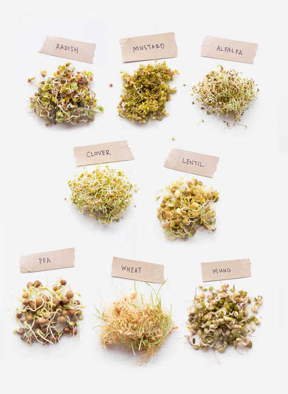
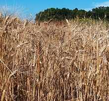
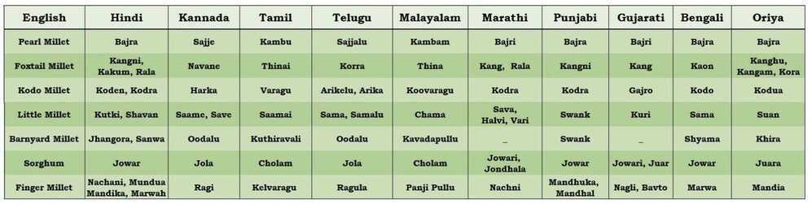
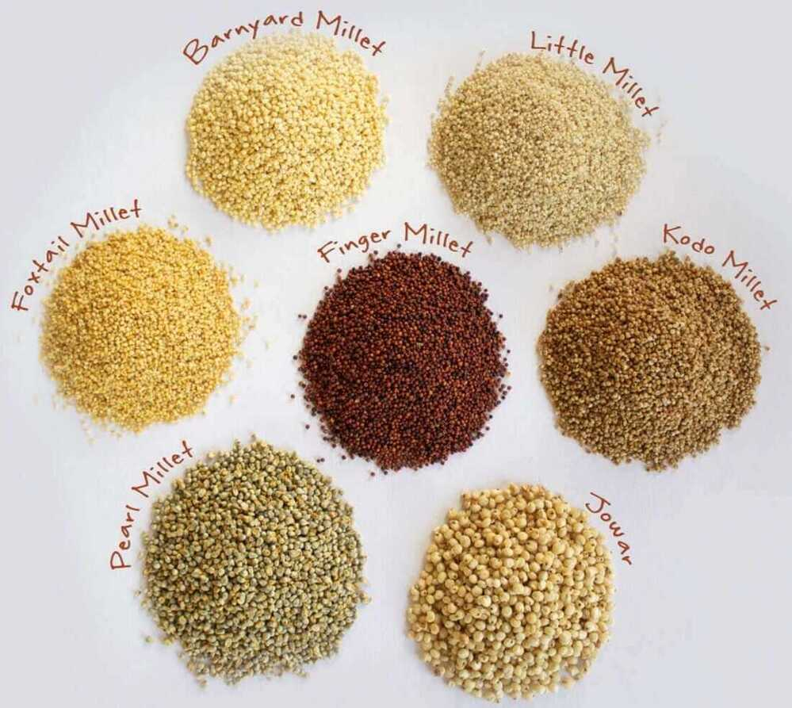

# Pulses / Daal / Lentils

## Masoor daal

Masoor is probably the most commonly used daal ([lentil](https://www.thespruceeats.com/lentil-selection-and-storage-1807776)) in India. It is available whole and split and without skin.

It does not need soaking prior to cooking as it is a "soft" daal and cooks quickly.

## Saabut masoor daal

Saabutmasoor, means whole and the brownish skin is left on in this type of masoor daal.

It can be used in all the same dishes as masoor daal (split and skin removed). Saabut masoor takes slightly longer to cook than masoor daal.

## Saabut moong daal

Saabut moong daal, is whole moong or moong with the green skin left on. It cooks faster if soaked in advance as it is a "harder" daal. Saabut moong tastes great when sprouted and is a lovely, healthful addition to salads.

Mix a handful of sprouted Saabut moong daal in a bowl of yogurt, season with salt and somechaat masala(available at most Indian grocery stores) and you'll have a delicious and filling snack.

## Moong daal

Moongdaal, has had its olive green skin removed and is split. It is a golden yellow color and turns slightly lighter when cooked.

Moong does not need soaking prior to being cooked as it is a "soft" daal.

## Toor/Tuvar or Arhar daal

Toor/tuvarorarhardaal, is most commonly sold and cooked in its split, skinless form. With its skin on, it is a greenish-brown color and without its skin, yellow.

Toor daal looks a lot likechana daalbut has smaller, more yellow-colored grains. It is especially popular in thewest and south India. It cooks quickly and does not require soaking in advance.

## Sabut urad

## Split urad with skin

Urad daal, can be bought whole with its skin on, split with its skin on or split with its skin removed.

This [black lentil](https://www.thespruceeats.com/what-are-lentils-1328630) has a creamy white interior when split. Whole and with its skin on, it is known assaabuturadand has a stronger, more distinct flavor than the split, skinless variety. It is a "harder" lentil and takes longer to cook. A little soaking is best prior to ​cooking this daal.

## Urad daal with skin removed

Urad daal, has had its black skin removed. It is creamy white in color and has a milder flavor than whole urad daal.

Skinless Urad does not need soaking before it is cooked. It is often ground into flour or a paste and used as part of batters.

## Kabuli chana

Also known aschole, garbanzo beans, Egyptian peas and white chickpeas, kabulichana, has a lovely nutty flavor. In India, it is used to make curries, added to salads and even in dips.

Kabuli chana is especially popular in North India. It must be soaked for several hours before cooking as it is a "very hard" bean. You can also use canned kabuli chana which is easily available in supermarkets these days but nothing beats the taste of kabuli chana freshly soaked and boiled just before cooking.

## Lobia or chawli

There is no need to soaklobiaorchawli, because it is a relatively "soft" bean that cooks easily. Watch carefully when cooking as it should not get mashed.

Lobia can be used almost similarly to kabulichana (white chickpeas) even though it tastes different.

## Rajma

Slightly larger than the Mexican red bean, rajma or red kidney beans are very popular in North India where a well-loved dish is named after them. Not only do they taste great on their own, they make a terrific combination when cooked with vegetables and meats too.

Rajma must be soaked for several hours before cooking to soften it. As with all beans (like kabuli chana, lobia, etc.) that are high in fiber and full of nutrition, rajma has gas-producing enzymes. The trick to beating this is to change the soaking water every few hours (before cooking) and cook them until soft.

## Chickpeas - Kala chana / Black chickpeas / / Bengal gram / Desi chana

### Types

- **Black chickpeas (Bengal gram) / garbanzo beans:**These chickpeas come from India where they are sun-dried until they turn a deep rust color. Like regular chickpeas, they have a deep, earthy aroma and a nutty flavor. Black chickpeas can be found in Indian markets and specialty food shops.

- **Chana dal:**These small split desi chickpeas are sold in Indian stores and look very much like yellow split peas. Chana dal have a sweet, nutty taste. In India, chana dal are used to make chickpea flour, while in the United States, the larger kabuli chick-peas are used for flour. Chana dal can be found in Indian stores and some specialty food shops.

Chana daal, looks like a larger version of toor/tuvar or arhar daal. It is made by splitting a smaller cousin of the chickpea.

This [lentil](https://www.thespruceeats.com/history-of-lentils-1807624) has a nutty flavor and is used in dry curries or with vegetables or meats and also as a flour (Bengal gram flour). It cooks fairly quickly and does not need soaking prior to being cooked.

- **Chickpea shoots:** These feathery shoots of the chickpea plant are excellent in salads. Like fresh green chickpeas, they can occasionally be found in local farmers' markets.

- **Chickpea flour:** Chickpea flour has a rich culinary tradition in Indian cuisine, where it is known as **besanorchana** and is used in pancakes, stews, and curries. It is popular as well in Italian cuisine where **farina di ceci(chickpea flour)** is used to make pasta and a polenta-like dish. Chickpeas are also used in some blended flours, such as **garfava flour**, a combination of chickpeas and fava beans, and **dhokra flour**, a combination of rice, lentils, and chickpeas.
- **Green chickpeas:** Fresh and sweet, like green peas, these are young, tender, fresh chickpeas. They are predominantly found in local farmers' markets.

## Health Benefits

Just 1 cup of cooked daal can give you as much as 62 percent of your daily dietary fiber requirement. Daalsalso have high levels of important minerals like manganese, phosphorous, potassium, iron and copper. They are high in folates and the B-vitamins like Thiamin.

- Peanuts / Moong falli / groundnuts / earth nuts / goobers / not nut, legume family

<https://www.thespruceeats.com/a-photo-gallery-of-indian-daals-and-beans-4121903>

<https://myheartbeets.com/different-types-of-indian-dals-legumes-lentils-beans-pulses>

## Sproutes / Seeds / Sprouted grains

1. Radish
2. Mustard
3. Alfalfa
4. clover
5. lentil / masoor
6. **pea / matar / kala chana**
7. wheat
8. **mung / Green gram / Sabut moong**

<https://wholefully.com/sprouting-101>

## Grains

### Semolina / Sooji

Semolinais the coarse, purified [wheat middlings](https://en.wikipedia.org/wiki/Wheat_middlings) of [durum wheat](https://en.wikipedia.org/wiki/Durum) mainly used in making [upma](https://en.wikipedia.org/wiki/Upma), [pasta](https://en.wikipedia.org/wiki/Pasta), and [couscous](https://en.wikipedia.org/wiki/Couscous). The wordsemolinacan also refer to sweet dessert made from semolina and milk.The term semolina is also used to designate coarse middlings from other varieties of wheat, and from other grains, such as [rice](https://en.wikipedia.org/wiki/Rice) and [maize](https://en.wikipedia.org/wiki/Maize).

<https://en.wikipedia.org/wiki/Semolina>

### Durum Wheat

Durum wheat([/ˈdjʊərəm/](https://en.wikipedia.org/wiki/Help:IPA/English)), also calledpasta wheatormacaroni wheat(Triticum durum or Triticum turgidum subsp.duru), is a [tetraploid](https://en.wikipedia.org/wiki/Polyploid) species of [wheat](https://en.wikipedia.org/wiki/Wheat).It is the second most cultivated species of wheat after [common wheat](https://en.wikipedia.org/wiki/Common_wheat), although it represents only 5% to 8% of global wheat production.It was developed by [artificial selection](https://en.wikipedia.org/wiki/Artificial_selection) of the domesticated [emmer](https://en.wikipedia.org/wiki/Emmer) wheat strains formerly grown in Central Europe and the [Near East](https://en.wikipedia.org/wiki/Near_East) around 7000 BC, which developed a naked, [free-threshing](https://en.wikipedia.org/wiki/Wheat#Hulled_versus_free-threshing_wheat) form.Like emmer, durum wheat is [awned](https://en.wikipedia.org/wiki/Awn_(botany))(with bristles). It is the predominant wheat that grows in the Middle East.

Durumin [Latin](https://en.wikipedia.org/wiki/Latin) means "hard", and the species is the hardest of all wheats. This refers to the resistance of the grain to milling, in particular of the [starchy](https://en.wikipedia.org/wiki/Starch)[endosperm](https://en.wikipedia.org/wiki/Endosperm), implying dough made from its flour is weak or "soft". This makes durum favorable for [semolina](https://en.wikipedia.org/wiki/Semolina) and [pasta](https://en.wikipedia.org/wiki/Pasta) and less practical for flour, which requires more work than with [hexaploid](https://en.wikipedia.org/wiki/Hexaploid) wheats like [common bread wheats](https://en.wikipedia.org/wiki/Common_wheat). Despite its high [protein](https://en.wikipedia.org/wiki/Protein) content, durum is not a strong wheat in the sense of giving strength to [dough](https://en.wikipedia.org/wiki/Dough) through the formation of a [gluten](https://en.wikipedia.org/wiki/Gluten) network. Durum contains 27% extractable wet gluten, about 3% higher than in common wheat (T. aestivumL.).

<https://en.wikipedia.org/wiki/Durum>

### Buckwheat / kuttu ka atta

Buckwheat(Fagopyrum esculentum), orcommon buckwheat,  is a plant cultivated for its [grain-like](https://en.wikipedia.org/wiki/Pseudocereal) seeds and as a [cover crop](https://en.wikipedia.org/wiki/Cover_crop). A related species, [Fagopyrum tataricum](https://en.wikipedia.org/wiki/Fagopyrum_tataricum), is a domesticated food plant raised in Asia. Despite the name, buckwheat is not related to [wheat](https://en.wikipedia.org/wiki/Wheat), as it is not a [grass](https://en.wikipedia.org/wiki/Grasses). Instead, buckwheat is related to [sorrel](https://en.wikipedia.org/wiki/Sorrel), [knotweed](https://en.wikipedia.org/wiki/Polygonum), and [rhubarb](https://en.wikipedia.org/wiki/Rhubarb). Buckwheat is referred to as a [pseudocereal](https://en.wikipedia.org/wiki/Pseudocereal) because its seeds' culinary use is the same as cereals', owing to their composition of [complex carbohydrates](https://en.wikipedia.org/wiki/Complex_carbohydrates).

<https://en.wikipedia.org/wiki/Buckwheat>

### Millet

Milletsare a group of highly variable small-seeded [grasses](https://en.wikipedia.org/wiki/Grasses), widely grown around the world as [cereal](https://en.wikipedia.org/wiki/Cereal)[crops](https://en.wikipedia.org/wiki/Crops) or grains for [fodder](https://en.wikipedia.org/wiki/Fodder) and human food.

Millets are important crops in the [semiarid tropics](https://en.wikipedia.org/wiki/Semi-arid_climate) of Asia and Africa (especially in [India](https://en.wikipedia.org/wiki/India), [Mali](https://en.wikipedia.org/wiki/Mali), [Nigeria](https://en.wikipedia.org/wiki/Nigeria), and [Niger](https://en.wikipedia.org/wiki/Niger)), with 97% of millet production in [developing countries](https://en.wikipedia.org/wiki/Developing_country).The crop is favored due to its [productivity](https://en.wikipedia.org/wiki/Agricultural_productivity) and short growing season under dry, high-temperature conditions.

Millets are [indigenous](https://en.wikipedia.org/wiki/Indigenous_(ecology)) to many parts of the world.The most widely grown millet is [pearl millet](https://en.wikipedia.org/wiki/Pearl_millet), which is an important crop in India and parts of Africa.[Finger millet](https://en.wikipedia.org/wiki/Finger_millet), [proso millet](https://en.wikipedia.org/wiki/Proso_millet), and [foxtail millet](https://en.wikipedia.org/wiki/Foxtail_millet) are also important crop species.

Millets may have been consumed by humans for about 7,000 years and potentially had "a pivotal role in the rise of multi-crop agriculture and settled farming societies".

| Amaranth                        | Rajgira/ Ramdana             |
|---------------------------------|------------------------------|
| Barnyard                        | Sanwa/ Samvat ke Chawal      |
| Buckwheat                       | Kuttu                        |
| **Finger millet**               | **Ragi/ Nachni**             |
| Foxtail millet                  | Kangni / Kakum               |
| Kodu                            | Kodon                        |
| Little millet                   | Moraiyo/ Kutki/ Shavan/ Sama |
| Pearl millet                    | Bajra                        |
| Proso millet (broomcorn millet) | Chena                        |
| Sorghum                         | Jowar                        |

<https://en.wikipedia.org/wiki/Millet>

<https://www.wellcurve.in/blog/different-types-of-millets>

<https://pristineorganics.com/millet-ancient-grains-for-a-healthier-future>

## Other Grains (Gluten Free)

| Rice                 | Chawal                    |
|----------------------|---------------------------|
| Puffed Rice          | Murmure                   |
| Beaten Rice          | Poha                      |
| Brown Rice           |                          |
| **Corn, Maize**      | **Makkai, Makki, Bhutta** |
| Polenta              | Makkai ka Daliya          |
| Oats                 | Jaee                      |
| Quinoa               |                          |
| Tapioca Pearls, Sago | Sabudana                  |
| Water chestnut four  | Singhare ka aata          |
| Teff                 |                          |

Corn is mainly used in North America, however in the UK and other parts of the world, maize is more commonlyused. ... For example, corn is most commonly used when referring to food items, such as popcorn, whereas maize is less commonly used to describe these foods, even though it comes from the same crop.

Cornflour and corn flour (two words) are different things

The later one you asked, is makai ka ata which we get from whole kernel. Often known as maize flour and can be used for making roti's and tortilla.

Cornflour is starch which gets from endosperm portion of kernel and used as binding or thickening agent.

<https://www.quora.com/Is-corn-flour-same-as-makke-maize-ka-ata>

## Gluten Free Flours

1. Almond flour
2. Arrowroot flour
3. Chickpea flour
4. Cononut flour
5. Tapiaco flour
6. Cassava flour
7. Tigernut flour

[https://www.healthline.com/nutrition/gluten-free-flours](https://www.healthline.com/nutrition/gluten-free-flours#section15)

## Gluten Containing Grains

| All-purpose white flour | Maida                                                      |
|-----------------------|-------------------------------------------------|
| Barley                  | Jau / Jav                                                  |
| Broken wheat            | Daliya (These days there is also gluten free jowar daliya) |
| Bulgar                  |                                                           |
| Couscous                | No exact hindi word but it is like thick sooji.            |
| Rye                     |                                                           |
| Semolina                | Sooji / Rava                                               |
| Vermicelli              | Seviyan, Sevaiyan                                          |
| Wheat                   | Gehoon                                                     |
| Whole Wheat Flour       | Gehoon aata                                                |

## Cloth Fibers / Textiles

1. Cotton
2. Linen
3. Hemp
4. Polyester

    Fleece - <https://en.wikipedia.org/wiki/Polar_fleece>

    Microfiber - <https://en.wikipedia.org/wiki/Microfiber>

5. Wool
6. Acrylic
7. Silk
8. Nylon
9. Spandex/Elastane/Lycra
10. Rayon
11. Bamboo
12. Lyocell/Tencel

[Pros & Cons of Common Fabrics | Fibres & Fabrics Part 1](https://www.youtube.com/watch?v=9QmTnHNb8ro)

<https://www.youtube.com/watch?v=-B4tfduOQ7w>

Zoe Hong - <https://www.youtube.com/channel/UCMQ_mPIBPi4IMpYEmuyOMqQ>

### Pill

Apill, colloquially known as a b**obble, fuzzball, orlint ball**is a small ball of fibers that forms on a piece of [cloth](https://en.wikipedia.org/wiki/Cloth).Pillis also a verb for the formation of such balls.

Pilling is a surface defect of textiles caused by wear, and is generally considered an undesirable trait.It happens when washing and wearing of fabrics causes loose fibers to begin to push out from the surface of the cloth, and, over time, abrasion causes the fibers to develop into small spherical bundles, anchored to the surface of the fabric by protruding fibers that haven't broken. The textile industry divides pilling into four stages: **fuzz formation, entanglement, growth, and wear-off.**

Pilling normally happens on the parts of clothing that receive the most abrasion in day-to-day wear, such as the [collar](https://en.wikipedia.org/wiki/Collar_(clothing)), [cuffs](https://en.wikipedia.org/wiki/Cuff), and around the [thighs](https://en.wikipedia.org/wiki/Thighs) and [rear](https://en.wikipedia.org/wiki/Buttocks) on [trousers](https://en.wikipedia.org/wiki/Trousers).

<https://en.wikipedia.org/wiki/Pill_(textile)>

<https://en.wikipedia.org/wiki/Nap_(fabric)>

<https://en.wikipedia.org/wiki/Pile_(textile)>

### Knit vs Woven Fabric

Construction

Woven fabrics are created on weaving looms. These looms can be 54 inches wide and above. The main difference betweenknit vs wovenfabrics is how they are constructed. Woven fabrics are created using several warps, or longitudinal yarns, and wefts, or latitudinal yarns. Knitting involves interloping or interlacing a single yarn or thread.

<https://www.dutchlabelshop.com/en_us/blog/difference-knit-woven-fabric>

[Knitted Vs. Woven Fabrics - What's The Difference???](https://www.youtube.com/watch?v=Zg2aJpd_KJg)

## Utensils

[The pan you don't have (but should)](https://www.youtube.com/watch?v=yX4hXnyfozo)

- non stick
- stainless steel
- cast iron
- carbon steel
