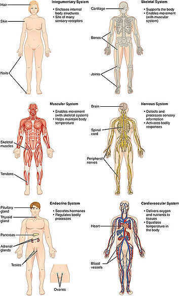
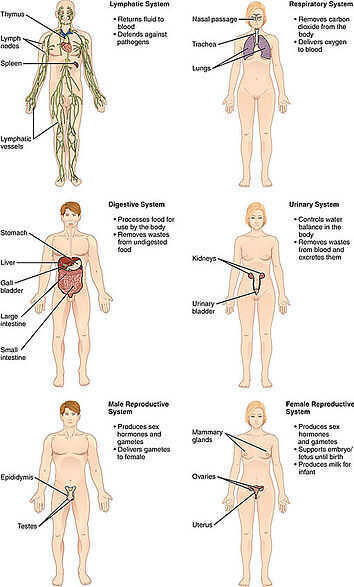

# Organ Systems

1. [Circulatory system](https://en.wikipedia.org/wiki/Circulatory_system):
    - Circulates [blood](https://en.wikipedia.org/wiki/Blood) around the body via the [heart](https://en.wikipedia.org/wiki/Human_heart), [arteries](https://en.wikipedia.org/wiki/Artery) and [veins](https://en.wikipedia.org/wiki/Vein), delivering [oxygen](https://en.wikipedia.org/wiki/Oxygen) and nutrients to organs and cells and carrying their waste products away.
    - Equalizes temperature in the body
    - Platelets ensure that the blood can clot and heal over time, while red blood cells ensure that oxygen reaches vital organs.

2. [Digestive system](https://en.wikipedia.org/wiki/Digestive_system):
    - Mechanical and chemical processes that provide nutrients via the [mouth](https://en.wikipedia.org/wiki/Human_mouth), [esophagus](https://en.wikipedia.org/wiki/Esophagus), [stomach](https://en.wikipedia.org/wiki/Stomach) and [intestines](https://en.wikipedia.org/wiki/Intestine).
    - Eliminates waste from the body.

3. [Endocrine system](https://en.wikipedia.org/wiki/Endocrine_system):
    - Provides chemical communications within the body using [hormones](https://en.wikipedia.org/wiki/Hormone).

4. [Integumentary system](https://en.wikipedia.org/wiki/Integumentary_system)/[Exocrine system](https://en.wikipedia.org/wiki/Exocrine_system):
    - [Skin](https://en.wikipedia.org/wiki/Human_skin), [hair](https://en.wikipedia.org/wiki/Human_hair), [nails](https://en.wikipedia.org/wiki/Nail_(anatomy)), [sweat](https://en.wikipedia.org/wiki/Sweat_gland) and other [exocrine glands](https://en.wikipedia.org/wiki/Exocrine_gland).

5. [Lymphatic system](https://en.wikipedia.org/wiki/Lymphatic_system)/[Immune system](https://en.wikipedia.org/wiki/Immune_system):
    - The system comprising a network of lymphatic vessels that carry a clear fluid called [lymph](https://en.wikipedia.org/wiki/Lymph).
    - Defends the body against pathogenic viruses that may endanger the body .

6. [Muscular system](https://en.wikipedia.org/wiki/Muscular_system):
    - Enables the body to move using [muscles](https://en.wikipedia.org/wiki/Muscle).

7. [Nervous system](https://en.wikipedia.org/wiki/Nervous_system):
    - Collects and processes information from the [senses](https://en.wikipedia.org/wiki/Sense) via [nerves](https://en.wikipedia.org/wiki/Nerve) and the [brain](https://en.wikipedia.org/wiki/Human_brain) and tells the [muscles](https://en.wikipedia.org/wiki/Muscle) to contract to cause physical actions.

8. *[Renal system](https://en.wikipedia.org/wiki/Renal_system)/[Urinary system](https://en.wikipedia.org/wiki/Urinary_system)*/[*Excretory system*](https://en.wikipedia.org/wiki/Excretory_system):
    - *The system where the [kidneys](https://en.wikipedia.org/wiki/Kidneys) filter blood.*

9. [Reproductive system](https://en.wikipedia.org/wiki/Reproductive_system):
    - The [sex organs](https://en.wikipedia.org/wiki/Sex_organ) required for the production of [offspring](https://en.wikipedia.org/wiki/Offspring).

10. [Respiratory system](https://en.wikipedia.org/wiki/Respiratory_system):
    - The [lungs](https://en.wikipedia.org/wiki/Lung) and the [trachea](https://en.wikipedia.org/wiki/Trachea) that bring air into and out of the body.

11. [Skeletal system](https://en.wikipedia.org/wiki/Skeletal_system):
    - [Bones](https://en.wikipedia.org/wiki/Bone) supporting the body and its [organs](https://en.wikipedia.org/wiki/Organ_(anatomy)).

Bone to bone connection - ligament

Bone to muscle connection - tendon

Both ligament and tendon are made up of collagen (specially type-1 collagen and type-3 collagen and elastin)
