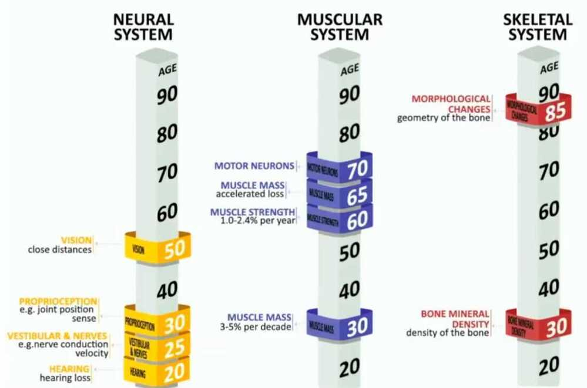
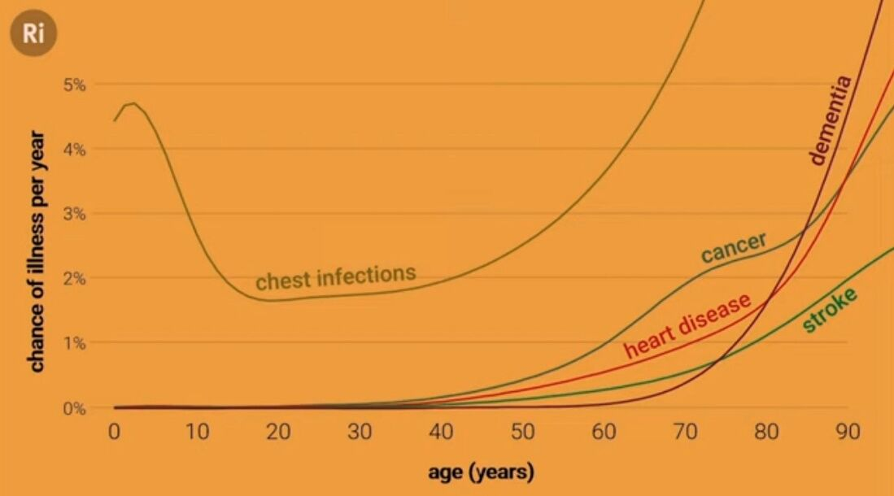
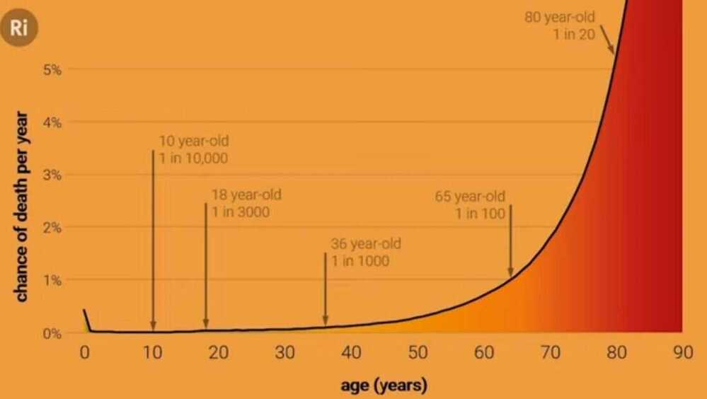

# Others

## Blinkists

1. The End of Illness
2. What to Eat When by Michael Roizen, Michael Crupain and Ted Spiker
3. The Longevity Paradox by Dr. Stevan Gundry
4. Eat to beat disease by William W. Li

## Autophagy

Autophagy (or autophagocytosis) (from the Ancient Greek) αὐτόφαγοςautóphagos, meaning "self-devouring" andκύτοςkýtos, meaning "hollow") is the natural, regulated mechanism of the cell that disassembles unnecessary or dysfunctional components.It allows the orderly degradation and recycling of cellular components

https://en.wikipedia.org/wiki/Autophagy

## Angiogenesis

Physiological process through which new blood vessels form from per-existing vessels, formed in the earlier stage of vasculogenesis.

- Vital process in growth and development, as well as in wound healing and in the formation of granulation tissue

## Tomography

Tomography is [imaging](https://en.wikipedia.org/wiki/Image)by sections or sectioning, through the use of any kind of penetrating [wave](https://en.wikipedia.org/wiki/Wave). The method is used in [radiology](https://en.wikipedia.org/wiki/Radiology),[archaeology](https://en.wikipedia.org/wiki/Archaeology),[biology](https://en.wikipedia.org/wiki/Biology),[atmospheric science](https://en.wikipedia.org/wiki/Atmospheric_science),[geophysics](https://en.wikipedia.org/wiki/Geophysics),[oceanography](https://en.wikipedia.org/wiki/Oceanography),[plasma physics](https://en.wikipedia.org/wiki/Plasma_physics),[materials science](https://en.wikipedia.org/wiki/Materials_science),[astrophysics](https://en.wikipedia.org/wiki/Astrophysics),[quantum information](https://en.wikipedia.org/wiki/Quantum_information), and other areas of science. The word *tomography* is derived from Ancient Greek τόμος *tomos*, "slice, section" and γράφω*graphō*, "to write" (see also[Etymology](https://en.wikipedia.org/wiki/Etymology)). A device used in tomography is called a **tomograph**, while the image produced is a tomogram

https://en.wikipedia.org/wiki/Tomography

## Heart

### Mild Aortic Stenosis

Aortic stenosis is a heart valve disease that occurs when the aortic valve narrows, preventing blood from flowing normally from the heart to the body. Mild to moderate aortic stenosis may not cause significant symptoms, and many people with mild cases may not notice anything. When symptoms do occur, they can include: Tiredness, Swollen ankles, Heart murmur, Needing to put more effort into physical activity, and Chest pain after activity in children and infants.

Over time, the heart's left ventricle has to work harder to pump blood through the narrowed valve, which can cause it to thicken, enlarge, and weaken. If left untreated, this can lead to heart failure.

### Degenerative valve disease (DVD)

Degenerative valve disease (DVD) is a common heart disease that affects both humans and dogs. In humans, it's the most common type of valvular heart disease in the United States and Europe, and is the primary cause of regurgitant and stenotic valvular lesions. In dogs, it's the most common heart disease and the leading cause of congestive heart failure (CHF).

In humans, DVD can cause myxomatous mitral valve disease, calcified tricuspid aortic valve disease, and calcified bicuspid aortic valve disease. In dogs, the mitral valve is most commonly affected, but the tricuspid valve is also involved in 30% of cases. The disease causes the valves to thicken and develop a lumpy appearance, which prevents them from forming a tight seal between the atrium and ventricle. This causes the valves to leak blood backwards into the upper chambers, which is called regurgitation. The regurgitation can cause an abnormal sound called a heart murmur, which a veterinarian can typically hear with a stethoscope.

In humans, medicines like beta-blockers, digoxin, and calcium channel blockers can help relieve symptoms by controlling the heart rate and preventing abnormal heart rhythms. In dogs, DVD is a chronic, slowly progressive process that can affect dogs for more than five years before resulting in heart failure and death. However, most dogs with asymptomatic CVD can live for many years without ever developing any clinical signs of heart failure.

### Angiography

Angiography, also known as a catheter angiogram, is a type of X-ray that examines blood vessels in the body. It uses a special dye called a contrast agent to highlight blood vessels that don't show up clearly on a normal X-ray. The dye moves through the blood vessels, allowing a doctor to see any problems. The X-ray images created during angiography are called angiograms.

Angiography can be used to examine the vascular system, and is sometimes used to diagnose conditions like heart disease, kidney infections, and blood clots.

During an angiography procedure, a patient is usually awake, but general anesthesia may be used for young children. The procedure involves:

1. Cleaning and numbing an area of the body, such as the arm or groin
2. Making a small cut in the skin over an artery
3. Inserting a long, thin, flexible tube called a catheter into the artery and guiding it to the area being examined
4. Injecting the contrast dye into the catheter
5. Taking X-ray images to see how the dye moves through the artery

After the procedure, a healthcare provider may find blockages that don't require further treatment, or they may recommend more invasive treatment.

### Computed tomography angiography (CTA)

Computed tomography angiography (CTA) is a medical imaging test that combines a CT scan with a dye injection to create images of blood vessels and tissues in the body. The dye, called a contrast material, is injected intravenously (IV) into an arm or hand to enhance the blood vessels and tissues being studied. The CT scan then takes specialized X-rays of the highlighted areas.

### Angioplasty

A treatment that widens narrowed blood vessels to improve blood flow. During an angioplasty, a catheter or tiny tube is inserted through a blockage, and a balloon is placed on a wire and passed into the narrowed artery. The balloon is then inflated to enlarge the narrow segment, and sometimes a stent is placed to keep the blood vessel open. Angioplasty can take 30 minutes to two hours, and patients are usually released from the hospital 1–2 days after the procedure. Potential side effects include allergic reactions to the dye, blood vessel injury, restenosis, blood clots, and bleeding.

Others

- IVUS + IVL + PCI
- Essentric vs concentric calcified lesions

### Echocardiogram

An echocardiogram, or "echo", is a non-invasive ultrasound scan that uses sound waves to create images of the heart and nearby blood vessels. The scan is painless and doesn't expose the patient to radiation.

During an echo, a healthcare provider places a small probe, called a transducer, on the patient's chest and moves it around. The probe emits high-frequency sound waves that bounce off the heart's valves and chambers, creating echoes. The echoes are recorded and a computer turns them into moving images that appear on a monitor. The images provide more detailed information than an X-ray and can help the provider evaluate the heart's pumping action.

Doctors often use echoes to:

- Assess left ventricular dysfunction
- Rule out the heart as a source of a blood clot
- Characterize murmurs
- Check for signs of a heart attack, such as impaired blood supply, wall abnormalities, and blood flow
- Look for blood clots or tumors
- Evaluate atherosclerosis and coronary artery disease

To prepare for an echo, patients may be asked to lie still on an exam table, breathe in a certain way, or roll onto their left side. They may also receive oxygen through a face mask or tube in their nostrils. For some types of echoes, patients may need to take sedating medication or have their throat numbed with a spray or gel.

## Glands

Your body has two types of sweat glands:

- eccrine glands, which secrete an odorless mixture of water and salt to cool your skin and lower your body temperature
- apocrine glands, which produce the smelly substance we usually associate with sweating

## Old Age / Ageing

- How you age

[Getting older without getting old - with Andrew Steele](https://www.youtube.com/watch?v=fX9P1xuIJGg)

[David Sinclair: Living to 120 - YouTube](https://www.youtube.com/watch?v=NK-H8Uq3x0Q)

Hydra don't age

### What is Ageing

1. DNA damage and mutations
2. Trimmed telomeres
3. Protein problems
4. Epigenetic alterations
5. Senescent cells
6. Malfunctioning mitochondria
7. Signalling changes
8. Microbiome changes
9. Cellular exhaustion
10. Immune malfunction

[The science of super longevity | Dr. Morgan Levine - YouTube](https://www.youtube.com/watch?v=B_CqKVU19ec)

[Bryan Johnson - YouTube](https://www.youtube.com/@bryanjohnson)

- [I Designed the Perfect Anti-Aging Diet ($16/day) - YouTube](https://www.youtube.com/watch?v=foa9ZhtyrfM&ab_channel=BryanJohnson)
- [Does Bryan Johnson’s $2m biohacking routine actually work? We tested it to see | Hard Reset - YouTube](https://www.youtube.com/watch?v=ECTBg2AtOfc&ab_channel=Freethink)
- [How I Reversed My Hair Loss + Greying - YouTube](https://www.youtube.com/watch?v=F25RiUZQSLQ&ab_channel=BryanJohnson)
- [How I FIXED My Terrible Sleep - 10 Habits - YouTube](https://www.youtube.com/watch?v=Wk9p3dhMYdk&ab_channel=BryanJohnson)
- [Scientists find humans age dramatically in two bursts – at 44, then 60 | Medical research | The Guardian](https://www.theguardian.com/science/article/2024/aug/14/scientists-find-humans-age-dramatically-in-two-bursts-at-44-then-60-aging-not-slow-and-steady)

## Links

[The more fertile you are, the sooner you may die](https://www.msn.com/en-in/lifestyle/whats-hot/the-more-fertile-you-are-the-sooner-you-may-die-study/ar-AA1lA8ML)
