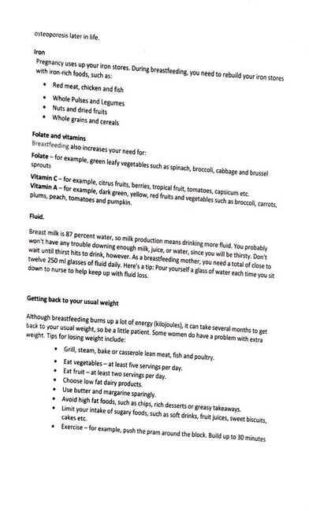

# Pregnancy / Baby

## Pregnancy

<https://www.youtube.com/watch?v=F_ssj7-8rYg>

<https://www.parents.com/pregnancy/giving-birth/labor-and-delivery/checklist-how-to-write-a-birth-plan>

15 percent of pregnancies end in miscarriage

[Bridget Teyler - YouTube](https://www.youtube.com/@BridgetTeyler)

## Baby movements

- Try to perform a kick count around the same time each day, preferably during a time when your baby is usually active, so you get an accurate count. If they usually start kicking after you eat, for example, [have a snack](https://www.verywellfamily.com/great-pregnancy-snacks-2759344) and then lie down for a few hours while counting the number of times you feel them kick.
- If you feel at least 10 kicks or movements within an hour or 20 within two hours, everything is likely fine.
- But doctors don't consider your baby "[full term](https://www.babycenter.com/pregnancy/your-body/full-term-pregnancy_10407757)" until [39 weeks](https://www.babycenter.com/pregnancy/week-by-week/39-weeks-pregnant). Spending the next two weeks in the womb allows [your baby's brain](https://www.babycenter.com/pregnancy/your-baby/fetal-development-your-babys-brain_20004924), lungs, and nervous system to fully mature.

## C-Section

- placenta previa, in which going into labor would precipitate life-threatening hemorrhaging, or cord prolapse, which can cause the death of a baby if a C-section is not performed in a manner of minutes.

Health care providers might recommend a C-section if -

- **Labor isn't progressing normally.** Labor that isn't progressing (labor dystocia) is one of the most common reasons for a C-section. Issues with labor progression include prolonged first stage (prolonged dilation or opening of the cervix) or prolonged second stage (prolonged time of pushing after complete cervical dilation).
- **The baby is in distress.** Concern about changes in a baby's heartbeat might make a C-section the safest option.
- **The baby or babies are in an unusual position.** A C-section is the safest way to deliver babies whose feet or buttocks enter the birth canal first (breech) or babies whose sides or shoulders come first (transverse).
- **You're carrying more than one baby.** A C-section might be needed for women carrying twins, triplets or more. This is especially true if labor starts too early or the babies are not in a head-down position.
- **There's a problem with the placenta.** If the placenta covers the opening of the cervix (placenta previa), a C-section is recommended for delivery.
- **Prolapsed umbilical cord.** A C-section might be recommended if a loop of umbilical cord slips through the cervix in front of the baby.
- **There's a health concern.** A C-section might be recommended for women with certain health issues, such as a heart or brain condition.
- **There's a blockage.** A large fibroid blocking the birth canal, a pelvic fracture or a baby who has a condition that can cause the head to be unusually large (severe hydrocephalus) might be reasons for a C-section.
- **You've had a previous C-section or other surgery on the uterus.** Although it's often possible to have a vaginal birth after a C-section, a health care provider might recommend a repeat C-section.

### Risks

Like other types of major surgery, C-sections carry risks.

Risks to babies include:

- **Breathing problems.** Babies born by scheduled C-section are more likely to develop a breathing issue that causes them to breathe too fast for a few days after birth (transient tachypnea).
- **Surgical injury.** Although rare, accidental nicks to the baby's skin can occur during surgery.

Risks to mothers include:

- **Infection.** After a C-section, there might be a risk of developing an infection of the lining of the uterus (endometritis), in the urinary tract or at the site of the incision.
- **Blood loss.** A C-section might cause heavy bleeding during and after delivery.
- **Reactions to anesthesia.** Reactions to any type of anesthesia are possible.
- **Blood clots.** A C-section might increase the risk of developing a blood clot inside a deep vein, especially in the legs or pelvis (deep vein thrombosis). If a blood clot travels to the lungs and blocks blood flow (pulmonary embolism), the damage can be life-threatening.
- **Surgical injury.** Although rare, surgical injuries to the bladder or bowel can occur during a C-section.
- **Increased risks during future pregnancies.** Having a C-section increases the risk of complications in a later pregnancy and in other surgeries. The more C-sections, the higher the risks of placenta previa and a condition in which the placenta becomes attached to the wall of the uterus (placenta accreta).

    A C-section also increases the risk of the uterus tearing along the scar line (uterine rupture) for women who attempt a vaginal delivery in a later pregnancy.

## NST

It is a non-invasive test used for the surveillance of high-risk pregnancies when the fetus is judged clinically to be at risk for hypoxemia or increased risk of death. Trained and certified nurses, midwives and physicians should read and interpret the non-stress test. The NST readings are as reactive and none reactive. The non-stress tests can initiate at 26 to 28 weeks. The NST is reactive from 32 weeks.

## Pregnancy Diet

## Others

- Breastfeeding mothers do not ovulate
- Lochia postpartum bleeding 6 weeks
- Lanugo
- [Why Babies Can't Drink Water - YouTube](https://www.youtube.com/watch?v=4DQv80biYbs&ab_channel=InsiderScience)
