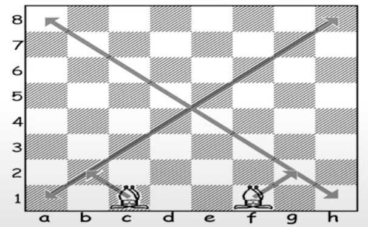

# Chess

**King - Priceless, Queen - 9, Rook - 5, Bishop (better than knight) - 3, Knight - 3, Pawn - 1**

**Algebraic Notation**

<https://www.wikiwand.com/en/Algebraic_notation_(chess)>

Kfor[king](https://www.wikiwand.com/en/King_(chess)),Qfor[queen](https://www.wikiwand.com/en/Queen_(chess)),Rfor[rook](https://www.wikiwand.com/en/Rook_(chess)),Bfor[bishop](https://www.wikiwand.com/en/Bishop_(chess)), andNfor[knight](https://www.wikiwand.com/en/Knight_(chess))(since K is already used).

**Moves**

Each move of a piece is indicated by the piece's uppercase letter, plus the coordinate of the destination square. For example,**Be5**(move a bishop to e5),**Nf3**(move a knight to f3). For pawn moves, a letter indicating pawn is not used, only the destination square is given. For example,**c5**(move a pawn to c5).

**Is it possible to checkmate with only a knight and a king against a lone king?**

- If you drive an enemy king into a corner, you still need to control four different squares to checkmate him. Your king can control two of those squares (but cannot approach the enemy king), your knight can control the third, but there is no way of controlling the fourth. That is, it is impossible for the knight to control both the corner square and the one adjacent to the enemy king (the one your own king doesn't control).
- So the result would be a draw -- insufficient material to win.

- Not only this, but N+N+K vs. K can't even win! This is one of the great tragedies of chess

- Checkmate with either 1 bishop or 1 knight and a king against a lone king is IMPOSSIBLE.

**Principle**

- Never move a chess piece twice before 1st 10 moves
- Try to control as much of the center as possible (Control the center)
- Do castle in first 7 moves

**Tactics and Strategy**

- Double attack
- Fork (royal fork - when both king and queen are attacked)
- Pin
  - Absolute pin (pin on king)
  - Relative pin
- Skewer
  - When you attack a valuable piece, compel it to move to avoid capture, which then exposes a less valuable piece for capture
  - You may be vulnerable to a pin or skewer tactic if you have multiple pieces on the same file, rank or diagonal
- Deflection
  - When you chase away a piece from an important square
  - You may be vulnerable to a deflection tactic if one of your pieces has a defensive reponsibility
- Discover check or discover attack
- Double check
- Clearance

When you move one of your pieces out of the way of another. This will allow one of your pieces to then make use of a certain square, file, rank or diagonal

- Interference

When you disrupt the coordination between enemy pieces

- Staying coordinated (Having your pieces defending one another) makes it more difficult for your opponent to use a tactic to win material

- Windmill

A combination where two pieces work together to deliver an alternating series of checks and discovered checks

- Tactics are the servant of strategy

**Checkmates**

- Smothered checkmate
- The support checkmate
- The back rank checkmate

**Terms**

- Gambit

A gambit is a term used to show that a player has sacrificed one or more of their pawns for early development of their pieces

e.g. The Danish gambit, The Queen's gambit, King's gambit

- Patzer

Player who is very poor at chess (German origin)

- Fianchetto

Refers to the development of a Bishop along the longest diagonals on the Chessboard (b2 and g2)

- En Passant

Special capturing right in Chess for pawn

- Exchange

When during a game the players capture pieces of equal value.

- Smothered mate

When a checkmate occurs in which the mated king is surrounded by its own pieces

- Promotion

When a pawn reaches the eighth rank, it gets promoted and becomes any piece of the player's choice (a pawn cannot remain a pawn)

- The centre (e4, d4, e5, d5)
- Sacrifice
- Blunder
- Hope chess

Making a threatening move towards your opponent even though you know it's bad, and hope they won't respond well

**Proverbs**

- Tactics are the servant of strategy

**Fast Chess**

**Fast chess**is a type of[chess](https://www.wikiwand.com/en/Chess)in which each player is given less time to consider their moves than normal tournament[time controls](https://www.wikiwand.com/en/Time_control)allow. Fast chess is further subdivided, by decreasing time controls, into[rapid chess](https://www.wikiwand.com/en/Fast_chess#Rapid),[blitz chess](https://www.wikiwand.com/en/Fast_chess#Blitz), and[bullet chess](https://www.wikiwand.com/en/Fast_chess#Bullet).[Armageddon chess](https://www.wikiwand.com/en/Fast_chess#Armageddon)is a particular variation in which different rules apply for each of the two players.

<https://www.wikiwand.com/en/Fast_chess>

**FIDE - World Chess Federation**

**ELO Rating System**

The Elo rating system is a method for calculating the relative skill levels of players in[zero-sum games](https://www.wikiwand.com/en/Zero-sum_game)such as[chess](https://www.wikiwand.com/en/Chess). It is named after its creator[Arpad Elo](https://www.wikiwand.com/en/Arpad_Elo), a Hungarian-American physics professor.

The Elo system was originally invented as an improved chess-rating system over the previously used[Harkness system](https://www.wikiwand.com/en/Harkness_rating_system), but is also used as a rating system for multiplayer competition in a number of[video games](https://www.wikiwand.com/en/Video_game),[association football](https://www.wikiwand.com/en/Association_football),[American football](https://www.wikiwand.com/en/American_football),[basketball](https://www.wikiwand.com/en/Basketball), [Major League Baseball](https://www.wikiwand.com/en/Major_League_Baseball),[table tennis](https://www.wikiwand.com/en/Table_tennis),[board games](https://www.wikiwand.com/en/Board_game) such as[Scrabble](https://www.wikiwand.com/en/Scrabble) and [Diplomacy](https://www.wikiwand.com/en/Diplomacy_(game)), and other games.

The difference in the ratings between two players serves as a predictor of the outcome of a match. Two players with equal ratings who play against each other are expected to score an equal number of wins. A player whose rating is 100 points greater than their opponent's is expected to score 64%; if the difference is 200 points, then the expected score for the stronger player is 76%.

A player's Elo rating is represented by a number which may change depending on the outcome of rated games played. After every game, the winning player takes points from the losing one. The difference between the ratings of the winner and loser determines the total number of points gained or lost after a game. If the high-rated player wins, then only a few rating points will be taken from the low-rated player. However, if the lower-rated player scores an[upset win](https://www.wikiwand.com/en/Upset_(competition)), many rating points will be transferred. The lower-rated player will also gain a few points from the higher rated player in the event of a draw. This means that this rating system is self-correcting. Players whose ratings are too low or too high should, in the long run, do better or worse correspondingly than the rating system predicts and thus gain or lose rating points until the ratings reflect their true playing strength.

An Elo rating is a comparative rating only, and is valid only within the rating pool where it was established.

<https://www.wikiwand.com/en/Elo_rating_system>

<https://www.youtube.com/playlist?list=PLE0EA747B97FADD86>

<https://www.youtube.com/playlist?list=PLQsLDm9Rq9bHKEBnElquF8GuWkI1EJ8Zp>
