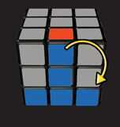
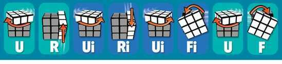
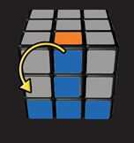
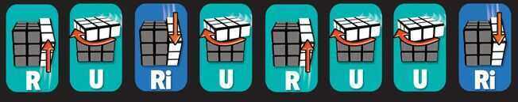
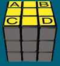
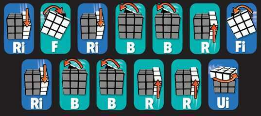
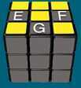
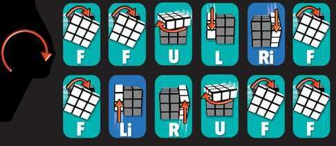
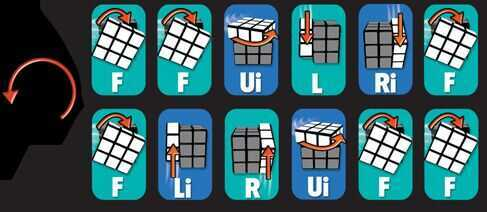

# Rubix Rubics Cube

**Formulas**

**Formula -**

**RUR'U'**

**L'U'LU**

**Middle Layer**

Clockwise

URUiRiUiFiUF

Anti-clockwise

UiLiULUFUiFi

**Top Face**

1. Make a yellow cross

FURUiRiFi

OR

F (RUR'U') F'

2. Make all corners yellow

RURiURUURi

**Final Layer**

1. Positions yellow corner correctly

R'FR'BBRF'

R'BBRRU'

2. Position yellow edges correctly

Clockwise

FFULR'F

FL'RUFF

Anti-clockwise

FFU'LR'F

FL'RU'FF

**CFOP**

**C - Cross**

**F - F2L (First 2 Layers)**

**O - Orienting Last Layer**

**P - Permutating Last Layer**

**Fridrick F2L**

**Basics**

**Middle Layer**

**Solve the Top Face -**

https://www.rubiks.com/blog/how-to-solve-the-rubiks-cube-stage-5

1. **Make a yellow cross**

1. **Make all the corners yellow**

State 1

If no corner Cubes are yellow on the top face, you must have yellow left corner or left face as shown.

State 2

If one corner Cube is yellow match your top face as shown and do the sequence below.

State 3

If any two corner Cubes are yellow don't worry about their position. You MUST match the front face with a yellow left corner as shown Do this sequence 1, 2 or 3 times to achieve a complete yellow top face. After each sequence, orient the Rubik's Cube to REMATCH the top face to the appropriate state and repeat the sequence until all the corners are yellow

https://www.rubiks.com/blog/how-to-solve-the-rubiks-cube-stage-6

**Final Layer**

1st Step: Position yellow corners correctly

While holding your Rubik's Cube as shown above, look at the top face. Place the 2 correct corners in the back A, B or diagonally A, D or B, C across from each other.

If you need to switch diagonal corners like B and C or D and A, then do the sequence once. Then, orient the Cube so the 2 correct corners are in the back and do the sequence again.

R'FR'BBRF'

R'BBRRU'

2nd Step: Position yellow edges correctly

If 1 edge is correct and 3 edges are incorrect orient the Rubik's Cube so the face with the correct edge is the back face. Then determine if the edge pieces need to move clockwise or counter-clockwise and do the correct sequence below.

If all 4 edges are incorrect, then do either sequence below once, and then determine what direction the three edge pieces need to move and do the correct sequence below.

To cycle EFG Clockwise or EFGH Clockwise

To cycle EFG Counter-Clockwise or EFGH Counter-Clockwise

