# Sudoku Techniques

https://www.learn-sudoku.com/basic-techniques.html

https://www.learn-sudoku.com/advanced-techniques.html

## Basic Techniques

1. Open Singles

    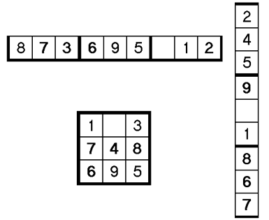

2. Visual Elimination
3. Lone Singles
4. Locked Candidates
5. Hidden Single

    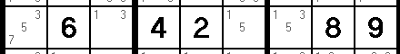

    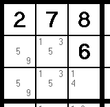

6. Naked Pair

    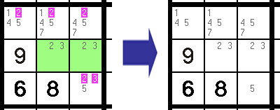

7. Naked Triplets & Quad in block

    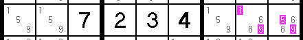

    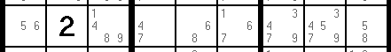

    They are the middle cell and the two cells on each end. Believe it or not, they make up a Naked Triplet. These cells *must* end up being the 5, 6, & 8, because together they share *only those three candidates*. The rule still applies - and you can safely remove 5, 6, & 8 from the other cells.

    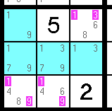

8. Hidden pairs

    A Hidden Pair is basically just a "buried" Naked Pair. It occurs when two pencil marks appear in*exactly two cells*within the same house (row, column, or block).

    This time, however, the pair is not "Naked" - it is buried (or hidden) among other pencil marks.

    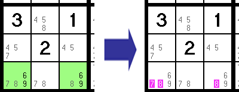

9. Hidden Triplets & Quads

    

## Advanced Techniques

1. **X-Wing**

    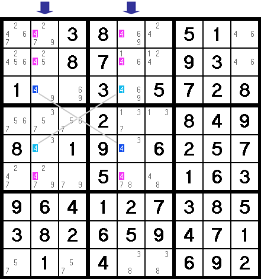

2. **Swordfish**

    Just as the[X-Wing](https://www.learn-sudoku.com/x-wing.html)involves two candidates in two columns or rows, the Swordfish involves *three* candidates in *three* columns or rows.

    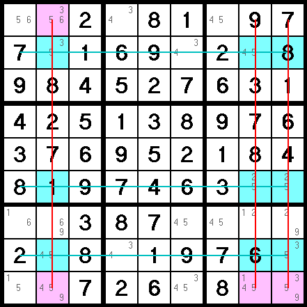

3. **Finned swordfish**

4. **XY Wing**

    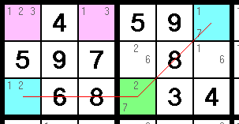

5. **Unique Rectangle**

    the logic it uses assumes the fact that the Sudoku puzzle you are working on has*only one unique answer*.

    This only works when four cells fall into**exactly two blocks**.

    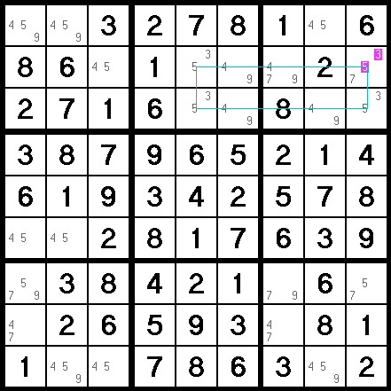
