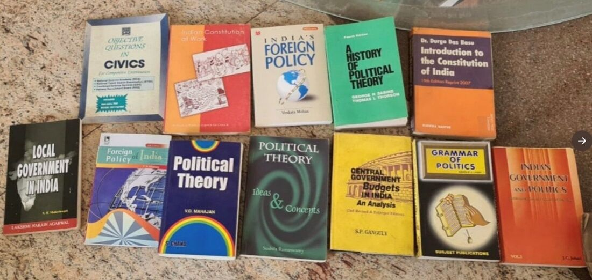
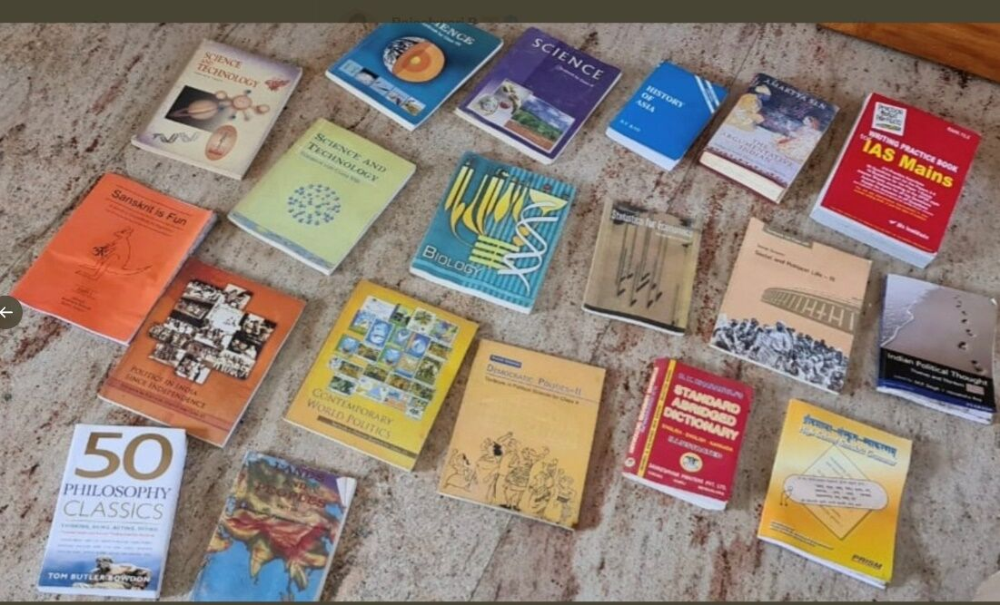

# Intro

Knowledge is a familiarity, awareness, or understanding of someone or something, such as [facts](https://en.wikipedia.org/wiki/Fact), [information](https://en.wikipedia.org/wiki/Information), [descriptions](https://en.wikipedia.org/wiki/Description), or [skills](https://en.wikipedia.org/wiki/Skills), which is acquired through [experience](https://en.wikipedia.org/wiki/Experience) or [education](https://en.wikipedia.org/wiki/Education) by [perceiving](https://en.wikipedia.org/wiki/Perception), [discovering](https://en.wikipedia.org/wiki/Discovery_(observation)), or [learning](https://en.wikipedia.org/wiki/Learning).

Knowledge can refer to a [theoretical](https://en.wikipedia.org/wiki/Theoretical) or [practical](https://en.wikipedia.org/wiki/Practical) understanding of a subject. It can be implicit (as with practical skill or expertise) or explicit (as with the theoretical understanding of a subject); it can be more or less formal or systematic.

In [philosophy](https://en.wikipedia.org/wiki/Philosophy), the study of knowledge is called **[epistemology](https://en.wikipedia.org/wiki/Epistemology)** ; the philosopher [Plato](https://en.wikipedia.org/wiki/Plato) famously defined knowledge as "[justified true belief](https://en.wikipedia.org/wiki/Justified_true_belief)", though this definition is now thought by some analytic philosophersto be problematic because of the [Gettier problems](https://en.wikipedia.org/wiki/Gettier_problem), while others defend the platonic definition.However, several definitions of knowledge and theories to explain it exist.

Knowledge acquisition involves complex [cognitive](https://en.wikipedia.org/wiki/Cognition) processes:[perception](https://en.wikipedia.org/wiki/Perception), [communication](https://en.wikipedia.org/wiki/Communication), and [reasoning](https://en.wikipedia.org/wiki/Reasoning); while knowledge is also said to be related to the capacity ofacknowledgementin human beings.

- Communicating knowledge
- Situated knowledge
- Partial knowledge
- Scientific knowledge

STEM - Science, Technology, Engineering and Mathematics

References

<https://en.wikipedia.org/wiki/Knowledge>

## Home Economics

Home economics, domestic science or home science is a field of studythat deals with the relationship between individuals, families, communities, and the environment in which they live.

<https://en.wikipedia.org/wiki/Home_economics>

## UPSC

PUBAD - Public Administration

PSIR - Political Science & International Relations

[UPSC Prelims 2022 Hacks | Mnemonics & Mindmaps | International Organisations](https://youtu.be/t08_LW_Du_U)

- JUICE with GF
- JUICE with Russian GF

- GURU JI SITA AB SSC FCI ME job karti hai
- SIR'S BEAUTIFU_ MAGICS Just C

[UPSC Prelims 2022 Hacks | Mnemonics & Mindmaps | Important Water Bodies](https://youtu.be/xZAmmOQwSRc)

[UPSC Prelims 2022 Hacks | Mnemonics & Mindmaps | Ancient History & Modern History](https://youtu.be/REZoXo5TqP4)

[UPSC Prelims 2022 Hacks | Mnemonics & Mindmaps | Geography & Environment](https://youtu.be/PoOfyRtWMJM)

[UPSC Prelims 2022 Hacks | Mnemonics & Mindmaps | Geography & Environment - Part II](https://youtu.be/wysaceX6BkU)

Episode 7 - [UPSC Prelims 2022 Hacks | Mnemonics & Mindmaps | Indian Polity](https://youtu.be/eZbu_MSh-p8)

Episode 8 - [UPSC Prelims 2022 Hacks | Mnemonics & Mindmaps | Indian Polity](https://youtu.be/b7VkE1CeDr8)

Complete M Laxmikanth Polity in 100 Parts by Dr Sidharth Arora Crack UPSC CSEIAS 20212223

## Books

