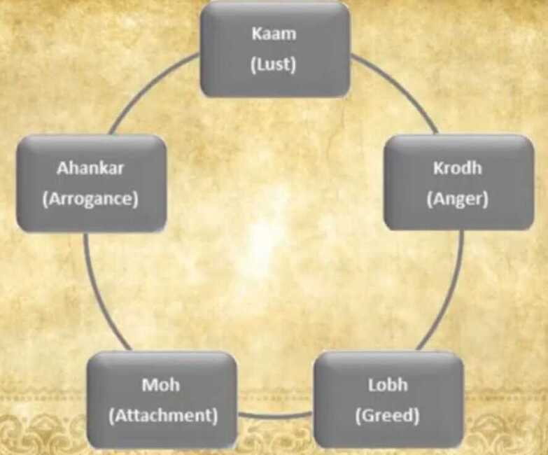

# Knowledge of Humanity

## Humanities

## Arts

## Performing arts

- [Music](https://en.wikipedia.org/wiki/Music)([outline](https://en.wikipedia.org/wiki/Outline_of_music))
  - [Accompanying](https://en.wikipedia.org/wiki/Accompaniment)
  - [Chamber music](https://en.wikipedia.org/wiki/Chamber_music)
  - [Church music](https://en.wikipedia.org/wiki/Church_music)
  - [Conducting](https://en.wikipedia.org/wiki/Conducting)
    - [Choral conducting](https://en.wikipedia.org/wiki/Choir)
    - [Orchestral conducting](https://en.wikipedia.org/wiki/Orchestra)
    - [Wind ensemble conducting](https://en.wikipedia.org/wiki/Concert_band)
  - [Early music](https://en.wikipedia.org/wiki/Early_music)
  - [Jazz studies](https://en.wikipedia.org/wiki/Jazz)([outline](https://en.wikipedia.org/wiki/Outline_of_jazz))
  - [Musical composition](https://en.wikipedia.org/wiki/Musical_composition)
  - [Music education](https://en.wikipedia.org/wiki/Music_education)
  - [Music history](https://en.wikipedia.org/wiki/Music_history)
  - [Musicology](https://en.wikipedia.org/wiki/Musicology)
    - [Historical musicology](https://en.wikipedia.org/wiki/Music_history)
    - [Systematic musicology](https://en.wikipedia.org/wiki/Systematic_musicology)
  - [Ethnomusicology](https://en.wikipedia.org/wiki/Ethnomusicology)
  - [Music theory](https://en.wikipedia.org/wiki/Music_theory)
  - [Orchestral studies](https://en.wikipedia.org/wiki/Orchestra)
  - [Organology](https://en.wikipedia.org/wiki/Organology)
    - [Organ](https://en.wikipedia.org/wiki/Organ_(music)) and [historical keyboards](https://en.wikipedia.org/wiki/Keyboard_instrument)
    - [Piano](https://en.wikipedia.org/wiki/Piano)
    - [Strings](https://en.wikipedia.org/wiki/String_instrument), [harp](https://en.wikipedia.org/wiki/Harp), [oud](https://en.wikipedia.org/wiki/Oud), and [guitar](https://en.wikipedia.org/wiki/Guitar)([outline](https://en.wikipedia.org/wiki/Outline_of_guitars))
    - [Singing](https://en.wikipedia.org/wiki/Singing)
    - [Woodwinds](https://en.wikipedia.org/wiki/Woodwind_instrument), [brass](https://en.wikipedia.org/wiki/Brass_instrument), and [percussion](https://en.wikipedia.org/wiki/Percussion_instrument)
  - [Recording](https://en.wikipedia.org/wiki/Sound_recording_and_reproduction)
- [Dance](https://en.wikipedia.org/wiki/Dance)([outline](https://en.wikipedia.org/wiki/Outline_of_dance))
  - [Choreography](https://en.wikipedia.org/wiki/Choreography)
  - [Dance notation](https://en.wikipedia.org/wiki/Dance_notation)
  - [Ethnochoreology](https://en.wikipedia.org/wiki/Ethnochoreology)
  - [History of dance](https://en.wikipedia.org/wiki/History_of_dance)
- [Television](https://en.wikipedia.org/wiki/Television)([outline](https://en.wikipedia.org/wiki/Outline_of_television_broadcasting))
  - [Television studies](https://en.wikipedia.org/wiki/Television_studies)
- [Theatre](https://en.wikipedia.org/wiki/Theatre)([outline](https://en.wikipedia.org/wiki/Outline_of_theatre))
  - [Acting](https://en.wikipedia.org/wiki/Acting)
  - [Directing](https://en.wikipedia.org/wiki/Theatre_director)
  - [Dramaturgy](https://en.wikipedia.org/wiki/Dramaturgy)
  - [History](https://en.wikipedia.org/wiki/History_of_theater)
  - [Musical theatre](https://en.wikipedia.org/wiki/Musical_theatre)
  - [Playwrighting](https://en.wikipedia.org/wiki/Playwrighting)
  - [Puppetry](https://en.wikipedia.org/wiki/Puppetry)
  - [Scenography](https://en.wikipedia.org/wiki/Scenography)
  - [Stage design](https://en.wikipedia.org/wiki/Scenic_design)
- [Film](https://en.wikipedia.org/wiki/Film_studies)([outline](https://en.wikipedia.org/wiki/Outline_of_film))
  - [Animation](https://en.wikipedia.org/wiki/Animation)
  - [Film criticism](https://en.wikipedia.org/wiki/Film_criticism)
  - [Filmmaking](https://en.wikipedia.org/wiki/Filmmaking)
  - [Film theory](https://en.wikipedia.org/wiki/Film_theory)
  - [Live action](https://en.wikipedia.org/wiki/Live_action)

## Visual arts

- [Fine arts](https://en.wikipedia.org/wiki/Fine_arts)
  - [Graphic arts](https://en.wikipedia.org/wiki/Graphic_arts)
    - [Drawing](https://en.wikipedia.org/wiki/Drawing)([outline](https://en.wikipedia.org/wiki/Outline_of_drawing_and_drawings))
    - [Painting](https://en.wikipedia.org/wiki/Painting)([outline](https://en.wikipedia.org/wiki/Outline_of_painting))
    - [Photography](https://en.wikipedia.org/wiki/Photography)([outline](https://en.wikipedia.org/wiki/Outline_of_photography))
  - [Sculpture](https://en.wikipedia.org/wiki/Sculpture)([outline](https://en.wikipedia.org/wiki/Outline_of_sculpture))
- [Applied arts](https://en.wikipedia.org/wiki/Applied_arts)
  - [Animation](https://en.wikipedia.org/wiki/Animation)
  - [Calligraphy](https://en.wikipedia.org/wiki/Calligraphy)
  - [Decorative arts](https://en.wikipedia.org/wiki/Decorative_arts)
  - [Mixed media](https://en.wikipedia.org/wiki/Mixed_media)
  - [Printmaking](https://en.wikipedia.org/wiki/Printmaking)
  - [Studio art](https://en.wikipedia.org/wiki/Studio_art)
  - [Architecture](https://en.wikipedia.org/wiki/Architecture)([Outline of architecture](https://en.wikipedia.org/wiki/Outline_of_architecture))
    - [Interior architecture](https://en.wikipedia.org/wiki/Interior_architecture)
    - [Landscape architecture](https://en.wikipedia.org/wiki/Landscape_architecture)
    - [Architectural analytics](https://en.wikipedia.org/wiki/Architectural_Analytics)
    - [Historic preservation](https://en.wikipedia.org/wiki/Historic_preservation)
    - [Interior design](https://en.wikipedia.org/wiki/Interior_design)([interior architecture](https://en.wikipedia.org/wiki/Interior_architecture))
    - [Landscape architecture](https://en.wikipedia.org/wiki/Landscape_architecture)([landscape planning](https://en.wikipedia.org/wiki/Landscape_planning))
    - [Landscape design](https://en.wikipedia.org/wiki/Landscape_design)
    - [Technical drawing](https://en.wikipedia.org/wiki/Technical_drawing)
    - [Information architecture](https://en.wikipedia.org/wiki/Information_architecture)
    - [Urban planning](https://en.wikipedia.org/wiki/Urban_planning)([urban design](https://en.wikipedia.org/wiki/Urban_design))
  - [Outline of design](https://en.wikipedia.org/wiki/Design)
    - [Fashion design](https://en.wikipedia.org/wiki/Fashion_design)
    - [Textile design](https://en.wikipedia.org/wiki/Textile_design)
    - [User experience design](https://en.wikipedia.org/wiki/User_experience_design)
      - [Interaction design](https://en.wikipedia.org/wiki/Interaction_design)
      - [User experience evaluation](https://en.wikipedia.org/wiki/User_experience_evaluation)
      - [User interface design](https://en.wikipedia.org/wiki/User_interface_design)
    - [Visual communication](https://en.wikipedia.org/wiki/Visual_communication)
      - [Graphic design](https://en.wikipedia.org/wiki/Graphic_design)
      - [Typography](https://en.wikipedia.org/wiki/Typography)
        - [Type design](https://en.wikipedia.org/wiki/Type_design)
    - [Industrial design](https://en.wikipedia.org/wiki/Industrial_design)([product design](https://en.wikipedia.org/wiki/Product_design))
      - [Ergonomics](https://en.wikipedia.org/wiki/Ergonomics)([outline](https://en.wikipedia.org/wiki/Outline_of_ergonomics))
      - [Game design](https://en.wikipedia.org/wiki/Game_design)
      - [Toy and amusement design](https://en.wikipedia.org/wiki/Toy)

## Languages and literature

- [Linguistics](https://en.wikipedia.org/wiki/Linguistics)([Outline of linguistics](https://en.wikipedia.org/wiki/Outline_of_linguistics))
  - [Applied linguistics](https://en.wikipedia.org/wiki/Applied_linguistics)
  - [Composition studies](https://en.wikipedia.org/wiki/Composition_studies)
  - [Computational linguistics](https://en.wikipedia.org/wiki/Computational_linguistics)
  - [Discourse analysis](https://en.wikipedia.org/wiki/Discourse_analysis)
  - [English studies](https://en.wikipedia.org/wiki/English_studies)
  - [Etymology](https://en.wikipedia.org/wiki/Etymology)
  - [Grammar](https://en.wikipedia.org/wiki/Grammar)
  - [Historical linguistics](https://en.wikipedia.org/wiki/Historical_linguistics)
  - [History of linguistics](https://en.wikipedia.org/wiki/History_of_linguistics)
  - [Interlinguistics](https://en.wikipedia.org/wiki/Interlinguistics)
  - [Lexicology](https://en.wikipedia.org/wiki/Lexicology)
  - [Linguistic typology](https://en.wikipedia.org/wiki/Linguistic_typology)
  - [Morphology (linguistics)](https://en.wikipedia.org/wiki/Morphology_(linguistics))
  - [Natural language processing](https://en.wikipedia.org/wiki/Natural_language_processing)
  - [Philology](https://en.wikipedia.org/wiki/Philology)
  - [Phonetics](https://en.wikipedia.org/wiki/Phonetics)
  - [Phonology](https://en.wikipedia.org/wiki/Phonology)
  - [Pragmatics](https://en.wikipedia.org/wiki/Pragmatics)
  - [Psycholinguistics](https://en.wikipedia.org/wiki/Psycholinguistics)
  - [Rhetoric](https://en.wikipedia.org/wiki/Rhetoric)
  - [Semantics](https://en.wikipedia.org/wiki/Semantics)
  - [Semiotics](https://en.wikipedia.org/wiki/Semiotics)([outline](https://en.wikipedia.org/wiki/Outline_of_semiotics))
  - [Sociolinguistics](https://en.wikipedia.org/wiki/Sociolinguistics)
  - [Syntax](https://en.wikipedia.org/wiki/Syntax)
  - [Usage](https://en.wikipedia.org/wiki/Usage)
  - [Word usage](https://en.wikipedia.org/wiki/Word_usage)
- [Comparative literature](https://en.wikipedia.org/wiki/Comparative_literature)
- [Creative writing](https://en.wikipedia.org/wiki/Creative_writing)
  - [Fiction](https://en.wikipedia.org/wiki/Fiction)([outline](https://en.wikipedia.org/wiki/Outline_of_fiction))
  - [Non-fiction](https://en.wikipedia.org/wiki/Non-fiction)
- [English literature](https://en.wikipedia.org/wiki/English_literature)
- [History of literature](https://en.wikipedia.org/wiki/History_of_literature)
  - [Medieval literature](https://en.wikipedia.org/wiki/Medieval_literature)
  - [Post-colonial literature](https://en.wikipedia.org/wiki/Post-colonial_literature)
  - [Post-modern literature](https://en.wikipedia.org/wiki/Post-modern_literature)
- [Literary theory](https://en.wikipedia.org/wiki/Literary_theory)
  - [Critical theory](https://en.wikipedia.org/wiki/Critical_theory)([outline](https://en.wikipedia.org/wiki/Outline_of_critical_theory))
  - [Literary criticism](https://en.wikipedia.org/wiki/Literary_criticism)
  - [Poetics](https://en.wikipedia.org/wiki/Poetics)
  - [Rhetoric](https://en.wikipedia.org/wiki/Rhetoric)
- [Poetry](https://en.wikipedia.org/wiki/Poetry)
- [World literature](https://en.wikipedia.org/wiki/World_literature)
  - [African-American literature](https://en.wikipedia.org/wiki/African-American_literature)
  - [American literature](https://en.wikipedia.org/wiki/American_literature)
  - [British literature](https://en.wikipedia.org/wiki/British_literature)

## Theology

- [Biblical studies](https://en.wikipedia.org/wiki/Biblical_studies)
- [Religious studies](https://en.wikipedia.org/wiki/Religious_studies)
- [Biblical Hebrew](https://en.wikipedia.org/wiki/Biblical_Hebrew), [Biblical Greek](https://en.wikipedia.org/wiki/Biblical_Greek), [Aramaic](https://en.wikipedia.org/wiki/Aramaic)
- [Buddhist theology](https://en.wikipedia.org/wiki/Buddhist_devotion)
- [Christian theology](https://en.wikipedia.org/wiki/Christian_theology)
  - [Anglican theology](https://en.wikipedia.org/wiki/Anglican_theology)
  - [Baptist theology](https://en.wikipedia.org/wiki/Baptist_theology)
  - [Catholic theology](https://en.wikipedia.org/wiki/Catholic_theology)
  - [Eastern Orthodox theology](https://en.wikipedia.org/wiki/Eastern_Orthodox_theology)
  - [Protestant theology](https://en.wikipedia.org/wiki/Protestant_theology)
- [Hindu theology](https://en.wikipedia.org/wiki/Hindu_theology)
- [Jewish theology](https://en.wikipedia.org/wiki/Jewish_theology)
- [Muslim theology](https://en.wikipedia.org/wiki/Muslim_theology)

Monotheism (Sikh Creed)

- One eternal God = Waheguru (Wonderful Lord)
- God has no form or gender
- Center / creator of the universe and sovereign ruler
- God's name should be remembered, repeated and meditated upon continually
- God is present everywhere, therefore prayers can be said anywhere, at any time (everyone has direct access)

There is but One God, His name is Truth,

He is the Creator, He fears none,

He is without hate, He never dies,

He is beyond the cycle of births and death,

He is self illuminated,

He is realized by the kindness of the True Guru.

He was True in the beginning,

He was True when the ages commenced and has ever been True,

He is alo True now

## Social Sciences

## Anthropology

- [Biological anthropology](https://en.wikipedia.org/wiki/Biological_anthropology)
- [Linguistic anthropology](https://en.wikipedia.org/wiki/Linguistic_anthropology)
- [Cultural anthropology](https://en.wikipedia.org/wiki/Cultural_anthropology)
- [Social anthropology](https://en.wikipedia.org/wiki/Social_anthropology)

## Archaeology

- [Archaeology](https://en.wikipedia.org/wiki/Archaeology)

## Human geography

- [Human geography](https://en.wikipedia.org/wiki/Human_geography)
  - [Behavioral geography](https://en.wikipedia.org/wiki/Behavioral_geography)
  - [Cognitive geography](https://en.wikipedia.org/wiki/Cognitive_geography)
  - [Cultural geography](https://en.wikipedia.org/wiki/Cultural_geography)
  - [Development geography](https://en.wikipedia.org/wiki/Development_geography)
  - [Economic geography](https://en.wikipedia.org/wiki/Economic_geography)
  - [Health geography](https://en.wikipedia.org/wiki/Health_geography)
  - [Historical geography](https://en.wikipedia.org/wiki/Historical_geography)
  - [Language geography](https://en.wikipedia.org/wiki/Language_geography)
  - [Marketing geography](https://en.wikipedia.org/wiki/Marketing_geography)
  - [Military geography](https://en.wikipedia.org/wiki/Military_geography)
  - [Political geography](https://en.wikipedia.org/wiki/Political_geography)
  - [Population geography](https://en.wikipedia.org/wiki/Population_geography)
  - [Religion geography](https://en.wikipedia.org/wiki/Religion_geography)
  - [Social geography](https://en.wikipedia.org/wiki/Social_geography)
  - [Strategic geography](https://en.wikipedia.org/wiki/Strategic_geography)
  - [Time geography](https://en.wikipedia.org/wiki/Time_geography)
  - [Tourism geography](https://en.wikipedia.org/wiki/Tourism_geography)
  - [Transport geography](https://en.wikipedia.org/wiki/Transport_geography)
  - [Urban geography](https://en.wikipedia.org/wiki/Urban_geography)

## Law

- [Administrative law](https://en.wikipedia.org/wiki/Administrative_law)
- [Canon law](https://en.wikipedia.org/wiki/Canon_law)
- [Civil law](https://en.wikipedia.org/wiki/Civil_law_(common_law))
  - [Admiralty law](https://en.wikipedia.org/wiki/Admiralty_law)
  - [Animal law](https://en.wikipedia.org/wiki/Animal_law)/[Animal rights](https://en.wikipedia.org/wiki/Animal_rights)
  - [Civil procedure](https://en.wikipedia.org/wiki/Civil_procedure)
  - [Common law](https://en.wikipedia.org/wiki/Common_law)
  - [Contract law](https://en.wikipedia.org/wiki/Contract_law)
  - [Corporations](https://en.wikipedia.org/wiki/Corporations)
  - [Environmental law](https://en.wikipedia.org/wiki/Environmental_law)
  - [Family law](https://en.wikipedia.org/wiki/Family_law)
  - [Federal law](https://en.wikipedia.org/wiki/Federal_law)
  - [International law](https://en.wikipedia.org/wiki/International_law)
    - [Public international law](https://en.wikipedia.org/wiki/Public_international_law)
    - [Supranational law](https://en.wikipedia.org/wiki/Supranational_law)
  - [Labor law](https://en.wikipedia.org/wiki/Labor_law)
  - [Property law](https://en.wikipedia.org/wiki/Property_law)
  - [Tax law](https://en.wikipedia.org/wiki/Tax_law)
  - [Tort law](https://en.wikipedia.org/wiki/Tort_law)([outline](https://en.wikipedia.org/wiki/Outline_of_tort_law))
- [Comparative law](https://en.wikipedia.org/wiki/Comparative_law)
- [Competition law](https://en.wikipedia.org/wiki/Competition_law)
- [Constitutional law](https://en.wikipedia.org/wiki/Constitutional_law)
- [Criminal law](https://en.wikipedia.org/wiki/Criminal_law)
  - [Criminal justice](https://en.wikipedia.org/wiki/Criminal_justice)([outline](https://en.wikipedia.org/wiki/Outline_of_criminal_justice))
  - [Criminal procedure](https://en.wikipedia.org/wiki/Criminal_procedure)
    - [Forensic science](https://en.wikipedia.org/wiki/Forensic_science)([outline](https://en.wikipedia.org/wiki/Outline_of_forensic_science))
    - [Police science](https://en.wikipedia.org/wiki/Police_science)
- [Islamic law](https://en.wikipedia.org/wiki/Sharia)
- [Jewish law](https://en.wikipedia.org/wiki/Jewish_law)([outline](https://en.wikipedia.org/wiki/Outline_of_Jewish_law))
- [Jurisprudence](https://en.wikipedia.org/wiki/Jurisprudence)(Philosophy of Law)
- [Legal management](https://en.wikipedia.org/wiki/Legal_management)
  - [Business law](https://en.wikipedia.org/wiki/Business_law)
  - [Corporate law](https://en.wikipedia.org/wiki/Corporate_law)
  - [Mercantile law](https://en.wikipedia.org/wiki/Mercantile_law)
- [Procedural law](https://en.wikipedia.org/wiki/Procedural_law)
- [Substantive law](https://en.wikipedia.org/wiki/Substantive_law)

## Political science

- [American politics](https://en.wikipedia.org/wiki/Politics_of_the_United_States)
- [Canadian politics](https://en.wikipedia.org/wiki/Politics_of_Canada)
- [Civics](https://en.wikipedia.org/wiki/Civics)
- [Comparative politics](https://en.wikipedia.org/wiki/Comparative_politics)
- [European studies](https://en.wikipedia.org/wiki/European_studies)
- [Geopolitics](https://en.wikipedia.org/wiki/Geopolitics)(Political geography)
- [International relations](https://en.wikipedia.org/wiki/International_relations)
- [International organizations](https://en.wikipedia.org/wiki/International_organization)
- [Nationalism studies](https://en.wikipedia.org/wiki/Nationalism_studies)
- [Peace and conflict studies](https://en.wikipedia.org/wiki/Peace_and_conflict_studies)
- [Policy studies](https://en.wikipedia.org/wiki/Policy_studies)
- [Political behavior](https://en.wikipedia.org/wiki/Theories_of_political_behavior)
- [Political culture](https://en.wikipedia.org/wiki/Political_culture)
- [Political economy](https://en.wikipedia.org/wiki/Political_economy)
- [Political history](https://en.wikipedia.org/wiki/Political_history)
- [Political philosophy](https://en.wikipedia.org/wiki/Political_philosophy)
- [Psephology](https://en.wikipedia.org/wiki/Psephology)
- [Social choice theory](https://en.wikipedia.org/wiki/Social_choice_theory)

## Psychology

- [Abnormal psychology](https://en.wikipedia.org/wiki/Abnormal_psychology)
- [Applied psychology](https://en.wikipedia.org/wiki/Applied_psychology)
- [Asian psychology](https://en.wikipedia.org/wiki/Asian_psychology)
- [Biological psychology](https://en.wikipedia.org/wiki/Biological_psychology)
- [Black psychology](https://en.wikipedia.org/wiki/Black_psychology)
- [Clinical neuropsychology](https://en.wikipedia.org/wiki/Clinical_neuropsychology)
- [Clinical psychology](https://en.wikipedia.org/wiki/Clinical_psychology)
- [Cognitive psychology](https://en.wikipedia.org/wiki/Cognitive_psychology)
- [Community psychology](https://en.wikipedia.org/wiki/Community_psychology)
- [Comparative psychology](https://en.wikipedia.org/wiki/Comparative_psychology)
- [Conservation psychology](https://en.wikipedia.org/wiki/Conservation_psychology)
- [Consumer psychology](https://en.wikipedia.org/wiki/Consumer_psychology)
- [Counseling psychology](https://en.wikipedia.org/wiki/Counseling_psychology)
- [Criminal psychology](https://en.wikipedia.org/wiki/Criminal_psychology)
- [Cultural psychology](https://en.wikipedia.org/wiki/Cultural_psychology)
- [Developmental psychology](https://en.wikipedia.org/wiki/Developmental_psychology)
- [Differential psychology](https://en.wikipedia.org/wiki/Differential_psychology)
- [Ecological psychology](https://en.wikipedia.org/wiki/Ecological_psychology)
- [Educational psychology](https://en.wikipedia.org/wiki/Educational_psychology)
- [Environmental psychology](https://en.wikipedia.org/wiki/Environmental_psychology)
- [Evolutionary psychology](https://en.wikipedia.org/wiki/Evolutionary_psychology)
- [Experimental psychology](https://en.wikipedia.org/wiki/Experimental_psychology)
- [Group psychology](https://en.wikipedia.org/wiki/Group_dynamics)
- [Family psychology](https://en.wikipedia.org/wiki/Journal_of_Family_Psychology)
- [Feminine psychology](https://en.wikipedia.org/wiki/Feminine_psychology)
- [Forensic developmental psychology](https://en.wikipedia.org/wiki/Forensic_developmental_psychology)
- [Forensic psychology](https://en.wikipedia.org/wiki/Forensic_psychology)
- [Health psychology](https://en.wikipedia.org/wiki/Health_psychology)
- [Humanistic psychology](https://en.wikipedia.org/wiki/Humanistic_psychology)
- [Indigenous psychology](https://en.wikipedia.org/wiki/Indigenous_psychology)
- [Legal psychology](https://en.wikipedia.org/wiki/Legal_psychology)
- [Masculine psychology](https://en.wikipedia.org/wiki/Masculine_psychology)
- [Mathematical psychology](https://en.wikipedia.org/wiki/Mathematical_psychology)
- [Media psychology](https://en.wikipedia.org/wiki/Media_psychology)
- [Medical psychology](https://en.wikipedia.org/wiki/Medical_psychology)
- [Military psychology](https://en.wikipedia.org/wiki/Military_psychology)
- [Moral psychology](https://en.wikipedia.org/wiki/Moral_psychology) and [Descriptive ethics](https://en.wikipedia.org/wiki/Descriptive_ethics)
- [Music psychology](https://en.wikipedia.org/wiki/Music_psychology)
- [Neuropsychology](https://en.wikipedia.org/wiki/Neuropsychology)
- [Occupational health psychology](https://en.wikipedia.org/wiki/Occupational_health_psychology)
- [Occupational psychology](https://en.wikipedia.org/wiki/Occupational_psychology)
- [Organizational psychology](https://en.wikipedia.org/wiki/Industrial_and_organizational_psychology)
- [Parapsychology](https://en.wikipedia.org/wiki/Parapsychology)([outline](https://en.wikipedia.org/wiki/Outline_of_parapsychology))
- [Pediatric psychology](https://en.wikipedia.org/wiki/Pediatric_psychology)
- [Pedology (children study)](https://en.wikipedia.org/wiki/Pedology_(children_study))
- [Personality psychology](https://en.wikipedia.org/wiki/Personality_psychology)
- [Phenomenology](https://en.wikipedia.org/wiki/Phenomenology_(psychology))
- [Political psychology](https://en.wikipedia.org/wiki/Political_psychology)
- [Positive psychology](https://en.wikipedia.org/wiki/Positive_psychology)
- [Psychoanalysis](https://en.wikipedia.org/wiki/Psychoanalysis)
- [Psychobiology](https://en.wikipedia.org/wiki/Psychobiology)
- [Psychology of religion](https://en.wikipedia.org/wiki/Psychology_of_religion)
- [Psychometrics](https://en.wikipedia.org/wiki/Psychometrics)
- [Psychopathology](https://en.wikipedia.org/wiki/Psychopathology)
  - [Child psychopathology](https://en.wikipedia.org/wiki/Child_psychopathology)
- [Psychophysics](https://en.wikipedia.org/wiki/Psychophysics)
- [Quantitative psychology](https://en.wikipedia.org/wiki/Quantitative_psychology)
- [Rehabilitation psychology](https://en.wikipedia.org/wiki/Rehabilitation_Psychology_(journal))
- [School psychology](https://en.wikipedia.org/wiki/School_psychology)
- [Social psychology](https://en.wikipedia.org/wiki/Social_psychology)
- [Sport psychology](https://en.wikipedia.org/wiki/Sport_psychology)
- [Traffic psychology](https://en.wikipedia.org/wiki/Traffic_psychology)
- [Transpersonal psychology](https://en.wikipedia.org/wiki/Transpersonal_psychology)

## Sociology

- [Analytical sociology](https://en.wikipedia.org/wiki/Analytical_sociology)
- [Applied sociology](https://en.wikipedia.org/wiki/Applied_sociology)
  - [Leisure studies](https://en.wikipedia.org/wiki/Leisure_studies)
  - [Political sociology](https://en.wikipedia.org/wiki/Political_sociology)
  - [Public sociology](https://en.wikipedia.org/wiki/Public_sociology)
  - [Social engineering](https://en.wikipedia.org/wiki/Social_engineering_(political_science))
- [Architectural sociology](https://en.wikipedia.org/wiki/Architectural_sociology)
- [Area studies](https://en.wikipedia.org/wiki/Area_studies)
  - [African studies](https://en.wikipedia.org/wiki/African_studies)
  - [American studies](https://en.wikipedia.org/wiki/American_studies)
    - [Appalachian studies](https://en.wikipedia.org/wiki/Appalachian_studies)
    - [Canadian studies](https://en.wikipedia.org/wiki/Canadian_studies)
    - [Latin American studies](https://en.wikipedia.org/wiki/Latin_American_studies)
  - [Asian studies](https://en.wikipedia.org/wiki/Asian_studies)
    - [Central Asian studies](https://en.wikipedia.org/wiki/Central_Asian_studies)
    - [East Asian studies](https://en.wikipedia.org/wiki/East_Asian_studies)
    - [Indology](https://en.wikipedia.org/wiki/Indology)
    - [Iranian studies](https://en.wikipedia.org/wiki/Iranian_studies)
    - [Japanese studies](https://en.wikipedia.org/wiki/Japanese_studies)
    - [Korean studies](https://en.wikipedia.org/wiki/Korean_studies)
    - [Pakistan studies](https://en.wikipedia.org/wiki/Pakistan_studies)
    - [Sindhology](https://en.wikipedia.org/wiki/Sindhology)
    - [Sinology](https://en.wikipedia.org/wiki/Sinology)([outline](https://en.wikipedia.org/wiki/Outline_of_sinology))
    - [Southeast Asian studies](https://en.wikipedia.org/wiki/Southeast_Asian_studies)
    - [Thai studies](https://en.wikipedia.org/wiki/Thai_studies)
  - [Australian studies](https://en.wikipedia.org/wiki/Australian_studies)
  - [European studies](https://en.wikipedia.org/wiki/European_studies)
    - [Celtic studies](https://en.wikipedia.org/wiki/Celtic_studies)
    - [German studies](https://en.wikipedia.org/wiki/German_studies)
    - [Scandinavian studies](https://en.wikipedia.org/wiki/Scandinavian_studies)
    - [Slavic studies](https://en.wikipedia.org/wiki/Slavic_studies)
  - [Middle Eastern studies](https://en.wikipedia.org/wiki/Middle_Eastern_studies)
- [Behavioral sociology](https://en.wikipedia.org/wiki/Collective_behavior)
- [Chinese sociology](https://en.wikipedia.org/wiki/Chinese_sociology)
- [Collective behavior](https://en.wikipedia.org/wiki/Collective_behavior)
  - [Social movements](https://en.wikipedia.org/wiki/Social_movements)
- [Community informatics](https://en.wikipedia.org/wiki/Community_informatics)
  - [Social network analysis](https://en.wikipedia.org/wiki/Social_network_analysis)
- [Comparative sociology](https://en.wikipedia.org/wiki/Comparative_sociology)
- [Conflict theory](https://en.wikipedia.org/wiki/Conflict_theories)
- [Criminology](https://en.wikipedia.org/wiki/Criminology)/[Criminal justice](https://en.wikipedia.org/wiki/Criminal_justice)([outline](https://en.wikipedia.org/wiki/Outline_of_criminal_justice))
- [Critical management studies](https://en.wikipedia.org/wiki/Critical_management_studies)
- [Critical sociology](https://en.wikipedia.org/wiki/Critical_sociology)
- [Cultural sociology](https://en.wikipedia.org/wiki/Cultural_sociology)
- [Cultural studies](https://en.wikipedia.org/wiki/Cultural_studies)/[ethnic studies](https://en.wikipedia.org/wiki/Ethnic_studies)
  - [Africana studies](https://en.wikipedia.org/wiki/Africana_studies)
  - [Cross-cultural studies](https://en.wikipedia.org/wiki/Cross-cultural_studies)
  - [Culturology](https://en.wikipedia.org/wiki/Culturology)
  - [Ethnology](https://en.wikipedia.org/wiki/Ethnology)
  - [Whiteness studies](https://en.wikipedia.org/wiki/Whiteness_studies)
- [Demography](https://en.wikipedia.org/wiki/Demography)/[Population](https://en.wikipedia.org/wiki/Population)
- [Digital sociology](https://en.wikipedia.org/wiki/Digital_sociology)
- [Dramaturgical sociology](https://en.wikipedia.org/wiki/Dramaturgical_sociology)
- [Economic sociology](https://en.wikipedia.org/wiki/Economic_sociology)
- [Educational sociology](https://en.wikipedia.org/wiki/Educational_sociology)
- [Empirical sociology](https://en.wikipedia.org/wiki/Empirical_sociology)
- [Environmental sociology](https://en.wikipedia.org/wiki/Environmental_sociology)
- [Evolutionary sociology](https://en.wikipedia.org/wiki/Evolutionary_sociology)
- [Feminist sociology](https://en.wikipedia.org/wiki/Feminist_sociology)
- [Figurational sociology](https://en.wikipedia.org/wiki/Figurational_Sociology)
- [Futures studies](https://en.wikipedia.org/wiki/Futures_studies)([outline](https://en.wikipedia.org/wiki/Outline_of_futures_studies))
- [Gender studies](https://en.wikipedia.org/wiki/Gender_studies)
  - [Men's studies](https://en.wikipedia.org/wiki/Men%27s_studies)
  - [Women's studies](https://en.wikipedia.org/wiki/Women%27s_studies)
- [Historical sociology](https://en.wikipedia.org/wiki/Historical_sociology)
- [Human ecology](https://en.wikipedia.org/wiki/Human_ecology)
- [Humanistic sociology](https://en.wikipedia.org/wiki/Humanistic_sociology)
- [Industrial sociology](https://en.wikipedia.org/wiki/Industrial_sociology)
- [Interactionism](https://en.wikipedia.org/wiki/Interactionism)
- [Interpretive sociology](https://en.wikipedia.org/wiki/Interpretive_sociology)
  - [Ethnomethodology](https://en.wikipedia.org/wiki/Ethnomethodology)
  - [Phenomenology](https://en.wikipedia.org/wiki/Phenomenology_(philosophy))
  - [Social constructionism](https://en.wikipedia.org/wiki/Social_constructionism)
  - [Symbolic interactionism](https://en.wikipedia.org/wiki/Symbolic_interactionism)
- [Jealousy sociology](https://en.wikipedia.org/wiki/Jealousy_sociology)
- [Macrosociology](https://en.wikipedia.org/wiki/Macrosociology)
- [Marxist sociology](https://en.wikipedia.org/wiki/Marxist_sociology)
- [Mathematical sociology](https://en.wikipedia.org/wiki/Mathematical_sociology)
- [Medical sociology](https://en.wikipedia.org/wiki/Medical_sociology)
- [Mesosociology](https://en.wikipedia.org/wiki/Mesosociology)
- [Microsociology](https://en.wikipedia.org/wiki/Microsociology)
- [Military sociology](https://en.wikipedia.org/wiki/Military_sociology)
- [Natural resource sociology](https://en.wikipedia.org/wiki/Natural_resource_sociology)
- [Organizational studies](https://en.wikipedia.org/wiki/Organizational_studies)
- [Phenomenological sociology](https://en.wikipedia.org/wiki/Phenomenological_sociology)
- [Policy sociology](https://en.wikipedia.org/wiki/Policy_sociology)
- [Polish sociology](https://en.wikipedia.org/wiki/Polish_sociology)
- [Psychoanalytic sociology](https://en.wikipedia.org/wiki/Psychoanalytic_sociology)
- [Science studies](https://en.wikipedia.org/wiki/Science_studies)/[Science and technology studies](https://en.wikipedia.org/wiki/Science_and_technology_studies)
- [Sexology](https://en.wikipedia.org/wiki/Sexology)
  - [Heterosexism](https://en.wikipedia.org/wiki/Heterosexism)
  - [Human sexual behavior](https://en.wikipedia.org/wiki/Human_sexual_activity)
  - [Human sexuality](https://en.wikipedia.org/wiki/Human_sexuality)([outline](https://en.wikipedia.org/wiki/Outline_of_human_sexuality))
  - [Queer studies](https://en.wikipedia.org/wiki/Queer_studies)/[Queer theory](https://en.wikipedia.org/wiki/Queer_theory)
  - [Sex education](https://en.wikipedia.org/wiki/Sex_education)
- [Social capital](https://en.wikipedia.org/wiki/Social_capital)
- [Social change](https://en.wikipedia.org/wiki/Social_change)
- [Social conflict theory](https://en.wikipedia.org/wiki/Social_conflict_theory)
- [Social control](https://en.wikipedia.org/wiki/Social_control)
  - [Pure sociology](https://en.wikipedia.org/wiki/Pure_sociology)
- [Social economy](https://en.wikipedia.org/wiki/Social_economy)
- [Social philosophy](https://en.wikipedia.org/wiki/Social_philosophy)
- [Social policy](https://en.wikipedia.org/wiki/Social_policy)
- [Social psychology](https://en.wikipedia.org/wiki/Social_psychology)
- [Social research](https://en.wikipedia.org/wiki/Social_research)
- [Social stratification](https://en.wikipedia.org/wiki/Social_stratification)
- [Social theory](https://en.wikipedia.org/wiki/Social_theory)
- [Social transformation](https://en.wikipedia.org/wiki/Social_transformation)
  - [Computational sociology](https://en.wikipedia.org/wiki/Computational_sociology)
  - [Economic sociology](https://en.wikipedia.org/wiki/Economic_sociology)/[Socioeconomics](https://en.wikipedia.org/wiki/Socioeconomics)
    - [Economic development](https://en.wikipedia.org/wiki/Economic_development)
    - [Social development](https://en.wikipedia.org/wiki/Social_development)
- [Sociobiology](https://en.wikipedia.org/wiki/Sociobiology)
- [Sociocybernetics](https://en.wikipedia.org/wiki/Sociocybernetics)
- [Sociolinguistics](https://en.wikipedia.org/wiki/Sociolinguistics)
- [Sociological theory](https://en.wikipedia.org/wiki/Sociological_theory)
- [Sociology of aging](https://en.wikipedia.org/wiki/Gerontology#Social_gerontology)
- [Sociology of agriculture](https://en.wikipedia.org/wiki/Rural_sociology)
- [Sociology of art](https://en.wikipedia.org/wiki/Sociology_of_art)
- [Sociology of autism](https://en.wikipedia.org/wiki/Societal_and_cultural_aspects_of_autism)
- [Sociology of childhood](https://en.wikipedia.org/wiki/Sociology_of_the_family#Sociology_of_childhood)
- [Sociology of conflict](https://en.wikipedia.org/wiki/Social_conflict)
- [Sociology of culture](https://en.wikipedia.org/wiki/Sociology_of_culture)
- [Sociology of cyberspace](https://en.wikipedia.org/wiki/Sociology_of_the_Internet)
- [Sociology of development](https://en.wikipedia.org/wiki/Development_theory)
- [Sociology of deviance](https://en.wikipedia.org/wiki/Deviance_(sociology))
- [Sociology of disaster](https://en.wikipedia.org/wiki/Sociology_of_disaster)
- [Sociology of education](https://en.wikipedia.org/wiki/Sociology_of_education)
- [Sociology of emotions](https://en.wikipedia.org/wiki/Sociology_of_emotions)
- [Sociology of fatherhood](https://en.wikipedia.org/wiki/Sociology_of_the_family#Sociology_of_fatherhood)
- [Sociology of finance](https://en.wikipedia.org/wiki/Social_studies_of_finance)
- [Sociology of food](https://en.wikipedia.org/wiki/Sociology_of_food)
- [Sociology of gender](https://en.wikipedia.org/wiki/Sociology_of_gender)
- [Sociology of generations](https://en.wikipedia.org/wiki/Theory_of_generations)
- [Sociology of globalization](https://en.wikipedia.org/wiki/World-systems_theory)
- [Sociology of government](https://en.wikipedia.org/wiki/Political_sociology)
- [Sociology of health and illness](https://en.wikipedia.org/wiki/Sociology_of_health_and_illness)
- [Sociology of human consciousness](https://en.wikipedia.org/wiki/Sociology_of_human_consciousness)
- [Sociology of immigration](https://en.wikipedia.org/wiki/Sociology_of_immigration)
- [Sociology of knowledge](https://en.wikipedia.org/wiki/Sociology_of_knowledge)
- [Sociology of language](https://en.wikipedia.org/wiki/Sociology_of_language)
- [Sociology of law](https://en.wikipedia.org/wiki/Sociology_of_law)
- [Sociology of leisure](https://en.wikipedia.org/wiki/Sociology_of_leisure)
- [Sociology of literature](https://en.wikipedia.org/wiki/Sociology_of_literature)
- [Sociology of markets](https://en.wikipedia.org/wiki/Economic_sociology)
- [Sociology of marriage](https://en.wikipedia.org/wiki/Sociology_of_the_family#Sociology_of_marriage)
- [Sociology of motherhood](https://en.wikipedia.org/wiki/Sociology_of_the_family#Sociology_of_motherhood)
- [Sociology of music](https://en.wikipedia.org/wiki/Sociomusicology)
- [Sociology of natural resources](https://en.wikipedia.org/wiki/Natural_resource_management)
- [Sociology of organizations](https://en.wikipedia.org/wiki/Organizational_behavior)
- [Sociology of peace, war, and social conflict](https://en.wikipedia.org/wiki/Sociology_of_peace,_war,_and_social_conflict)
- [Sociology of punishment](https://en.wikipedia.org/wiki/Sociology_of_punishment)
- [Sociology of race and ethnic relations](https://en.wikipedia.org/wiki/Sociology_of_race_and_ethnic_relations)
- [Sociology of religion](https://en.wikipedia.org/wiki/Sociology_of_religion)
- [Sociology of risk](https://en.wikipedia.org/wiki/Risk)
- [Sociology of science](https://en.wikipedia.org/wiki/Sociology_of_scientific_knowledge)
- [Sociology of scientific knowledge](https://en.wikipedia.org/wiki/Sociology_of_scientific_knowledge)
- [Sociology of social change](https://en.wikipedia.org/wiki/Social_change)
- [Sociology of social movements](https://en.wikipedia.org/wiki/Social_movement)
- [Sociology of space](https://en.wikipedia.org/wiki/Sociology_of_space)
- [Sociology of sport](https://en.wikipedia.org/wiki/Sociology_of_sport)
- [Sociology of technology](https://en.wikipedia.org/wiki/Science,_technology_and_society)
- [Sociology of terrorism](https://en.wikipedia.org/wiki/Sociology_of_terrorism)
- [Sociology of the body](https://en.wikipedia.org/wiki/Sociology_of_the_body)
- [Sociology of the family](https://en.wikipedia.org/wiki/Sociology_of_the_family)
- [Sociology of the history of science](https://en.wikipedia.org/wiki/Sociology_of_the_history_of_science)
- [Sociology of the Internet](https://en.wikipedia.org/wiki/Sociology_of_the_Internet)
- [Sociology of work](https://en.wikipedia.org/wiki/Industrial_sociology)
- [Sociomusicology](https://en.wikipedia.org/wiki/Sociomusicology)
- [Structural sociology](https://en.wikipedia.org/wiki/Structural_sociology)
- [Theoretical sociology](https://en.wikipedia.org/wiki/Theoretical_sociology)
- [Urban studies](https://en.wikipedia.org/wiki/Urban_studies) or [Urban sociology](https://en.wikipedia.org/wiki/Urban_sociology)/[Rural sociology](https://en.wikipedia.org/wiki/Rural_sociology)
- [Victimology](https://en.wikipedia.org/wiki/Victimology)
- [Visual sociology](https://en.wikipedia.org/wiki/Visual_sociology)

## Natural Sciences

## Chemistry

- [Agrochemistry](https://en.wikipedia.org/wiki/Agrochemistry)
- [Analytical chemistry](https://en.wikipedia.org/wiki/Analytical_chemistry)
- [Astrochemistry](https://en.wikipedia.org/wiki/Astrochemistry)
- [Atmospheric chemistry](https://en.wikipedia.org/wiki/Atmospheric_chemistry)
- [Biochemistry](https://en.wikipedia.org/wiki/Biochemistry)([outline](https://en.wikipedia.org/wiki/Outline_of_biochemistry))
- [Chemical biology](https://en.wikipedia.org/wiki/Chemical_biology)
- [Chemical engineering](https://en.wikipedia.org/wiki/Chemical_engineering)([outline](https://en.wikipedia.org/wiki/Outline_of_chemical_engineering))
- [Cheminformatics](https://en.wikipedia.org/wiki/Cheminformatics)
- [Computational chemistry](https://en.wikipedia.org/wiki/Computational_chemistry)
- [Cosmochemistry](https://en.wikipedia.org/wiki/Cosmochemistry)
- [Electrochemistry](https://en.wikipedia.org/wiki/Electrochemistry)
- [Environmental chemistry](https://en.wikipedia.org/wiki/Environmental_chemistry)
- [Femtochemistry](https://en.wikipedia.org/wiki/Femtochemistry)
- [Flavor](https://en.wikipedia.org/wiki/Flavor)
- [Flow chemistry](https://en.wikipedia.org/wiki/Flow_chemistry)
- [Geochemistry](https://en.wikipedia.org/wiki/Geochemistry)
- [Green chemistry](https://en.wikipedia.org/wiki/Green_chemistry)
- [Histochemistry](https://en.wikipedia.org/wiki/Histochemistry)
- [Hydrogenation](https://en.wikipedia.org/wiki/Hydrogenation)
- [Immunochemistry](https://en.wikipedia.org/wiki/Immunochemistry)
- [Inorganic chemistry](https://en.wikipedia.org/wiki/Inorganic_chemistry)
- [Marine chemistry](https://en.wikipedia.org/wiki/Marine_chemistry)
- [Mathematical chemistry](https://en.wikipedia.org/wiki/Mathematical_chemistry)
- [Mechanochemistry](https://en.wikipedia.org/wiki/Mechanochemistry)
- [Medicinal chemistry](https://en.wikipedia.org/wiki/Medicinal_chemistry)
- [Molecular biology](https://en.wikipedia.org/wiki/Molecular_biology)
- [Molecular mechanics](https://en.wikipedia.org/wiki/Molecular_mechanics)
- [Nanotechnology](https://en.wikipedia.org/wiki/Nanotechnology)
  - [Nanomaterials for the future - with Nguyen TK Thanh - YouTube](https://www.youtube.com/watch?v=SFUgdUWw6S8&ab_channel=TheRoyalInstitution)
- [Natural product chemistry](https://en.wikipedia.org/wiki/Natural_product_chemistry)
- [Neurochemistry](https://en.wikipedia.org/wiki/Neurochemistry)
- [Oenology](https://en.wikipedia.org/wiki/Oenology)
- [Organic chemistry](https://en.wikipedia.org/wiki/Organic_chemistry)([outline](https://en.wikipedia.org/wiki/Outline_of_organic_chemistry))
- [Organometallic chemistry](https://en.wikipedia.org/wiki/Organometallic_chemistry)
- [Petrochemistry](https://en.wikipedia.org/wiki/Petrochemistry)
- [Pharmacology](https://en.wikipedia.org/wiki/Pharmacology)
- [Photochemistry](https://en.wikipedia.org/wiki/Photochemistry)
- [Physical chemistry](https://en.wikipedia.org/wiki/Physical_chemistry)
- [Physical organic chemistry](https://en.wikipedia.org/wiki/Physical_organic_chemistry)
- [Phytochemistry](https://en.wikipedia.org/wiki/Phytochemistry)
- [Polymer chemistry](https://en.wikipedia.org/wiki/Polymer_chemistry)
- [Quantum chemistry](https://en.wikipedia.org/wiki/Quantum_chemistry)
- [Radiochemistry](https://en.wikipedia.org/wiki/Radiochemistry)
- [Solid-state chemistry](https://en.wikipedia.org/wiki/Solid-state_chemistry)
- [Sonochemistry](https://en.wikipedia.org/wiki/Sonochemistry)
- [Supramolecular chemistry](https://en.wikipedia.org/wiki/Supramolecular_chemistry)
- [Surface chemistry](https://en.wikipedia.org/wiki/Surface_chemistry)
- [Synthetic chemistry](https://en.wikipedia.org/wiki/Synthetic_chemistry)
- [Theoretical chemistry](https://en.wikipedia.org/wiki/Theoretical_chemistry)
- [Thermochemistry](https://en.wikipedia.org/wiki/Thermochemistry)

## Earth sciences

- [Edaphology](https://en.wikipedia.org/wiki/Edaphology)
- [Environmental chemistry](https://en.wikipedia.org/wiki/Environmental_chemistry)
- [Environmental science](https://en.wikipedia.org/wiki/Environmental_science)
- [Gemology](https://en.wikipedia.org/wiki/Gemology)
- [Geochemistry](https://en.wikipedia.org/wiki/Geochemistry)
- [Geodesy](https://en.wikipedia.org/wiki/Geodesy)
- [Physical geography](https://en.wikipedia.org/wiki/Physical_geography)([outline](https://en.wikipedia.org/wiki/Outline_of_geography#Physical_geography))
  - [Atmospheric science](https://en.wikipedia.org/wiki/Atmospheric_science)/[Meteorology](https://en.wikipedia.org/wiki/Meteorology)([outline](https://en.wikipedia.org/wiki/Outline_of_meteorology))
  - [Biogeography](https://en.wikipedia.org/wiki/Biogeography)/[Phytogeography](https://en.wikipedia.org/wiki/Phytogeography)
  - [Climatology](https://en.wikipedia.org/wiki/Climatology)/[Paleoclimatology](https://en.wikipedia.org/wiki/Paleoclimatology)/[Palaeogeography](https://en.wikipedia.org/wiki/Palaeogeography)
  - [Coastal geography](https://en.wikipedia.org/wiki/Coastal_geography)/[Oceanography](https://en.wikipedia.org/wiki/Oceanography)
  - [Edaphology](https://en.wikipedia.org/wiki/Edaphology)/[Pedology](https://en.wikipedia.org/wiki/Pedology) or [Soil science](https://en.wikipedia.org/wiki/Soil_science)
  - [Geobiology](https://en.wikipedia.org/wiki/Geobiology)
  - [Geology](https://en.wikipedia.org/wiki/Geology)([outline](https://en.wikipedia.org/wiki/Outline_of_geology)) ([Geomorphology](https://en.wikipedia.org/wiki/Geomorphology), [Mineralogy](https://en.wikipedia.org/wiki/Mineralogy), [Petrology](https://en.wikipedia.org/wiki/Petrology), [Sedimentology](https://en.wikipedia.org/wiki/Sedimentology), [Speleology](https://en.wikipedia.org/wiki/Speleology), [Tectonics](https://en.wikipedia.org/wiki/Tectonics), [Volcanology](https://en.wikipedia.org/wiki/Volcanology))
  - [Geostatistics](https://en.wikipedia.org/wiki/Geostatistics)
  - [Glaciology](https://en.wikipedia.org/wiki/Glaciology)
  - [Hydrology](https://en.wikipedia.org/wiki/Hydrology)([outline](https://en.wikipedia.org/wiki/Outline_of_hydrology))/[Limnology](https://en.wikipedia.org/wiki/Limnology)/[Hydrogeology](https://en.wikipedia.org/wiki/Hydrogeology)
  - [Landscape ecology](https://en.wikipedia.org/wiki/Landscape_ecology)
  - [Quaternary science](https://en.wikipedia.org/wiki/Quaternary_science)
- [Geophysics](https://en.wikipedia.org/wiki/Geophysics)([outline](https://en.wikipedia.org/wiki/Outline_of_geophysics))
- [Paleontology](https://en.wikipedia.org/wiki/Paleontology)
  - [Paleobiology](https://en.wikipedia.org/wiki/Paleobiology)
  - [Paleoecology](https://en.wikipedia.org/wiki/Paleoecology)

## Space sciences

- [Astrobiology](https://en.wikipedia.org/wiki/Astrobiology)
- [Astronomy](https://en.wikipedia.org/wiki/Astronomy)([outline](https://en.wikipedia.org/wiki/Outline_of_astronomy))
  - [Observational astronomy](https://en.wikipedia.org/wiki/Observational_astronomy)
    - [Gamma ray astronomy](https://en.wikipedia.org/wiki/Gamma_ray_astronomy)
    - [Infrared astronomy](https://en.wikipedia.org/wiki/Infrared_astronomy)
    - [Microwave astronomy](https://en.wikipedia.org/wiki/Timeline_of_cosmic_microwave_background_astronomy)
    - [Optical astronomy](https://en.wikipedia.org/wiki/Optical_astronomy)
    - [Radio astronomy](https://en.wikipedia.org/wiki/Radio_astronomy)
    - [UV astronomy](https://en.wikipedia.org/wiki/UV_astronomy)
    - [X-ray astronomy](https://en.wikipedia.org/wiki/X-ray_astronomy)
- [Astrophysics](https://en.wikipedia.org/wiki/Astrophysics)
  - [Gravitational astronomy](https://en.wikipedia.org/wiki/Gravity)
    - [Black holes](https://en.wikipedia.org/wiki/Black_hole)
- [Interstellar medium](https://en.wikipedia.org/wiki/Interstellar_medium)
- [Numerical simulations](https://en.wikipedia.org/wiki/Direct_numerical_simulation)
  - [Astrophysical plasma](https://en.wikipedia.org/wiki/Astrophysical_plasma)
  - [Galaxy formation and evolution](https://en.wikipedia.org/wiki/Galaxy_formation_and_evolution)
  - [High-energy astrophysics](https://en.wikipedia.org/wiki/High-energy_astronomy)
  - [Hydrodynamics](https://en.wikipedia.org/wiki/Hydrodynamics)
  - [Magnetohydrodynamics](https://en.wikipedia.org/wiki/Magnetohydrodynamics)
  - [Star formation](https://en.wikipedia.org/wiki/Star_formation)
- [Physical cosmology](https://en.wikipedia.org/wiki/Physical_cosmology)
- [Stellar astrophysics](https://en.wikipedia.org/wiki/Star)
  - [Helioseismology](https://en.wikipedia.org/wiki/Helioseismology)
  - [Stellar evolution](https://en.wikipedia.org/wiki/Stellar_evolution)
  - [Stellar nucleosynthesis](https://en.wikipedia.org/wiki/Stellar_nucleosynthesis)
- [Planetary science](https://en.wikipedia.org/wiki/Planetary_science)

## Physics

- [Acoustics](https://en.wikipedia.org/wiki/Acoustics)
- [Applied physics](https://en.wikipedia.org/wiki/Applied_physics)
- [Astrophysics](https://en.wikipedia.org/wiki/Astrophysics)
- [Atomic, molecular, and optical physics](https://en.wikipedia.org/wiki/Atomic,_molecular,_and_optical_physics)
- [Biophysics](https://en.wikipedia.org/wiki/Biophysics)([outline](https://en.wikipedia.org/wiki/Outline_of_biophysics))
- [Computational physics](https://en.wikipedia.org/wiki/Computational_physics)
- [Condensed matter physics](https://en.wikipedia.org/wiki/Condensed_matter_physics)
- [Cryogenics](https://en.wikipedia.org/wiki/Cryogenics)
- [Electromagnetism](https://en.wikipedia.org/wiki/Electromagnetism)
- [Elementary particle physics](https://en.wikipedia.org/wiki/Elementary_particle_physics)
- [Experimental physics](https://en.wikipedia.org/wiki/Experimental_physics)
- [Fluid dynamics](https://en.wikipedia.org/wiki/Fluid_dynamics)
- [Geophysics](https://en.wikipedia.org/wiki/Geophysics)([outline](https://en.wikipedia.org/wiki/Outline_of_geophysics))
- [Mathematical physics](https://en.wikipedia.org/wiki/Mathematical_physics)
- [Mechanics](https://en.wikipedia.org/wiki/Mechanics)
- [Medical physics](https://en.wikipedia.org/wiki/Medical_physics)
- [Molecular physics](https://en.wikipedia.org/wiki/Molecular_physics)
- [Newtonian dynamics](https://en.wikipedia.org/wiki/Newton%27s_laws_of_motion)
- [Nuclear physics](https://en.wikipedia.org/wiki/Nuclear_physics)
- [Optics](https://en.wikipedia.org/wiki/Optics)
- [Plasma physics](https://en.wikipedia.org/wiki/Plasma_physics)
- [Quantum physics](https://en.wikipedia.org/wiki/Quantum_physics)
- [Solid mechanics](https://en.wikipedia.org/wiki/Solid_mechanics)
- [Solid state physics](https://en.wikipedia.org/wiki/Solid_state_physics)
- [Statistical mechanics](https://en.wikipedia.org/wiki/Statistical_mechanics)
- [Theoretical physics](https://en.wikipedia.org/wiki/Theoretical_physics)
- [Thermodynamics](https://en.wikipedia.org/wiki/Thermodynamics)
- [Vehicle dynamics](https://en.wikipedia.org/wiki/Vehicle_dynamics)

## Applied Sciences

## Engineering and technology (Applied Engineering)

[**Chemical Engineering**](https://en.wikipedia.org/wiki/Chemical_engineering)

- [Bioengineering](https://en.wikipedia.org/wiki/Bioengineering)
  - [Biochemical engineering](https://en.wikipedia.org/wiki/Biochemical_engineering)
  - [Biomolecular engineering](https://en.wikipedia.org/wiki/Biomolecular_engineering)
- [Catalysis](https://en.wikipedia.org/wiki/Catalysis)
- [Materials engineering](https://en.wikipedia.org/wiki/Materials_engineering)
- [Molecular engineering](https://en.wikipedia.org/wiki/Molecular_engineering)
- [Nanotechnology](https://en.wikipedia.org/wiki/Nanotechnology)
- [Polymer engineering](https://en.wikipedia.org/wiki/Polymer_engineering)
- [Process design](https://en.wikipedia.org/wiki/Process_design)
  - [Petroleum engineering](https://en.wikipedia.org/wiki/Petroleum_engineering)
  - [Nuclear engineering](https://en.wikipedia.org/wiki/Nuclear_engineering)
  - [Food engineering](https://en.wikipedia.org/wiki/Food_engineering)
- [Process engineering](https://en.wikipedia.org/wiki/Process_engineering)
- [Reaction engineering](https://en.wikipedia.org/wiki/Reaction_engineering)
- [Thermodynamics](https://en.wikipedia.org/wiki/Thermodynamics)
- [Transport phenomena](https://en.wikipedia.org/wiki/Transport_phenomena)

[**Civil Engineering**](https://en.wikipedia.org/wiki/Civil_engineering)

- [Coastal engineering](https://en.wikipedia.org/wiki/Coastal_engineering)
- [Earthquake engineering](https://en.wikipedia.org/wiki/Earthquake_engineering)
- [Ecological engineering](https://en.wikipedia.org/wiki/Ecological_engineering)
- [Environmental engineering](https://en.wikipedia.org/wiki/Environmental_engineering)
- [Geotechnical engineering](https://en.wikipedia.org/wiki/Geotechnical_engineering)
  - [Engineering geology](https://en.wikipedia.org/wiki/Engineering_geology)
- [Hydraulic engineering](https://en.wikipedia.org/wiki/Hydraulic_engineering)
- [Mining engineering](https://en.wikipedia.org/wiki/Mining_engineering)
- [Transportation engineering](https://en.wikipedia.org/wiki/Transportation_engineering)
  - [Highway engineering](https://en.wikipedia.org/wiki/Highway_engineering)
- [Structural engineering](https://en.wikipedia.org/wiki/Structural_engineering)
  - [Architectural engineering](https://en.wikipedia.org/wiki/Architectural_engineering)
- [Structural mechanics](https://en.wikipedia.org/wiki/Structural_mechanics)
- [Surveying](https://en.wikipedia.org/wiki/Surveying)

[**Educational Technology**](https://en.wikipedia.org/wiki/Educational_technology)

- [Instructional design](https://en.wikipedia.org/wiki/Instructional_design)
  - [Distance education](https://en.wikipedia.org/wiki/Distance_education)
  - [Instructional simulation](https://en.wikipedia.org/wiki/Instructional_simulation)
- [Human performance technology](https://en.wikipedia.org/wiki/Human_performance_technology)
- [Knowledge management](https://en.wikipedia.org/wiki/Knowledge_management)

[**Electrical Engineering**](https://en.wikipedia.org/wiki/Electrical_engineering)

- [Applied physics](https://en.wikipedia.org/wiki/Applied_physics)
- [Computer engineering](https://en.wikipedia.org/wiki/Computer_engineering)([outline](https://en.wikipedia.org/wiki/Outline_of_computer_engineering))
- [Computer science](https://en.wikipedia.org/wiki/Computer_science)
- [Control systems engineering](https://en.wikipedia.org/wiki/Control_engineering)
  - [Control theory](https://en.wikipedia.org/wiki/Control_theory)
- [Electronic engineering](https://en.wikipedia.org/wiki/Electronic_engineering)
  - [Instrumentation engineering](https://en.wikipedia.org/wiki/Instrumentation_engineering)
- [Engineering physics](https://en.wikipedia.org/wiki/Engineering_physics)
  - [Photonics](https://en.wikipedia.org/wiki/Photonics)
- [Information theory](https://en.wikipedia.org/wiki/Information_theory)
- [Mechatronics](https://en.wikipedia.org/wiki/Mechatronics)
- [Power engineering](https://en.wikipedia.org/wiki/Power_engineering)
- [Quantum computing](https://en.wikipedia.org/wiki/Quantum_computing)
- [Robotics](https://en.wikipedia.org/wiki/Robotics)([outline](https://en.wikipedia.org/wiki/Outline_of_robotics))
- [Semiconductors](https://en.wikipedia.org/wiki/Semiconductors)
- [Telecommunications engineering](https://en.wikipedia.org/wiki/Telecommunications_engineering)

[**Materials Science and Engineering**](https://en.wikipedia.org/wiki/Materials_science)

- [Biomaterials](https://en.wikipedia.org/wiki/Biomaterials)
- [Ceramic engineering](https://en.wikipedia.org/wiki/Ceramic_engineering)
- [Crystallography](https://en.wikipedia.org/wiki/Crystallography)
- [Nanomaterials](https://en.wikipedia.org/wiki/Nanomaterials)
- [Photonics](https://en.wikipedia.org/wiki/Photonics)
- [Physical Metallurgy](https://en.wikipedia.org/wiki/Metallurgy)
- [Polymer engineering](https://en.wikipedia.org/wiki/Polymer_engineering)
- [Polymer science](https://en.wikipedia.org/wiki/Polymer_science)
- [Semiconductors](https://en.wikipedia.org/wiki/Semiconductors)

[**Mechanical Engineering**](https://en.wikipedia.org/wiki/Mechanical_engineering)

- [Aerospace engineering](https://en.wikipedia.org/wiki/Aerospace_engineering)
  - [Aeronautics](https://en.wikipedia.org/wiki/Aeronautics)
  - [Astronautics](https://en.wikipedia.org/wiki/Astronautics)
- [Acoustical engineering](https://en.wikipedia.org/wiki/Acoustical_engineering)
- [Automotive engineering](https://en.wikipedia.org/wiki/Automotive_engineering)
- [Biomedical engineering](https://en.wikipedia.org/wiki/Biomedical_engineering)
  - [Biomechanical engineering](https://en.wikipedia.org/wiki/Biomechanical_engineering)
  - [Neural engineering](https://en.wikipedia.org/wiki/Neural_engineering)
- [Continuum mechanics](https://en.wikipedia.org/wiki/Continuum_mechanics)
- [Fluid mechanics](https://en.wikipedia.org/wiki/Fluid_mechanics)
- [Heat transfer](https://en.wikipedia.org/wiki/Heat_transfer)
- [Industrial engineering](https://en.wikipedia.org/wiki/Industrial_engineering)
- [Manufacturing engineering](https://en.wikipedia.org/wiki/Manufacturing_engineering)
- [Marine engineering](https://en.wikipedia.org/wiki/Marine_propulsion)
- [Mass transfer](https://en.wikipedia.org/wiki/Mass_transfer)
- [Mechatronics](https://en.wikipedia.org/wiki/Mechatronics)
- [Nanoengineering](https://en.wikipedia.org/wiki/Nanoengineering)
- [Ocean engineering](https://en.wikipedia.org/wiki/Offshore_construction)
- [Optical engineering](https://en.wikipedia.org/wiki/Optical_engineering)
- [Robotics](https://en.wikipedia.org/wiki/Robotics)
- [Thermodynamics](https://en.wikipedia.org/wiki/Thermodynamics)
- [Vehicle engineering](https://en.wikipedia.org/wiki/Vehicle_engineering)

[**Systems science**](https://en.wikipedia.org/wiki/Systems_science)

- [Chaos theory](https://en.wikipedia.org/wiki/Chaos_theory)
- [Complex system](https://en.wikipedia.org/wiki/Complex_system)
- [Complex systems](https://en.wikipedia.org/wiki/Complex_systems)
- [Conceptual systems](https://en.wikipedia.org/wiki/Conceptual_systems)
- [Control theory](https://en.wikipedia.org/wiki/Control_theory)
  - [Affect control theory](https://en.wikipedia.org/wiki/Affect_control_theory)
  - [Control engineering](https://en.wikipedia.org/wiki/Control_engineering)
  - [Control systems](https://en.wikipedia.org/wiki/Control_systems)
  - [Dynamical systems](https://en.wikipedia.org/wiki/Dynamical_systems)
  - [Perceptual control theory](https://en.wikipedia.org/wiki/Perceptual_control_theory)
- [Cybernetics](https://en.wikipedia.org/wiki/Cybernetics)
  - [Biocybernetics](https://en.wikipedia.org/wiki/Biocybernetics)
  - [Engineering cybernetics](https://en.wikipedia.org/wiki/Engineering_cybernetics)
  - [Management cybernetics](https://en.wikipedia.org/wiki/Management_cybernetics)
  - [Medical cybernetics](https://en.wikipedia.org/wiki/Medical_cybernetics)
  - [New Cybernetics](https://en.wikipedia.org/wiki/New_Cybernetics)
  - [Second-order cybernetics](https://en.wikipedia.org/wiki/Second-order_cybernetics)
  - [Sociocybernetics](https://en.wikipedia.org/wiki/Sociocybernetics)
- [Network science](https://en.wikipedia.org/wiki/Network_science)
- [Operations research](https://en.wikipedia.org/wiki/Operations_research)
- [Systems biology](https://en.wikipedia.org/wiki/Systems_biology)
  - [Computational systems biology](https://en.wikipedia.org/wiki/Computational_systems_biology)
  - [Synthetic biology](https://en.wikipedia.org/wiki/Synthetic_biology)
  - [Systems immunology](https://en.wikipedia.org/wiki/Systems_immunology)
  - [Systems neuroscience](https://en.wikipedia.org/wiki/Systems_neuroscience)
- [System dynamics](https://en.wikipedia.org/wiki/System_dynamics)
  - [Social dynamics](https://en.wikipedia.org/wiki/Social_dynamics)
- [Systems ecology](https://en.wikipedia.org/wiki/Systems_ecology)
  - [Ecosystem ecology](https://en.wikipedia.org/wiki/Ecosystem_ecology)
- [Systems engineering](https://en.wikipedia.org/wiki/Systems_engineering)
  - [Biological systems engineering](https://en.wikipedia.org/wiki/Biological_systems_engineering)
  - [Earth systems engineering and management](https://en.wikipedia.org/wiki/Earth_systems_engineering_and_management)
  - [Enterprise systems engineering](https://en.wikipedia.org/wiki/Enterprise_systems_engineering)
  - [Systems analysis](https://en.wikipedia.org/wiki/Systems_analysis)
- [Systems psychology](https://en.wikipedia.org/wiki/Systems_psychology)
  - [Ergonomics](https://en.wikipedia.org/wiki/Ergonomics)
  - [Family systems theory](https://en.wikipedia.org/wiki/Family_systems_theory)
  - [Systemic therapy](https://en.wikipedia.org/wiki/Systemic_therapy)
- [Systems theory](https://en.wikipedia.org/wiki/Systems_theory)
  - [Biochemical systems theory](https://en.wikipedia.org/wiki/Biochemical_systems_theory)
  - [Ecological systems theory](https://en.wikipedia.org/wiki/Ecological_systems_theory)
  - [Developmental systems theory](https://en.wikipedia.org/wiki/Developmental_systems_theory)
  - [General systems theory](https://en.wikipedia.org/wiki/General_systems_theory)
  - [Living systems theory](https://en.wikipedia.org/wiki/Living_systems_theory)
  - [LTI system theory](https://en.wikipedia.org/wiki/LTI_system_theory)
  - [Mathematical system theory](https://en.wikipedia.org/wiki/Mathematical_system_theory)
  - [Sociotechnical systems theory](https://en.wikipedia.org/wiki/Sociotechnical_systems_theory)
  - [World-systems theory](https://en.wikipedia.org/wiki/World-systems_theory)
- [Systems theory in anthropology](https://en.wikipedia.org/wiki/Systems_theory_in_anthropology)

## Medicine and health (Applied Healthcare)

- [Alternative medicine](https://en.wikipedia.org/wiki/Alternative_medicine)
- [Clinical laboratory sciences](https://en.wikipedia.org/wiki/Clinical_laboratory_sciences)/[Clinical pathology](https://en.wikipedia.org/wiki/Clinical_pathology)/[Laboratory medicine](https://en.wikipedia.org/wiki/Laboratory_medicine)
  - [Clinical biochemistry](https://en.wikipedia.org/wiki/Clinical_biochemistry)
  - [Cytogenetics](https://en.wikipedia.org/wiki/Cytogenetics)
  - [Cytohematology](https://en.wikipedia.org/wiki/Cytohematology)
  - [Cytology](https://en.wikipedia.org/wiki/Cell_biology)([outline](https://en.wikipedia.org/wiki/Outline_of_cell_biology))
  - [Haemostasiology](https://en.wikipedia.org/wiki/Haemostasiology)
  - [Histology](https://en.wikipedia.org/wiki/Histology)
  - [Clinical immunology](https://en.wikipedia.org/wiki/Clinical_immunology)
  - [Clinical microbiology](https://en.wikipedia.org/wiki/Clinical_microbiology)
  - [Molecular genetics](https://en.wikipedia.org/wiki/Molecular_genetics)
  - [Parasitology](https://en.wikipedia.org/wiki/Parasitology)
- [Clinical physiology](https://en.wikipedia.org/wiki/Clinical_physiology)
- [Dentistry](https://en.wikipedia.org/wiki/Dentistry)([outline](https://en.wikipedia.org/wiki/Outline_of_dentistry_and_oral_health))
  - [Dental hygiene](https://en.wikipedia.org/wiki/Dental_hygienist) and [epidemiology](https://en.wikipedia.org/wiki/Epidemiology)
  - [Dental surgery](https://en.wikipedia.org/wiki/Dental_surgery)
  - [Endodontics](https://en.wikipedia.org/wiki/Endodontics)
  - [Implantology](https://en.wikipedia.org/wiki/Dental_implant)
  - [Oral and maxillofacial surgery](https://en.wikipedia.org/wiki/Oral_and_maxillofacial_surgery)
  - [Orthodontics](https://en.wikipedia.org/wiki/Orthodontics)
  - [Periodontics](https://en.wikipedia.org/wiki/Periodontics)
  - [Prosthodontics](https://en.wikipedia.org/wiki/Prosthodontics)
- [Dermatology](https://en.wikipedia.org/wiki/Dermatology)
- [Emergency medicine](https://en.wikipedia.org/wiki/Emergency_medicine)([outline](https://en.wikipedia.org/wiki/Outline_of_emergency_medicine))
  - [Hepatology](https://en.wikipedia.org/wiki/Hepatology)
- [Geriatrics](https://en.wikipedia.org/wiki/Geriatrics)
- [Gynaecology](https://en.wikipedia.org/wiki/Gynaecology)
- [Health informatics](https://en.wikipedia.org/wiki/Health_informatics)/[Clinical informatics](https://en.wikipedia.org/wiki/Clinical_informatics)
- [Hematology](https://en.wikipedia.org/wiki/Hematology)
- [Infectious disease](https://en.wikipedia.org/wiki/Infectious_disease)
- [Intensive care medicine](https://en.wikipedia.org/wiki/Intensive_care_medicine)
- [Internal medicine](https://en.wikipedia.org/wiki/Internal_medicine)
  - [Cardiology](https://en.wikipedia.org/wiki/Cardiology)
    - [Cardiac electrophysiology](https://en.wikipedia.org/wiki/Cardiac_electrophysiology)
  - [Endocrinology](https://en.wikipedia.org/wiki/Endocrinology)
  - [Gastroenterology](https://en.wikipedia.org/wiki/Gastroenterology)
  - [Nephrology](https://en.wikipedia.org/wiki/Nephrology)
  - [Neurology](https://en.wikipedia.org/wiki/Neurology)
  - [Oncology](https://en.wikipedia.org/wiki/Oncology)
  - [Pulmonology](https://en.wikipedia.org/wiki/Pulmonology)
  - [Rheumatology](https://en.wikipedia.org/wiki/Rheumatology)
- [Medical toxicology](https://en.wikipedia.org/wiki/Medical_toxicology)
- [Music therapy](https://en.wikipedia.org/wiki/Music_therapy)
- [Nursing](https://en.wikipedia.org/wiki/Nursing)
- [Nutrition](https://en.wikipedia.org/wiki/Nutrition)([outline](https://en.wikipedia.org/wiki/Outline_of_nutrition)) and [dietetics](https://en.wikipedia.org/wiki/Dietetics)
- [Obstetrics](https://en.wikipedia.org/wiki/Obstetrics)([outline](https://en.wikipedia.org/wiki/Outline_of_obstetrics))
- [Occupational hygiene](https://en.wikipedia.org/wiki/Occupational_hygiene)
- [Occupational therapy](https://en.wikipedia.org/wiki/Occupational_therapy)
- [Occupational toxicology](https://en.wikipedia.org/wiki/Occupational_toxicology)
- [Ophthalmology](https://en.wikipedia.org/wiki/Ophthalmology)
  - [Neuro-ophthalmology](https://en.wikipedia.org/wiki/Neuro-ophthalmology)
- [Optometry](https://en.wikipedia.org/wiki/Optometry)
- [Otolaryngology](https://en.wikipedia.org/wiki/Otolaryngology)
- [Pathology](https://en.wikipedia.org/wiki/Pathology)
- [Pediatrics](https://en.wikipedia.org/wiki/Pediatrics)
- [Pharmaceutical sciences](https://en.wikipedia.org/wiki/Pharmaceutical_sciences)
  - [Pharmacy](https://en.wikipedia.org/wiki/Pharmacy)
- [Physical fitness](https://en.wikipedia.org/wiki/Physical_fitness)
  - Group Fitness /[aerobics](https://en.wikipedia.org/wiki/Aerobics)
  - [Kinesiology](https://en.wikipedia.org/wiki/Kinesiology)/ Exercise science / Human performance
  - [Personal fitness training](https://en.wikipedia.org/wiki/Personal_fitness_training)
- [Physical therapy](https://en.wikipedia.org/wiki/Physical_therapy)
- [Physiotherapy](https://en.wikipedia.org/wiki/Physiotherapy)
- [Podiatry](https://en.wikipedia.org/wiki/Podiatry)
- [Preventive medicine](https://en.wikipedia.org/wiki/Preventive_healthcare)
- [Primary care](https://en.wikipedia.org/wiki/Primary_care)
  - [General practice](https://en.wikipedia.org/wiki/General_medical_services)
- [Psychiatry](https://en.wikipedia.org/wiki/Psychiatry)([outline](https://en.wikipedia.org/wiki/Outline_of_psychiatry))
  - [Forensic psychiatry](https://en.wikipedia.org/wiki/Forensic_psychiatry)
- [Psychology](https://en.wikipedia.org/wiki/Psychology)([outline](https://en.wikipedia.org/wiki/Outline_of_psychology))
- [Public health](https://en.wikipedia.org/wiki/Public_health)
  - [Epidemiology](https://en.wikipedia.org/wiki/Epidemiology)
- [Radiology](https://en.wikipedia.org/wiki/Radiology)
- [Recreational therapy](https://en.wikipedia.org/wiki/Recreational_therapy)
- [Rehabilitation medicine](https://en.wikipedia.org/wiki/Physical_medicine_and_rehabilitation)
- [Respiratory therapy](https://en.wikipedia.org/wiki/Respiratory_therapy)
- [Sleep medicine](https://en.wikipedia.org/wiki/Sleep_medicine)
- [Speech-language pathology](https://en.wikipedia.org/wiki/Speech-language_pathology)
- [Sports medicine](https://en.wikipedia.org/wiki/Sports_medicine)
- [Surgery](https://en.wikipedia.org/wiki/Surgery)
  - [Bariatric surgery](https://en.wikipedia.org/wiki/Bariatric_surgery)
  - [Cardiothoracic surgery](https://en.wikipedia.org/wiki/Cardiothoracic_surgery)
  - [Neurosurgery](https://en.wikipedia.org/wiki/Neurosurgery)
  - [Orthoptics](https://en.wikipedia.org/wiki/Orthoptics)
  - [Orthopedic surgery](https://en.wikipedia.org/wiki/Orthopedic_surgery)
  - [Plastic surgery](https://en.wikipedia.org/wiki/Plastic_surgery)
  - [Trauma surgery](https://en.wikipedia.org/wiki/Trauma_surgery)
  - [Traumatology](https://en.wikipedia.org/wiki/Traumatology)
- [Traditional medicine](https://en.wikipedia.org/wiki/Traditional_medicine)
- [Urology](https://en.wikipedia.org/wiki/Urology)
  - [Andrology](https://en.wikipedia.org/wiki/Andrology)
- [Veterinary medicine](https://en.wikipedia.org/wiki/Veterinary_medicine)

## References

[**https://en.wikipedia.org/wiki/Outline_of_academic_disciplines**](https://en.wikipedia.org/wiki/Outline_of_academic_disciplines)

<https://en.wikipedia.org/wiki/Outline_of_knowledge#Knowledge_of_humanity>

<https://en.wikipedia.org/wiki/Outline_of_science>

<https://en.wikipedia.org/wiki/List_of_academic_fields>
