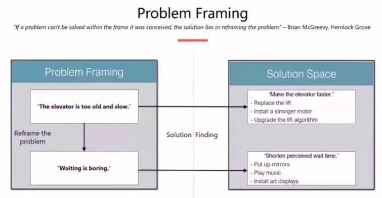
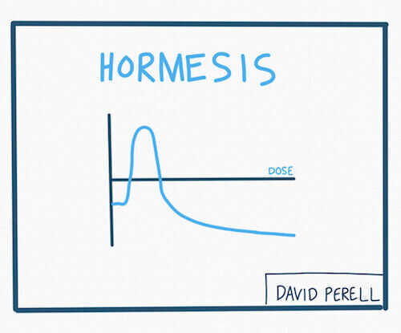
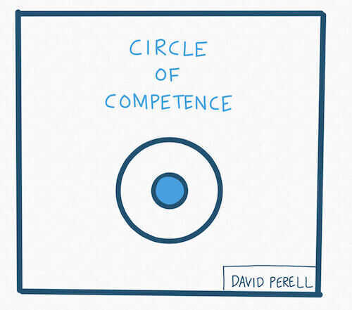
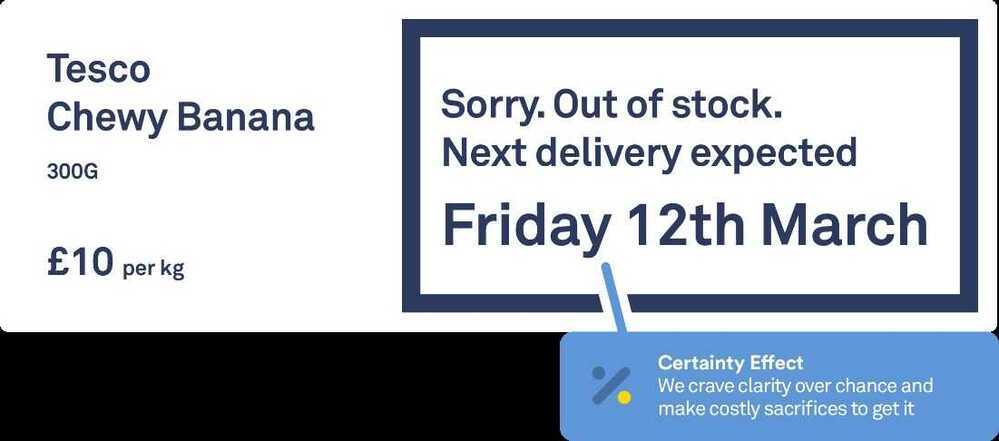

# Mental Models

## Links

- [Psychology Mental Models](../../psychology/mental-models)
- [Economics Mental Models](../../economics/mental-models/economics-mental-models)
- [Management Mental Models](../../management/mental-models)
- [Thinking Mental Models](../../psychology/thinking-mental-models)

## Mental Models in Science

Biology

- [Evolution by Natural Selection](https://en.wikipedia.org/wiki/Natural_selection)
- [Equilibrium (Homeostasis)](https://en.wikipedia.org/wiki/Homeostasis)
- [Heredity](https://en.wikipedia.org/wiki/Heredity)
- [Signalling](https://en.wikipedia.org/wiki/Signalling_theory)

Chemistry

- [Activation Energy](https://en.wikipedia.org/wiki/Activation_energy)
- [Atomic Theory](https://en.wikipedia.org/wiki/Atomic_theory)
- [Autocatalysis](https://en.wikipedia.org/wiki/Autocatalysis)
- [Entropy (The Second Law of Thermodynamics)](https://jamesclear.com/entropy)
- [Catalysts](https://en.wikipedia.org/wiki/Catalysis)

Physics

- [Critical Mass](https://en.wikipedia.org/wiki/Critical_mass)
- [Relativity](https://en.wikipedia.org/wiki/Theory_of_relativity)
- [Velocity](https://en.wikipedia.org/wiki/Velocity)

## Mental Models in Math and Engineering

Engineering

- Break Points
- [Leverage](https://en.wikipedia.org/wiki/Mechanical_advantage)
- [Margin of Safety](https://jamesclear.com/margin-of-safety)
- [Redundancy](https://en.wikipedia.org/wiki/Redundancy_(engineering))

Mathematics

- [Normal Distribution (Bell Curve)](https://en.wikipedia.org/wiki/Normal_distribution)
- [Permutations and Combinations](https://en.wikipedia.org/wiki/Twelvefold_way)

## Best Mental Models Books

- [Seeking Wisdom](https://jamesclear.com/book/seeking-wisdom) by Peter Bevelin
- [Poor Charlie's Almanack](https://jamesclear.com/book/poor-charlies-almanack) by Charles Munger
- [The Personal MBA](https://jamesclear.com/book/the-personal-mba) by Josh Kaufman
- [The Fifth Discipline](https://jamesclear.com/book/the-fifth-discipline) by Peter Senge

## Mental Models

- [Classical Conditioning (Pavlov)](https://en.wikipedia.org/wiki/Classical_conditioning)
- Commitment and Consistency Bias
- [Illusion of Control](https://en.wikipedia.org/wiki/Illusion_of_control)
- [Mere Exposure Effect](https://en.wikipedia.org/wiki/Mere-exposure_effect)
- [Operant Conditioning (Skinner)](https://en.wikipedia.org/wiki/Operant_conditioning)
- [Reciprocity](https://en.wikipedia.org/wiki/Norm_of_reciprocity)
- [Status Quo Bias](https://en.wikipedia.org/wiki/Status_quo_bias)
- [Survivorship Bias](https://en.wikipedia.org/wiki/Survivorship_bias)
- [Tribalism](https://en.wikipedia.org/wiki/Tribalism)

## Explaining

- **[Hanlon's Razor](https://en.wikipedia.org/wiki/Hanlon%27s_razor)---** "Never attribute to malice that which is adequately explained by carelessness." (related:[fundamental attribution error](https://en.wikipedia.org/wiki/Fundamental_attribution_error)(FAE) or correspondence bias or attribution effect --- " the tendency for people to place an undue emphasis on internal characteristics of the agent (character or intention), rather than external factors, in explaining another person's behavior in a given situation.")

We should not attribute to malice, people do make mistakes

<https://en.wikipedia.org/wiki/Fundamental_attribution_error>

- **[Occam's Razor](https://en.wikipedia.org/wiki/Occam%27s_razor)---** "Among competing hypotheses, the one with the fewest assumptions should be selected." (related:[conjunction fallacy](https://en.wikipedia.org/wiki/Conjunction_fallacy), [overfitting](https://en.wikipedia.org/wiki/Overfitting), "when you hear hoofbeats, think of horses not [zebras](https://en.wikipedia.org/wiki/Zebra_%28medicine%29).")

Simpler explanations are more likely to be true than complicated ones

Occam's Razoris the problem-solving principle that the simplest solution tends to be the right one. When presented with competing [hypotheses](https://en.wikipedia.org/wiki/Hypothesis) to solve a problem, one should select the solution with the fewest assumptions.

<https://en.wikipedia.org/wiki/Occam%27s_razor>

## Problem Framing

- [Cognitive Biases](https://en.wikipedia.org/wiki/Cognitive_bias)--- "Tendencies to think in certain ways that can lead to systematic deviations from a standard of rationality or good judgments." (See [list of cognitive biases](https://en.wikipedia.org/wiki/List_of_cognitive_biases))
- [Proximate vs Root Cause](https://en.wikipedia.org/wiki/Proximate_and_ultimate_causation)--- "A proximate cause is an event which is closest to, or immediately responsible for causing, some observed result. This exists in contrast to a higher-level ultimate cause (or distal cause) which is usually thought of as the 'real' reason something occurred." (related:[5 whys](https://en.wikipedia.org/wiki/5_Whys)--- "to determine the root cause of a defect or problem by repeating the question 'Why?')

## Physics

- [Critical Mass](https://en.wikipedia.org/wiki/Critical_mass)--- "The smallest amount of fissile material needed for a sustained nuclear chain reaction." "In [social dynamics](https://en.wikipedia.org/wiki/Critical_mass_%28sociodynamics%29), critical mass is a sufficient number of adopters of an innovation in a social system so that the rate of adoption becomes self-sustaining and creates further growth."
- [Activation Energy](https://en.wikipedia.org/wiki/Activation_energy)--- "The minimum energy which must be available to a chemical system with potential reactants to result in a chemical reaction."
- [Catalyst](https://en.wikipedia.org/wiki/Catalysis)--- "A substance which increases the rate of a chemical reaction." (related:[tipping point](https://en.wikipedia.org/wiki/Tipping_point))
- [Leverage](https://en.wikipedia.org/wiki/Mechanical_advantage)--- "The force amplification achieved by using a tool, mechanical device or machine system." (related:[Theory of constraints](https://en.wikipedia.org/wiki/Theory_of_constraints)--- "a management paradigm that views any manageable system as being limited in achieving more of its goals by a very small number of constraints."
- [Inertia](https://en.wikipedia.org/wiki/Inertia)--- "the resistance of any physical object to any change in its state of motion; this includes changes to its speed, direction or state of rest. It is the tendency of objects to keep moving in a straight line at constant velocity." (related:[strategy tax](http://scripting.com/davenet/2001/04/30/strategyTax.html)--- "sometimes products developed inside a company...have to accept constraints that go against competitiveness, or might displease users, in order to further the cause of another product.";[flywheel](https://en.wikipedia.org/wiki/Flywheel)--- "a rotating mechanical device that is used to store rotational energy. Flywheels have an inertia called the moment of inertia and thus resist changes in rotational speed.")
- [Half-life](https://en.wikipedia.org/wiki/Half-life)--- "the time required for a quantity to reduce to half its initial value. The term is commonly used in nuclear physics to describe how quickly unstable atoms undergo, or how long stable atoms survive, radioactive decay." (related:[viral marketing](https://en.wikipedia.org/wiki/Viral_marketing))
- [Heisenberg Uncertainty Principle](https://en.wikipedia.org/wiki/Uncertainty_principle)--- "A fundamental limit to the precision with which certain pairs of physical properties of a particle, known as complementary variables, such as positionxand momentump, can be known."

## Experimenting

- [Scientific Method](https://en.wikipedia.org/wiki/Scientific_method)--- "Systematic observation, measurement, and experiment, and the formulation, testing, and modification of hypotheses." (related:[reproducibility](https://en.wikipedia.org/wiki/Reproducibility))
- [Proxy](https://en.wikipedia.org/wiki/Proxy_%28statistics%29)--- "A variable that is not in itself directly relevant, but that serves in place of an unobservable or immeasurable variable. In order for a variable to be a good proxy, it must have a close correlation, not necessarily linear, with the variable of interest." (related:[revealed preference](https://en.wikipedia.org/wiki/Revealed_preference);[Proxy War](https://en.wikipedia.org/wiki/Proxy_war)--- "A conflict between two nations where neither country directly engages the other.")

## Interpreting

- [Order of Magnitude](https://en.wikipedia.org/wiki/Order_of_magnitude)--- "An order-of-magnitude estimate of a variable whose precise value is unknown is an estimate rounded to the nearest power of ten." (related:[order of approximation](https://en.wikipedia.org/wiki/Order_of_approximation), [back-of-the-envelope calculation](https://en.wikipedia.org/wiki/Back-of-the-envelope_calculation), [dimensional analysis](https://en.wikipedia.org/wiki/Dimensional_analysis), [Fermi problem](https://en.wikipedia.org/wiki/Fermi_problem))
- (1) Major vs Minor Factors - Major factors explains major portions of the results, while minor factors only explain minor portions. (related: first order vs second order effects - first order effects directly follow from a cause, while second order effects follow from first order effects.)
- [False Positives and False Negatives](https://en.wikipedia.org/wiki/False_positives_and_false_negatives)--- "A false positive error, or in short false positive, commonly called a 'false alarm', is a result that indicates a given condition has been fulfilled, when it actually has not been fulfilled...A false negative error, or in short false negative, is where a test result indicates that a condition failed, while it actually was successful, i.e. erroneously no effect has been assumed."
- [Confidence Interval](https://en.wikipedia.org/wiki/Confidence_interval)--- "Confidence intervals consist of a range of values (interval) that act as good estimates of the unknown population parameter; however, the interval computed from a particular sample does not necessarily include the true value of the parameter." (related:[error bar](https://en.wikipedia.org/wiki/Error_bar))
- [Bayes' Theorem](https://en.wikipedia.org/wiki/Bayes%27_theorem)--- "Describes the probability of an event, based on conditions that might be related to the event. For example, suppose one is interested in whether a person has cancer, and knows the person's age. If cancer is related to age, then, using Bayes' theorem, information about the person's age can be used to more accurately assess the probability that they have cancer." (related:[base rate fallacy](https://en.wikipedia.org/wiki/Base_rate_fallacy))
- [Regression to the Mean](https://en.wikipedia.org/wiki/Regression_toward_the_mean)--- "The phenomenon that if a variable is extreme on its first measurement, it will tend to be closer to the average on its second measurement." (related:[Pendulum](https://en.wikipedia.org/wiki/Pendulum) swing;[variance](https://en.wikipedia.org/wiki/Variance);[Gambler's fallacy](https://en.wikipedia.org/wiki/Gambler%27s_fallacy))
- **[Inflection Point](https://en.wikipedia.org/wiki/Inflection_point#See_also)--- "A point on a curve at which the curve changes from being concave (concave downward) to convex (concave upward), or vice versa."**
- [Simpson's Paradox](https://en.wikipedia.org/wiki/Simpson%27s_paradox)--- "A paradox in probability and statistics, in which a trend appears in different groups of data but disappears or reverses when these groups are combined."

## Negotiating

- [The Third Story](http://www.pon.harvard.edu/daily/conflict-resolution/telling-the-third-story/)--- "The Third Story is one an impartial observer, such as a mediator, would tell; it's a version of events both sides can agree on." (related:[Most Respectful Interpretation](http://www.nscblog.com/miscellaneous/mri-most-respectful-interpretation/))
- [Active Listening](https://en.wikipedia.org/wiki/Active_listening)--- "Requires that the listener fully concentrates, understands, responds and then remembers what is being said."
- [Trade-offs](https://en.wikipedia.org/wiki/Trade-off)--- "A situation that involves losing one quality or aspect of something in return for gaining another quality or aspect."
- [Best Alternative to a Negotiated Agreement (BATNA)](https://en.wikipedia.org/wiki/Best_alternative_to_a_negotiated_agreement)--- "The most advantageous alternative course of action a party can take if negotiations fail and an agreement cannot be reached."
- [Zero-sum](https://en.wikipedia.org/wiki/Zero-sum_game) vs [Non-zero-sum](https://en.wikipedia.org/wiki/Zero-sum_game#Non-zero-sum)

"A zero-sum game is a mathematical representation of a situation in which each participant's gain (or loss) of utility is exactly balanced by the losses (or gains) of the utility of the other participant(s)...In contrast, non-zero-sum describes a situation in which the interacting parties' aggregate gains and losses can be less than or more than zero." (related:[win-win](https://en.wikipedia.org/wiki/Win-win_game)--- "A win--win strategy is a conflict resolution process that aims to accommodate all disputants.")

In [game theory](https://en.wikipedia.org/wiki/Game_theory) and [economic theory](https://en.wikipedia.org/wiki/Economic_theory), azero-sum gameis a [mathematical representation](https://en.wikipedia.org/wiki/Mathematical_model) of a situation in which each participant's gain or loss of [utility](https://en.wikipedia.org/wiki/Utility) is exactly balanced by the losses or gains of the utility of the other participants. If the total gains of the participants are added up and the total losses are subtracted, they will sum to zero. Thus, [cutting a cake](https://en.wikipedia.org/wiki/Fair_cake-cutting), where taking a larger piece reduces the amount of cake available for others, is a zero-sum game if all participants value each unit of cake equally (see [marginal utility](https://en.wikipedia.org/wiki/Marginal_utility)).

In contrast, non-zero-sumdescribes a situation in which the interacting parties' aggregate gains and losses can be less than or more than zero. A zero-sum game is also called astrictly competitivegame while non-zero-sum games can be either competitive or non-competitive. Zero-sum games are most often solved with the [minimax theorem](https://en.wikipedia.org/wiki/Minimax_theorem) which is closely related to [linear programming duality](https://en.wikipedia.org/wiki/LP_duality), or with [Nash equilibrium](https://en.wikipedia.org/wiki/Nash_equilibrium).

<https://en.wikipedia.org/wiki/Zero-sum_game>

- [Alternative Dispute Resolution (ADR)](https://en.wikipedia.org/wiki/Alternative_dispute_resolution)--- "Dispute resolution processes and techniques that act as a means for disagreeing parties to come to an agreement short of litigation." (related:[mediation](https://en.wikipedia.org/wiki/Mediation);[arbitration](https://en.wikipedia.org/wiki/Arbitration); "extend an olive branch.")
- [Prisoner's Dilemma](https://en.wikipedia.org/wiki/Prisoner%27s_dilemma)--- "A standard example of a game analyzed in game theory that shows why two completely 'rational' individuals might not cooperate, even if it appears that it is in their best interests to do so." (related:[Nash equilibrium](https://en.wikipedia.org/wiki/Nash_equilibrium), [evolutionarily stable strategy](https://en.wikipedia.org/wiki/Evolutionarily_stable_strategy))
- Argument from ignorance - Assuming a claim is true, because it has not proven false
- Burden of Proof - lies with the person making the claim
- Hobson's Choice

AHobson's choiceis a [free choice](https://en.wikipedia.org/wiki/Free_choice) in which only one thing is actually offered. The term is often used to describe an illusion that multiple choices are available. The most well known Hobson's choice is "I'll give you a choice: take it or leave it", wherein "leaving it" is strongly undesirable.

A Hobson's choice is different from

- [Dilemma](https://en.wikipedia.org/wiki/Dilemma): a choice between two or more options, none of which are attractive.
- [False dilemma](https://en.wikipedia.org/wiki/False_dilemma): only certain choices are considered, when in fact there are others.
- [Catch-22](https://en.wikipedia.org/wiki/Catch-22_(logic)): a [logical paradox](https://en.wikipedia.org/wiki/Logical_paradox) arising from a situation in which an individual needs something that can only be acquired by not being in that very situation.
- [Morton's fork](https://en.wikipedia.org/wiki/Morton%27s_fork), and a [double bind](https://en.wikipedia.org/wiki/Double_bind): choices yield equivalent and, often, undesirable results.

AMorton's forkis a type of [false dilemma](https://en.wikipedia.org/wiki/False_dilemma) in which contradictory observations lead to the same conclusion.

- [Blackmail](https://en.wikipedia.org/wiki/Blackmail) and [extortion](https://en.wikipedia.org/wiki/Extortion): the choice between paying money (or some non-monetary good or deed) or risk suffering an unpleasant action.

In the late 16th and early 17th centuries, Thomas Hobson worked as a licensed carrier of passengers, letters, and parcels between Cambridge and London, England. He kept horses for this purpose and rented them to university students when he wasn't using them. Of course, the students always wanted their favorite mounts, and consequently a few of Hobson's horses became overworked. To correct the situation, Hobson began a strict rotation system, giving each customer the choice of taking the horse nearest the stable door or none at all. This rule became known asHobson's choice, and soon people were using that term to mean "no choice at all" in all kinds of situations.

## Mitigating

- [Unintended Consequences](https://en.wikipedia.org/wiki/Unintended_consequences)--- "Outcomes that are not the ones foreseen and intended by a purposeful action." (related:[collateral damage](https://en.wikipedia.org/wiki/Collateral_damage)--- "Deaths, injuries, or other damage inflicted on an unintended target.", [Goodhart's law](https://en.wikipedia.org/wiki/Goodhart%27s_law)--- "When a measure becomes a target, it ceases to be a good measure";[Campbell's law](https://en.wikipedia.org/wiki/Campbell%27s_law); **[Streisand Effect](https://en.wikipedia.org/wiki/Streisand_effect)---** "The phenomenon whereby an attempt to hide, remove, or censor a piece of information has the unintended consequence of publicizing the information more widely, usually facilitated by the Internet"; [cobra effect](https://en.wikipedia.org/wiki/Cobra_effect)--- "when an attempted solution to a problem actually makes the problem worse."; "Kick a hornet's nest.")
- [Preserving Optionality](http://www.iheavy.com/2009/05/01/open-insights-55-preserving-optionality/)--- "A strategy of keeping options open and fluid, fighting the urge to make choices too soon, before all of the uncertainties have been resolved." (related:[tyranny of small decisions](https://en.wikipedia.org/wiki/Tyranny_of_small_decisions)--- "a situation where a series of small, individually rational decisions can negatively change the context of subsequent choices, even to the point where desired alternatives are irreversibly destroyed.";[boiling frog](https://en.wikipedia.org/wiki/Boiling_frog)--- "an anecdote describing a frog slowly being boiled alive.";[path dependence](https://en.wikipedia.org/wiki/Path_dependence); "Everybody has a plan until they get punched in the mouth.";[fog of war](https://en.wikipedia.org/wiki/Fog_of_war);[OODA loop](https://en.wikipedia.org/wiki/OODA_loop))
- [Precautionary Principle](https://en.wikipedia.org/wiki/Precautionary_principle)--- "If an action or policy has a suspected risk of causing harm to the public, or to the environment, in the absence of scientific consensus (that the action or policy is not harmful), the burden of proof that it is not harmful falls on those taking an action that may or may not be a risk."
- [Short-termism](http://lexicon.ft.com/Term?term=short_termism)--- "Short-termism refers to an excessive focus on short-term results at the expense of long-term interests."

## Influencing

- [Framing](https://en.wikipedia.org/wiki/Framing_%28social_sciences%29)--- "With the same information being used as a base, the 'frame' surrounding the issue can change the reader's perception without having to alter the actual facts." (related:[anchoring](https://en.wikipedia.org/wiki/Anchoring))
- [Cialdini's Six Principles of Influence](https://en.wikipedia.org/wiki/Robert_Cialdini)---[Reciprocity](https://en.wikipedia.org/wiki/Reciprocity_%28cultural_anthropology%29)("People tend to return a favor."), [Commitment](https://en.wikipedia.org/wiki/Consistency_%28negotiation%29)("If people commit...they are more likely to honor that commitment."), [Social Proof](https://en.wikipedia.org/wiki/Social_proof)("People will do things they see other people are doing."), [Authority](https://en.wikipedia.org/wiki/Authority)("People will tend to obey authority figures."), Liking ("People are easily persuaded by other people they like."), and [Scarcity](https://en.wikipedia.org/wiki/Scarcity)("Perceived scarcity will generate demand"). (related:[foot-in-the-door technique](https://en.wikipedia.org/wiki/Foot-in-the-door_technique#See_also))
- [Paradox of Choice](https://en.wikipedia.org/wiki/The_Paradox_of_Choice)--- "Eliminating consumer choices can greatly reduce anxiety for shoppers." (related:[Hick's Law](https://en.wikipedia.org/wiki/Hick%27s_law), "increasing the number of choices will increase the decision time logarithmically.")
- [Major vs Minor Chords](https://en.wikipedia.org/wiki/Major_and_minor)--- "In Western music, a minor chord, in comparison, 'sounds darker than a major chord.'"
- [Coda](https://en.wikipedia.org/wiki/Coda_%28music%29)--- "A term used in music primarily to designated a passage that brings a piece to an end." (related:[CTA](https://en.wikipedia.org/wiki/Call_to_action_%28marketing%29).) People psychologically expect codas, and so they can be used for influence.

## Marketing

- [Bullseye Framework](https://medium.com/@yegg/the-bullseye-framework-for-getting-traction-ef49d05bfd7e)--- "With nineteen traction channels to consider, figuring out which one to focus on is tough. That's why we've created a simple framework called Bullseye that will help you findthe channelthat will get you traction."
- [Technology Adoption Lifecycle](https://en.wikipedia.org/wiki/Technology_adoption_life_cycle)--- "Describes the adoption or acceptance of a new product or innovation, according to the demographic and psychological characteristics of defined adopter groups. The process of adoption over time is typically illustrated as a classical normal distribution or "bell curve". The model indicates that the first group of people to use a new product is called 'innovators', followed by 'early adopters'. Next come the early majority and late majority, and the last group to eventually adopt a product are called 'laggards'." (related:[S-curve](https://en.wikipedia.org/wiki/Logistic_function), [Crossing the Chasm](https://en.wikipedia.org/wiki/Crossing_the_Chasm), [Installation Period vs Deployment Period](http://reactionwheel.net/2015/10/the-deployment-age.html))
- [Jobs To Be Done](http://hbswk.hbs.edu/item/clay-christensens-milkshake-marketing)--- "Consumers usually don't go about their shopping by conforming to particular segments. Rather, they take life as it comes. And when faced with a job that needs doing, they essentially 'hire' a product to do that job."
- [Fear, Uncertainty, and Doubt (FUD)](https://en.wikipedia.org/wiki/Fear,_uncertainty_and_doubt)--- "A disinformation strategy used in sales, marketing, public relations, politics and propaganda. FUD is generally a strategy to influence perception by disseminating negative and dubious or false information and a manifestation of the appeal to fear."

## Strategizing

- (1) Sustainable Competitive Advantage - Structural factors that allow a firm to outcompete its rivals for many years.
- [Core Competency](https://en.wikipedia.org/wiki/Core_competency)--- "A harmonized combination of multiple resources and skills that distinguish a firm in the marketplace." (related:[circle of competence](http://www.businessinsider.com/the-circle-of-competence-theory-2013-12)--- "you don't have to be an expert on every company, or even many. You only have to be able to evaluate companies within your circle of competence. The size of that circle is not very important; knowing its boundaries, however, is vital.")
- [Strategy vs Tactics](https://en.wikipedia.org/wiki/Tactic_(method))--- Sun Tzu: "Strategy without tactics is the slowest route to victory. Tactics without strategy is the noise before defeat."
- [Sphere of Influence](https://en.wikipedia.org/wiki/Sphere_of_influence)--- "A spatial region or concept division over which a state or organization has a level of cultural, economic, military, or political exclusivity, accommodating to the interests of powers outside the borders of the state that controls it."
- [Unknown Unknowns](https://en.wikipedia.org/wiki/There_are_known_knowns)--- "Known unknowns refers to 'risks you are aware of, such as cancelled flights....' Unknown unknowns are risks that 'come from situations that are so out of this world that they never occur to you.' (related:[Cynefin framework](https://en.wikipedia.org/wiki/Cynefin_framework))
- [Switching Costs](https://en.wikipedia.org/wiki/Switching_barriers)--- "The costs associated with switching suppliers."
- [Network Effect](https://en.wikipedia.org/wiki/Network_effect)--- "The effect that one user of a good or service has on the value of that product to other people. When a network effect is present, the value of a product or service is dependent on the number of others using it."
- [Economies of Scale](https://en.wikipedia.org/wiki/Economies_of_scale)--- "The cost advantages that enterprises obtain due to size, output, or scale of operation, with cost per unit of output generally decreasing with increasing scale as fixed costs are spread out over more units of output."

## Military

- [Guerilla warfare](https://en.wikipedia.org/wiki/Guerrilla_warfare)--- "a form of irregular warfare in which a small group of combatants such as paramilitary personnel, armed civilians, or irregulars use military tactics including ambushes, sabotage, raids, petty warfare, hit-and-run tactics, and mobility to fight a larger and less-mobile traditional military." (related:[asymmetric warfare](https://en.wikipedia.org/wiki/Asymmetric_warfare); "Punch above your weight.")
- [Two-front War](https://en.wikipedia.org/wiki/Two-front_war)--- "A war in which fighting takes place on two geographically separate fronts."
- [Flypaper Theory](https://en.wikipedia.org/wiki/Flypaper_theory_%28strategy%29)--- "The idea that it is desirable to draw enemies to a single area, where it is easier to kill them and they are far from one's own vulnerabilities." (related:[honeypot](https://en.wikipedia.org/wiki/Honeypot_(computing)))
- (3) Fighting the Last War --- Using strategies and tactics that worked successfully in the past, but are no longer as useful.
- (3) Rumsfeld's Rule --- "You go to war with the Army you have. They're not the Army you might want or wish to have at a later time." (related:[Joy's law](https://en.wikipedia.org/wiki/Joy%27s_law_%28management%29)--- "no matter who you are, most of the smartest people work for someone else.";[Effectuation](https://en.wikipedia.org/wiki/Effectuation))
- [Trojan Horse](https://en.wikipedia.org/wiki/Trojan_War)--- "After a fruitless 10-year siege, the Greeks constructed a huge wooden horse, and hid a select force of men inside. The Greeks pretended to sail away, and the Trojans pulled the horse into their city as a victory trophy. That night the Greek force crept out of the horse and opened the gates for the rest of the Greek army, which had sailed back under cover of night. The Greeks entered and destroyed."
- [Empty Fort Strategy](https://en.wikipedia.org/wiki/Empty_Fort_Strategy)--- "Involves using reverse psychology (and luck) to deceive the enemy into thinking that an empty location is full of traps and ambushes, and therefore induce the enemy to retreat." (related:[Potemkin village](https://en.wikipedia.org/wiki/Potemkin_village)--- "any construction (literal or figurative) built solely to deceive others into thinking that a situation is better than it really is.";[vaporware](https://en.wikipedia.org/wiki/Vaporware)--- "a product, typically computer hardware or software, that is announced to the general public but is never actually manufactured nor officially cancelled.")
- [Exit Strategy](https://en.wikipedia.org/wiki/Exit_strategy)--- "A means of leaving one's current situation, either after a predetermined objective has been achieved, or as a strategy to mitigate failure."
- [Boots on the Ground](https://en.wikipedia.org/wiki/Boots_on_the_Ground#Derivation_of_the_title)--- "The belief that military success can only be achieved through the direct physical presence of troops in a conflict area."
- [Winning Hearts and Minds](https://en.wikipedia.org/wiki/Winning_hearts_and_minds)--- "In which one side seeks to prevail not by the use of superior force, but by making emotional or intellectual appeals to sway supporters of the other side."
- [Mutually Assured Destruction](https://en.wikipedia.org/wiki/Mutual_assured_destruction)--- "In which a full-scale use of nuclear weapons by two or more opposing sides would cause the complete annihilation of both the attacker and the defender. It is based on the theory of deterrence, which holds that the threat of using strong weapons against the enemy prevents." (related:[Mexican standoff](https://en.wikipedia.org/wiki/Mexican_standoff), [Zugzwang](https://en.wikipedia.org/wiki/Zugzwang))
- [Containment](https://en.wikipedia.org/wiki/Containment)--- "A military strategy to stop the expansion of an enemy. It is best known as the Cold War policy of the United States and its allies to prevent the spread of communism abroad."
- (3) Appeasement --- "A diplomatic policy of making political or material concessions to an enemy power in order to avoid conflict." (related:[Danegeld](https://en.wikipedia.org/wiki/Danegeld), [extortion](https://en.wikipedia.org/wiki/Extortion))
- [Winning a Battle but Losing the War](https://en.wikipedia.org/wiki/Pyrrhic_victory#Related_concepts)--- "A poor strategy that wins a lesser (or sub-) objective but overlooks and loses the true intended objective." (related:[sacrifice play](https://en.wikipedia.org/wiki/Sacrifice_play))
- [Beachhead](https://en.wikipedia.org/wiki/Beachhead)--- "A temporary line created when a military unit reaches a landing beach by sea and begins to defend the area while other reinforcements help out until a unit large enough to begin advancing has arrived."
- [Attrition warfare](https://en.wikipedia.org/wiki/Attrition_warfare)--- "a military strategy in which a belligerent attempts to win a war by wearing down the enemy to the point of collapse through continuous losses in personnel and material."

## History

- [Nuclear option](https://en.wikipedia.org/wiki/Nuclear_option)--- "a parliamentary procedure that allows the U.S. Senate to override a rule or precedent by a simple majority of 51 votes, instead of by a supermajority of 60 votes...The name is an analogy to nuclear weapons being the most extreme option in warfare."
- [Cargo cult](https://en.wikipedia.org/wiki/Cargo_cult)--- "a millenarian movement first described in Melanesia which encompasses a range of practices and occurs in the wake of contact with more technologically advanced societies. The name derives from the belief which began among Melanesians in the late 19th and early 20th century that various ritualistic acts such as the building of an airplane runway will result in the appearance of material wealth, particularly highly desirable Western goods (i.e., "cargo"), via Western airplanes."

## Sports

- [Unforced Error](https://en.wikipedia.org/wiki/Glossary_of_tennis_terms#U)--- In tennis, an "error in a service or return shot that cannot be attributed to any factor other than poor judgement and execution by the player; contrasted with a [forced error](https://en.wikipedia.org/wiki/Unforced_error#Forced_error)," "an error caused by an opponent's good play."
- [Hail Mary Pass](https://en.wikipedia.org/wiki/Hail_Mary_pass)--- "A very long forward pass in American football, made in desperation with only a small chance of success... has become generalized to refer to any last-ditch effort with little chance of success."

## Market Failure

- [Social vs Market Norms](https://en.wikipedia.org/wiki/Predictably_Irrational#Being_Paid_vs._A_Friendly_Favor)--- "People are happy to do things occasionally when they are not paid for them. In fact there are some situations in which work output is negatively affected by payment of small amounts of money."
- [Information Asymmetry](https://en.wikipedia.org/wiki/Information_asymmetry)--- "The study of decisions in transactions where one party has more or better information than the other." (related:**[adverse selection](https://en.wikipedia.org/wiki/Adverse_selection)**--- "when traders with better private information about the quality of a product will selectively participate in trades which benefit them the most.";[moral hazard](https://en.wikipedia.org/wiki/Moral_hazard)--- "when one person takes more risks because someone else bears the cost of those risks.")
- [Externalities](https://en.wikipedia.org/wiki/Externality)--- "An externality is the cost or benefit that affects a party who did not choose to incur that cost or benefit." (related:**[tragedy of the commons](https://en.wikipedia.org/wiki/Tragedy_of_the_commons)**--- "A situation within a shared-resource system where individual users acting independently according to their own self-interest behave contrary to the common good of all users by depleting that resource through their collective action";[free rider problem](https://en.wikipedia.org/wiki/Free_rider_problem)--- "when those who benefit from resources, goods, or services do not pay for them, which results in an under-provision of those goods or services.";[Coase theorem](https://en.wikipedia.org/wiki/Coase_theorem)--- "if trade in an externality is possible and there are sufficiently low transaction costs, bargaining will lead to a Pareto efficient outcome regardless of the initial allocation of property.";[NIMBY](https://en.wikipedia.org/wiki/NIMBY)--- "Not In My Back Yard")

The economic problem of overconsumption and depletion of shared resources

- [Deadweight Loss](https://en.wikipedia.org/wiki/Deadweight_loss)--- "A loss of economic efficiency that can occur when equilibrium for a good or service is not achieved or is not achievable."

## Political Failure

- [Chilling Effect](https://en.wikipedia.org/wiki/Chilling_effect)--- "The inhibition or discouragement of the legitimate exercise of natural and legal rights by the threat of legal sanction...Outside of the legal context in common usage; any coercion or threat of coercion (or other unpleasantries) can have a chilling effect on a group of people regarding a specific behavior, and often can be statistically measured or be plainly observed."
- [Third Rail](https://en.wikipedia.org/wiki/Third_rail_of_politics)--- "The third rail of a nation's politics is a metaphor for any issue so controversial that it is 'charged' and 'untouchable' to the extent that any politician or public official who dares to broach the subject will invariably suffer politically."
- [Regulatory Capture](https://en.wikipedia.org/wiki/Regulatory_capture)--- "When a regulatory agency, created to act in the public interest, instead advances the commercial or political concerns of special interest groups that dominate the industry or sector it is charged with regulating." (related:[Shirky principle](https://en.wikipedia.org/wiki/Clay_Shirky#Shirky_principle)--- "Institutions will try to preserve the problem to which they are the solution."; "Sunlight is the best disinfectant.")
- [Duverger's Law](https://en.wikipedia.org/wiki/Duverger%27s_law)--- "A principle which states that plurality-rule elections (such asfirst past the post) structured within single-member districts tend to favor a two-party system, and that 'the double ballot majority system and proportional representation tend to favor multipartism.'"
- [Arrow's Impossibility Theorem](https://en.wikipedia.org/wiki/Arrow%27s_impossibility_theorem)--- "When voters have three or more distinct alternatives (options), no ranked order voting system can convert the ranked preferences of individuals into a community-wide (complete and transitive) ranking while also meeting a pre-specified set of criteria." (related:[approval voting](https://en.wikipedia.org/wiki/Approval_voting))

## Nature

- [Nature vs Nurture](https://en.wikipedia.org/wiki/Nature_versus_nurture)--- "the relative importance of an individual's innate qualities as compared to an individual's personal experiences in causing individual differences, especially in behavioral traits."
- (2) Chain Reaction --- "A sequence of reactions where a reactive product or by-product causes additional reactions to take place. In a chain reaction, positive feedback leads to a self-amplifying chain of events." (related:[cascading failure](https://en.wikipedia.org/wiki/Cascading_failure), [domino effect](https://en.wikipedia.org/wiki/Domino_effect))
- (2) Filling a Vacuum - A [vacuum](https://en.wikipedia.org/wiki/Vacuum)"is space void of matter." Filling a vacuum refers to the fact that if a vacuum is put next to something with pressure, it will be quickly filled by the gas producing that pressure. (related:[power vacuum](https://en.wikipedia.org/wiki/Power_vacuum))
- [Emergence](https://en.wikipedia.org/wiki/Emergence#See_also)--- "Whereby larger entities, patterns, and regularities arise through interactions among smaller or simpler entities that themselves do not exhibit such properties." (related:[decentralized system](https://en.wikipedia.org/wiki/Decentralised_system), [spontaneous order](https://en.wikipedia.org/wiki/Spontaneous_order))
- [Natural Selection](https://en.wikipedia.org/wiki/Natural_selection)--- "The differential survival and reproduction of individuals due to differences in phenotype. It is a key mechanism of evolution, the change in heritable traits of a population over time."
- [Butterfly Effect](https://en.wikipedia.org/wiki/Butterfly_effect#See_also)--- "The concept that small causes can have large effects." (related:[bullwhip effect](https://en.wikipedia.org/wiki/Bullwhip_effect)--- "increasing swings in inventory in response to shifts in customer demand as you move further up the supply chain.")
- [Sustainability](https://en.wikipedia.org/wiki/Sustainability)--- "The endurance of systems and processes."
- [Peak Oil](https://en.wikipedia.org/wiki/Peak_oil)--- "The point in time when the maximum rate of extraction of petroleum is reached, after which it is expected to enter terminal decline."
- **mimetic desire**. "Man is the creature who does not know what to desire, and he turns to others in order to make up his mind," Girard wrote. "We desire what others desire because we imitate their desires"

## Internet

- [Filter Bubble](https://en.wikipedia.org/wiki/Filter_bubble)--- "In which a website algorithm selectively guesses what information a user would like to see based on information about the user (such as location, past click behavior and search history) and, as a result, users become separated from information that disagrees with their viewpoints, effectively isolating them in their own cultural or ideological bubbles." (related:[echo chamber](https://en.wikipedia.org/wiki/Echo_chamber_(media)))
- [Botnet](https://en.wikipedia.org/wiki/Botnet)--- "A number of Internet-connected computers communicating with other similar machines in which components located on networked computers communicate and coordinate their actions by command and control (C&C) or by passing messages to one another." (related:[flash mob](https://en.wikipedia.org/wiki/Flash_mob))
- [Spamming](https://en.wikipedia.org/wiki/Spamming)--- "The use of electronic messaging systems to send unsolicited messages (spam), especially advertising, as well as sending messages repeatedly on the same site." (related:[phishing](https://en.wikipedia.org/wiki/Phishing)--- "the attempt to acquire sensitive information such as usernames, passwords, and credit card details (and sometimes, indirectly, money), often for malicious reasons, by masquerading as a trustworthy entity in an electronic communication.", [clickjacking](https://en.wikipedia.org/wiki/Clickjacking), [social engineering](https://en.wikipedia.org/wiki/Social_engineering_(security)))
- [Content Farm](https://en.wikipedia.org/wiki/Content_farm)--- "large amounts of textual content which is specifically designed to satisfy algorithms for maximal retrieval by automated search engines." (related:[click farm](https://en.wikipedia.org/wiki/Click_farm)--- "where a large group of low-paid workers are hired to click on paid advertising links for the click fraudster.")
- [Micropayment](https://en.wikipedia.org/wiki/Micropayment)--- "A financial transaction involving a very small sum of money and usually one that occurs online."
- [Godwin's Law](https://en.wikipedia.org/wiki/Godwin%27s_law)--- "If an online discussion (regardless of topic or scope) goes on long enough, sooner or later someone will compare someone or something to Hitler or Nazism." (related: "Take the high road.", "Rise above the fray.", "Don't stoop down to their level.")

<https://medium.com/@yegg/mental-models-i-find-repeatedly-useful-936f1cc405d>

<https://jamesclear.com/mental-models>

<https://fs.blog/tgmm>

## Catch-22

Acatch-22is a [paradoxical](https://en.wikipedia.org/wiki/Paradox) situation from which an individual cannot escape because of contradictory rules or limitations.The term was coined by [Joseph Heller](https://en.wikipedia.org/wiki/Joseph_Heller), who used it in his 1961 novel [Catch-22](https://en.wikipedia.org/wiki/Catch-22).

An example is:

In needing experience to get a job..."How can I get any experience until I get a job thatgivesme experience?" -- Brantley Foster in [The Secret of My Success](https://en.wikipedia.org/wiki/The_Secret_of_My_Success_(1987_film)).

<https://en.wikipedia.org/wiki/Catch-22_(logic)>

## Says law

In classical economics, Say's law, or the law of markets, is the claim that the production of a product creates demand for another product by providing something of value which can be exchanged for that other product. So, production is the source of demand.

## Gall's Law

A complex system that works is invariably found to have evolved from a simple system that worked. The inverse proposition also appears to be true: a complex system designed from scratch never works and cannot be made to work. You have to start over, beginning with a simple system."

## Chesterton's Fence (in Second-order thinking)

Chesterton's fenceis the principle that reforms should not be made until the reasoning behind the existing state of affairs is understood. The quotation is from [G. K. Chesterton](https://en.wikipedia.org/wiki/G._K._Chesterton)'s 1929 bookThe Thing, in the chapter entitled "The Drift from Domesticity":

In the matter of reforming things, as distinct from deforming them, there is one plain and simple principle; a principle which will probably be called a paradox. There exists in such a case a certain institution or law; let us say, for the sake of simplicity, a fence or gate erected across a road. The more modern type of reformer goes gaily up to it and says, "I don't see the use of this; let us clear it away." To which the more intelligent type of reformer will do well to answer: "If you don't see the use of it, I certainly won't let you clear it away. Go away and think. Then, when you can come back and tell me that you do see the use of it, I may allow you to destroy it."

## Do not remove a fence until you know why it was put up in the first place

Don't change something until you know why it was there in the first place. It's also a way to look at reforms, and to understand the second order effects of an action.

## Unless we know why someone made a decision, we can't safely change it or conclude that they were wrong

<https://abovethelaw.com/2014/01/the-fallacy-of-chestertons-fence>

<https://fs.blog/2020/03/chestertons-fence>

## 50 Ideas

- Doublespeak: People often say the opposite of what they mean, especially in political language. It allows people to lie while looking like they're telling the truth. As George Orwell famously wrote in 1984, "War is peace. Freedom is slavery. Ignorance is strength."

- Theory of Constraints: A system is only as strong as its weakest point. Focus on the bottleneck. Counterintuitively, if you break down the entire system and optimize each component individually, you'll lower the effectiveness of the system. Optimize the entire system instead.

- Preference Falsification: People lie about their true opinions and conform to socially acceptable preferences instead. In private they'll say one thing. In public, they'll say another.

- Faustian Bargain: A man once sold his soul to a demon in exchange for knowledge. At first, it seemed like a smart trade. But the man lost in the long-run. Tragically, what the man lost was more valuable than what he earned. In short, he won the battle but lost the war.

- Mimetic Theory of Desire: Humans are like sheep. We don't know what we want, so we imitate each other. Instead of creating our own desires, we desire the same things as other people. The entire advertising industry is built on this idea.

- Mimetic Theory of Conflict: People who are similar are more likely to fight than people who are different. That's why Civil Wars and family feuds create the worst conflicts. The closer two people are and the more equality between them, the greater the potential for conflict.

- Talent vs. Genius: Society is good at training talent but terrible at cultivating genius. Talented people are good at hitting targets others can't hit, but geniuses find targets others can't see. They are opposite modes of excellence. Talent is predictable, genius is unpredictable.

- Competition is for Losers: Avoid competition. Stop copying what everybody else is doing. If you work at a for-profit company, work on problems that would not otherwise be solved. If you're at a non-profit, fix unpopular problems. Life is easier when you don't compete. (Hint: don't start another bottled water company)

- Secrets are Hidden in Plain Sight: Most people think of secrets as Easter eggs. They assume that if a secret is important, it's necessarily going to be hard to find. The best ideas can come from things that are so well-known that they aren't well-seen.

- The Never-Ending Now: The structure of our social media feeds blinds us to history, as it causes us to live in an endless cycle of ephemeral content consumption. The structure of the Internet pulls people away from age-old wisdom.

- Demand Curves Slope Down: The harder something is to do, the fewer people will do it. For example, raise the price of a product and fewer people will buy it. Lower the price and more people will buy it. Economics 101.

- Look for Things That Don't Make Sense: The world always makes sense. But it can be confusing. When it is, your model of the world is wrong. So, things that don't make sense are a learning opportunity. Big opportunities won't make sense until it's too late to profit from them.

- The Wisdom of Paradox: Logic is the key to scientific truths, but paradoxes are the key to psychological ones. When it comes to the human condition, the deepest truths are often counter-intuitive. When you find two opposites that are both true, start exploring.

- Law of Shitty Click-Through Rates: Most marketing strategies have a short window of success, as click-through rates decrease as tactics mature. For example, the first banner-ad has a click-through rate of more than 70%. Now we avoid them with ad-blockers.

- Russell Conjugation: Journalists often change the meaning of a sentence by replacing one word with a synonym that implies a different meaning. For example, the same person can support an estate tax but oppose a death tax - even though they are the same thing.

- Overton Window: You can control thought without limiting speech. You can do it by defining the limits of acceptable thought while allowing for lively debate within these barriers. For example, Fox News and MSNBC set limits on what political thoughts they consider acceptable, but in the grand scheme of things, they're both fairly conventional. The political spectrum stretches far beyond the ideas they entertain, but ideas outside their limits are shunned.

- Planck's Principle: Science doesn't progress because people change their views. Rather, each new generation of scientists has different views. As old generations pass away, new ideas are accepted and the scientific consensus changes.

- Bike-Shed Effect: A group of people working on a project will fight over the most trivial ideas. They'll ignore what's complicated. They'll focus too much on easy-to-understand ideas at the expense of important, but hard to talk about ideas. For example, instead of approving plans for a complicated spaceship, the team would argue over the color of the astronaut's uniforms.

- Table Selection: This idea comes from poker, where you're advised to choose your opponents carefully. That means you shouldn't compete against the best people. You don't need to get good at doing difficult things if you get good at avoiding difficult things. If you want to win, pick an easy table and nail your execution.

- Goodhart's Law: When a measure becomes a target, it ceases to be a good measure. One hospital took too long to admit patients so a penalty was given for 4+ hour wait times. In response, ambulance drivers were asked to slow down so they could shorten wait times.

- Gall's Law: A complex system that works is invariably found to have evolved from a simple system that worked. A complex system designed from scratch never works and cannot be patched up to make it work. You have to start over with a working simple system.

- Hock Principle: Simple, clear purpose and principles give rise to complex and intelligent behavior. Complex rules and regulations give rise to simple and stupid behavior.

- Parkinson's Law: Work expands to fill the time available. People don't want to look like they're lazy, so they find extra tasks to tackle, even if they're trivial. If you have six months to complete a project, it will take six months to complete. Set deadlines accordingly.

- The Second Law of Thermodynamics: The world tends towards disorder. That's why your room becomes messier and messier over time. It's also why an engine converts only ~35% of its energy into useful work. Time moves towards increasing one direction: increasing entropy.

- The Paradox of Specificity: Focus isn't as constraining as it seems. In the age of the Internet, when everybody has Google search and personalized social media feeds, differentiation is free marketing. The more specific your goal, the more opportunities you'll create for yourself. Narrowing your aperture can expand your horizons.

- Emergence: When things interact, they often birth new, unpredictable forms. Therefore, the sum total of a system is more than its component parts. As a system evolves, its structure can transform - just like how water becomes cold water until it turns into ice.

- Occam's Razor: If there are multiple explanations for why something happened and they are equally persuasive, assume the simplest one is true. In the search for truth, remove unnecessary assumptions. Trust the lowest-complexity answer.

- Hickam's Dictum: The opposite of Occam's Razor. In a complex system, problems usually have more than one cause. For example, in medicine, people can have many diseases at the same time.

- Hormesis: A low dose of something can have the opposite effect of a high dose. A little bit of stress wakes you up, but a lot of stress is bad for you. Lifting weights for 30 minutes per day is good for you, but lifting weights for 6 hours per day will destroy your muscles. Stress yourself, but not too much.

- Robustness Principle: Be conservative in what you do, be liberal in what you accept from others. It's a design guideline for software and a good rule for life: Hold yourself to a higher standard than you hold others to.

- Legibility: We are blind to what we cannot measure. Not everything that counts can be measured, and not everything that can be measured counts. But people manage what they can measure, so society repeats the same mistakes.

- Horseshoe Theory: Extreme opposites tend to look the same. For example, a far-right movement and a far-left movement can be equally violent or desire a similar outcome. People on both sides are more similar to each other than they are to people in the center.

- Availability Cascade: A self-reinforcing cycle that creates collective beliefs. An idea will gain traction once it enters the mainstream, which triggers a chain reaction, which causes lots of people to adopt it not because it's true but because it's popular.

- Creativity Begins at the Edge: Change starts away from the spotlight. Then, it moves towards the center. That's why the most interesting ideas at a conference never come from the main stage. They come from the hallways and the bar after sunset

- The Copernican Principle: The more we learn about astronomy, the less it seems that earth is special. It's a small part of the universe, and each human is a small part of the earth. We are all spinning through the solar system - nowhere near the beginning or end of time.

- Personal Monopoly: Corporations reward conformity, but the Internet rewards people who are unique. If you work in a creative field, strive to be the only person who does what you do. Find your own style, then run with it. Create intellectual real estate for yourself.

- The Paradox of Consensus: Under ancient Jewish law, if a suspect was found guilty by every judge, they were deemed innocent. Too much agreement implied a systemic error in the judicial process. Unanimous agreement sometimes leads to bad decisions.

- Penny Problem Gap: Economists assume demand is linear, but people's behavior totally changes once an action costs money. If the inventors of the Internet had known about it, spam wouldn't be such a problem. If sending an email cost you $0.001, there'd be way less spam.

- The Invisible Hand: Markets aggregate knowledge. Rising prices signal falling supply or increased demand, which incentivizes an increase in production. The opposite is true for falling prices. Prices are a signal wrapped in an incentive.

- Base Rate: The average outcome for an event over time. They're like batting averages for life, and they work best with big sample sizes. For example, if you're starting a business, avoid the restaurant business where margins are low and competition is high.

- Circle of Competence: Define the limits of your knowledge. Hint: the limits are smaller than you think. That's because being an expert in one area doesn't make you an expert in anything else. Be clear about what you know and don't know.

- Convexity: If you want to be lucky, look for opportunities with big upsides and low downsides. In addition to increased optionality, your errors will benefit you more than they harm you. Convex payoffs let you tinker your way to success and innovation.

- The Go-For-It Window: Large gaps between accelerating technologies and stagnating social norms create lucrative new business opportunities. But they are only available for a short time when people can capitalize on the difference between the real and perceived state of the world. For example, 2007 was the perfect time to launch the iPhone, but Google Glasses launched too early.

- Via Negativa: When we have a problem, our natural instinct is to add a new habit or purchase a fix. But sometimes, you can improve your life by taking things away. For example, the foods you avoid are more important than the foods you eat.

- The Medium Is the Message: We pay too much attention to what is being said. But the medium of communication is more impactful. For example, the Internet's impact on humanity has a bigger influence than anything that's said on the Internet.

- Resource Curse: Countries with an abundance of natural resources such as diamonds and fossil fuels tend to have less economic growth and worse development than countries with fewer natural resources.

- The Paradox of Abundance: The average quality of information is getting worse and worse. But the best stuff is getting better and better. Markets of abundance are simultaneously bad for the median consumer but good for conscious consumers.

- The Map Is Not the Territory: Reality will never match the elegance of theory. All models have inconsistencies, but some are still useful. Some maps are useful because they're inaccurate. If you want to find an edge, look for what the map leaves out.

- Baker's Dozen: The key to good hospitality is to delight your guests with an unexpected gift. If you run a hotel, leave a chocolate on the bed. If you run a bakery, give your customers one extra bagel. If you write a tweetstorm, share an extra idea.

- Mimesis: we mimic each other in our desires

The default cycle of mimetic desire leads people to want what other people have, and eventually leads to rivalry and conflict. But desires can be mimetic in tremendously positive ways. Heroism is mimetic - we saw it on 9/11. When a firefighter runs into a burning building, it might become a little easier for the second and third to run in.

We're inspired by people who take a stand for what they believe in, who refuse to give in; we're inspired by people who demonstrate extreme empathy and vulnerability. That, too, is mimetic. When we see it in others, it makes us want to be more like that.

We can start a positive cycle of desire for ourselves even in simple things, like fitness. It's like turning a giant flywheel, which builds momentum as we go. One turn of the flywheel might work like this: I commit to showing up for my workouts with my highly disciplined friend, who holds me accountable if I don't; which makes me want to eat well so that I have enough energy for our workouts; which makes me want to wake up...."

<https://www.perell.com/blog/50-ideas-that-changed-my-life>

## Principle of reasonable accommodation

Reasonable accommodation is a principle that promotes equality, enables the grant of positive rights and prevents discrimination based ondisability, health condition or personal belief

## Systemic bias

Systemic bias, also calledinstitutional bias, is the inherent tendency of a process to support particular outcomes. The term generally refers to human systems such as institutions; the equivalent bias in non-human systems (such as measurement instruments or [mathematical models](https://www.wikiwand.com/en/Computational_mechanics) used to estimate physical quantities) is often called [systematic bias](https://www.wikiwand.com/en/Systematic_bias), and leads to [systematic error](https://www.wikiwand.com/en/Systematic_error) in measurements or estimates. The issues of systemic bias are dealt with extensively in the field of [industrial organization](https://www.wikiwand.com/en/Industrial_organization) economics.

## Human Capital Theory

Human capitalis the stock of [habits](https://www.wikiwand.com/en/Habit), [knowledge](https://www.wikiwand.com/en/Knowledge), [social](https://www.wikiwand.com/en/Social) and [personality](https://www.wikiwand.com/en/Personality) attributes (including [creativity](https://www.wikiwand.com/en/Creativity)) embodied in the ability to perform labour so as to produce [economic value](https://www.wikiwand.com/en/Economic_value).

Human capital is unique and differs from any other capital. It is needed for companies to achieve goals, develop and remain innovative. Companies can invest in human capital for example through education and training enabling improved levels of quality and production.

<https://www.wikiwand.com/en/Human_capital>

## Hedonic Treadmill / Hedonic Adaptation

Thehedonic treadmill, also known ashedonic adaptation, is the observed tendency of [humans](https://www.wikiwand.com/en/Human) to quickly return to a relatively stable level of [happiness](https://www.wikiwand.com/en/Happiness) despite major positive or negative events or life changes.According to this theory, as a person makes more money, expectations and desires rise in tandem, which results in no permanent gain in happiness.

<https://www.wikiwand.com/en/Hedonic_treadmill>

<https://www.coglode.com/research/hedonic-adaptation>

## Zeigarnik Effect

It's the tendency of our brains to dwell on unfinished tasks. And if you leave in the middle of a financial plan, it could create stress. That stress could push you into restarting the plan again. But since it requires far more effort than bingeing on a TV show, you put it off again. And the stress builds up and paralyses you into inactivity. It's a vicious cycle.

<https://en.wikipedia.org/wiki/Zeigarnik_effect>

## Certainty Effect

<https://www.coglode.com/story/offsetting-painful-loss-with-reassuring-certainty>

Decision making is hard.

People really never have enough information to make an educated guess.

Therefore people use intuition to make decisions.

But intuitions can lead to mistakes.

2008 financial crisis.

<https://collabfund.com/blog/little-ways-the-world-works>

[What Investors can Learn from other Disciplines | Biology, Astrophysics, Statistics, etc | ET Money](https://www.youtube.com/watch?v=2d4tYdhE8mY)

## EVOLUTION - MULLER'S RATCHET

What the theory says is that the evolution of any species is severely hampered in the absence of variety. So for instance, if the same genetics of the parent is exactly passed on, to the offspring which is then passed to their offspring then there is no genetic recombination here and this can lead to dangerous mutations ultimately leading to extinction. When we apply this to modern day commerce the Muller's ratchet is exactly what happens in closed societies and large corporations. There is a resistance to change, there are no new ideas, bad habits tend to stick, there is lethargy which eventually brings about the business's downfall.

## ASTROPHYSICS - BENFORD'S LAW OF CONTROVERSY

Benford's law of controversy is not really a law but it's more of an adage that says - "Passion is inversely proportional to the amount of real information available". So there are two ways to look at this. Firstly, the theory says that the fewer facts one knows, the more interesting the topic becomes. And secondly, when one is given the opportunity to fill information gaps with rumors, theories and imagination people tend to cling onto what they want to be true which more-often-than-not is something they are passionate about.

If we have data, let's look at data. If all we have are opinions, let's go with mine

## BIOLOGY - COPE'S RULE

Cope's Rule postulates that species often evolve to get bigger bodies over time. And this happens for the simple reason that there are many competitive advantages to being big. But size also has its drawbacks in the form of requiring more food per unit of body mass, being unable to hide, having a slow reproductive process etc. which can often be amongst the primary causes of their extinction. In other words the same force that pushes you to become big can also lead to you dying or going extinct.

When we connect this with investing, I'm sure we can visualize a similar life cycle for most companies and industries. Similarly, large businesses get favourable terms, the advantage of economies of scale and a strong brand name

## STATISTICS : STATIONARITY

Plainly speaking, "stationarity" says that the past is a statistical guide to the future which is another way of saying that the big forces that impact a system don't change over time. For example - if you want to know how many people are going to die next year, then an examination of the last 100 years of actuarial tables should do the trick. Now from an investing standpoint, this concept of stationarity is the bedrock principle for quant based investment managers. I mean, at the core of every quant-based model is the assumption that there are patterns in the stock markets that have prevailed in the past and those patterns will also prevail in the future and this steadiness can be used to make money in the financial markets. However, as wonderful and scientific stationarity might seem it has a tendency to work, right up until the moment it doesn't. It's a bit like stationarity meeting a black swan event like what we saw with the Covid19 pandemic, the war in Ukraine or China pulling the plug on its Internet companies etc. which can come as major unfactored surprises. Infact, Scott Sagan - a professor at Stanford University said it best when he said "Things that have never happened before happen all the time".

## AGRONOMY - LIEBIG'S LAW OF THE MINIMUM

Agronomy is nothing but the study of agriculture and Liebig's law of the minimum says that a plant's growth is limited not by its total but by it's most scarcest nutrient. For example if you were to give a plant everything except nitrogen or water then the plant is going nowhere. Likewise, if the soil has a mix of different nutrients, Liebig's law says that the crop yield will be only as good as the availability of the least abundant nutrient in the soil. This concept is highly relatable to business and investing frameworks where one bad bank or one broken supply chain can ruin an entire system's trajectory.

## Absorption rates (biology, geology, chemistry)

There is a natural limit to how fast something can grow, governed by how fast it can absorb certain nutrients. But different organisms have massively different absorption rates despite being delivered nutrients at the same rate, so you can get vastly different outcomes despite feeding something the same nutrients. Same with education, career success, and social networks -- some people are primed to absorb much more than others, even when they are part of the same system.

## Tocqueville Paradox (sociology)

People's expectations rise faster than living standards, so a society that becomes exponentially wealthier can see a decline in net happiness and satisfaction. There is virtually nothing people can't get accustomed to, which also helps explain why there is so much desire for innovation and improvement.

## Three Men Make a Tiger (Chinese proverb)

If one person tells you there's a tiger roaming around your neighborhood, you can assume they're lying. If two people tell you, you begin to wonder. If three say it's true, you're convinced there's a tiger in your neighborhood and you run for your life. The proverb first came about hundreds of years ago, but is probably more relevant than ever in the social media age. People will believe anything if enough people tell them it's true.
