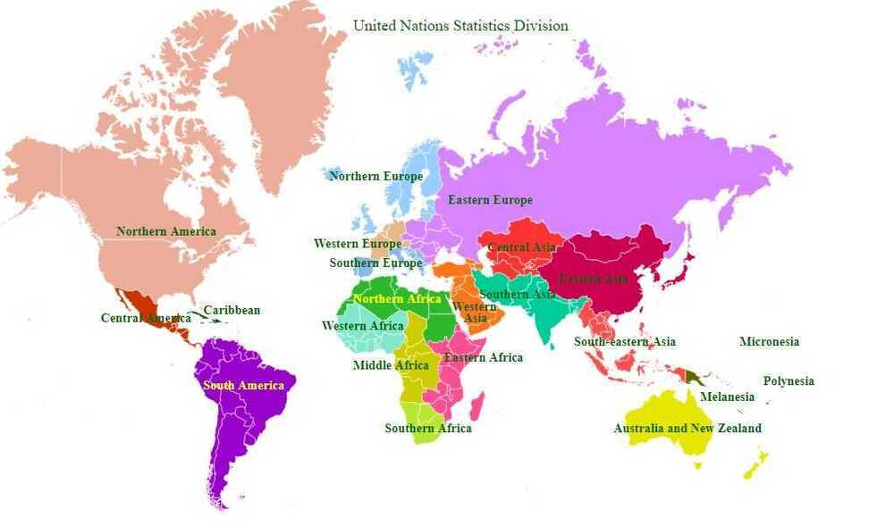

# Continents

| **Continent** | **Area (km²)** | **Area (mi²)** | **Percent total landmass** | **Population** | **Percent total pop.** | **Most populous city** |
|---|---|---|---|---|---|---|
| Africa | 30,370,000 | 11,730,000 | 20.4% | 1,287,920,000 | 16.9% | Lagos,Nigeria |
| Antarctica | 14,000,000 | 5,400,000 | 9.2% | 4,490 | 0.0% | McMurdo Station |
| Asia | 44,579,000 | 17,212,000 | 29.5% | 4,545,133,000 | 59.5% | Shanghai,China |
| Australia | 8,600,000 | 3,300,000 | 5.9% | 41,261,000 | 0.5% | Sydney,Australia |
| Europe | 10,180,000 | 3,930,000 | 6.8% | 742,648,000 | 9.7% | Moscow,Russia |
| North America | 24,709,000 | 9,540,000 | 16.5% | 587,615,000 | 7.7% | Mexico City,Mexico |
| South America | 17,840,000 | 6,890,000 | 12.0% | 428,240,000 | 5.6% | São Paulo,Brazil |

The term [Oceania](https://en.wikipedia.org/wiki/Oceania) refers to a group of [island countries](https://en.wikipedia.org/wiki/Island_country) and territories in the [Pacific Ocean](https://en.wikipedia.org/wiki/Pacific_Ocean), together with the [continent of Australia](https://en.wikipedia.org/wiki/Australia_(continent)).[Pacific islands](https://en.wikipedia.org/wiki/Pacific_islands) with ties to other continents (such as [Japan](https://en.wikipedia.org/wiki/Japan), [Hawaii](https://en.wikipedia.org/wiki/Hawaii) or [Easter Island](https://en.wikipedia.org/wiki/Easter_Island)) are usually grouped with those continents rather than Oceania. This term is used in several different continental models instead of [Australia](https://en.wikipedia.org/wiki/Australia_(continent)).

## Highest and Lowest Point

| **Continent** | **Highest point**                                                    | **Elevation (m)** | **Elevation (ft)** | **Country or territory containing highest point**                                                              | **Lowest point**                                                            | **Elevation (m)** | **Elevation (ft)** | **Country or territory containing lowest point**                                                                                                                 |
|-------|--------|-------|-------|-----------|---------|-------|-------|---------------|
| Asia          | [Mount Everest](https://en.wikipedia.org/wiki/Mount_Everest)         | 8,848             | 29,029             | [China](https://en.wikipedia.org/wiki/China), [Nepal](https://en.wikipedia.org/wiki/Nepal)                      | [Dead Sea](https://en.wikipedia.org/wiki/Dead_Sea)                          | −427              | −1,401             | [Israel](https://en.wikipedia.org/wiki/Israel), [Jordan](https://en.wikipedia.org/wiki/Jordan) and [Palestine](https://en.wikipedia.org/wiki/State_of_Palestine) |
| South America | [Aconcagua](https://en.wikipedia.org/wiki/Aconcagua)                 | 6,960             | 22,830             | [Argentina](https://en.wikipedia.org/wiki/Argentina)                                                           | [Laguna del Carbón](https://en.wikipedia.org/wiki/Laguna_del_Carb%C3%B3n)   | −105              | −344               | [Argentina](https://en.wikipedia.org/wiki/Argentina)                                                                                                             |
| North America | [Denali](https://en.wikipedia.org/wiki/Denali)                       | 6,198             | 20,335             | United States                                                                                                  | [Death Valley](https://en.wikipedia.org/wiki/Death_Valley)†                | −86               | −282               | United States                                                                                                                                                    |
| Africa        | [Mount Kilimanjaro](https://en.wikipedia.org/wiki/Mount_Kilimanjaro) | 5,895             | 19,341             | [Tanzania](https://en.wikipedia.org/wiki/Tanzania)                                                             | [Lake Assal](https://en.wikipedia.org/wiki/Lake_Assal_(Djibouti))           | −155              | −509               | [Djibouti](https://en.wikipedia.org/wiki/Djibouti)                                                                                                               |
| Europe        | [Mount Elbrus](https://en.wikipedia.org/wiki/Mount_Elbrus)           | 5,642             | 18,510             | Russia                                                                                                         | [Caspian Sea](https://en.wikipedia.org/wiki/Caspian_Sea)                    | −28               | −92                | Russia                                                                                                                                                           |
| Antarctica    | [Vinson Massif](https://en.wikipedia.org/wiki/Vinson_Massif)         | 4,892             | 16,050             | (none)                                                                                                         | Deep Lake, [Vestfold Hills](https://en.wikipedia.org/wiki/Vestfold_Hills)† | −50               | −160               | (none)                                                                                                                                                           |
| Australia     | [Puncak Jaya](https://en.wikipedia.org/wiki/Puncak_Jaya)             | 4,884             | 16,024             | [Indonesia](https://en.wikipedia.org/wiki/Indonesia)([Papua](https://en.wikipedia.org/wiki/Papua_(province))) | [Lake Eyre](https://en.wikipedia.org/wiki/Lake_Eyre)                        | −15               | −49                | Australia                                                                                                                                                        |

[How the World Map Looks Wildly Different Than You Think](https://youtu.be/lPNrtjboISg)

## Mercator Projection

The Mercator projection ([/mərˈkeɪtər/](https://en.wikipedia.org/wiki/Help:IPA/English)) is a [cylindrical map projection](https://en.wikipedia.org/wiki/Cylindrical_map_projection) presented by [Flemish](https://en.wikipedia.org/wiki/Flemish_people) geographer and cartographer [Gerardus Mercator](https://en.wikipedia.org/wiki/Gerardus_Mercator) in 1569. It became the standard map projection for [navigation](https://en.wikipedia.org/wiki/Navigation) because it is unique in representing north as up and south as down everywhere while preserving local directions and shapes. The map is thereby [conformal](https://en.wikipedia.org/wiki/Conformal_map_projection). As a side effect, the Mercator projection inflates the size of objects away from the equator. This inflation is very small near the equator but accelerates with increasing [latitude](https://en.wikipedia.org/wiki/Latitude) to become infinite at the poles. As a result, landmasses such as [Greenland](https://en.wikipedia.org/wiki/Greenland) and [Antarctica](https://en.wikipedia.org/wiki/Antarctica) appear far larger than they actually are relative to landmasses near the equator, such as Central Africa.

https://en.wikipedia.org/wiki/Mercator_projection

https://en.wikipedia.org/wiki/Equal-area_map

https://thetruesize.com

[Maps Distort How We See the World - by Tomas Pueyo](https://unchartedterritories.tomaspueyo.com/p/maps-distort-how-we-see-the-world)

- India is bigger than greenland
- Russia is not as big as it seems

So the Mercator projection clearly distorts our perception of the world. But it’s not the only way it’s distorted. We center our map around the equator and the [reference meridian](https://en.wikipedia.org/wiki/IERS_Reference_Meridian), which goes [through London](https://en.wikipedia.org/wiki/Prime_meridian_(Greenwich)).

What happens if you center it on Argentina instead?

_This shows how far away from everything Chile is, at the bottom left of South America. Poor lonely Chile. Your Australian editor Shoni would also want to claim lonely status for New Zealand._

Conversely, if you center the map around Alaska, you can see why it has the [3rd biggest airport](https://www.internationalairportreview.com/article/107921/top-10-busiest-airports-world-cargo/) in the world in terms of cargo: it’s the most central point to all the big markets in the northern hemisphere.

