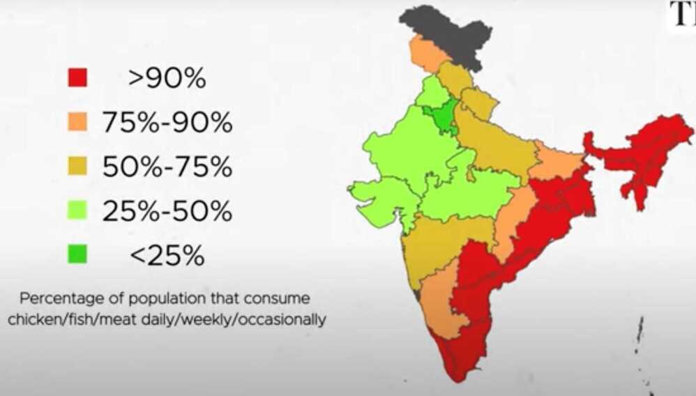

# India

### Population Distribution

- Total Population - 1.428 billion
- Male population of 51.6% and a current female population of 48.4%
- Country - 944 Females out of 1000 Males
- Lakshadweep - 1051 females out of 1000 males
- Tripura - 1028 females out of 1000 males
- Haryana - 893 females out of 1000 males
- Chhattisgarh - 960 females out of 1000 males

[List of states and union territories of India by sex ratio - Wikipedia](https://en.wikipedia.org/wiki/List_of_states_and_union_territories_of_India_by_sex_ratio)

### Education

- India’s total literacy rate is 77.70%
- Kerala - 96.2%
    - Female literacy - 95.2%
    - Male literacy - 97.4%.
- Chhattisgarh - 70.3%
- Haryana - 75.6%

[State Wise Literacy Rate in India 2023 - Dare to Miss The Top 10](https://onlineschoolsindia.in/school-guide/state-wise-literacy-rate-in-india/)

### Religion Distribution

- Hinduism: 79.8%
- Islam: 14.2%
- Christianity: 2.3%
- Sikhism: 1.7%
- Buddhism: 0.7%
- Adivasi: 0.5%
- Jainism: 0.4%
- No religion: 0.25%

### Food Distribution

[Superlatives of India and World | Largest, deepest, tallest , smallest | Static GK](https://www.youtube.com/watch?v=3_w5x_N5xks)

[UNESCO World Heritage Sites in India | Intangible sites | Competitive exams - YouTube](https://www.youtube.com/watch?v=DpcbulG7QJE&ab_channel=LearnwithFinology)
[Coastal Plains of India - Types & Importance [Explained] | Geography for UPSC Prelims & Mains 2022 - YouTube](https://www.youtube.com/watch?v=Kn5S0Sw0MNc)

[National symbols of India - YouTube](https://www.youtube.com/watch?v=-ImDjAuGVoU)

[BrahMos Supersonic Cruise Missile [Explained] | Science and Technology for UPSC Prelims & Mains 2022 - YouTube](https://www.youtube.com/watch?v=1gwRy8t2wCA)

## Delhi Metro

## Problems

### Stampedes in India

1. Kumbh mela
2. NDLS station
3. Bangalore RCB victory parade chinnaswamy station

[Category:Human stampedes in India - Wikipedia](https://en.wikipedia.org/wiki/Category:Human_stampedes_in_India)

[A list of major stampedes in India](https://www.hindustantimes.com/india-news/a-list-of-major-stampedes-in-india-101749063669232.html)

[Bengaluru stampede: A list of major stampedes in India - The Hindu](https://www.thehindu.com/news/national/major-stampedes-in-india-list/article69659616.ece)

[Tamil Nadu Karur Stampede At Actor-Politician Vijay's Rally Described In Haunting Visuals](https://www.ndtv.com/india-news/tamil-nadu-karur-stampede-at-actor-politician-vijays-rally-described-in-haunting-visuals-9360785)

## Economics

[How many Indians earn more than Rs 1 crore annually? The Hurun Wealth Report 2025 reveals - Money News \| The Financial Express](https://www.financialexpress.com/money/how-many-indians-earn-more-than-rs-1-crore-annually-the-hurun-wealth-report-2025-reveals-3983400/)

## Others

- [India has a Big Stray Dogs Problem | Dhruv Rathee - YouTube](https://www.youtube.com/watch?v=tMsf6i7yID8)
- [INDIA is Doomed - YouTube](https://youtu.be/bJ8Mz_HZMN4) - **No civics sense in India**
