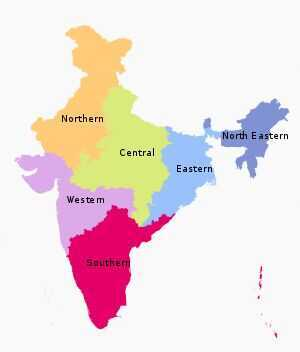

# Indian States and UTs

[India](https://en.wikipedia.org/wiki/India) is a [federal](https://en.wikipedia.org/wiki/Federalism) union comprising 28 [states](https://en.wikipedia.org/wiki/Federated_state) and 9 [union territories](https://en.wikipedia.org/wiki/Union_territory), for a total of 37 entities. The states and union territories are further subdivided into [districts](https://en.wikipedia.org/wiki/List_of_districts_in_India) and smaller [administrative divisions](https://en.wikipedia.org/wiki/Administrative_divisions_of_India).

## Adminstrative Divisions of India

Indian states and territories frequently use different local titles for the same level of subdivision (e.g., the [*mandals*](https://en.wikipedia.org/wiki/Mandal_(country_subdivision)) of [Andhra Pradesh](https://en.wikipedia.org/wiki/Andhra_Pradesh) and [Telangana](https://en.wikipedia.org/wiki/Telangana) correspond to [*tehsils*](https://en.wikipedia.org/wiki/Tehsil) of [Uttar Pradesh](https://en.wikipedia.org/wiki/Uttar_Pradesh) and other [Hindi-speaking states](https://en.wikipedia.org/wiki/Hindi_Belt) but to [*talukas*](https://en.wikipedia.org/wiki/Taluka) of [Gujarat](https://en.wikipedia.org/wiki/Gujarat), [Goa](https://en.wikipedia.org/wiki/Goa), [Karnataka](https://en.wikipedia.org/wiki/Karnataka), [Kerala](https://en.wikipedia.org/wiki/Kerala), [Maharashtra](https://en.wikipedia.org/wiki/Maharashtra), and [Tamil Nadu](https://en.wikipedia.org/wiki/Tamil_Nadu)).

## Tiers of India

## Zones

The States have been grouped into six zones having an Advisory Council "to develop the habit of cooperative working" among these States.[Zonal Councils](https://en.wikipedia.org/wiki/Zonal_Council) were set up vide Part-III of the [States Reorganisation Act](https://en.wikipedia.org/wiki/States_Reorganisation_Act), 1956. The North Eastern States' special problems are addressed by another statutory body - The North Eastern Council, created by the North Eastern Council Act, 1971. The present composition of each of these Zonal Councils is as under:

- [Northern Zonal Council](https://en.wikipedia.org/wiki/Northern_Zonal_Council), comprising [Chandigarh](https://en.wikipedia.org/wiki/Chandigarh), [Delhi](https://en.wikipedia.org/wiki/Delhi), [Haryana](https://en.wikipedia.org/wiki/Haryana), [Himachal Pradesh](https://en.wikipedia.org/wiki/Himachal_Pradesh), [Jammu and Kashmir](https://en.wikipedia.org/wiki/Jammu_and_Kashmir_(union_territory)), [Ladakh](https://en.wikipedia.org/wiki/Ladakh), [Punjab](https://en.wikipedia.org/wiki/Punjab,_India), and [Rajasthan](https://en.wikipedia.org/wiki/Rajasthan);
- [North Eastern Council](https://en.wikipedia.org/wiki/North_Eastern_Council), comprising [Assam](https://en.wikipedia.org/wiki/Assam), [Arunachal Pradesh](https://en.wikipedia.org/wiki/Arunachal_Pradesh), [Manipur](https://en.wikipedia.org/wiki/Manipur), [Meghalaya](https://en.wikipedia.org/wiki/Meghalaya), [Mizoram](https://en.wikipedia.org/wiki/Mizoram), [Nagaland](https://en.wikipedia.org/wiki/Nagaland) and [Tripura](https://en.wikipedia.org/wiki/Tripura); The State of [Sikkim](https://en.wikipedia.org/wiki/Sikkim) has also been included in the North Eastern Council vide North Eastern Council (Amendment) Act, 2002 notified on 23 December 2002.
- [Central Zonal Council](https://en.wikipedia.org/wiki/Central_Zonal_Council), comprising the States of [Chhattisgarh](https://en.wikipedia.org/wiki/Chhattisgarh), [Madhya Pradesh](https://en.wikipedia.org/wiki/Madhya_Pradesh), [Uttarakhand](https://en.wikipedia.org/wiki/Uttarakhand) and [Uttar Pradesh](https://en.wikipedia.org/wiki/Uttar_Pradesh);
- [Eastern Zonal Council](https://en.wikipedia.org/wiki/Eastern_Zonal_Council), comprising [Bihar](https://en.wikipedia.org/wiki/Bihar), [Jharkhand](https://en.wikipedia.org/wiki/Jharkhand), [Odisha](https://en.wikipedia.org/wiki/Odisha), and [West Bengal](https://en.wikipedia.org/wiki/West_Bengal);
- [Western Zonal Council](https://en.wikipedia.org/wiki/Western_Zonal_Council), comprising [Dadra and Nagar Haveli](https://en.wikipedia.org/wiki/Dadra_and_Nagar_Haveli), [Daman and Diu](https://en.wikipedia.org/wiki/Daman_and_Diu), [Goa](https://en.wikipedia.org/wiki/Goa), [Gujarat](https://en.wikipedia.org/wiki/Gujarat), and [Maharashtra](https://en.wikipedia.org/wiki/Maharashtra);
- [Southern Zonal Council](https://en.wikipedia.org/wiki/Southern_Zonal_Council), comprising [Andhra Pradesh](https://en.wikipedia.org/wiki/Andhra_Pradesh), [Karnataka](https://en.wikipedia.org/wiki/Karnataka), [Kerala](https://en.wikipedia.org/wiki/Kerala), [Puducherry](https://en.wikipedia.org/wiki/Puducherry), [Tamil Nadu](https://en.wikipedia.org/wiki/Tamil_Nadu), and [Telangana](https://en.wikipedia.org/wiki/Telangana).
- [Andaman and Nicobar Islands](https://en.wikipedia.org/wiki/Andaman_and_Nicobar_Islands), [Lakshadweep](https://en.wikipedia.org/wiki/Lakshadweep) are not members of any of the Zonal Councils. However, they are presently special invitees to the [Southern Zonal Council](https://en.wikipedia.org/wiki/Southern_Zonal_Council)
