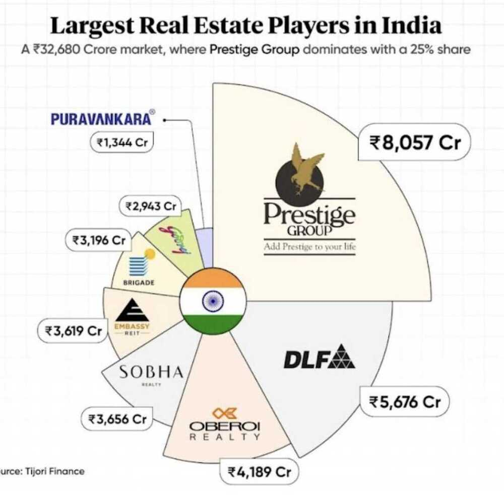

# New Home / Place Buying / House

[Living](knowledge/geography/living.md)

[Architectural Digest - YouTube](https://www.youtube.com/@Archdigest)

Housing isn’t a great investment but for most people, it’s the best investment they will ever make because it’s the only asset they will leave alone and let compound for 10, 20, 30 years.

## Questions

- Why people have false ceilings

## Places/Place to live

[**Where on Earth Will People Live in the Future? | Parag Khanna | TED**](https://www.youtube.com/watch?v=MSevAi_YarQ)

**20-30 degrees Celsius with no humidity throughout year i.e dry climate**

### Elevation / Altitude

One of the factor is Elevation

- 500 mtr+ is good weather like bangalore (964m), pune (565m), jagdalpur (570m), nainital (1990m)
- 300 mtr is bad - delhi (246m), dantewada (370m), ramnagar (388m)

As we increase elevation, there is less air above us thus the pressure decreases. As the pressure decreases, air molecules spread out further (i.e. air expands) and the temperature decreases.

[As we go to higher altitudes, what happens to the temperature?](https://byjus.com/question-answer/as-we-go-to-higher-altitudes-what-happens-to-the-temperature-it-increasesit-remains-constantit/)

When we move up a hill, we notice a fall in temperature. This fall in temperature with elevation is primarily due to two reasons.

1. With the increase in elevation, the atmospheric **pressure falls**. Fall in pressure implies that the temperature also falls (Pressure is directly proportional to Temperature and vice versa)
2. With the increase in elevation, the **concentration of greenhouse gases decreases** (Water vapor and carbon dioxide fall sharply with elevation). Hence the heat absorption capacity of the atmosphere will also decrease.

[why temperature decreases with altitude?](https://byjus.com/question-answer/why-temperature-decreases-with-altitude/)

[If heat rises, why does the temperature decrease at higher elevations? | Scientific American](https://www.scientificamerican.com/article/if-heat-rises-why-does-th/)

[Why does temperature decrease with increase in altitude? - Quora](https://www.quora.com/Why-does-temperature-decrease-with-increase-in-altitude)

### Places

- **Pune**
- Bangalore
- **Mysore**
- Nashik
- Nainital (15-25)
- Shillong (15-25)
- Hyderabad - [Planning to Buy a Flat in Hyderabad? Here Are Top trends of 2024 You Should Know - The 1% News](https://news.onepercentclub.io/invest/planning-to-buy-a-flat-in-hyderabad-here-are-top-trends-of-2024-you-should-know/12849/)
- Chandigarh

[Which is the best city to live in North India? - Quora](https://www.quora.com/Which-is-the-best-city-to-live-in-North-India)

[Best cities in India with pleasant weather all year round | EconomicTimes](https://economictimes.indiatimes.com/news/web-stories/best-cities-in-india-with-pleasant-weather-all-year-round/slideshow/103212353.cms)

https://zolostays.com/blog/cities-with-best-weather-in-india

[Want to Go Abroad? Immigration Advisor on Which Countries Are Preferable for Indians and Why](https://www.youtube.com/watch?v=FLBEhyzYHUQ)

[iVisa Plus: Free Standard Processing of Unlimited Travel Docs](https://www.ivisa.com/plus)

### Foreign

- Finland
- Norway
- Denmark
- Switzerland (HNWIs)
- Canada
- Australia (HNWIs)
- UAE (HNWIs)
- New Zealand
- Portugal (invest less than 3 crore and be a citizen)
- Japan

- Temperature - 23-25 degree Celsius
- Humidity - 30-50%
- [Is there a country/region in the world where the temperature is year round around 23-25 degrees Celsius?](https://www.quora.com/Is-there-a-country-region-in-the-world-where-the-temperature-is-year-round-around-23-25-degrees-Celsius)
- [Best Countries to Live In 2023](https://worldpopulationreview.com/country-rankings/best-countries-to-live-in)
- [The Best Countries to Live in the World: Top-9 Places to Immigrate](https://immigrantinvest.com/blog/top-9-countries-for-comfortable-life-en/)
    - Singapore
    - New Zealand
    - Germany
    - Spain
    - Canada
    - Austria
    - Finland
- [4,300 millionaires may leave India this year. Here's where they are moving to](https://economictimes.indiatimes.com/nri/migrate/4300-millionaires-may-leave-india-this-year-heres-where-they-are-moving-to/articleshow/111109899.cms)
    - UAE (Land Ownership)
    - Top 5 affordable countries where Indians can buy citizenship
    - ​Dominica - Rs 76,46,000​
    - ​St. Lucia - Rs 76,46,000​
    - ​Grenada - Rs 1,14,69,000​
    - ​Antigua and Barbuda - Rs 76,46,000​
    - Vanuatu - Rs 91,05,000
- India has taxes like Europe/England services like Somalia or any other African countries

#### Metrics

- Maximum life expectancy (if no accident or anything like that) vs life expectancy
- Population Density
- Spending on healthcare
- Taxes and generational tax / Property tax
- Quality of life index for new home and multiple indexes
- Total homicides, total crime index, total accidents
- Public transport
- Education
- Climate & Environmental protection
- Racism
- Economics - Job Market, Home Prices
- [The Economist Democracy Index - Wikipedia](https://en.wikipedia.org/wiki/The_Economist_Democracy_Index)
- HDI by UNDP

### Renting

- Never ever buy a second hand AC
- Never get a top floor apartment

### New Home

- Buy home where new metro stations are coming up
- Study Room / Office Room / GYM (2 desks for WFH - no bed or people or clutter in study room)
- Buy home in parents name, so can pay house rent and deduct HRA) / Housing / Condominiums
- Near beach & independent house with open areas and no humidity and no huge temperature variance (in a different country, with low income tax and high HDI, happiness index, low crime, low inequality, good education, no racism)
- https://www.thehindu.com/real-estate/the-occupancy-certificate-why-it-is-now-more-important-than-ever/article19294876.ece
- Natural Disaster area - earthquake, tsunami, hurricane, flood, drought, etc
    -  Global Seismic Hazard Map
- **Don't buy a house more than 50 lakhs in India (1 crore house in america gives you a condo)**
    - In $300,000 (2.5 crore) you can get a 5 bedroom condo
- Buy home from bank auctions - [auction property: Is it safe to buy auction property? Six things a buyer need to keep in mind - The Economic Times](https://economictimes.indiatimes.com/wealth/real-estate/is-it-safe-to-buy-auction-property-six-things-a-buyer-need-to-keep-in-mind/articleshow/103044435.cms)
- Property Tax
- Home stress testing and building testing via a third party engineer (ultrasound) - Chintan
- Reverse mortage
- Rent dresses
- We already have 3 homes (Dantewada, Bahadurgarh, Gurgaon)
- We don't have a scarcity of land in the world, we have too much land, land is cheap
- Investor's clinic / housing.com - India's biggest exclusive broker for property
- No floating interest
- Bank auction properties
- Folding beds
- Rent Aggrement
- Trash management
- Water bill
- Electricity meter (BSES) - Powercuts in area
- Gas connection
    - Chimney point
    - Induction cooktop over gas stove
    - [The Problem With Gas Stoves - YouTube](https://www.youtube.com/watch?v=X440BHdy35g)
    - [Why don't Americans use electric kettles? - YouTube](https://www.youtube.com/watch?v=_yMMTVVJI4c)
    - [Gas stoves aren't really that fast - even standard electric is faster! - YouTube](https://www.youtube.com/watch?v=eUywI8YGy0Y)
- Electricity Backup (Inverter / DG (Diesel Generator))
- Security deposit
- Ventilators
- Fan / Cooler / AC / Geyser
- Maintenance fees
- Parking
- Floor - Lift?
- Internet / Network signal strength and call quality (Drop rate)
- In and out times / security
- Sound proofing between walls rooms and outside house (Noise Pollution Levels)
- RO / Water
    - Ceremic filters are also good (doesn't require electricity / doesn't need Maintenance / no wastage of water / Cheap)
    - https://www.livemint.com/Leisure/6IPqOAHPfAb4aLecr2U0vI/How-safe-is-your-water.html
- Water
	- Tubewell
	- Water storage tanks - underground (10000 ltrs) and above (1000 ltrs)
	- Close by lakes/rivers for undisturbed water supply
- Big Wardrobes (storage)
    - Sliding door better
    - Add door plastic below adder so cold AC air doesn't leak from below door

#### Tools / Sites

- Facebook chapters
- MagicBricks
- 99acres
- nobroker

#### Priorities

- Double your salary and knowledge in next 2 years
- Budget - 25-40K
- Office traveling distance (max 30 mins)
- Park
- Society (high rise apartment), walkable
- Semi furnished (AC / Cupboard / Geyser)
- Sunlight
- Study room

### Bathroom

- Check all tap and flush working or not
- Taps valves should not be round or circular opening, but that can be opened when the hand is wet or dirty, with elbows

### Amneties

- Nearby Park
- Contemporary Clubhouse
- Multipurpose Banquet Hall
- Indoor Games Room
- Toddler's Play Area
- Amphitheatre
- Multipurpose Court
- Sit Out Zone
- Fully Equipped Air-Conditioned Gymnasium
- Adequate Multi-level Parking

### Nearby

- Hospital
- CultFit
- Market / Mall
- Metro
- Look at Google Earth for surrounding things
- House Poor / house rich, cash poor - https://www.investopedia.com/terms/h/housepoor.asp
- Home lane for interior designing, for a home get a professional interior designer
- Rent
    - Furniture rental furlenco
    - Rentomojo
- Solar - [Solar System for Home with 23% ROE - with Excel Calculation | Solar subsidy and utility | - YouTube](https://www.youtube.com/watch?v=EB2CZJz1dIY)
- Daily dump composter
- Not near airport, or noisy place

### Thoughts

- Don't live in tier 2 cities
- Surround yourself with highly motivated and highly talented people
- Low Crime Rates

https://transferwise.com/au/blog/property-tax-in-india

Stamp duty in Delhi: Stamp duty in national capital Delhi is six per cent. Women buyers, on the other hand, have to pay only four per cent stamp duty.

https://freefincal.com/real-estate-investing-practical-aspects-retail-investors-should-keep-in-mind

[Why will I NOT buy a house?](https://youtu.be/IwBu_YYXGzY)

#### Thoughts 1

Life is currently too dynamic to plan very super long term, so live short term happy cycles

Try to create a family life wherever noone is dependent on me, so I can be free and do whatever I want

Therefore you need a lot of money

I am an implementor -

Papa open a franchise - supermarket that is not dependent on him, but he has a place to spend time

Land living in isolation vs society flat living with people

If not delhi, can raipur, hyderbad be our place of dwelling

Buy 1 acre land
Good air quality
Good social security

Good infra

Low crime

Good hospitals nearby
Good education
Open a school
Gardening for parents
Close to didi jiju

Dubai is an option

Do we really want to stay in India

- culture
- indian people

What do I want to do

- give back to society
- do fundamental core research
- solve core world problems
- live long and healthy
- participate in sports

Try 1st living in isolation (without needing more people or society) if it works and you are happy than move out of India

Find a purpose for your life

Live long enough so someone finds a cure to aging

For papa - find hobby
For maa - find hobby

Children can be a gateway to everyone's life
Start with tution, speak to mother, than to father
Give best education
Slowly takeover the education full time
Close or tieup with other schools

### New Flats

- **> 3000 sq ft**
- **Running balcony**
- carpet area / floor space / usable floor space
    - [Watch this before buying a FLAT | How to find fair market value of property - YouTube](https://www.youtube.com/watch?v=qCMFlfBTWks&ab_channel=LabourLawAdvisor)
    - Carpet area / rera carpet area
    - Built up area (10-15% more than carpet area)
    - Super built up area - 20-50% more than built up area
- [Why are Top Floor Apartments More Expensive? | Boom | Boom](https://www.boompay.app/post/why-top-floor-units-more-expensive)
- Asian paints smart care damp proof

[Should you buy home? | Property investment in India - Future expectations | NIRANJAN HIRANANDANI | - YouTube](https://www.youtube.com/watch?v=FnrbjPvLTXg)

[आपके सपनो का बंगलो | 4 BHK Ultra Luxurious Bungalow For Sale,Ahmedabad | 850 Sqyrd Villa #bungalow - YouTube](https://www.youtube.com/watch?v=6glqoNzMN3Y)

## Buying vs Renting Home

Unrecoverable cost of owning vs buying

Property Taxes, Maintenance costs, cost of capital

Take the value of the home that you are considering multiply by 5% and divide by 12

**Never buy a home, don't buy a land too**

- **Land is not that scarce, world has too much land (Africa is 9 times of India)**
- because house depreciates in value, but land appreciates in value
- land is a commodity, house is a consumer good

### Links

- Arthayantra Buy Vs Rent Report
- https://www.etmoney.com/blog/buying-a-house-or-staying-on-rent-which-is-a-better-option
- [BUY or RENT a House in 2021 | CA Rachana Ranade - YouTube](https://www.youtube.com/watch?v=hPTrtp098vg)
- [5 IMPORTANT Life Decisions you SHOULD take on an Excel Sheet | Ankur Warikoo Hindi](https://youtu.be/EE8iTK9_xa8)
- [Is BUYING a BETTER OPTION in 2023? | Buying vs Renting a house: 2023 edition | Ankur Warikoo Hindi - YouTube](https://www.youtube.com/watch?v=YT1ZYWr-tAU&ab_channel=warikoo)
- [Home rent or buy? | Should you buy a house in 2024? - The final answer | - YouTube](https://www.youtube.com/watch?v=pjpfeTvVMA4&ab_channel=InvestAajForKal)

## Documents / Property Investing

### Thoughts

- Will you buy a 20 year old flat, what's the rate of 20 year old flat in a 20 year old society???
- So flats area not an investment. It's a bubble that will burst
- Same for a commercial property
- Will you go to a 20 year old Mall??
- Once analyse the resell market too
- Never buy a flat in a society without living in the society on rent for atleast 6 months to a year.

### Documents

[Don't Invest in Property before checking 10 DOCUMENTS ft. @LegalSHOTS | Real Estate - YouTube](https://www.youtube.com/watch?v=Zhxp1BGgBn8)

1. Title document - Sale deed, gift deed, conveyance deed
2. Channel document
3. Encumbrance certificate (no existing loan on the document)
4. Occupancy certificate
5. Allotment letter
6. Urban development tax receipt
7. Car allotment letter
8. No objection certificate (noc)
9. Mutation letter
10. Conversion certificate
11. Motation / Mutation

[Flat buying tips - 21 points checklist before buying a flat | FLAT BUYING TIPS | Personal Finance | - YouTube](https://www.youtube.com/watch?v=5biF-qJxuyo&ab_channel=InvestAajForKal)

[The REAL Cost of Buying a House in Delhi/Gurgaon? - YouTube](https://www.youtube.com/watch?v=CdZ199Fo0kE&ab_channel=WintWealth)

[Noida Property Market EXPOSED: How Builders are Trapping Investors - YouTube](https://www.youtube.com/watch?v=jeD2kg4ObXs&ab_channel=PropertyDuniya)

- Builder transfer policy
- Property transfer

## Climate resilient

[World Risk Report 2022](https://repository.gheli.harvard.edu/repository/10930/)

[WeltRisikoBericht - WeltRisikoIndex](https://weltrisikobericht.de/weltrisikobericht-2022-e/#worldriskindex)

Air pollution in Delhi reduces life expectancy by 10 years

- [They came to start a new life; now every breath they take is a struggle](https://timesofindia.indiatimes.com/city/gurgaon/they-came-to-start-a-new-life-now-every-breath-they-take-is-a-struggle/articleshow/109066285.cms)

### Factors

- access to freshwater
- availability of food
- proximity to healthcare facilities
- withstand extreme weather events
- Areas that are less prone to extreme weather events, such as inland areas or regions at higher elevations, may be more resilient to climate change impacts than coastal regions or low-lying areas that are vulnerable to sea-level rise and flooding

### India

1. The Himalayan region: This region includes states like Uttarakhand, Himachal Pradesh, Sikkim, and Arunachal Pradesh, which are at higher elevations and have access to freshwater sources. These areas are also less prone to extreme weather events, such as cyclones and floods, that can impact coastal regions. Additionally, these states have a strong tradition of organic farming and have relatively better healthcare facilities compared to other parts of the country.
2. The Deccan Plateau: This region covers a large part of central and southern India, including states like Maharashtra, Karnataka, Andhra Pradesh, and Telangana. This area is relatively more stable climatically and has access to groundwater sources. The Deccan Plateau is also known for its agriculture and food production, including the cultivation of crops such as rice, wheat, and pulses.
3. The North-Eastern region: This region includes states like Assam, Meghalaya, and Nagaland and has access to water resources such as the Brahmaputra and Barak rivers. This region is less prone to extreme weather events, although some areas are prone to landslides and floods. Additionally, the region has a high biodiversity and a rich cultural heritage.

### International

1. Iceland, which is relatively less vulnerable to the impacts of climate change compared to many other countries. Iceland has a small population, abundant renewable energy resources, and access to freshwater. Additionally, Iceland has a strong focus on environmental conservation and sustainable practices, which have helped to mitigate the impacts of climate change in the country.
2. Canada, which has a vast land area and diverse geography that may provide some resilience to climate change impacts. Canada has a relatively small population and abundant freshwater resources, which may be crucial as water scarcity becomes a more significant problem in other parts of the world. Additionally, Canada has taken steps to reduce greenhouse gas emissions and invest in renewable energy sources, which may help to mitigate the impacts of climate change.
3. ~~Australia, New Zealand,~~ and certain countries in Europe such as Germany or Denmark
4. Dubai - [Moving to Dubai for Tax Free Crypto? Read Our Guide!](https://www.coinbureau.com/analysis/dubai-crypto-tax/)
5. Newzealand Japan Pacific ring of fire earthquake prone areas

[The Best Citizenship in a New World Order - YouTube](https://www.youtube.com/watch?v=CAiW7HOwiaQ)

[Human Development Index - Wikipedia](https://en.wikipedia.org/wiki/Human_Development_Index)

## Land

**1 hectacre (2.47 acre) land to be self sufficient**

1 acre = 4046 sq mtrs = 63.6 mtr x 63.6 mtr

- [Plots in Chattarpur Delhi - 55+ Residential Land / Plots in Chattarpur Delhi](https://www.99acres.com/residential-land-in-chattarpur-south-delhi-ffid)

A person feeding themselves a vegetarian diet would need about an acre of land a year. If they were to eat meat by raising chickens, goats and cows this would be 3 acres and above.

- [How much land do you need to be self sufficient? - Self Sufficient Homesteading](https://www.selfsufficienthomesteading.com/self-sufficiency/how-much-land-do-you-need-to-be-self-sufficient/)
- [Land in India: Market price vs. fundamental value](https://www.ideasforindia.in/topics/governance/land-in-india-market-price-vs-fundamental-value.html)
- [How To Buy Agricultural Land In Haryana | Agri Farming](https://www.agrifarming.in/how-to-buy-agricultural-land-in-haryana)
- [How to buy an Agricultural Land in India in 2023: Know laws, legal tips, eligibility](https://www.99acres.com/articles/legal-tips-for-buying-agricultural-land-in-india.html)

### Taxation

- [All About your Property Tax and How to Pay it Online](https://www.bankbazaar.com/home-loan/resources/land-tax.html)
- [What are the Land Ownership Laws in India?](https://www.ezylegal.in/blogs/land-ownership-laws-in-india)
- [Property Tax in India - Defination, Types, & Calculation Formula](https://www.bankbazaar.com/tax/property-tax.html)

## Loan

- [hdfcfund.com/knowledge-stack/mf-vault/weekend-bytes/balancing-between-taking-home-loan-and-dipping-personal-reserves](https://www.hdfcfund.com/knowledge-stack/mf-vault/weekend-bytes/balancing-between-taking-home-loan-and-dipping-personal-reserves)
- Loan - aavas financiers
- Variable interest rate mortgage loan
- https://economictimes.indiatimes.com/wealth/borrow/smart-use-of-home-loan-can-deliver-best-tax-saving-at-the-lowest-cost/articleshow/88402560.cms
- https://freefincal.com/when-should-i-get-a-home-loan-how-to-decide-this

## Real Estate / Realty Market

- [8 misconceptions about Delhi NCR properties - Reasons why you should invest in Real Estate.](https://www.linkedin.com/pulse/8-misconceptions-delhi-ncr-properties-reasons-why-you-chaudhary/)
- [Is Investing in Delhi Property Worth It? Uncovering the Pros and Cons](https://www.omaxe.com/blog/investing-in-delhi-property-pros-cons/)
- [Why Should You Buy Home If Rent Is Much Less Than Home Emi - YouTube](https://www.youtube.com/watch?v=tb_k4rqcWA8)
- [Buying A Flat? Things That Your Real Estate Agent Won't Tell You - YouTube](https://www.youtube.com/watch?v=aDwNj4NPxi0)
- [Things NO ONE Tells You About Owning a Flat in Mumbai - YouTube](https://www.youtube.com/watch?v=wMzUe71eKLM)
- [My Villa in GOA | Should you buy property in Goa? | Goa REAL ESTATE Market - YouTube](https://www.youtube.com/watch?v=0xmbMoXTk7o)
- [Best रियल एस्टेट investment? -- दुकान, घर, प्लॉट या कृषि भूमि? - YouTube](https://www.youtube.com/watch?v=1r67W4-rk_k)
- [SaudaGhar - YouTube](https://www.youtube.com/@SaudaGhar)
- [Bangalore VS Dehradun: Living on 50 Lakh+ - YouTube](https://www.youtube.com/watch?v=ADlmQRzA258&ab_channel=WintWealth)
- [Are QIPs driving India’s realty sector?](https://finshots.in/markets/what-are-qips-and-are-they-driving-indias-realty-sector-qualified-institutional-placements/)

## Noida Market

- [Inside an Ultra Luxury 17,000 sq ft Villa in Hyderabad (House Tour).](https://youtu.be/kHmNT9sRT1M)
- [Premium Luxury Apartments in Mohali between 1 to 2 Cr | Medallion & Marb...](https://youtu.be/LSdCC3NvZHs)
- [FOMO Market Exposed | New Launches Gurgaon](https://youtu.be/1VJ1YZPCqms)
- [Yamuna authority latest plot scheme | ये कागज रखें तैयार | Yeida plot la...](https://youtu.be/LkRT4rodmLE)
- [Yamuna Expressway Authority New Plot Scheme 2024](https://youtu.be/pJlpSysDuEY)
- [Yamuna Authority Plots: YEIDA Plot Scheme 2024 - Plots Near Jewar Airport](https://youtu.be/Y0Ome-gh7IA)
- [Yeida Flats 2024 Realty:देखिये क्या हकीकत यमुना अथॉरिटी के सेक्टर 22D के...](https://youtu.be/E_t80utc8Ow)
- [Plot v/s Apartment v/s Commercial | What Is Better?](https://youtu.be/s_4Nns496Zg)
- [Addressing Short Term Real Estate Investors](https://youtu.be/zaHI01OlAi4)
- [All Top Upcoming Projects | Real Estate | Noida | Ghaziabad](https://youtu.be/dAFvSRxwEhU)
- [Noida Sec 150 Overview | Discover The Darker side and Future Opportunities | Whitehat Realty - YouTube](https://www.youtube.com/watch?v=K8o5Ky5VMV8&ab_channel=WhitehatRealty)

### 2025-01-18 - Locations - Buy

**Requirement -** We are looking for a residential plot, in a 1 hour travelling distance from sector 18. The budget is 2-3 cr. It should be from a reputed developer in a gated already built-up society, where people are already living. Loan should be available for due diligence. Not looking for a farm house. Something like chhattarpur farms, or ansal villas. It can be either be new or resell.

144, advent building
151 sector

146 sector

Brokers

- +91 95829 72918 - AK Sharma (Good)
- +917988462871 - Nikhil Gupta
- +91 99110 76869 - Prateek Jain
- 092894 84015- aman - green beauty farms
- 099731 36791 - sector 156
- +917052225080 - property square yard noida
- Noida resale, land brokers - +916397655281, +919818377721

[ATS Pristine - Google Maps](https://www.google.com/maps/place/ATS+Pristine,+Pushta+Rd,+Sector+150,+Noida,+Uttar+Pradesh+201310/data=!4m2!3m1!1s0x390cc1933f72bb5f:0x35523950c45896a7?utm_source=mstt_1&entry=gps&coh=192189&g_ep=CAESBjI1LjIuNBgAIJ6dCipsLDk0MjQyNTE3LDk0MjIzMjk5LDk0MjE2NDEzLDk0MjEyNDk2LDk0MjA3Mzk0LDk0MjA3NTA2LDk0MjA4NTA2LDk0MjE3NTIzLDk0MjE4NjUzLDk0MjI5ODM5LDQ3MDg0MzkzLDk0MjEzMjAwQgJJTg%3D%3D)

+91 70115 43356 - Ace estate Surendra tiwari, moneytree,
ATS sector 22 D, yamuna expressway

95829 72918 - Duplex bungalow rwa sector 135
[HD-207, Duplex Villa Sector-135, Noida - Google Maps](https://www.google.com/maps/place/HD-207,+Duplex+Villa+Sector-135,+Noida/@28.4987734,77.3968481,17z/data=!3m1!4b1!4m6!3m5!1s0x390ce9acb76d6c2f:0xccb67a92fb9d54c3!8m2!3d28.4987734!4d77.3968481!16s%2Fg%2F11j7j7m70r?entry=ttu&g_ep=EgoyMDI1MDExNS4wIKXMDSoASAFQAw%3D%3D)

+919973136791 farm house lake view - Residential plot - [Rise Resorts Residency Villa - Google Maps](https://www.google.com/maps/place/Rise+Resorts+Residency+Villa/@28.5800944,77.4317573,17z/data=!3m1!4b1!4m6!3m5!1s0x390cef0301f8bfb7:0xabc2d83d549b4e46!8m2!3d28.5800944!4d77.4317573!16s%2Fg%2F11k547hlpn?entry=ttu&g_ep=EgoyMDI1MDExNS4wIKXMDSoASAFQAw%3D%3D)

### 2025-01-17 - Rent

+919990086104 sector 26, 3rd floor, 45000, 3 bhk, 2 bathroom

078275 71239 sector 26 rent broker

+918077095384 sector 26 (17 jan)

Manoj broker - sector 26 - +91 98181 09460 (17 jan)

### Rates

1.25 - 1140 sq ft, 6th
1390 sq ft - 20%, - 3 bhk - 1.35 lower, 3rd, 3.30

1850 - 2.05 cr -

1640 - 3 bhk, 1.65, mid floor (7 floor, 18 floor - phase 1)
18
2400 - 3+1
3075 - 3+1 and 4 - 3.50 cr

2bhk

10 years

Mahugan, - sector 78 - 2+study - 1250, 11th floor, 1.5 (7-8)
Mahugan modern - 1550 - 2cr
1250 - 1.59
Hyde park - 2bhk - 1010, 3bhk - 1320 - 1.55 (6-8)

Ravi - amrapali -

## Links

- [Living](knowledge/geography/living.md)
- [home-house-building](knowledge/geography/home-house-building.md)
- Best country for kids/primary education
