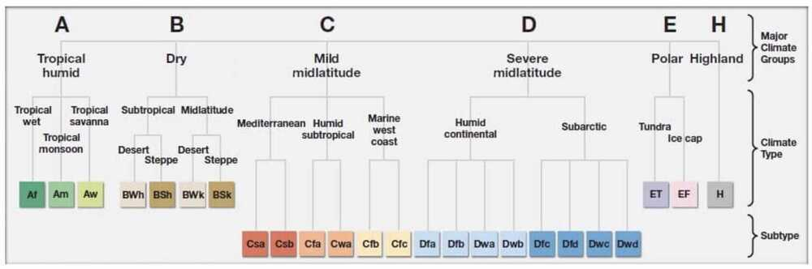
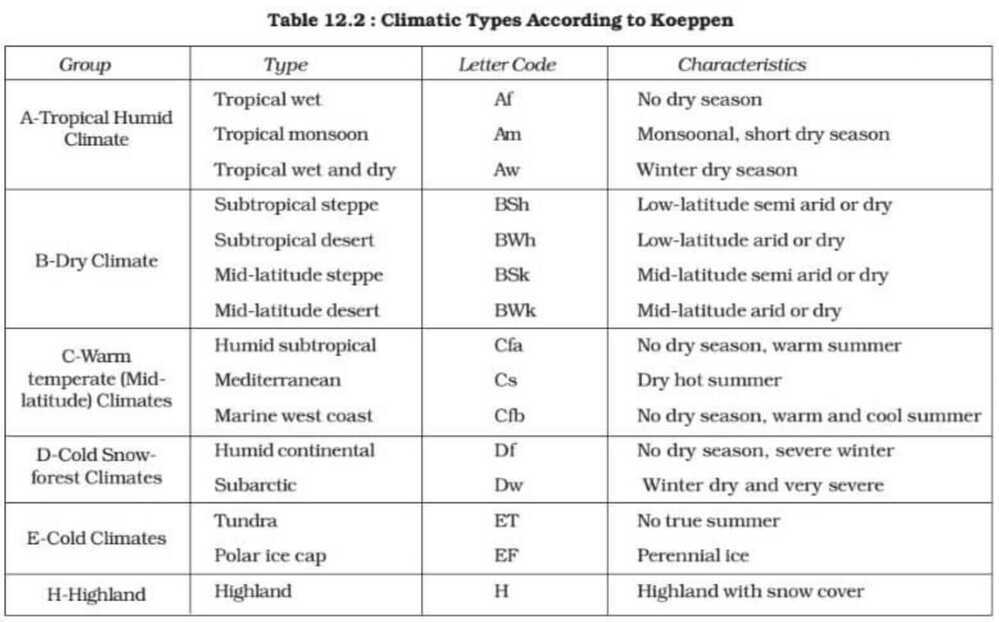

# Others

Summer Solstice - 21 June, 22 June

Winter Solstice - 21 December, 22 December

## South Korea - Hermit Kingdom

The term **hermit kingdom** is used to refer to any country, organization or society which willfully walls itself off, either metaphorically or physically, from the rest of the world. In the current geopolitical order, the [East Asian](https://en.wikipedia.org/wiki/East_Asia) country of [North Korea](https://en.wikipedia.org/wiki/North_Korea) is regarded as a prime example of a hermit kingdom, and the term is contemporarily used to describe that nation state.

[Map based learning](https://www.youtube.com/playlist?list=PL1vNLZF5gfwdayqTO--hnJUy-nutsb-ZE)

[World Climate - Koppen Classification | All Groups A,B,C,D,E,H | Climatology UPSC, IAS](https://youtube.com/playlist?list=PL1vNLZF5gfwfyFHsGeiBhDw9_51_JB-SB)

https://lotusarise.com/koppen-climate-classification-system-upsc

## Climatology: [Climatology](https://www.youtube.com/playlist?list=PL1vNLZF5gfwdEws_cLSiMQfXDC6ev3knK)

- Indian Ocean Dipole
- ENSO (El Nino, Southern Oscillation)
  - Thermocline
- Subtropical high, Subpolar low, Easterlies, Westerlies
- Hadley Cell

[Lakes in India](https://www.youtube.com/playlist?list=PL1vNLZF5gfwd1-1Wli0O6m2J3sJjr1FA5)

## Space / Solar System / Earth

[To Scale: THE SOLAR SYSTEM - YouTube](https://www.youtube.com/watch?v=zR3Igc3Rhfg)

### Layers of atmosphere

1. Troposphere
2. Stratosphere
3. Mesosphere
4. Thermosphere
1. Ionosphere (lies within the thermosphere)
5. Exosphere

[Earth's Atmosphere: A Multi-layered Cake – Climate Change: Vital Signs of the Planet](https://climate.nasa.gov/news/2919/earths-atmosphere-a-multi-layered-cake/)

[Layers of The Atmosphere - Structure of Earth’s Atmosphere, Characteristics and FAQs](https://byjus.com/physics/layers-of-atmsophere/)

## Others

[Points of the compass - Wikipedia](https://en.m.wikipedia.org/wiki/Points_of_the_compass)

[What's the Most Difficult Place to Get to In the World? - YouTube](https://www.youtube.com/watch?v=ap4eVlcYLww)
