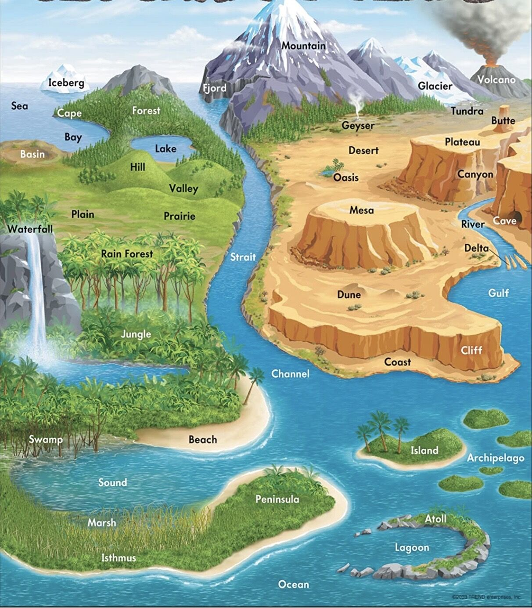

# Rivers

[Important Geographical Terms Features Landforms Of Earth](https://youtu.be/8McizDCj6qE)

- Mountain
- Glacier
- Iceberg
- Fjord
- Volcano
- Tundra
- Geyser
- Desert
- Oasis
- Plateau
- Butte
- Mesa
- Canyon
- Rivers
- Caves
- Delta
- Gulf
- Sand dune
- Cliff
- Coast
- Strait
- Channel
- Island
- Archipelago
- Atoll
- Lagoon
- Ocean
- Peninsula
- Isthmus
- Marsh
- Swamp
- Sound
- Beach
- Rainforest
- Waterfall
- Plain
- Prairie
- Valley
- Hill
- Basin
- Lake
- Bay
- Cape
- Sea

[How Wells & Aquifers Actually Work - YouTube](https://www.youtube.com/watch?v=bG19b06NG_w)

## Rivers

### Mahi

- The river originates from Dhar district of MP
- The river flows through MP, Rajasthan, and Gujarat
- The river drains in the Gulf of Cambay
- Mahi Bajaj Sagar dam and Kadana Dam are the major Hydro Power stations situated on this river

### Sabarmati

- Sabarmati River is a combination of two streams the Sabar and Hathmati
- The river is flowing through Rajasthan and Gujarat
- It originates from Tepur in the Udaipur district of Rajasthan
- The Wakal, the Hathmati, the Vatrak, and the Sei are the major tributaries of Sabarmati River
- Sabarmati reservoir, Hathmati reservoir, and Meshwo reservoir project are the major projects situated on this river

### Luni

- Luni is an endorheic river
- It is also known as the Sagarmati
- It originates from the Western slopes of the Aravalli ranges near Ajmer

### Tawa

- The river rises from the Satpura range of Betul in MP
- This river is the longest tributary of River Narmada

### Sharavati

- This is an important river in the state of Karnataka flowing towards the west
- The Sharavati River originates from the Shimoga district of Karnataka
- The river drains a catchment area of 2209 sq.km.
- The Jog Falls is created by the Sharawati River

### Narmada

- It is located mainly in MP
- The Narmada River is also known as the Rewa River
- The River is originated from Maikala range near Amarkantak
- It is a West flowing river
- The River flows through Gujarat, Chhattisgarh MP, and Maharashtra
- The tributaries of Narmada River are Kolar River, Shakkar River, Dudhi River, Tawa River, and Hiran River
- Major Hydrop Power Project in this river are Maheshwar Dam, Sardar Sarovar Dam, and Indira Gandhi Sagar Dam

### Tapti/Tapi

- The Tapti/Tapi River is located in MP
- It originates from the Multai reserve forest
- The river is flowing through the states of MP, Maharastra and Gujarat
- Kakrapar Dam, Ukai Dam, Girna Dam are the major projects on this river
- The Suki, the Gomai, the Arunavati, the Vaghur, the Amravati, the Puma, the Mona, and the Sipna are the major tributaries of Tapti River

[Top 10 Longest Rivers in India](https://www.jagranjosh.com/general-knowledge/amp/top-10-longest-rivers-in-india-1546602888-1)

[Rivers of India - Geography UPSC, IAS, CDS, NDA, SSC CGL, PCS](https://youtube.com/playlist?list=PL1vNLZF5gfwes_mQ3u4B8KLBUp0ezwjv6)

[Indian Geography: Peninsular Rivers of India | Smart Revision through Animation | OnlyIAS - YouTube](https://www.youtube.com/watch?v=B-M6-sjXBCw)
