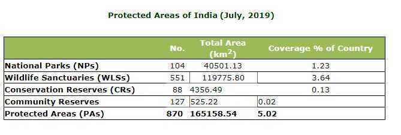

# Wildlife

## IUCN Red List of Threatened Species

The [IUCN Red List of Threatened Species](https://en.wikipedia.org/wiki/IUCN_Red_List) is the best known worldwide conservation status listing and ranking system. Species are classified by the IUCN Red List into nine groups set through criteria such as rate of decline, population size, area of geographic distribution, and degree of population and distribution fragmentation.

Also included are species that have gone extinct since 1500 CE.When discussing the IUCN Red List, the official term "[threatened](https://en.wikipedia.org/wiki/Threatened_species)" is a grouping of three categories: critically endangered, endangered, and vulnerable.

## Extinct

- [Extinct](https://en.wikipedia.org/wiki/Extinction)(EX) -- No known living individuals
- [Extinct in the wild](https://en.wikipedia.org/wiki/Extinct_in_the_wild)(EW) -- Known only to survive in captivity, or as a naturalized population outside its historic range

## Threatened

- [Critically endangered](https://en.wikipedia.org/wiki/Critically_endangered)(CR) -- Extremely high risk of extinction in the wild
- [Endangered](https://en.wikipedia.org/wiki/Endangered_species)(EN) -- High risk of extinction in the wild
- [Vulnerable](https://en.wikipedia.org/wiki/Vulnerable_species)(VU) -- High risk of endangerment in the wild

## Lower Risk

- [Near threatened](https://en.wikipedia.org/wiki/Near_threatened)(NT) -- Likely to become endangered in the near future
- Conservation Dependent (CD) - as dependent on conservation efforts to prevent it from becoming [threatened](https://en.wikipedia.org/wiki/Threatened_species) with extinction
- [Least concern](https://en.wikipedia.org/wiki/Least_concern)(LC) -- Lowest risk; does not qualify for a higher risk category. Widespread and abundant [taxa](https://en.wikipedia.org/wiki/Taxa) are included in this category.

## Other Categories

- [Data deficient](https://en.wikipedia.org/wiki/Data_deficient)(DD) -- Not enough data to make an assessment of its risk of extinction
- [Not evaluated](https://en.wikipedia.org/wiki/Not_evaluated)(NE) -- Has not yet been evaluated against the criteria.

## The Protected Areas of India

Protected areas are those in which human occupation or at least the exploitation of resources is limited. These are defined according to the categorization guidelines for protected areas by the International Union for Conservation of Nature (IUCN). There are several kinds of protected areas, which vary by level of protection depending on the enabling laws of each country or the regulations of the international organizations involved.

- **National Park**
    - A National park is an area with enough ecological, geo-morphological and natural significance with rich fauna and flora, which is designed to protect and to develop wildlife or its environment.
    - National parks in India are IUCN category II protected areas.
    - Activities like grazing, hunting, forestry or cultivation etc. are strictly prohibited. No human activity is permitted inside the national park except for the ones permitted by the Chief Wildlife Warden of the state.
    - India's first national park was established in 1936 as Hailey National Park, now known as Jim Corbett National Park, Uttarakhand.
    - There are 104 existing national parks in India covering an area of 40501.13 km2, which is 1.23% of the geographical area of the country (National Wildlife Database, May 2019).
- **Wildlife Sanctuary**
    - Any area other than area comprised with any reserve forest or the territorial waters can be notified by the State Government to constitute as a sanctuary if such area is of adequate ecological, faunal, floral, geomorphological, natural. or zoological significance, for the purpose of protecting, propagating or developing wildlife or its environment.
    - The difference between a Sanctuary and a National Park mainly lies in the vesting of rights of people living inside. Unlike a Sanctuary, where certain rights can be allowed, in a National Park, no rights are allowed. No grazing of any livestock is permitted inside a National Park while in a Sanctuary, the Chief Wildlife Warden may regulate, control or prohibit it.
    - There are a total of 551 wildlife sanctuaries in India.
- **Conservation reserves and community reservesin India**
    - These terms denote the protected areas of India which typically act as buffer zones to or connectors and migration corridors between established national parks, wildlife sanctuaries and reserved and protected forests of India.
    - Such areas are designated as Conservation Reserves if they are uninhabited and completely owned by the Government of India but used for subsistence by communities and Community Reserves if a part of the lands is privately owned.
    - These protected area categories were first introduced in the Wildlife (Protection) Amendment Act of 2002 − the amendment to the Wildlife Protection Act of 1972.
    - These categories were added because of reduced protection in and around existing or proposed protected areas due to private ownership of land, and land use.

## Biosphere Reserves

A biosphere reserve is an area of land or water that is protected by law in order to support the conservation of ecosystems, as well as the sustainability of mankind's impact on the environment.

- Each reserve aims to help scientists and the environmental community figure out how to protect the world's plant and animal species while dealing with a growing population and its resource needs.
- To carry out the complementary activities of biodiversity conservation and sustainable use of natural resources, biosphere reserves are traditionally organized into 3 interrelated zones, known as:
    - the core area,
    - the buffer zone, and
    - a transition zone or 'area of cooperation / Marginal zone

- The purpose of the formation of the biosphere reserve is to conserve in situ all forms of life, along with its support system, in its totality, so that it could serve as a referral system for monitoring and evaluating changes in natural ecosystems.
- Presently, there are **18 notified biosphere reserves in India**. Ten out of the eighteen biosphere reserves are a part of the World Network of Biosphere Reserves, based on the UNESCO Man and the Biosphere (MAB) Programme list.

http://www.amit-sengupta.com/types-of-forests-in-india-evergreen-deciduous-thorny-montane-littoral-swamp-upsc-ias-cds-nda

Indian forests can be broadly divided into 5 types

1. Tropical Evergreen and Semi Evergreen Forests

2. Tropical Deciduous Forests

3. Tropical Thorn Forests

4. Montane Forests

5. Littoral and Swamp Forests
