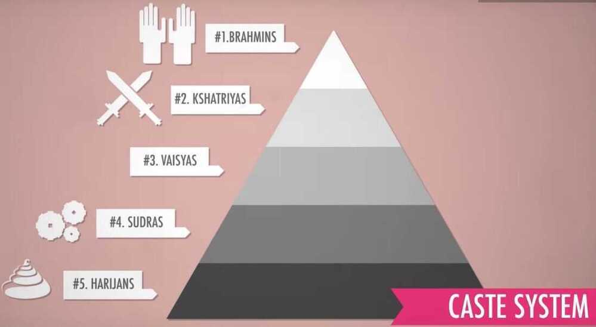

# Crash Course World History

## Crash Course World History 1

1. **The Agriculture Revolution**
    - **15000 years ago**
    - **Controllable food supply**

2. **Indus Valley Revolution**

Civilization

- Surplus production
- City
- Specilized labour
- Trade
- Shared values (generally in the form of religion)
- Social stratification
- Centralized government
- Writing

Indus valley civilization

- flood plains of indus valley in today's pakistan
- around 3000 BCE
- Trading with mesopotamian civilization around 3500 BCE
- Harappa
- Mohenjadaro
- Have drainage systems
- The great bath
- Traded cotton cloth with mesopotamia
- No signs of warfare and no weapons
- Around 1750 BCE declined
  - conquest (by carcauses)
  - Environmental disaster
  - Earthquake

3. **Mesopotamia**
    - **writing**
    - **taxes**
    - **Meso (between) + potamia (river) (tigres and euphrates rivers)**
    - **The epic of Gilgamesh**
    - **Writing giving by mesopotamia - Quinea form**
    - **Hameorabi - Kingdom of babylon**
    - **Neo-Assyrian empire (911 BCE - 612 BCE)**

4. **Ancient Egypt (3400 BCE - 525 BCE)**
    - **Nile river shaped the egypt**
    - **All the egypt was located on the sides of nile river**
    - **It provided transport and twice a year flooding with rich nutrients for agriculture**
    - **Dynasties**
        - **Old kingdom (2649 BCE - 2152 BCE)**
        - **Middle kingdom (2040 BCE - 1640 BCE)**
        - **New kingdom (1550 BCE - 1070 BCE)**
        - **In between there were intermediate kingdoms**
    - **Great pyramid for pharoah kufu**
    - **Heiroglyphics (sacred writing) and demotic script (recording contracts and agreements)**
    - **King Tut**

5. **The Persians & Greeks**

Greeks gave music, democracy, idealization

## Realism - The view that the subject matter of politics is political power, not matter of principle

Non-rhetorical question - Did the right side win the persian wars?

Persians - Monarchy (one-man rule)

- life under persians pretty good (lot more stable and successful empires than democracies in history)

Greeks / Athenians - Democracy

- Government corrupt
- Life of women and slaves were very bad

Real questions of history -

- What's the point of being alive
- How should we organize ourselves
- What should we seek from this life

6. **Buddha and Ashoka**
    - The Vedas (Indus valley civilization)
    - The caste system

3. Dharma - One's role in life and society primarily by birth and by caste

Bhagavada Gita is a 700-[verse](https://en.wikipedia.org/wiki/Sanskrit_prosody) [Hindu](https://en.wikipedia.org/wiki/Hinduism) scripture in [Sanskrit](https://en.wikipedia.org/wiki/Sanskrit) that is part of the [Hindu epic](https://en.wikipedia.org/wiki/Hindu_epic)[*Mahabharata*](https://en.wikipedia.org/wiki/Mahabharata)(chapters 23--40 of the 6th book of Mahabharata).

4. Samsara, Moksha and Karma

Samsara - Cycle of re-birth, re-incarnation

Moksha - free from the cycle of re-birth

Karma - The doer of good becomes good, the doer of evil becomes evil. One becomes virtuous by virtuous action, bad by bad action

5. Buddhism - 6th century BCE - Siddhartha Gautam - achieved Nirvana

Four noble truths

- All life is suffering
- The source of suffering is desire
- To stop suffering, you must get rid of desire
- Follow the 8 folds paths
  - Right view
  - Right intention
  - Right speech
  - Right action
  - Right livelihood
  - Right effort
  - Right mindfulness
  - Right concentration

6. Snakes & Ladders invented in India

7. Ashoka from Mauryan dynasty
    - United twice
        - Mauryan Dynasty (321 - 185 BCE)
        - Gupta Dyansty (320 - 550 CE)
    - Got into Buddhism after his army destroyed the Kingdom of Kalinga
    - Build stupas

8. Hinduism is highly flexible because God can take many forms

7. **2000 years of Chinese history! The Mandate of Heaven and Confucius**
    - **Central government and core of bureaucrats that execute the wishes of that government (150 BCE to 1911 CE)**
    - **Shang dynasty (1600 - 1029 BCE)**
    - **Zhou dynasty (1029 - 771 BCE)**
    - **The warring states period (475 BCE - 221 BCE)**
    - **Qin dynasty (221 - 206 BCE)**
    - **Han dynasty (206 BCE - 220 CE)**
    - **The three kingdoms period (220 - 280 CE)**
    - **Sui dynasty (581 - 618 CE)**
    - **Tang dynasty (618 - 907 CE)**
    - **Song dynasty (960 - 1271 CE)**
    - **Yuan dynasty (1271 - 1368 CE)**
    - **Red turban rebellion (1351 - 1368 CE)**
    - **Ming dynasty (1368 - 1644 CE) (built the great wall)**
    - **Qing dynasty (1644 - 1911 CE)**

8. **Alexander the Great and the Situation .. the Great?**
    - **Alexander of Macedon (356 BCE - 323 BCE)**
    - **Destroyed the Persian empire**
    - **After his death the empire broke down into 3 empires called the Hallenistic kingdoms - Antigonids, Seleucids and Ptolemies**

9. **The silk road and ancient trade**
    - **Network of roads**

10. **The Roman Empire. Or Republic. Or... Which was it?**

11. Christianity from Judaism to Constantine

12. Fall of the Roman Empire...in the 15th Century

13. Islam, the Quran, and the Five Pillars all without a flamewar

14. The Dark Ages...How Dark were they really?

15. The Crusades - Pilgrimage or Holy War?

16. Mansa Musa and Islam in Africa

17. Wait for it... The Mongols

18. Int'l Commerce, Snorkeling Camels, and The Indian Ocean Trade

19. Venice and the Ottomon Empire

20. Russia, the Kievan Rus, and the Mongols

21. Columbus, de Gama, and Zheng He!

22. The Renaissance: Was it a Thing?

23. The Columbian Exchange

24. The Atlantic Slave Trade

25. The Spanish Empire, Silver, & Runaway Inflation

26. The Seven Years War

27. The Amazing Life and Strange Death of Captain Cook

28. Tea, Taxes, and The American Revolution

29. The French Revolution

30. Haitian Revolutions

31. Latin American Revolutions

32. Coal, Steam, and The Industrial Revolution

33. Capitalism and Socialism

34. Samurai, Daimyo, Matthew Perry, and Nationalism

35. Imperialism

36. Archdukes, Cynicism, and World War I

37. Communists, Nationalists, and China's Revolutions

38. World War II

39. USA vs USSR Fight! The Cold War

40. Decolonization and Nationalism Triumphant

41. Globalization I - The Upside

42. Globalization II - Good or Bad?

## Crash Course World History 2

1. Rethinking Civilization

2. Money & Debt

3. Disease

4. War & Human Nature

5. War and Civilization

6. Climate Change, Chaos, and the Little Ice Age
    - Little Ice Age - 13th to 19th Century

7. Humans and Energy

8. Drought and Famine

9. How World War I started

10. Who started World War I

11. The End of Civilization (In the Bronze Age)

12. The Rise of the West and Historical Methodology

13. Asian Responses to Imperialism

14. The Railorad journey and the Industrial Revolution

15. Population, Sustainability and Malthus

16. Islam and Politics

17. The Mughal Empire and Historical Reputation

18. Luther and the Protestant Reformation

19. Charles V and the Holy Roman Empire

20. World War II, A War for Resources

21. Congo and Africa's World War

22. Water and Classical Civilizations

23. Conflict in Israel and Palestine

24. The Vikings

25. War and Nation Building in Latin America

26. Iran's Revolutions

27. Japan in the Heian Period and Cultural History

28. Nonviolence and Peace Movements

29. Capitalism and the Dutch East India Company

30. Democracy, Authoritarian Capitalism, and China

[Crash Course World History #1](https://www.youtube.com/playlist?list=PLu1rATTEb5flTauK4qgdZ64mTGFBJiJqf)

[World History 2](https://www.youtube.com/playlist?list=PL8dPuuaLjXtNjasccl-WajpONGX3zoY4M)
