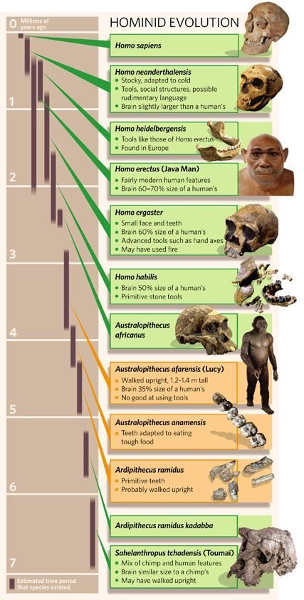
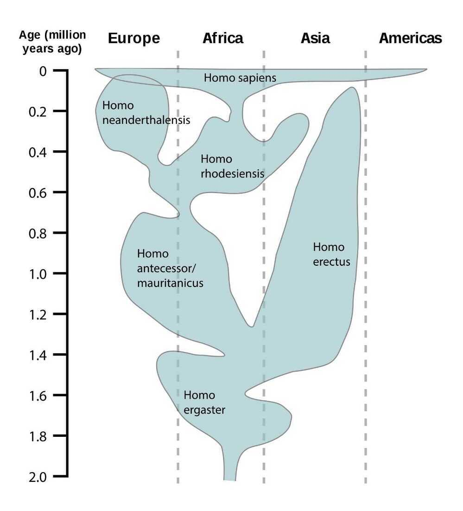

# Human History / Anthropology

[Human Origins 101 | National Geographic - YouTube](https://www.youtube.com/watch?v=ehV-MmuvVMU&ab_channel=NationalGeographic)

[The 2 planetary disasters you owe your life to | Sean B. Carroll](https://youtu.be/YC2qoeWYr4w)

- We divided from fungi 650 million years ago
- About 221 million and 210 million years ago
- 66 million years ago asteroid impact Yucatán Peninsula - Chicxulub crater
- 6-7 million years ago relationship with apes ended
- 2.8 million years ago genus of Homo emerged
- 2 million years ago fire discovered
    - Fire started cooking; which turned food more nutritious; which helped develop our brains
- 300,000 years ago, species lived in small hunters gatherers society; and spoke to each other
- Homo sapiens sapiens 200,000 years ago (6 species of Homo was around that time)
    - Homo erectus survived for 2 million years
    - Last of other species disappeared around 10,000 years ago
    - Modern human have some neaderthal's DNA, so there was some mixing
- 70,000 years ago only humans got some abstract thinking capabilities to survive in today's generation
- **60,000 years ago first time humans moved out of Africa**
- 50,000 years ago there was explosion in innovation; tools and weapons became more sophisticated and culture became more complex; communication improved and in turn cooperation improved in large groups
- Humans started fishing somewhere between 40,000 and 10000 years BCE.
- 12,000 years ago agriculture started in multiple locations; because of this specialization started
- 500 years ago scientific revolution happened; industrial revolution

## Human Generations

| **Generations**                          | **Born**    | **Current Ages (as of 2024)** |
| :--------------------------------------- | :---------- | :---------------------------- |
| **Gen Z \| GenZ**                        | 1997 - 2012 | 12 - 27                       |
| **Millennials**                          | 1981 - 1996 | 28 - 43                       |
| **Gen X**                                | 1965 - 1980 | 44 - 59                       |
| **Boomers II (a/k/a Generation Jones)*** | 1955 - 1964 | 60 - 69                       |
| **Boomers I***                           | 1946 - 1954 | 70 - 78                       |
| **Post War**                             | 1928 - 1945 | 79 - 96                       |
| **WWII**                                 | 1922 - 1927 | 97 - 102                      |

[Age Range by Generation - Beresford Research](https://www.beresfordresearch.com/age-range-by-generation/)

[Every Birth Generation Explained in 9 Minutes - YouTube](https://www.youtube.com/watch?v=ruKJpwlRe_M&ab_channel=PaintGuy)

- Lost Generation
- Greatest Generation
- Silent Generation
- Baby Boomers
- Generation X
- Millennials
- Zoomers
- Generation Alpha

## Earth History

http://timelineofearth.com

[To Scale: TIME - YouTube](https://www.youtube.com/watch?v=nOVvEbH2GC0)

[You're Basically A Mushroom - YouTube](https://www.youtube.com/watch?v=SFikJUQttxU)

### Extinction Events

- Devonian Extinction Event - 372 million years ago
- Permian Extinction Event - 252 million years ago
- Triassic Extinction Event - 201 million years ago
- Cretaceous Extinction Event- 66 million years ago
